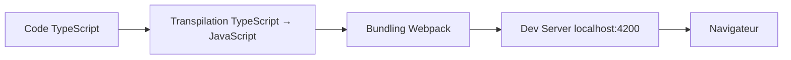

# Angular : Installation et Premier Projet

## Introduction

### Objectifs du cours
Ce cours vous permettra de :
- Installer Angular CLI et créer votre premier projet Angular
- Comprendre la structure d'un projet Angular
- Lancer votre application en mode développement
- Faire vos premières modifications

### Ce que vous saurez faire après ce cours
- Créer un nouveau projet Angular 20+ depuis zéro
- Naviguer dans la structure de fichiers Angular
- Comprendre le rôle de chaque fichier principal
- Modifier et visualiser les changements en temps réel

### Scope de la notion
Angular est un framework de développement d'applications web modernes créé par Google. Il permet de construire des applications web dynamiques, performantes et maintenables. Ce premier cours pose les fondations pour tout votre parcours Angular.

---

## Prérequis

Avant de commencer, assurez-vous d'avoir :
- Node.js (version 18.19+ ou 20.11+) installé → [Cours Node.js + NPM](../nodejs-npm.md)
- Un éditeur de code (VSCode recommandé) → [Cours VSCode](../vscode-debugging-extensions.md)
- Des connaissances de base en TypeScript → [Phase 2 : TypeScript Propre](../../hard-skills.md#phase-2--typescript-propre)

---

## Définitions et Concepts Clés

### Angular
**Angular** est un framework TypeScript pour construire des applications web côté client (front-end). Il fournit une architecture complète avec :
- Un système de composants réutilisables
- La gestion du routing (navigation)
- La communication HTTP avec des APIs
- La gestion de formulaires
- Et bien plus encore

**Analogie** : Imaginez Angular comme une boîte à outils complète pour construire une maison. Au lieu de devoir chercher chaque outil séparément (marteau, scie, niveau), Angular vous fournit tout dans un seul ensemble cohérent.

### Angular CLI
**Angular CLI** (Command Line Interface) est l'outil en ligne de commande officiel pour Angular. Il automatise les tâches répétitives :
- Création de projets
- Génération de composants, services, etc.
- Compilation et bundling
- Démarrage du serveur de développement
- Lancement des tests

**Analogie** : C'est comme un assistant personnel qui fait le travail répétitif à votre place, vous permettant de vous concentrer sur la logique métier.

### SPA (Single Page Application)
Une **SPA** est une application web qui charge une seule page HTML et met à jour dynamiquement le contenu sans recharger la page complète.

**Exemple concret** : Gmail, Google Maps, Facebook - ces applications ne rechargent pas toute la page quand vous naviguez, elles mettent juste à jour la partie qui change.

### Composant
Un **composant** est un bloc de construction réutilisable de votre interface utilisateur. Chaque composant a :
- Un template HTML (la vue)
- Une classe TypeScript (la logique)
- Un fichier CSS (le style)

**Analogie** : C'est comme une brique LEGO. Chaque composant est une pièce que vous pouvez assembler avec d'autres pour construire votre application.

---

## Installation d'Angular CLI

### Étape 1 : Vérifier Node.js et npm

```bash
node --version  # Doit afficher v18.19+ ou v20.11+
npm --version   # Doit afficher 9+ ou 10+
```

### Étape 2 : Installer Angular CLI globalement

```bash
npm install -g @angular/cli@20
```

**Explication** :
- `npm install` : Installer un package
- `-g` : Globalement (disponible partout sur votre système)
- `@angular/cli@20` : Angular CLI version 20

### Étape 3 : Vérifier l'installation

```bash
ng version
```

Vous devriez voir quelque chose comme :
```
Angular CLI: 20.x.x
Node: 20.x.x
Package Manager: npm 10.x.x
```

---

## Créer votre Premier Projet

### Commande de création

```bash
ng new mon-premier-projet
```

**Angular CLI vous posera plusieurs questions** :

#### Question 1 : Routing
```
? Would you like to add Angular routing? (y/N)
```
Répondez **`y`** (oui) - Le routing permet la navigation entre pages.

#### Question 2 : Styles
```
? Which stylesheet format would you like to use?
  CSS
❯ SCSS   [ https://sass-lang.com/documentation/syntax#scss ]
  Sass   [ https://sass-lang.com/documentation/syntax#the-indented-syntax ]
  Less   [ http://lesscss.org ]
```
Choisissez **`CSS`** pour commencer simplement (ou `SCSS` si vous le connaissez déjà).

#### Question 3 : SSR (Server-Side Rendering)
```
? Do you want to enable Server-Side Rendering (SSR) and Static Site Generation (SSG/Prerendering)? (y/N)
```
Répondez **`N`** (non) - Pas nécessaire pour débuter.

### Processus d'installation

Angular CLI va :
1. Créer la structure de dossiers
2. Générer les fichiers de base
3. Installer toutes les dépendances npm (peut prendre quelques minutes)

```
CREATE mon-premier-projet/README.md
CREATE mon-premier-projet/angular.json
CREATE mon-premier-projet/package.json
...
✔ Packages installed successfully.
```

---

## Structure du Projet

### Arborescence complète

```
mon-premier-projet/
├── src/                        # Code source de l'application
│   ├── app/                    # Dossier principal de l'application
│   │   ├── app.component.ts    # Composant racine (logique)
│   │   ├── app.component.html  # Template du composant racine
│   │   ├── app.component.css   # Styles du composant racine
│   │   ├── app.component.spec.ts # Tests du composant
│   │   ├── app.config.ts       # Configuration de l'application
│   │   └── app.routes.ts       # Configuration du routing
│   ├── index.html              # Page HTML principale
│   ├── main.ts                 # Point d'entrée de l'application
│   └── styles.css              # Styles globaux
├── node_modules/               # Dépendances (ne pas modifier)
├── angular.json                # Configuration Angular CLI
├── package.json                # Dépendances npm du projet
├── tsconfig.json               # Configuration TypeScript
└── README.md                   # Documentation du projet
```

### Fichiers importants expliqués

#### `package.json`
Liste toutes les dépendances du projet et les scripts disponibles.

```json
{
  "name": "mon-premier-projet",
  "version": "0.0.0",
  "scripts": {
    "ng": "ng",
    "start": "ng serve",
    "build": "ng build",
    "test": "ng test"
  },
  "dependencies": {
    "@angular/animations": "^20.0.0",
    "@angular/common": "^20.0.0",
    "@angular/core": "^20.0.0",
    ...
  }
}
```

#### `src/main.ts`
Point d'entrée de l'application - démarre Angular.

```typescript
import { bootstrapApplication } from '@angular/platform-browser';
import { appConfig } from './app/app.config';
import { AppComponent } from './app/app.component';

// Bootstrap = démarrer l'application avec le composant racine
bootstrapApplication(AppComponent, appConfig)
  .catch((err) => console.error(err));
```

#### `src/app/app.component.ts`
Le composant principal de votre application.

```typescript
import { Component } from '@angular/core';
import { RouterOutlet } from '@angular/router';

@Component({
  selector: 'app-root',           // Balise HTML du composant
  standalone: true,               // Composant standalone (Angular 20)
  imports: [RouterOutlet],        // Imports nécessaires
  templateUrl: './app.component.html',  // Fichier HTML
  styleUrl: './app.component.css'       // Fichier CSS
})
export class AppComponent {
  title = 'mon-premier-projet';   // Propriété accessible dans le template
}
```

**Décortiquons le décorateur `@Component`** :
- `selector`: Le nom de la balise HTML (`<app-root></app-root>`)
- `standalone: true`: Nouveau dans Angular 20 - composant autonome (pas besoin de NgModule)
- `imports`: Les dépendances du composant
- `templateUrl`: Chemin vers le fichier HTML
- `styleUrl`: Chemin vers le fichier CSS

#### `src/app/app.component.html`
Le template HTML du composant.

```html
<div class="content">
  <h1>Bienvenue dans {{ title }}!</h1>
  <p>Votre première application Angular fonctionne!</p>
</div>
<router-outlet></router-outlet>
```

**Explication** :
- `{{ title }}` : Interpolation - affiche la valeur de la propriété `title`
- `<router-outlet>` : Emplacement où les composants des routes seront affichés

---

## Lancer l'Application

### Démarrer le serveur de développement

```bash
cd mon-premier-projet
ng serve
```

Ou avec ouverture automatique du navigateur :

```bash
ng serve --open
```

**Sortie attendue** :
```
Initial chunk files | Names         | Raw size
main.js             | main          | 187.52 kB
polyfills.js        | polyfills     |  83.04 kB
styles.css          | styles        |   0 bytes

Application bundle generation complete. [4.123 seconds]

Watch mode enabled. Watching for file changes...
➜  Local:   http://localhost:4200/
```

### Accéder à l'application

Ouvrez votre navigateur à l'adresse : **http://localhost:4200**

Vous devriez voir la page d'accueil Angular par défaut!

### Mode watch

Le serveur de développement surveille les changements. Quand vous modifiez un fichier, la page se recharge automatiquement.

**Test** : Modifiez `src/app/app.component.html` et sauvegardez - la page se met à jour instantanément!

---

## Première Modification

### Exercice pratique : Personnaliser l'application

**Étape 1** : Ouvrez `src/app/app.component.ts`

Modifiez la propriété `title` :

```typescript
export class AppComponent {
  title = 'Ma Super Application';  // ✅ Changez le texte ici
}
```

**Étape 2** : Ouvrez `src/app/app.component.html`

Remplacez tout le contenu par :

```html
<div class="container">
  <h1>{{ title }}</h1>
  <p>Bienvenue dans votre première application Angular!</p>
  
  <div class="info">
    <h2>Informations</h2>
    <ul>
      <li>Framework: Angular 20</li>
      <li>Langage: TypeScript</li>
      <li>Type: SPA (Single Page Application)</li>
    </ul>
  </div>
</div>
```

**Étape 3** : Ouvrez `src/app/app.component.css`

Ajoutez des styles :

```css
.container {
  max-width: 800px;
  margin: 50px auto;
  padding: 20px;
  font-family: Arial, sans-serif;
}

h1 {
  color: #dd0031;
  font-size: 2.5em;
  margin-bottom: 20px;
}

.info {
  background-color: #f5f5f5;
  padding: 20px;
  border-radius: 8px;
  margin-top: 30px;
}

.info h2 {
  color: #333;
  margin-top: 0;
}

.info ul {
  list-style-type: none;
  padding-left: 0;
}

.info li {
  padding: 8px 0;
  border-bottom: 1px solid #ddd;
}

.info li:last-child {
  border-bottom: none;
}
```

**Résultat** : Votre navigateur devrait automatiquement afficher la nouvelle version!

---

## Commandes Angular CLI Essentielles

### Créer un nouveau projet
```bash
ng new nom-projet
```

### Lancer le serveur de développement
```bash
ng serve              # Démarre sur http://localhost:4200
ng serve --port 4300  # Démarre sur un port différent
ng serve --open       # Ouvre automatiquement le navigateur
```

### Générer des fichiers
```bash
ng generate component mon-composant    # Crée un nouveau composant
ng generate service mon-service        # Crée un nouveau service
ng generate module mon-module          # Crée un nouveau module
```

Version courte :
```bash
ng g c mon-composant   # g = generate, c = component
ng g s mon-service     # s = service
```

### Compiler pour la production
```bash
ng build               # Compile dans dist/
ng build --configuration production  # Optimisé pour production
```

### Lancer les tests
```bash
ng test               # Tests unitaires
ng e2e                # Tests end-to-end
```

### Obtenir de l'aide
```bash
ng help               # Liste toutes les commandes
ng generate --help    # Aide sur une commande spécifique
```

---

## Ce qui se passe dans l'ordinateur

### Processus de compilation et exécution

**1. Développement (ng serve)** :



**2. Ce qui se passe en mémoire** :

Lorsque vous lancez `ng serve` :
1. **Angular CLI** analyse votre code TypeScript
2. **TypeScript Compiler** convertit `.ts` en JavaScript
3. **Webpack** regroupe tous les fichiers en bundles
4. Les fichiers sont servis en **mémoire** (pas sur le disque)
5. Le **navigateur** charge et exécute le JavaScript
6. **Angular** crée les composants dans le DOM

**3. Hot Module Replacement (HMR)** :

Quand vous modifiez un fichier :
- Angular détecte le changement (file watcher)
- Seul le module modifié est recompilé
- Le navigateur est notifié via WebSocket
- La page se met à jour **sans recharger complètement**

---

## Erreurs Courantes & Comment les Éviter

### Erreur 1 : "ng: command not found"

**Problème** : Angular CLI n'est pas installé globalement ou le PATH n'est pas configuré.

**Solution** :
```bash
npm install -g @angular/cli@20
# Ou redémarrez votre terminal après l'installation
```

### Erreur 2 : "Port 4200 is already in use"

**Problème** : Une autre instance d'Angular tourne déjà.

**Solutions** :
```bash
# Option 1: Utiliser un autre port
ng serve --port 4300

# Option 2: Tuer le processus sur le port 4200 (Linux/Mac)
lsof -ti:4200 | xargs kill -9

# Option 3: Tuer le processus (Windows)
netstat -ano | findstr :4200
taskkill /PID <PID> /F
```

### Erreur 3 : "Cannot find module '@angular/core'"

**Problème** : Les dépendances ne sont pas installées.

**Solution** :
```bash
npm install
# Ou si ça ne fonctionne pas
rm -rf node_modules package-lock.json
npm install
```

### Erreur 4 : "Error: Module build failed"

**Problème** : Erreur de syntaxe TypeScript.

**Solution** :
- Vérifiez la console - l'erreur indique le fichier et la ligne
- Corrigez l'erreur de syntaxe
- Sauvegardez - Angular recompile automatiquement

### Erreur 5 : "This version of CLI is only compatible with Angular versions..."

**Problème** : Version incompatible entre CLI et le projet.

**Solution** :
```bash
# Vérifier les versions
ng version

# Mettre à jour globalement
npm install -g @angular/cli@20

# Mettre à jour dans le projet
ng update @angular/cli @angular/core
```

---

## Exercices Pratiques

### Exercice 1 : Créer et lancer un projet (Obligatoire)

**Objectif** : Valider que vous savez créer et démarrer un projet Angular.

**Étapes** :
1. Créez un nouveau projet appelé `angular-exercice-1`
2. Avec routing : Oui
3. Style : CSS
4. Lancez le serveur
5. Vérifiez que la page s'affiche dans le navigateur

**Validation** : Vous voyez la page Angular par défaut sur localhost:4200

### Exercice 2 : Personnalisation basique (Recommandé)

**Objectif** : Modifier le contenu et les styles.

**Tâches** :
1. Changez le titre de l'application en "Gestionnaire de Tâches"
2. Dans le template HTML, créez une liste de 3 tâches :
   - Apprendre Angular
   - Créer un composant
   - Maîtriser TypeScript
3. Ajoutez du CSS pour styliser la liste (couleurs, espacements)

**Indice** :
```html
<h1>{{ title }}</h1>
<ul>
  <li>Tâche 1</li>
  <li>Tâche 2</li>
  <li>Tâche 3</li>
</ul>
```

### Exercice 3 : Exploration de la structure (Facultatif)

**Objectif** : Comprendre le rôle de chaque fichier.

**Tâches** :
1. Listez les fichiers du dossier `src/app/`
2. Pour chaque fichier, écrivez en une phrase son rôle
3. Trouvez où est déclaré le `selector` du composant
4. Identifiez le fichier qui démarre l'application

---

## Comportement Senior

### Bonnes pratiques dès le début

**1. Nommage cohérent**
```bash
# ✅ Bon
ng new customer-management-app
ng new inventory-tracker

# ❌ Mauvais
ng new app
ng new test123
```

**2. Organisation du workspace**
```
/projects/
  /frontend/          # Vos projets Angular
    /app1/
    /app2/
  /backend/           # Vos APIs
```

**3. Versionner dès le début**
```bash
cd mon-premier-projet
git init
git add .
git commit -m "Initial Angular project setup"
```

**4. .gitignore est déjà configuré**

Angular CLI génère automatiquement un `.gitignore` :
```
/node_modules/       # ✅ Ne jamais commit
/dist/               # ✅ Fichiers compilés
/.angular/cache/     # ✅ Cache Angular
```

**5. Utiliser les commandes CLI plutôt que de créer manuellement**

```bash
# ✅ Bon - utilise les templates et conventions Angular
ng generate component header

# ❌ Mauvais - risque d'oublier des fichiers ou conventions
# Créer manuellement header.component.ts, .html, .css...
```

**6. Consulter la documentation officielle**

Quand vous bloquez :
1. **Documentation Angular** : https://angular.dev
2. **Angular CLI** : `ng help` ou https://angular.dev/cli
3. **Stack Overflow** : Cherchez avec "Angular 20" dans la requête

**7. Configurer ESLint dès le début**

```bash
ng add @angular-eslint/schematics
```

Cela ajoute des règles de qualité de code automatiques.

### Astuces de développeur expérimenté

**Raccourcis clavier VSCode pour Angular** :

- `Ctrl + P` : Ouvrir rapidement un fichier
- `Ctrl + Shift + P` : Palette de commandes
- `F12` : Aller à la définition
- `Alt + Shift + F` : Formater le code

**Snippets Angular pour VSCode** :

Installez l'extension "Angular Snippets" pour générer du code rapidement :
- `a-component` : Génère un template de composant
- `a-service` : Génère un template de service
- `a-pipe` : Génère un template de pipe

**DevTools Angular** :

Installez l'extension Chrome "Angular DevTools" pour :
- Inspecter les composants
- Voir l'arbre des composants
- Profiler les performances

---

## Résumé

### Qu'avez-vous appris ?

Dans ce cours, vous avez appris à :
1. **Installer** Angular CLI globalement
2. **Créer** un nouveau projet Angular avec `ng new`
3. **Comprendre** la structure d'un projet Angular
4. **Lancer** le serveur de développement avec `ng serve`
5. **Modifier** les composants et voir les changements en temps réel
6. **Utiliser** les commandes essentielles d'Angular CLI

### Quand utiliser Angular ?

**✅ Utilisez Angular pour** :
- Applications web métier complexes (CRM, ERP, dashboards)
- Applications nécessitant une architecture robuste
- Projets d'équipe avec besoin de conventions strictes
- Applications avec beaucoup de formulaires
- SPAs avec routing complexe

**❌ Ne pas utiliser Angular pour** :
- Sites web statiques simples (utilisez HTML/CSS)
- Blogs (utilisez WordPress, Gatsby, Next.js)
- Applications ultra-légères (React ou Vue peuvent être mieux)
- Prototypes très rapides (trop de configuration initiale)

### Prochaines étapes

Maintenant que vous savez créer et lancer un projet Angular, vous êtes prêt pour :
1. **[Composants : Bases et création](./angular-composants-bases.md)** - Créer vos propres composants
2. **[Templates : Syntaxe et data binding](./angular-templates-data-binding.md)** - Lier données et interface

### Points clés à retenir

> Angular est un framework complet pour construire des SPAs. Angular CLI automatise la création, le développement et le build. Un projet Angular est composé de composants standalone (Angular 20+) qui combinent HTML, CSS et TypeScript. Le serveur de développement (`ng serve`) recompile automatiquement lors des changements.

---

## Ressources Externes

### Documentation officielle
- 📘 [Angular Official Documentation](https://angular.dev) - Documentation officielle complète
- 📘 [Angular CLI Documentation](https://angular.dev/cli) - Référence des commandes CLI
- 📘 [Angular Update Guide](https://update.angular.io) - Guide de mise à jour entre versions

### Vidéos (français)
- 🎥 [Angular pour les débutants - Grafikart](https://www.youtube.com/watch?v=vu0qLLUKPZQ)
- 🎥 [Créer une application Angular - From Scratch](https://www.youtube.com/watch?v=vy1Y_27T1wU)

### Vidéos (anglais)
- 🎥 [Angular Tutorial for Beginners - Programming with Mosh](https://www.youtube.com/watch?v=3qBXWUpoPHo)
- 🎥 [Angular Crash Course - Traversy Media](https://www.youtube.com/watch?v=3dHNOWTI7H8)

### Articles et tutoriels
- 📝 [Getting Started with Angular - Angular.dev](https://angular.dev/tutorials/learn-angular)
- 📝 [Angular Best Practices - FreeCodeCamp](https://www.freecodecamp.org/news/best-practices-for-a-clean-and-performant-angular-application-288e7b39eb6f/)

### Outils
- 🛠️ [Angular DevTools - Chrome Extension](https://chrome.google.com/webstore/detail/angular-devtools/)
- 🛠️ [StackBlitz - Angular Online IDE](https://stackblitz.com/fork/angular) - Tester Angular sans installation

### Communauté
- 💬 [Angular Discord](https://discord.gg/angular)
- 💬 [Stack Overflow - Angular Tag](https://stackoverflow.com/questions/tagged/angular)
- 💬 [Reddit r/Angular2](https://www.reddit.com/r/Angular2/)
