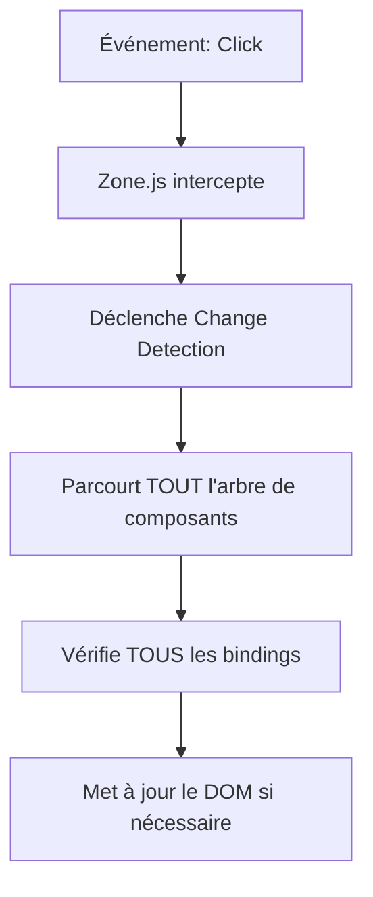
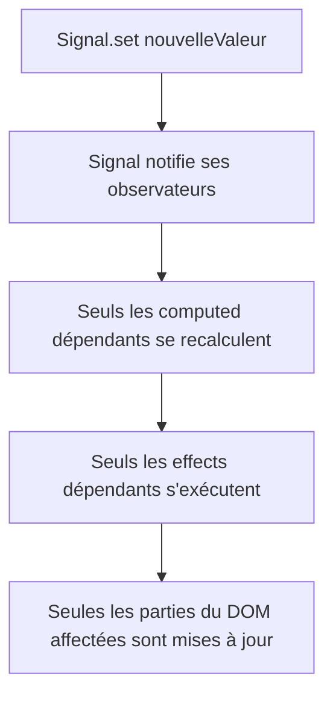

# Angular Signals : Nouvelle Gestion d'État Réactive

## Introduction

### Objectifs du cours
Ce cours vous permettra de :
- Comprendre ce que sont les Signals et pourquoi ils sont importants
- Créer et utiliser des signals dans vos composants
- Maîtriser les computed signals et les effects
- Migrer du pattern traditionnel vers les signals

### Ce que vous saurez faire après ce cours
- Créer des signals pour gérer l'état de vos composants
- Utiliser computed() pour dériver des valeurs automatiquement
- Implémenter des effects pour réagir aux changements
- Comprendre quand utiliser signals vs Observables (RxJS)

### Scope de la notion
Les Signals sont la nouvelle API de gestion d'état réactive introduite dans Angular 16+ et devenue standard dans Angular 20. Ils offrent une alternative plus simple et plus performante que RxJS pour la gestion d'état local des composants. Les signals permettent au framework de savoir précisément quelles parties du DOM mettre à jour, rendant le change detection beaucoup plus efficace.

---

## Prérequis

Avant ce cours, vous devez connaître :
- [Angular : Installation et premier projet](./angular-installation-premier-projet.md)
- [Composants : Bases et création](./angular-composants-bases.md)
- [TypeScript : Types et interfaces](../type-vs-interface.md)

---

## Définitions et Concepts Clés

### Signal
Un **Signal** est un conteneur pour une valeur qui notifie automatiquement Angular quand cette valeur change. C'est une primitive réactive qui track ses dépendances.

**Analogie** : Imaginez un Signal comme un thermomètre connecté. Quand la température change, tous les appareils qui surveillent ce thermomètre (climatisation, chauffage, affichage) sont automatiquement notifiés et réagissent. Vous n'avez pas besoin de vérifier manuellement si la température a changé.

### Réactivité fine (Fine-grained reactivity)
La **réactivité fine** signifie qu'Angular sait exactement quelles parties de la vue doivent être mises à jour quand une donnée change, au lieu de vérifier tout le composant.

**Exemple concret** : Dans une webapp de gestion de stock, si le prix d'un seul produit change dans une liste de 1000 produits, seul le prix de CE produit est re-rendu, pas toute la liste.

### Computed Signal
Un **Computed Signal** est un signal dont la valeur est calculée automatiquement à partir d'autres signals. Il se met à jour automatiquement quand ses dépendances changent.

**Analogie** : C'est comme le total sur une facture qui se recalcule automatiquement quand vous changez la quantité ou le prix d'un article.

### Effect
Un **Effect** est une fonction qui s'exécute automatiquement quand les signals dont elle dépend changent. C'est le point d'entrée pour les effets de bord (side effects).

**Analogie** : C'est comme une alarme de sécurité qui se déclenche automatiquement quand un capteur détecte un mouvement. L'effect "observe" les signals et réagit.

---

## Pourquoi les Signals ?

### Problèmes avec l'ancien système

**Avant les Signals (Change Detection classique)** :

```typescript
export class ProductListComponent {
  products: Product[] = [];  // Simple propriété
  
  updatePrice(productId: number, newPrice: number) {
    const index = this.products.findIndex(p => p.id === productId);
    if (index !== -1) {
      this.products[index].price = newPrice;  
      // ⚠️ Angular doit vérifier TOUT le composant et ses enfants
    }
  }
}
```

**Problèmes** :
- Angular ne sait pas exactement ce qui a changé
- Zone.js vérifie tous les bindings du composant (lent avec beaucoup de données)
- Difficile d'optimiser sans OnPush (complexe)

### Avec les Signals

```typescript
export class ProductListComponent {
  products = signal<Product[]>([]);  // ✅ Signal
  
  updatePrice(productId: number, newPrice: number) {
    this.products.update(current => 
      current.map(product =>
        product.id === productId
          ? { ...product, price: newPrice }  // ✅ Nouvelle instance de product
          : product
      )
    );
    // ✅ Angular sait exactement que products a changé
    // ✅ Seules les vues utilisant products() sont mises à jour
  }
}
```

**Avantages** :
- ✅ Réactivité automatique et précise
- ✅ Pas besoin de Zone.js
- ✅ Meilleures performances
- ✅ Code plus simple et prévisible

---

## Créer et Utiliser des Signals

### Signal basique : signal()

```typescript
import { Component, signal } from '@angular/core';

@Component({
  selector: 'app-counter',
  standalone: true,
  template: `
    <div class="counter">
      <h2>Compteur : {{ count() }}</h2>
      <button (click)="increment()">+1</button>
      <button (click)="decrement()">-1</button>
      <button (click)="reset()">Reset</button>
    </div>
  `,
  styles: [`
    .counter {
      padding: 20px;
      text-align: center;
    }
    button {
      margin: 5px;
      padding: 10px 20px;
      font-size: 16px;
    }
  `]
})
export class CounterComponent {
  // Créer un signal avec une valeur initiale
  count = signal(0);
  
  increment() {
    // set() : remplace complètement la valeur
    this.count.set(this.count() + 1);
  }
  
  decrement() {
    // update() : modifie basé sur la valeur actuelle
    this.count.update(value => value - 1);
  }
  
  reset() {
    this.count.set(0);
  }
}
```

**Points clés** :
- `signal(valeurInitiale)` : Crée un signal
- `count()` : Lit la valeur (dans le template ou le code)
- `count.set(nouvelleValeur)` : Définit une nouvelle valeur
- `count.update(fn)` : Met à jour basé sur la valeur actuelle

### Signal avec type TypeScript

```typescript
interface User {
  id: number;
  name: string;
  email: string;
}

export class UserProfileComponent {
  // Signal typé
  currentUser = signal<User | null>(null);
  
  // Avec valeur par défaut
  isLoading = signal<boolean>(false);
  errorMessage = signal<string>('');
  
  loadUser(userId: number) {
    this.isLoading.set(true);
    this.errorMessage.set('');
    
    // Simulation d'appel API
    setTimeout(() => {
      this.currentUser.set({
        id: userId,
        name: 'Alice Dupont',
        email: 'alice@example.com'
      });
      this.isLoading.set(false);
    }, 1000);
  }
}
```

### Signal avec tableaux et objets

```typescript
interface Task {
  id: number;
  title: string;
  completed: boolean;
}

export class TodoListComponent {
  tasks = signal<Task[]>([]);
  
  addTask(title: string) {
    this.tasks.update(current => [
      ...current,
      {
        id: Date.now(),
        title,
        completed: false
      }
    ]);
  }
  
  toggleTask(taskId: number) {
    this.tasks.update(current =>
      current.map(task =>
        task.id === taskId
          ? { ...task, completed: !task.completed }  // ✅ Nouvelle instance de task
          : task
      )
    );
  }
  
  deleteTask(taskId: number) {
    this.tasks.update(current =>
      current.filter(task => task.id !== taskId)  // ✅ Nouveau tableau
    );
  }
  
  clearCompleted() {
    this.tasks.update(current =>
      current.filter(task => !task.completed)
    );
  }
}
```

**⚠️ Règle importante** : Avec les tableaux et objets, utilisez toujours l'immutabilité (créez de nouvelles instances au lieu de modifier en place).

```typescript
// ❌ MAUVAIS - mutation directe (viole les bonnes pratiques)
this.tasks.update(current => {
  current.push(newTask);  // Mutation, peut causer des problèmes de performance
  return current;
});

// ✅ BON - nouvelle référence
this.tasks.update(current => [...current, newTask]);
```

---

## Computed Signals : Valeurs Dérivées

### Computed basique

```typescript
import { Component, signal, computed } from '@angular/core';

export class ShoppingCartComponent {
  // Signals source
  items = signal([
    { name: 'Laptop', price: 1000, quantity: 1 },
    { name: 'Mouse', price: 25, quantity: 2 },
    { name: 'Keyboard', price: 75, quantity: 1 }
  ]);
  
  taxRate = signal(0.20);  // 20% TVA
  
  // Computed signals - se recalculent automatiquement
  subtotal = computed(() => {
    return this.items().reduce(
      (sum, item) => sum + (item.price * item.quantity),
      0
    );
  });
  
  tax = computed(() => {
    return this.subtotal() * this.taxRate();
  });
  
  total = computed(() => {
    return this.subtotal() + this.tax();
  });
  
  itemCount = computed(() => {
    return this.items().reduce((sum, item) => sum + item.quantity, 0);
  });
}
```

**Template** :
```html
<div class="cart">
  <h2>Panier ({{ itemCount() }} articles)</h2>
  
  <div *ngFor="let item of items()">
    {{ item.name }} - {{ item.price }}€ x {{ item.quantity }}
  </div>
  
  <div class="totals">
    <p>Sous-total: {{ subtotal() | currency:'EUR' }}</p>
    <p>TVA ({{ taxRate() * 100 }}%): {{ tax() | currency:'EUR' }}</p>
    <p><strong>Total: {{ total() | currency:'EUR' }}</strong></p>
  </div>
</div>
```

**Ce qui se passe** :
1. Quand `items()` change → `subtotal()`, `itemCount()` se recalculent
2. Quand `subtotal()` change → `tax()` et `total()` se recalculent
3. Quand `taxRate()` change → `tax()` et `total()` se recalculent
4. Angular met à jour SEULEMENT les parties de la vue qui dépendent de ces valeurs

### Computed avec logique conditionnelle

```typescript
export class UserDashboardComponent {
  user = signal<User>({
    firstName: 'Alice',
    lastName: 'Dupont',
    age: 25,
    isPremium: false,
    orders: []
  });
  
  // Computed avec string interpolation
  fullName = computed(() => {
    const u = this.user();
    return `${u.firstName} ${u.lastName}`;
  });
  
  // Computed avec condition
  ageCategory = computed(() => {
    const age = this.user().age;
    if (age < 18) return 'Mineur';
    if (age < 65) return 'Adulte';
    return 'Senior';
  });
  
  // Computed avec logique métier
  discountRate = computed(() => {
    const u = this.user();
    if (u.isPremium) return 0.20;
    if (u.orders.length > 10) return 0.10;
    return 0;
  });
  
  // Computed complexe
  userSummary = computed(() => {
    const u = this.user();
    return {
      name: this.fullName(),
      category: this.ageCategory(),
      discount: this.discountRate(),
      totalOrders: u.orders.length,
      canBuyAlcohol: u.age >= 18
    };
  });
}
```

---

## Effects : Réagir aux Changements

### Effect basique

```typescript
import { Component, signal, effect } from '@angular/core';

export class LoggingComponent {
  count = signal(0);
  
  constructor() {
    // Effect : s'exécute quand count change
    effect(() => {
      console.log(`Le compteur vaut maintenant: ${this.count()}`);
    });
    
    // Cet effect s'exécute immédiatement une fois à la création
  }
  
  increment() {
    this.count.update(c => c + 1);
    // L'effect ci-dessus s'exécutera automatiquement
  }
}
```

### Effect pour localStorage

```typescript
export class SettingsComponent {
  theme = signal<'light' | 'dark'>('light');
  language = signal<'fr' | 'en'>('fr');
  
  constructor() {
    // Charger depuis localStorage au démarrage
    const savedTheme = localStorage.getItem('theme');
    if (savedTheme) {
      this.theme.set(savedTheme as 'light' | 'dark');
    }
    
    // Sauvegarder dans localStorage à chaque changement
    effect(() => {
      localStorage.setItem('theme', this.theme());
      console.log('Thème sauvegardé:', this.theme());
    });
    
    effect(() => {
      localStorage.setItem('language', this.language());
      console.log('Langue sauvegardée:', this.language());
    });
  }
  
  toggleTheme() {
    this.theme.update(current => current === 'light' ? 'dark' : 'light');
  }
}
```

### Effect pour manipulation DOM

```typescript
export class ThemeComponent {
  isDarkMode = signal(false);
  
  constructor() {
    effect(() => {
      // Ajouter/retirer une classe sur le body
      if (this.isDarkMode()) {
        document.body.classList.add('dark-theme');
      } else {
        document.body.classList.remove('dark-theme');
      }
    });
  }
}
```

### Effect avec cleanup

```typescript
import { effect } from '@angular/core';

export class AutoSaveComponent {
  formData = signal({ name: '', email: '' });
  
  constructor() {
    effect((onCleanup) => {
      const data = this.formData();
      
      // Démarrer un timer de sauvegarde automatique
      const timer = setTimeout(() => {
        console.log('Auto-save:', data);
        this.saveToServer(data);
      }, 2000);  // 2 secondes après la dernière modification
      
      // Cleanup : annuler le timer si formData change avant 2s
      onCleanup(() => {
        clearTimeout(timer);
      });
    });
  }
  
  updateForm(updates: Partial<typeof this.formData>) {
    this.formData.update(current => ({ ...current, ...updates }));
  }
  
  private saveToServer(data: any) {
    // Appel API...
  }
}
```

---

## Cas d'Usage Concrets

### Cas 1 : Formulaire de recherche avec debounce

```typescript
export class SearchComponent {
  searchTerm = signal('');
  isSearching = signal(false);
  results = signal<Product[]>([]);
  
  constructor() {
    // Effect avec debounce manuel
    effect((onCleanup) => {
      const term = this.searchTerm();
      
      if (term.length < 3) {
        this.results.set([]);
        return;
      }
      
      this.isSearching.set(true);
      
      const timer = setTimeout(async () => {
        try {
          const data = await this.searchProducts(term);
          this.results.set(data);
        } finally {
          this.isSearching.set(false);
        }
      }, 500);  // Attendre 500ms après la dernière frappe
      
      onCleanup(() => clearTimeout(timer));
    });
  }
  
  onSearchInput(value: string) {
    this.searchTerm.set(value);
  }
  
  private async searchProducts(term: string): Promise<Product[]> {
    // Appel API...
    return [];
  }
}
```

**Template** :
```html
<div class="search">
  <input
    type="text"
    [value]="searchTerm()"
    (input)="onSearchInput($any($event.target).value)"
    placeholder="Rechercher un produit..."
  />
  
  <div *ngIf="isSearching()">Recherche en cours...</div>
  
  <div class="results">
    <div *ngFor="let product of results()">
      {{ product.name }} - {{ product.price }}€
    </div>
  </div>
</div>
```

### Cas 2 : Filtres multiples sur une liste

```typescript
interface Product {
  id: number;
  name: string;
  category: string;
  price: number;
  inStock: boolean;
}

export class ProductFilterComponent {
  // Signals source
  allProducts = signal<Product[]>([
    { id: 1, name: 'Laptop', category: 'Electronics', price: 1000, inStock: true },
    { id: 2, name: 'Mouse', category: 'Electronics', price: 25, inStock: false },
    { id: 3, name: 'Desk', category: 'Furniture', price: 300, inStock: true },
    // ...
  ]);
  
  selectedCategory = signal<string>('all');
  maxPrice = signal<number>(1000);
  showOnlyInStock = signal<boolean>(false);
  sortBy = signal<'name' | 'price'>('name');
  
  // Computed : filtrage et tri automatiques
  filteredProducts = computed(() => {
    let products = this.allProducts();
    
    // Filtre par catégorie
    if (this.selectedCategory() !== 'all') {
      products = products.filter(p => p.category === this.selectedCategory());
    }
    
    // Filtre par prix
    products = products.filter(p => p.price <= this.maxPrice());
    
    // Filtre par stock
    if (this.showOnlyInStock()) {
      products = products.filter(p => p.inStock);
    }
    
    // Tri
    if (this.sortBy() === 'name') {
      products = [...products].sort((a, b) => a.name.localeCompare(b.name));
    } else {
      products = [...products].sort((a, b) => a.price - b.price);
    }
    
    return products;
  });
  
  // Computed : statistiques
  stats = computed(() => ({
    total: this.allProducts().length,
    filtered: this.filteredProducts().length,
    averagePrice: this.filteredProducts().reduce((sum, p) => sum + p.price, 0) / 
                  this.filteredProducts().length || 0
  }));
}
```

**Template** :
```html
<div class="filters">
  <select [(ngModel)]="selectedCategory">
    <option value="all">Toutes catégories</option>
    <option value="Electronics">Électronique</option>
    <option value="Furniture">Meubles</option>
  </select>
  
  <input
    type="range"
    [value]="maxPrice()"
    (input)="maxPrice.set(+$any($event.target).value)"
    min="0"
    max="2000"
  />
  <span>Max: {{ maxPrice() }}€</span>
  
  <label>
    <input
      type="checkbox"
      [checked]="showOnlyInStock()"
      (change)="showOnlyInStock.set($any($event.target).checked)"
    />
    En stock uniquement
  </label>
  
  <button (click)="sortBy.set('name')">Trier par nom</button>
  <button (click)="sortBy.set('price')">Trier par prix</button>
</div>

<div class="stats">
  <p>{{ stats().filtered }} / {{ stats().total }} produits</p>
  <p>Prix moyen: {{ stats().averagePrice | currency:'EUR' }}</p>
</div>

<div class="products">
  <div *ngFor="let product of filteredProducts()" class="product-card">
    <h3>{{ product.name }}</h3>
    <p>{{ product.category }} - {{ product.price }}€</p>
    <p>{{ product.inStock ? '✅ En stock' : '❌ Rupture' }}</p>
  </div>
</div>
```

### Cas 3 : Communication parent-enfant

**Parent** :
```typescript
export class ParentComponent {
  parentCount = signal(0);
  
  incrementFromParent() {
    this.parentCount.update(c => c + 1);
  }
}
```

**Template parent** :
```html
<div>
  <h2>Parent : {{ parentCount() }}</h2>
  <button (click)="incrementFromParent()">Incrémenter dans parent</button>
  
  <app-child [count]="parentCount()" />
</div>
```

**Enfant** :
```typescript
import { Component, input, output } from '@angular/core';

export class ChildComponent {
  // input() : nouvelle API signal pour @Input
  count = input.required<number>();
  
  // computed basé sur l'input
  doubled = computed(() => this.count() * 2);
}
```

**Template enfant** :
```html
<div>
  <h3>Enfant</h3>
  <p>Reçu du parent: {{ count() }}</p>
  <p>Doublé: {{ doubled() }}</p>
</div>
```

---

## Ce qui se passe dans l'ordinateur

### Avant les Signals : Zone.js et Change Detection



**Problème** : Même si un seul signal change, tout est vérifié.

### Avec les Signals : Réactivité fine



**Avantage** : Précision chirurgicale des mises à jour.

### Tracking des dépendances

Quand vous écrivez :
```typescript
const total = computed(() => this.price() + this.tax());
```

**Angular enregistre** :
- `total` dépend de `price`
- `total` dépend de `tax`

Quand `price` change :
1. `price` notifie `total`
2. `total` se recalcule
3. Les vues utilisant `total()` sont mises à jour

---

## Erreurs Courantes & Comment les Éviter

### Erreur 1 : Oublier les parenthèses pour lire

```typescript
// ❌ MAUVAIS
console.log(this.count);  // Affiche la fonction signal, pas la valeur!

// ✅ BON
console.log(this.count());  // Affiche la valeur
```

### Erreur 2 : Mutation directe d'objets/tableaux

```typescript
// ❌ MAUVAIS - ne déclenche PAS la réactivité
this.users.update(current => {
  current.push(newUser);
  return current;  // Même référence!
});

// ✅ BON - nouvelle référence
this.users.update(current => [...current, newUser]);
```

### Erreur 3 : Effect dans ngOnInit au lieu du constructor

```typescript
// ❌ MAUVAIS - peut causer des problèmes
ngOnInit() {
  effect(() => {
    console.log(this.count());
  });
}

// ✅ BON - effects dans le constructor
constructor() {
  effect(() => {
    console.log(this.count());
  });
}
```

### Erreur 4 : Utiliser effect pour des calculs

```typescript
// ❌ MAUVAIS - effect pour calcul
sum = signal(0);
constructor() {
  effect(() => {
    this.sum.set(this.a() + this.b());  // Anti-pattern!
  });
}

// ✅ BON - computed pour calcul
sum = computed(() => this.a() + this.b());
```

### Erreur 5 : Modification dans computed

```typescript
// ❌ MAUVAIS - effet de bord dans computed
totalClicks = signal(0);
doubled = computed(() => {
  this.totalClicks.update(c => c + 1);  // ❌ Interdit!
  return this.count() * 2;
});

// ✅ BON - computed SANS effet de bord
doubled = computed(() => this.count() * 2);
```

**Règle** : `computed` = pure function (pas d'effets de bord)

---

## Signals vs RxJS Observables

### Quand utiliser Signals ?

**✅ Utilisez Signals pour** :
- État local du composant
- Valeurs dérivées simples
- Propriétés réactives
- Formulaires simples
- Filtres et tri de listes
- Compteurs, toggles, sélections

**Exemple** : État d'un formulaire, filtres d'une liste, mode sombre/clair

### Quand utiliser RxJS ?

**✅ Utilisez RxJS pour** :
- Requêtes HTTP
- WebSockets et événements temps réel
- Opérations asynchrones complexes (debounce, throttle, retry)
- Combinaison de multiples sources de données
- Streaming de données

**Exemple** : Appels API, recherche avec debounce, auto-complétion

### Combiner les deux

```typescript
export class UserSearchComponent {
  // Signal pour l'état
  searchTerm = signal('');
  results = signal<User[]>([]);
  isLoading = signal(false);
  
  private searchService = inject(SearchService);
  
  constructor() {
    // Effect pour déclencher la recherche
    effect(() => {
      const term = this.searchTerm();
      
      if (term.length < 3) {
        this.results.set([]);
        return;
      }
      
      this.isLoading.set(true);
      
      // Utiliser RxJS pour l'appel HTTP
      this.searchService.search(term)
        .pipe(
          debounceTime(300),
          distinctUntilChanged()
        )
        .subscribe({
          next: (users) => {
            this.results.set(users);
            this.isLoading.set(false);
          },
          error: () => {
            this.isLoading.set(false);
          }
        });
    });
  }
}
```

---

## Exercices Pratiques

### Exercice 1 : Compteur avec historique (Obligatoire)

**Objectif** : Créer un compteur qui garde l'historique des valeurs.

**Tâches** :
1. Créez `count = signal(0)`
2. Créez `history = signal<number[]>([])`
3. Boutons : +1, -1, +10, -10, Reset
4. À chaque changement, ajoutez la nouvelle valeur à l'historique
5. Affichez l'historique dans une liste

**Indice** :
```typescript
increment() {
  this.count.update(c => c + 1);
  this.history.update(h => [...h, this.count()]);
}
```

### Exercice 2 : Calculateur de TVA (Recommandé)

**Objectif** : Calculer automatiquement TTC à partir de HT.

**Tâches** :
1. `priceHT = signal(100)`
2. `taxRate = signal(0.20)`
3. `priceTTC = computed(...)` → HT + (HT * taux)
4. `taxAmount = computed(...)` → HT * taux
5. Interface pour modifier HT et le taux
6. Affichage automatique de TTC et montant de TVA

### Exercice 3 : Todo List avec filtres (Facultatif)

**Objectif** : Liste de tâches avec filtrage.

**Tâches** :
1. `tasks = signal<Task[]>([])`
2. `filter = signal<'all' | 'active' | 'completed'>('all')`
3. `filteredTasks = computed(...)` → filtre selon `filter()`
4. `stats = computed(...)` → total, actives, complétées
5. Fonctions : add, toggle, delete, clearCompleted
6. Interface complète

---

## Comportement Senior

### Bonnes pratiques

**1. Signals pour état, computed pour dérivations**
```typescript
// ✅ BON
price = signal(100);
quantity = signal(2);
total = computed(() => this.price() * this.quantity());

// ❌ MAUVAIS - recalcul manuel
updateTotal() {
  this.total = this.price * this.quantity;  // Oubli facile
}
```

**2. Immutabilité avec tableaux/objets**
```typescript
// ✅ BON
this.items.update(current => [...current, newItem]);
this.user.update(current => ({ ...current, name: 'Alice' }));

// ❌ MAUVAIS
this.items.update(current => {
  current.push(newItem);
  return current;
});
```

**3. Nommage clair**
```typescript
// ✅ BON - intention claire
isLoading = signal(false);
hasError = signal(false);
itemCount = computed(() => this.items().length);

// ❌ MAUVAIS - noms vagues
flag = signal(false);
data = signal([]);
value = computed(() => this.stuff().length);
```

**4. Composition plutôt que duplication**
```typescript
// ✅ BON - réutilisable
function createCounter(initialValue = 0) {
  const count = signal(initialValue);
  const increment = () => count.update(c => c + 1);
  const decrement = () => count.update(c => c - 1);
  const reset = () => count.set(initialValue);
  
  return { count, increment, decrement, reset };
}

// Usage
const counter1 = createCounter(0);
const counter2 = createCounter(10);
```

**5. Effects pour effets de bord uniquement**
```typescript
// ✅ BON - sauvegarde (effet de bord)
effect(() => {
  localStorage.setItem('theme', this.theme());
});

// ❌ MAUVAIS - calcul (utilisez computed)
effect(() => {
  this.total.set(this.price() * this.quantity());
});
```

### Patterns avancés

**Pattern 1 : Signal avec validation**
```typescript
function createValidatedSignal<T>(
  initialValue: T,
  validator: (value: T) => boolean
) {
  const signal_ = signal(initialValue);
  
  return {
    value: signal_.asReadonly(),
    set: (newValue: T) => {
      if (validator(newValue)) {
        signal_.set(newValue);
      } else {
        console.warn('Validation failed for:', newValue);
      }
    }
  };
}

// Usage
const age = createValidatedSignal(25, (val) => val >= 0 && val <= 120);
age.set(150);  // ⚠️ Validation failed
```

**Pattern 2 : Signal avec historique**
```typescript
function createHistorySignal<T>(initialValue: T) {
  const current = signal(initialValue);
  const history = signal<T[]>([initialValue]);
  
  return {
    value: current.asReadonly(),
    history: history.asReadonly(),
    set: (newValue: T) => {
      current.set(newValue);
      history.update(h => [...h, newValue]);
    },
    undo: () => {
      const h = history();
      if (h.length > 1) {
        history.update(h => h.slice(0, -1));
        current.set(h[h.length - 2]);
      }
    }
  };
}
```

---

## Résumé

### Qu'avez-vous appris ?

1. **Signals** : Conteneurs réactifs pour gérer l'état
2. **Computed** : Valeurs dérivées automatiquement mises à jour
3. **Effects** : Réactions aux changements pour effets de bord
4. **API** : `signal()`, `computed()`, `effect()`, `.set()`, `.update()`

### Quand utiliser les Signals ?

**✅ Utilisez Signals pour** :
- État local des composants
- Propriétés réactives simples
- Calculs dérivés
- Filtrage et tri de données

**❌ Ne pas utiliser pour** :
- Requêtes HTTP (utilisez RxJS)
- Événements complexes (utilisez RxJS)
- État global complexe (considérez NgRx avec signals)

### Prochaines étapes

- **[RxJS : Introduction aux Observables](./angular-rxjs-observables.md)** - Comprendre quand utiliser RxJS
- **[HttpClient : Requêtes GET et POST](./angular-http-client-bases.md)** - Combiner signals et HTTP
- **[State management : Signals avancés](./angular-state-management-signals.md)** - Patterns avancés

### Points clés à retenir

> Les Signals sont des primitives réactives qui notifient automatiquement Angular des changements. `computed()` pour dériver des valeurs, `effect()` pour les effets de bord. Toujours utiliser l'immutabilité avec les objets et tableaux. Les Signals simplifient la gestion d'état locale, RxJS reste indispensable pour l'asynchrone complexe.

---

## Ressources Externes

### Documentation officielle
- 📘 [Angular Signals Guide](https://angular.dev/guide/signals) - Documentation officielle
- 📘 [Angular Signals API Reference](https://angular.dev/api/core#signals) - Référence API

### Vidéos (anglais)
- 🎥 [Angular Signals Explained - Decoded Frontend](https://www.youtube.com/watch?v=6W6gycwUI7w)
- 🎥 [Angular Signals Deep Dive - Joshua Morony](https://www.youtube.com/watch?v=wqOgTO-yOwI)

### Articles
- 📝 [Angular Signals: Complete Guide](https://blog.angular.io/angular-signals-complete-guide-2b8c2b1b7d9c)
- 📝 [Signals vs Observables](https://www.angulararchitects.io/en/blog/signals-vs-observables/)

### Comparaisons et Migration
- 📝 [Migrating from RxJS to Signals](https://angular.dev/guide/signals/rxjs-interop)
- 📝 [When to use Signals vs RxJS](https://dev.to/this-is-angular/when-to-use-signals-vs-rxjs-in-angular-4g8k)
