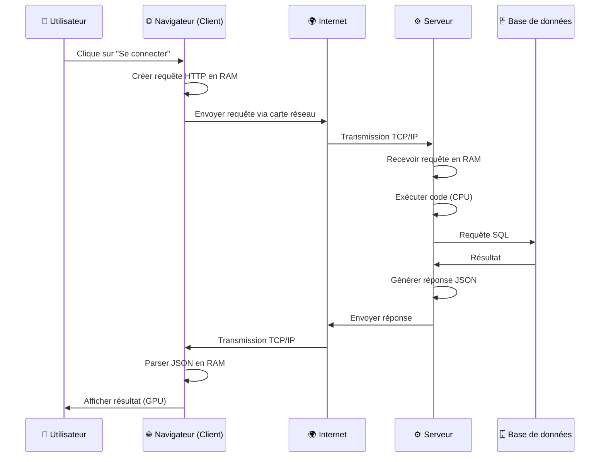
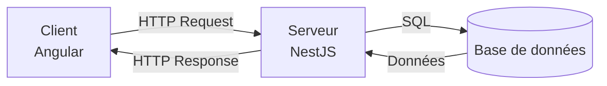
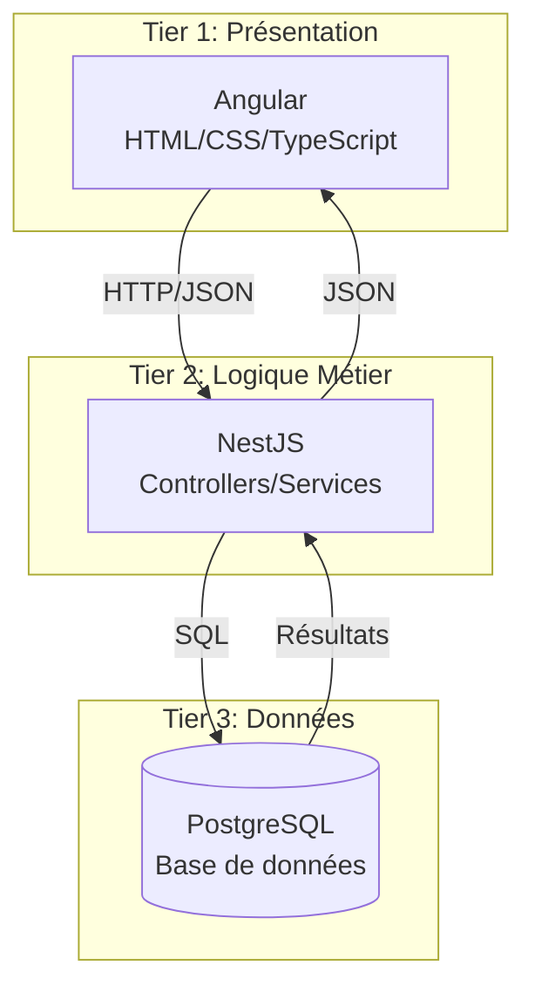
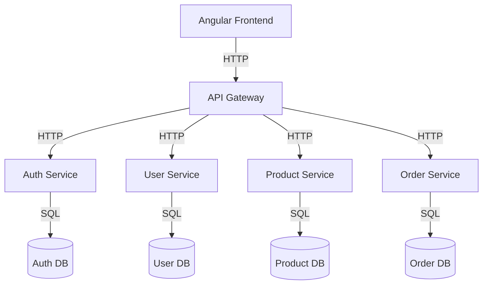
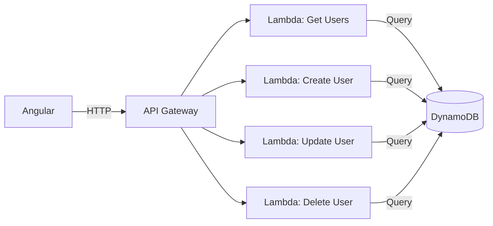

# Client-Serveur : Architecture Web

## 1. Introduction

### Objectifs du cours
À la fin de ce cours, vous serez capable de :
- Comprendre le modèle client-serveur et son fonctionnement
- Identifier les rôles et responsabilités du client et du serveur
- Mettre en œuvre une architecture client-serveur avec Angular et NestJS
- Choisir la bonne architecture pour vos applications web

### Scope de cette notion
L'architecture client-serveur est **la fondation de toutes les applications web modernes**. Cette notion vous permettra de :
- Concevoir des applications web scalables et maintenables
- Comprendre les flux de données entre frontend et backend
- Optimiser les performances et la sécurité de vos applications
- Collaborer efficacement entre équipes frontend et backend

---

## 2. Rappels utiles

Avant d'aborder l'architecture client-serveur, assurez-vous de maîtriser :
- **HTTP** : Le protocole de communication web (GET, POST, PUT, DELETE)
- **JSON** : Le format d'échange de données
- **Variables et types** : Pour manipuler les données côté client et serveur
- **Fonctions** : Pour structurer la logique métier

---

## 3. Définitions des concepts clés

### 3.1 Qu'est-ce qu'un Client ?

**Définition :** Un client est une application qui **demande** des données ou des services à un serveur.

**Analogie de la vie quotidienne :**
Pensez à un restaurant :
- **Vous** = le client
- Vous consultez le menu et passez commande
- Vous attendez que le plat soit préparé
- Vous recevez votre plat

Dans le web :
- **Navigateur web** (Chrome, Firefox) = le client
- **Application mobile** (iOS, Android) = le client
- **Application Angular** = le client

### 3.2 Qu'est-ce qu'un Serveur ?

**Définition :** Un serveur est une application qui **fournit** des données ou des services en réponse aux requêtes du client.

**Suite de l'analogie du restaurant :**
- **La cuisine** = le serveur
- Elle reçoit les commandes
- Elle prépare les plats (traite les données)
- Elle renvoie les plats au client

Dans le web :
- **Serveur web** (Apache, Nginx) = le serveur HTTP
- **Application backend** (NestJS, Express) = le serveur applicatif
- **Base de données** (PostgreSQL, MongoDB) = le serveur de données

### 3.3 Architecture Client-Serveur

**Définition :** Un modèle de communication où des **clients** demandent des services à des **serveurs** via un réseau (Internet).

**Caractéristiques principales :**
- **Séparation des responsabilités** : Le client gère l'interface, le serveur gère la logique métier
- **Communication via protocole** : HTTP/HTTPS pour le web
- **Stateless** : Chaque requête est indépendante
- **Scalabilité** : Plusieurs clients peuvent se connecter au même serveur

### 3.4 Vocabulaire essentiel

| Terme | Définition |
|-------|------------|
| **Frontend** | Partie client de l'application (interface utilisateur) |
| **Backend** | Partie serveur de l'application (logique métier, données) |
| **API** | Interface de programmation permettant la communication client-serveur |
| **Endpoint** | URL spécifique sur le serveur (ex: `/api/users`) |
| **Request** | Requête envoyée par le client |
| **Response** | Réponse renvoyée par le serveur |
| **Full-stack** | Développement incluant frontend ET backend |

---

## 4. Ce qui se passe dans l'ordinateur

### 4.1 Vue d'ensemble du flux de communication

Quand vous tapez une URL dans votre navigateur ou cliquez sur un bouton, voici ce qui se passe **au niveau matériel** :



### 4.2 Détails techniques de la communication

**Côté Client (dans votre ordinateur) :**
1. **CPU** : Exécute le code JavaScript/TypeScript
2. **RAM** : Stocke les données de l'application (état, variables)
3. **Carte réseau** : Envoie/reçoit les paquets de données
4. **GPU** : Affiche l'interface utilisateur

**Côté Serveur (dans le datacenter) :**
1. **CPU** : Traite les requêtes, exécute la logique métier
2. **RAM** : Cache, sessions, données temporaires
3. **Disque dur** : Base de données, fichiers
4. **Carte réseau** : Reçoit/envoie des milliers de requêtes par seconde

### 4.3 Exemple concret : Login utilisateur

**Ce qui se passe matériellement :**

```
1. Utilisateur tape email + mot de passe
   → Stocké en RAM du navigateur

2. Clic sur "Connexion"
   → CPU exécute JavaScript
   → Création objet JSON en RAM
   → Carte réseau envoie données chiffrées (HTTPS)

3. Données traversent Internet
   → Routeurs, câbles, fibres optiques
   → Protocole TCP/IP assure la livraison

4. Serveur reçoit les données
   → RAM stocke la requête
   → CPU exécute code NestJS
   → Vérifie email/mot de passe dans DB (disque)

5. Serveur génère token JWT
   → CPU crée le token
   → RAM stocke temporairement
   → Carte réseau renvoie au client

6. Client reçoit le token
   → RAM stocke le token
   → localStorage (disque dur du navigateur)
   → Redirection vers tableau de bord
```

---

## 5. Architecture Client-Serveur : Le cœur du cours

### 5.1 Modèle de base



**Flux typique :**
1. **Client** : Affiche l'interface, collecte les données utilisateur
2. **Client** : Envoie une requête HTTP au serveur
3. **Serveur** : Reçoit la requête, valide les données
4. **Serveur** : Interroge la base de données si nécessaire
5. **Serveur** : Traite la logique métier
6. **Serveur** : Renvoie une réponse au client
7. **Client** : Affiche le résultat à l'utilisateur

### 5.2 Architecture à 3 niveaux (3-Tier)

L'architecture la plus courante dans les applications web métier :



**Avantages de cette architecture :**
- ✅ **Séparation claire des responsabilités**
- ✅ **Scalabilité** : Chaque niveau peut évoluer indépendamment
- ✅ **Maintenabilité** : Plus facile à tester et déboguer
- ✅ **Sécurité** : Le client ne peut pas accéder directement à la DB
- ✅ **Réutilisabilité** : Le backend peut servir web + mobile + desktop

### 5.3 Responsabilités du Client (Frontend)

**Ce que fait le client :**

| Responsabilité | Description | Exemple Angular |
|----------------|-------------|-----------------|
| **Interface utilisateur** | Affichage, formulaires, navigation | Components, Templates |
| **Validation côté client** | Vérifications immédiates pour l'UX | FormControl, Validators |
| **Gestion de l'état** | Données temporaires de l'application | Services, Signals, RxJS |
| **Appels API** | Communication avec le serveur | HttpClient |
| **Routing** | Navigation entre pages | RouterModule |
| **Cache local** | Optimisation des performances | LocalStorage, SessionStorage |

**Exemple TypeScript (Angular) :**

```typescript
// Service client pour gérer les utilisateurs
@Injectable({ providedIn: 'root' })
export class UserService {
  private apiUrl = 'https://api.example.com/users';
  
  constructor(private http: HttpClient) {}
  
  // Récupérer tous les utilisateurs
  getUsers(): Observable<User[]> {
    return this.http.get<User[]>(this.apiUrl);
  }
  
  // Créer un utilisateur
  createUser(user: CreateUserDto): Observable<User> {
    return this.http.post<User>(this.apiUrl, user);
  }
  
  // Mettre à jour un utilisateur
  updateUser(id: number, updates: Partial<User>): Observable<User> {
    return this.http.patch<User>(`${this.apiUrl}/${id}`, updates);
  }
  
  // Supprimer un utilisateur
  deleteUser(id: number): Observable<void> {
    return this.http.delete<void>(`${this.apiUrl}/${id}`);
  }
}
```

**Composant Angular utilisant le service :**

```typescript
@Component({
  selector: 'app-user-list',
  template: `
    <div class="user-list">
      <h2>Liste des utilisateurs</h2>
      
      <div *ngFor="let user of users$ | async" class="user-card">
        <h3>{{ user.name }}</h3>
        <p>{{ user.email }}</p>
        <button (click)="deleteUser(user.id)">Supprimer</button>
      </div>
      
      <button (click)="loadUsers()">Recharger</button>
    </div>
  `
})
export class UserListComponent implements OnInit {
  users$: Observable<User[]>;
  
  constructor(private userService: UserService) {}
  
  ngOnInit(): void {
    this.loadUsers();
  }
  
  loadUsers(): void {
    this.users$ = this.userService.getUsers();
  }
  
  deleteUser(id: number): void {
    this.userService.deleteUser(id).subscribe(() => {
      this.loadUsers(); // Recharger la liste
    });
  }
}
```

### 5.4 Responsabilités du Serveur (Backend)

**Ce que fait le serveur :**

| Responsabilité | Description | Exemple NestJS |
|----------------|-------------|----------------|
| **Logique métier** | Règles business, calculs complexes | Services |
| **Validation des données** | Vérifications strictes et sécurisées | DTOs, Pipes, Validators |
| **Authentification** | Gestion des tokens, sessions | Guards, JWT |
| **Autorisation** | Contrôle des permissions | Guards, Roles |
| **Accès aux données** | CRUD sur la base de données | Repositories, ORM |
| **Sécurité** | Protection contre injections, XSS | Validation, Sanitization |
| **Logging** | Traçabilité des actions | Logger, Interceptors |

**Exemple TypeScript (NestJS) :**

```typescript
// DTO pour valider les données entrantes
export class CreateUserDto {
  @IsString()
  @IsNotEmpty()
  @MinLength(2)
  @MaxLength(50)
  name: string;

  @IsEmail()
  @IsNotEmpty()
  email: string;

  @IsString()
  @MinLength(8)
  @Matches(/^(?=.*[a-z])(?=.*[A-Z])(?=.*\d)/, {
    message: 'Le mot de passe doit contenir majuscule, minuscule et chiffre'
  })
  password: string;
}

// Controller : Point d'entrée des requêtes HTTP
@Controller('users')
export class UserController {
  constructor(private userService: UserService) {}
  
  @Get()
  async findAll(): Promise<User[]> {
    return this.userService.findAll();
  }
  
  @Get(':id')
  async findOne(@Param('id', ParseIntPipe) id: number): Promise<User> {
    const user = await this.userService.findById(id);
    
    if (!user) {
      throw new NotFoundException(`Utilisateur ${id} non trouvé`);
    }
    
    return user;
  }
  
  @Post()
  @HttpCode(201)
  @UsePipes(new ValidationPipe())
  async create(@Body() dto: CreateUserDto): Promise<User> {
    // Vérifier si l'email existe déjà
    const existing = await this.userService.findByEmail(dto.email);
    if (existing) {
      throw new ConflictException('Cet email est déjà utilisé');
    }
    
    return this.userService.create(dto);
  }
  
  @Patch(':id')
  @UseGuards(AuthGuard)
  async update(
    @Param('id', ParseIntPipe) id: number,
    @Body() updates: Partial<User>
  ): Promise<User> {
    return this.userService.update(id, updates);
  }
  
  @Delete(':id')
  @HttpCode(204)
  @UseGuards(AuthGuard, AdminGuard)
  async delete(@Param('id', ParseIntPipe) id: number): Promise<void> {
    await this.userService.delete(id);
  }
}

// Service : Logique métier
@Injectable()
export class UserService {
  constructor(
    @InjectRepository(User)
    private userRepository: Repository<User>,
    private emailService: EmailService
  ) {}
  
  async findAll(): Promise<User[]> {
    return this.userRepository.find();
  }
  
  async findById(id: number): Promise<User | null> {
    return this.userRepository.findOne({ where: { id } });
  }
  
  async findByEmail(email: string): Promise<User | null> {
    return this.userRepository.findOne({ where: { email } });
  }
  
  async create(dto: CreateUserDto): Promise<User> {
    // Hash du mot de passe
    const hashedPassword = await bcrypt.hash(dto.password, 10);
    
    // Création de l'utilisateur
    const user = this.userRepository.create({
      ...dto,
      password: hashedPassword
    });
    
    const savedUser = await this.userRepository.save(user);
    
    // Envoi email de bienvenue (asynchrone)
    await this.emailService.sendWelcomeEmail(savedUser.email);
    
    return savedUser;
  }
  
  async update(id: number, updates: Partial<User>): Promise<User> {
    await this.userRepository.update(id, updates);
    return this.findById(id);
  }
  
  async delete(id: number): Promise<void> {
    await this.userRepository.delete(id);
  }
}
```

### 5.5 Architectures avancées

#### 5.5.1 Architecture Microservices

Pour les grandes applications, on peut séparer le backend en plusieurs services :



**Avantages :**
- Chaque service peut être développé/déployé indépendamment
- Technologies différentes par service si nécessaire
- Scalabilité fine (scaler uniquement les services surchargés)

**Inconvénients :**
- Complexité accrue
- Communication inter-services à gérer
- Débogage plus difficile

#### 5.5.2 Architecture Serverless

Le backend est décomposé en fonctions individuelles (AWS Lambda, Azure Functions) :



**Avantages :**
- Pas de gestion de serveurs
- Scalabilité automatique
- Coût optimisé (paiement à l'usage)

**Inconvénients :**
- Cold starts (latence au démarrage)
- Complexité du débogage
- Vendor lock-in

### 5.6 Communication Client-Serveur : Patterns courants

#### Pattern 1 : Request-Response synchrone

```typescript
// Client
async login(email: string, password: string): Promise<void> {
  try {
    const response = await this.http.post<AuthResponse>(
      '/api/auth/login',
      { email, password }
    ).toPromise();
    
    // Stocker le token
    localStorage.setItem('token', response.token);
    
    // Rediriger
    this.router.navigate(['/dashboard']);
  } catch (error) {
    console.error('Erreur de connexion', error);
  }
}
```

#### Pattern 2 : Polling (interrogation périodique)

```typescript
// Client - Vérifier le statut toutes les 5 secondes
ngOnInit(): void {
  interval(5000).pipe(
    switchMap(() => this.http.get<JobStatus>('/api/jobs/123'))
  ).subscribe(status => {
    if (status.completed) {
      this.showNotification('Job terminé !');
    }
  });
}
```

#### Pattern 3 : WebSockets (communication bidirectionnelle)

```typescript
// Client
const socket = new WebSocket('wss://api.example.com/ws');

socket.onmessage = (event) => {
  const notification = JSON.parse(event.data);
  this.showNotification(notification.message);
};

// Serveur (NestJS)
@WebSocketGateway()
export class NotificationGateway {
  @SubscribeMessage('subscribe')
  handleSubscribe(@ConnectedSocket() client: Socket): void {
    // Envoyer notifications en temps réel
    client.emit('notification', {
      message: 'Nouvelle commande reçue'
    });
  }
}
```

#### Pattern 4 : Server-Sent Events (SSE)

```typescript
// Client
const eventSource = new EventSource('/api/events');

eventSource.onmessage = (event) => {
  const data = JSON.parse(event.data);
  console.log('Nouveau message:', data);
};

// Serveur (NestJS)
@Sse('events')
getEvents(): Observable<MessageEvent> {
  return interval(1000).pipe(
    map(() => ({
      data: { timestamp: Date.now() }
    }))
  );
}
```

---

## 6. Erreurs courantes & comment les éviter

### 6.1 Erreurs techniques

| Erreur | Impact | Solution |
|--------|--------|----------|
| **Logique métier côté client** | Contournement facile, insécurité | Toujours valider côté serveur |
| **Données sensibles dans le frontend** | Fuite de données | Stocker secrets uniquement côté serveur |
| **Pas de gestion d'erreur** | Application plante | try/catch + affichage user-friendly |
| **Requêtes synchrones bloquantes** | Interface figée | Utiliser async/await + Observable |
| **Pas de timeout** | Requêtes infinies | Configurer timeout HTTP |
| **Trop de requêtes** | Surcharge serveur | Debouncing, throttling, cache |

### 6.2 Erreurs d'architecture

**❌ Erreur 1 : Logique métier dans le client**

```typescript
// ❌ MAUVAIS : Calcul TVA côté client
calculatePriceWithTax(price: number): number {
  return price * 1.20; // Client peut modifier le code !
}
```

```typescript
// ✅ BON : Calcul TVA côté serveur
@Get('price/:id')
async getPrice(@Param('id') id: number): Promise<PriceResponse> {
  const basePrice = await this.productService.getPrice(id);
  const priceWithTax = basePrice * 1.20; // Sécurisé
  
  return { basePrice, priceWithTax, tax: 0.20 };
}
```

**❌ Erreur 2 : Accès direct à la base de données depuis le client**

```typescript
// ❌ JAMAIS FAIRE ÇA
const db = new PostgresClient({
  host: 'db.example.com',
  password: 'secret' // Exposé dans le code client !
});
```

**✅ Toujours passer par une API sécurisée**

**❌ Erreur 3 : Pas de validation serveur**

```typescript
// ❌ MAUVAIS : Faire confiance au client
@Post()
async create(@Body() data: any): Promise<User> {
  return this.db.save(data); // Injection possible !
}
```

```typescript
// ✅ BON : Valider avec DTO
@Post()
async create(@Body() dto: CreateUserDto): Promise<User> {
  // dto est validé par class-validator
  return this.userService.create(dto);
}
```

### 6.3 Erreurs de performance

**Problème : N+1 queries**

```typescript
// ❌ MAUVAIS : Une requête par utilisateur
async getUsersWithOrders(): Promise<UserWithOrders[]> {
  const users = await this.userRepository.find();
  
  // N requêtes supplémentaires !
  for (const user of users) {
    user.orders = await this.orderRepository.find({ userId: user.id });
  }
  
  return users;
}
```

```typescript
// ✅ BON : Une seule requête avec JOIN
async getUsersWithOrders(): Promise<UserWithOrders[]> {
  return this.userRepository.find({
    relations: ['orders'] // Un seul JOIN
  });
}
```

**Problème : Pas de pagination**

```typescript
// ❌ MAUVAIS : Retourner tous les résultats
@Get()
async findAll(): Promise<User[]> {
  return this.userRepository.find(); // 10 000+ résultats !
}
```

```typescript
// ✅ BON : Pagination
@Get()
async findAll(
  @Query('page', ParseIntPipe) page: number = 1,
  @Query('limit', ParseIntPipe) limit: number = 20
): Promise<PaginatedResponse<User>> {
  const skip = (page - 1) * limit;
  
  const [users, total] = await this.userRepository.findAndCount({
    skip,
    take: limit
  });
  
  return {
    data: users,
    total,
    page,
    pageCount: Math.ceil(total / limit)
  };
}
```

---

## 7. Exercices pratiques

### Exercice 1 : Créer une API Todo (Débutant)

**Objectif :** Implémenter un CRUD complet pour une application de todos.

**Partie 1 - Backend (NestJS) :**
1. Créer un DTO `CreateTodoDto` avec validation :
   - `title` : string, requis, 3-100 caractères
   - `description` : string, optionnel
   - `dueDate` : Date, optionnel

2. Créer un Controller avec les endpoints :
   - `GET /todos` : Liste tous les todos
   - `GET /todos/:id` : Récupère un todo
   - `POST /todos` : Crée un todo
   - `PATCH /todos/:id` : Met à jour un todo
   - `DELETE /todos/:id` : Supprime un todo

3. Créer un Service avec la logique métier :
   - Stocker les todos en mémoire (tableau)
   - Générer des IDs automatiques
   - Gérer les cas d'erreur (todo non trouvé)

**Partie 2 - Frontend (Angular) :**
1. Créer un Service `TodoService` :
   - Méthodes correspondant aux endpoints API
   - Utiliser HttpClient
   - Typage TypeScript strict

2. Créer un composant `TodoListComponent` :
   - Afficher la liste des todos
   - Boutons pour créer, modifier, supprimer
   - Gestion des états de chargement et d'erreur

**Points clés à vérifier :**
- ✅ Validation des données côté serveur
- ✅ Gestion des erreurs (404, 400, 500)
- ✅ Types TypeScript corrects
- ✅ Séparation des responsabilités (Service vs Component)

### Exercice 2 : Authentification JWT (Intermédiaire)

**Objectif :** Implémenter un système d'authentification complet.

**Backend :**
1. Endpoint `POST /auth/login` :
   - Validation email/password
   - Génération JWT token
   - Retour du token au client

2. Endpoint `GET /auth/profile` :
   - Protégé par Guard
   - Retourne les infos de l'utilisateur connecté

3. Guard `AuthGuard` :
   - Vérifier la présence du token
   - Valider le token JWT
   - Rejeter si invalide (401)

**Frontend :**
1. Service `AuthService` :
   - Méthodes login/logout
   - Stockage du token (localStorage)
   - Interceptor HTTP pour ajouter le token

2. Guard `AuthGuard` :
   - Protéger les routes nécessitant connexion
   - Rediriger vers /login si non connecté

**Bonus :**
- Refresh token automatique
- Déconnexion auto si token expiré
- Gestion des rôles (admin/user)

---

## 8. Comportement senior

### 8.1 Bonnes pratiques d'architecture

**1. Principe de séparation stricte :**
```typescript
// ❌ Mélanger présentation et logique
@Component({...})
export class UserComponent {
  async loadUsers(): Promise<void> {
    // Requête HTTP directement dans le composant
    const response = await fetch('/api/users');
    this.users = await response.json();
  }
}

// ✅ Séparer avec un service
@Injectable()
export class UserService {
  loadUsers(): Observable<User[]> {
    return this.http.get<User[]>('/api/users');
  }
}

@Component({...})
export class UserComponent {
  users$ = this.userService.loadUsers();
  
  constructor(private userService: UserService) {}
}
```

**2. Gestion d'erreur robuste :**
```typescript
// ✅ Backend : Erreurs explicites
@Get(':id')
async findOne(@Param('id') id: number): Promise<User> {
  const user = await this.userService.findById(id);
  
  if (!user) {
    throw new NotFoundException({
      statusCode: 404,
      message: 'Utilisateur non trouvé',
      error: 'Not Found',
      details: { userId: id }
    });
  }
  
  return user;
}

// ✅ Frontend : Gestion propre
this.userService.getUser(id).subscribe({
  next: (user) => this.user = user,
  error: (error) => {
    if (error.status === 404) {
      this.router.navigate(['/404']);
    } else {
      this.notificationService.error('Erreur lors du chargement');
    }
  }
});
```

**3. Optimisation des performances :**
```typescript
// ✅ Cache côté client
@Injectable()
export class UserService {
  private cache = new Map<number, User>();
  
  getUser(id: number): Observable<User> {
    // Retour du cache si disponible
    if (this.cache.has(id)) {
      return of(this.cache.get(id));
    }
    
    // Sinon requête HTTP
    return this.http.get<User>(`/api/users/${id}`).pipe(
      tap(user => this.cache.set(id, user))
    );
  }
}

// ✅ Debouncing pour recherche
searchControl = new FormControl('');

ngOnInit(): void {
  this.searchControl.valueChanges.pipe(
    debounceTime(300), // Attendre 300ms après la dernière frappe
    distinctUntilChanged(), // Ignorer si valeur identique
    switchMap(term => this.searchService.search(term))
  ).subscribe(results => this.results = results);
}
```

### 8.2 Conseils pour devenir senior rapidement

**1. Pensez sécurité TOUJOURS :**
- Ne jamais faire confiance aux données du client
- Valider côté serveur TOUT le temps
- Utiliser HTTPS en production
- Protéger contre les injections (SQL, XSS)
- Logger les actions sensibles

**2. Anticipez la scalabilité :**
- Pagination dès le début
- Cache intelligent
- Éviter les N+1 queries
- Index sur les colonnes fréquemment requêtées
- Monitoring des performances

**3. Maintenabilité avant tout :**
- Code lisible > code clever
- Documentation des endpoints (Swagger)
- Tests unitaires et d'intégration
- Convention de nommage claire
- Séparation des responsabilités

**4. Communication d'équipe :**
- Documenter les contrats d'API (DTOs)
- Versionner les APIs (`/api/v1/users`)
- Changelog des modifications
- Communication proactive avec frontend/backend

**5. Monitoring et observabilité :**
```typescript
// Logging structuré
@Injectable()
export class UserService {
  private logger = new Logger('UserService');
  
  async create(dto: CreateUserDto): Promise<User> {
    this.logger.log(`Creating user: ${dto.email}`);
    
    try {
      const user = await this.userRepository.save(dto);
      this.logger.log(`User created successfully: ${user.id}`);
      return user;
    } catch (error) {
      this.logger.error(`Failed to create user: ${error.message}`, error.stack);
      throw error;
    }
  }
}
```

**6. Évolution progressive :**
- Commencer simple (monolithe)
- Refactorer quand nécessaire
- Ne pas sur-architecturer
- YAGNI : You Aren't Gonna Need It

---

## 9. Résumé

### Ce que vous avez appris

✅ **Architecture client-serveur** : Modèle fondamental du web où le client demande et le serveur répond

✅ **Séparation des responsabilités** :
- Client = Interface utilisateur, expérience utilisateur
- Serveur = Logique métier, sécurité, données

✅ **Communication HTTP** : Request/Response via JSON

✅ **Implémentation concrète** :
- Frontend : Angular + HttpClient + Services
- Backend : NestJS + Controllers + Services + DTOs

✅ **Bonnes pratiques** :
- Validation serveur obligatoire
- Gestion d'erreur robuste
- Optimisation des performances
- Sécurité prioritaire

### Quand utiliser cette architecture

**✅ Utilisez client-serveur quand :**
- Vous développez une application web/mobile
- Vous avez besoin de sécuriser les données
- Vous voulez plusieurs clients (web, mobile, desktop)
- Vous avez une logique métier complexe
- Vous devez scaler l'application

**❌ Évitez client-serveur quand :**
- Application très simple (static site peut suffire)
- Pas de données sensibles (tout peut être côté client)
- Temps réel critique (préférer WebSocket pur)

### Pour aller plus loin

**Ressources recommandées :**
- [Architecture web moderne](https://roadmap.sh/backend) - Roadmap backend
- [NestJS Documentation](https://docs.nestjs.com/) - Documentation officielle
- [Angular Architecture](https://angular.dev/guide/architecture) - Guide Angular
- [REST API Best Practices](https://stackoverflow.blog/2020/03/02/best-practices-for-rest-api-design/) - Bonnes pratiques

**Vidéos :**
- [Client-Server Architecture Explained](https://www.youtube.com/watch?v=L5BlpPU_muY) (EN)
- [Building Scalable APIs](https://www.youtube.com/watch?v=ZX3qt0UWifc) (EN)

**Prochaines étapes :**
1. Maîtriser CORS (prochain cours)
2. Approfondir NestJS (Guards, Interceptors, Pipes)
3. Apprendre les WebSockets pour le temps réel
4. Découvrir les microservices

---

**En une phrase :**

> L'architecture client-serveur sépare l'interface utilisateur (client) de la logique métier et des données (serveur), permettant de créer des applications web sécurisées, scalables et maintenables où chaque partie a une responsabilité claire et communique via HTTP/JSON.
