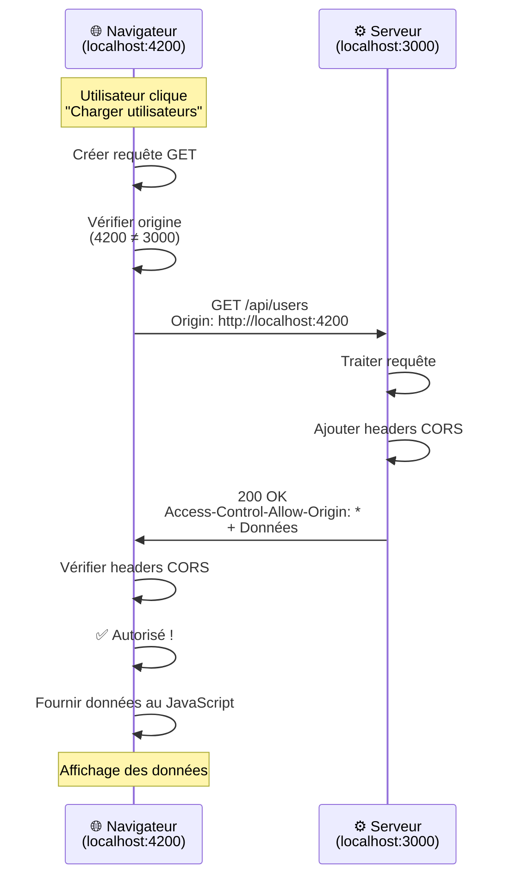
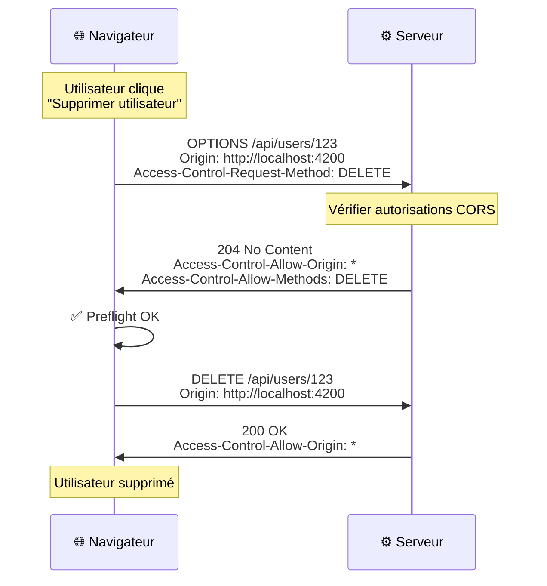

# CORS : Cross-Origin Resource Sharing

## 1. Introduction

### Objectifs du cours
À la fin de ce cours, vous serez capable de :
- Comprendre ce qu'est CORS et pourquoi il existe
- Diagnostiquer et résoudre les erreurs CORS
- Configurer CORS correctement dans une application NestJS
- Implémenter des stratégies CORS sécurisées en production
- Éviter les erreurs de sécurité liées à CORS

### Scope de cette notion
CORS est **un mécanisme de sécurité crucial** dans les applications web modernes. Cette notion vous permettra de :
- Permettre la communication entre votre frontend et backend sur différents domaines
- Protéger votre API contre les accès non autorisés
- Développer localement avec Angular et NestJS sur des ports différents
- Déployer en production de manière sécurisée
- Comprendre les erreurs CORS et les résoudre rapidement

**Pourquoi c'est important ?**
Sans CORS correctement configuré, votre frontend Angular ne pourra PAS communiquer avec votre backend NestJS si ils sont sur des domaines/ports différents !

---

## 2. Rappels utiles

Avant d'aborder CORS, assurez-vous de maîtriser :
- **HTTP** : Requêtes, réponses, headers
- **Client-Serveur** : Architecture web, communication frontend-backend
- **Domaines et URLs** : protocole://domaine:port/chemin
- **Sécurité web** : Concepts de base (XSS, CSRF)

**Rappel important :**
```
URL complète : https://api.example.com:443/api/users
                ↓        ↓             ↓
             Protocole  Domaine      Port
```

Deux URLs ont une **origine différente** si :
- Le protocole est différent (http vs https)
- Le domaine est différent (example.com vs api.example.com)
- Le port est différent (3000 vs 4200)

---

## 3. Définitions des concepts clés

### 3.1 Qu'est-ce que CORS ?

**CORS** (Cross-Origin Resource Sharing) est un **mécanisme de sécurité** implémenté par les navigateurs qui contrôle les requêtes HTTP entre différentes origines.

**Analogie de la vie quotidienne :**

Imaginez une **frontière entre pays** :
- **Votre pays** (frontend) = `http://localhost:4200` (Angular)
- **Pays voisin** (backend) = `http://localhost:3000` (NestJS)
- **Douane** = Le navigateur (Chrome, Firefox)
- **Passeport/Visa** = Headers CORS

Vous (requête HTTP) voulez aller dans le pays voisin :
1. La douane vérifie votre passeport
2. Si le pays voisin vous autorise (CORS configuré), vous passez ✅
3. Sinon, vous êtes refoulé (erreur CORS) ❌

### 3.2 Qu'est-ce qu'une Origine (Origin) ?

**Définition :** Une origine est la combinaison du **protocole + domaine + port**.

**Exemples :**

| URL | Origine |
|-----|---------|
| `https://example.com/page` | `https://example.com:443` |
| `http://localhost:4200` | `http://localhost:4200` |
| `http://api.example.com` | `http://api.example.com:80` |

**Comparaison d'origines :**

| URL 1 | URL 2 | Même origine ? |
|-------|-------|----------------|
| `http://example.com` | `http://example.com/page` | ✅ Oui |
| `http://example.com` | `https://example.com` | ❌ Non (protocole différent) |
| `http://example.com` | `http://api.example.com` | ❌ Non (domaine différent) |
| `http://localhost:4200` | `http://localhost:3000` | ❌ Non (port différent) |

### 3.3 Same-Origin Policy (SOP)

**Définition :** Politique de sécurité des navigateurs qui **interdit par défaut** les requêtes HTTP vers une origine différente.

**Pourquoi cette restriction ?**
- Protéger contre le vol de données
- Empêcher les sites malveillants d'accéder à vos données
- Éviter les attaques CSRF (Cross-Site Request Forgery)

**Exemple du problème :**
Sans SOP, un site malveillant `http://evil.com` pourrait faire des requêtes vers `http://bank.com` en utilisant VOS cookies de session et voler vos données !

### 3.4 CORS : La solution contrôlée

**CORS permet de contourner la SOP de manière sécurisée** en utilisant des headers HTTP spécifiques.

Le serveur dit explicitement : "J'autorise les requêtes de cette origine".

### 3.5 Vocabulaire essentiel

| Terme | Définition |
|-------|------------|
| **Origin** | Protocole + domaine + port de la requête |
| **Preflight** | Requête OPTIONS envoyée avant la vraie requête |
| **Simple Request** | Requête GET/POST basique, sans preflight |
| **Preflighted Request** | Requête complexe nécessitant un preflight |
| **CORS Headers** | Headers HTTP contrôlant CORS |
| **Credentials** | Cookies, headers d'authentification |
| **Wildcard** | `*` = Autoriser toutes les origines |

---

## 4. Ce qui se passe dans l'ordinateur

### 4.1 Flux d'une requête CORS simple



### 4.2 Flux d'une requête CORS avec Preflight

Pour les requêtes complexes (PUT, DELETE, headers custom, etc.), le navigateur envoie d'abord une requête **OPTIONS** pour vérifier les autorisations :



### 4.3 Qu'est-ce qu'une Simple Request ?

**Une requête est "simple" si elle respecte TOUS ces critères :**

1. **Méthode** : `GET`, `POST`, ou `HEAD`
2. **Headers** : Uniquement les headers standard autorisés :
   - `Accept`
   - `Accept-Language`
   - `Content-Language`
   - `Content-Type` (seulement ces valeurs) :
     - `application/x-www-form-urlencoded`
     - `multipart/form-data`
     - `text/plain`

**Exemples :**

```typescript
// ✅ Simple Request (pas de preflight)
fetch('http://localhost:3000/api/users', {
  method: 'GET'
});

// ✅ Simple Request
fetch('http://localhost:3000/api/users', {
  method: 'POST',
  headers: {
    'Content-Type': 'text/plain'
  },
  body: 'name=John'
});

// ❌ Preflighted Request (nécessite OPTIONS)
fetch('http://localhost:3000/api/users', {
  method: 'DELETE' // Méthode non-simple
});

// ❌ Preflighted Request
fetch('http://localhost:3000/api/users', {
  method: 'POST',
  headers: {
    'Content-Type': 'application/json', // Content-Type non-simple
    'Authorization': 'Bearer token'     // Header custom
  },
  body: JSON.stringify({ name: 'John' })
});
```

---

## 5. Configuration CORS : Le cœur du cours

### 5.1 Headers CORS essentiels

#### 5.1.1 Headers de réponse (Serveur → Client)

| Header | Description | Exemple |
|--------|-------------|---------|
| `Access-Control-Allow-Origin` | **Origines autorisées** | `*` ou `http://localhost:4200` |
| `Access-Control-Allow-Methods` | **Méthodes HTTP autorisées** | `GET, POST, PUT, DELETE` |
| `Access-Control-Allow-Headers` | **Headers autorisés** | `Content-Type, Authorization` |
| `Access-Control-Allow-Credentials` | **Autoriser cookies/auth** | `true` |
| `Access-Control-Max-Age` | **Durée cache preflight (s)** | `3600` |
| `Access-Control-Expose-Headers` | **Headers exposés au client** | `X-Total-Count` |

#### 5.1.2 Headers de requête (Client → Serveur)

| Header | Description | Exemple |
|--------|-------------|---------|
| `Origin` | Origine de la requête | `http://localhost:4200` |
| `Access-Control-Request-Method` | Méthode de la vraie requête (preflight) | `DELETE` |
| `Access-Control-Request-Headers` | Headers de la vraie requête (preflight) | `Content-Type, Authorization` |

### 5.2 Configuration CORS avec NestJS

#### 5.2.1 Configuration globale basique

**Autoriser toutes les origines (DÉVELOPPEMENT UNIQUEMENT) :**

```typescript
// main.ts
import { NestFactory } from '@nestjs/core';
import { AppModule } from './app.module';

async function bootstrap() {
  const app = await NestFactory.create(AppModule);
  
  // ⚠️ DÉVELOPPEMENT UNIQUEMENT - Pas sécurisé en production
  app.enableCors();
  
  await app.listen(3000);
}
bootstrap();
```

Équivalent à :
```typescript
app.enableCors({
  origin: '*', // Toutes les origines
  methods: 'GET,HEAD,PUT,PATCH,POST,DELETE',
  credentials: false
});
```

#### 5.2.2 Configuration sécurisée (PRODUCTION)

```typescript
// main.ts
async function bootstrap() {
  const app = await NestFactory.create(AppModule);
  
  // ✅ Configuration sécurisée
  app.enableCors({
    origin: [
      'https://www.monsite.com',        // Production
      'https://app.monsite.com',        // App web
      'http://localhost:4200',          // Dev local Angular
      'http://localhost:3001'           // Dev local React
    ],
    methods: ['GET', 'POST', 'PUT', 'PATCH', 'DELETE'],
    allowedHeaders: ['Content-Type', 'Authorization'],
    credentials: true, // Autoriser cookies et auth
    maxAge: 3600 // Cache preflight 1h
  });
  
  await app.listen(3000);
}
bootstrap();
```

#### 5.2.3 Configuration dynamique

```typescript
// main.ts
async function bootstrap() {
  const app = await NestFactory.create(AppModule);
  
  app.enableCors({
    origin: (origin, callback) => {
      // Liste blanche d'origines autorisées
      const whitelist = [
        'https://www.monsite.com',
        'http://localhost:4200'
      ];
      
      // Autoriser requêtes sans origin (Postman, cURL, mobile)
      if (!origin) {
        callback(null, true);
        return;
      }
      
      // Vérifier si l'origine est dans la whitelist
      if (whitelist.includes(origin)) {
        callback(null, true);
      } else {
        callback(new Error('Origine non autorisée par CORS'));
      }
    },
    credentials: true
  });
  
  await app.listen(3000);
}
bootstrap();
```

#### 5.2.4 Configuration par environnement

```typescript
// config/cors.config.ts
export const getCorsConfig = () => {
  const isDevelopment = process.env.NODE_ENV === 'development';
  
  if (isDevelopment) {
    // Dev : Permissif
    return {
      origin: '*',
      credentials: false
    };
  }
  
  // Production : Restrictif
  return {
    origin: process.env.ALLOWED_ORIGINS?.split(',') || [],
    credentials: true,
    methods: ['GET', 'POST', 'PUT', 'PATCH', 'DELETE'],
    allowedHeaders: ['Content-Type', 'Authorization'],
    maxAge: 3600
  };
};

// main.ts
import { getCorsConfig } from './config/cors.config';

async function bootstrap() {
  const app = await NestFactory.create(AppModule);
  app.enableCors(getCorsConfig());
  await app.listen(3000);
}
```

**.env (production) :**
```env
NODE_ENV=production
ALLOWED_ORIGINS=https://www.monsite.com,https://app.monsite.com
```

### 5.3 Configuration CORS par route

Si vous avez besoin de règles différentes par endpoint :

```typescript
// user.controller.ts
import { Controller, Get, Post, Res } from '@nestjs/common';
import { Response } from 'express';

@Controller('users')
export class UserController {
  
  // Route publique : CORS ouvert
  @Get('public')
  getPublicUsers(@Res() res: Response) {
    res.header('Access-Control-Allow-Origin', '*');
    res.json([{ name: 'Public User' }]);
  }
  
  // Route privée : CORS restrictif
  @Get('private')
  getPrivateUsers(@Res() res: Response) {
    res.header('Access-Control-Allow-Origin', 'https://app.monsite.com');
    res.header('Access-Control-Allow-Credentials', 'true');
    res.json([{ name: 'Private User', email: 'private@example.com' }]);
  }
}
```

### 5.4 Gestion des credentials (cookies, auth)

#### 5.4.1 Pourquoi credentials: true ?

Pour envoyer/recevoir :
- Cookies de session
- Headers Authorization
- Certificats client

**Configuration serveur :**
```typescript
app.enableCors({
  origin: 'http://localhost:4200', // ⚠️ Pas de wildcard avec credentials
  credentials: true
});
```

**Configuration client (Angular) :**
```typescript
// Sans interceptor
this.http.get('http://localhost:3000/api/users', {
  withCredentials: true // Envoyer cookies
}).subscribe();

// Avec interceptor (recommandé)
@Injectable()
export class CredentialsInterceptor implements HttpInterceptor {
  intercept(req: HttpRequest<any>, next: HttpHandler) {
    const clonedReq = req.clone({
      withCredentials: true
    });
    return next.handle(clonedReq);
  }
}
```

**⚠️ Règle importante :**
Si `credentials: true`, vous **NE POUVEZ PAS** utiliser `origin: '*'` !
Vous devez spécifier l'origine exacte.

```typescript
// ❌ ERREUR - Ne fonctionne pas
app.enableCors({
  origin: '*',
  credentials: true
});

// ✅ CORRECT
app.enableCors({
  origin: 'http://localhost:4200',
  credentials: true
});
```

### 5.5 Exposer des headers custom au client

Par défaut, le client JavaScript ne peut lire que ces headers :
- `Cache-Control`
- `Content-Language`
- `Content-Type`
- `Expires`
- `Last-Modified`
- `Pragma`

Pour exposer d'autres headers :

```typescript
// Serveur NestJS
app.enableCors({
  origin: 'http://localhost:4200',
  exposedHeaders: ['X-Total-Count', 'X-Page-Number']
});

// Controller
@Get()
async findAll(@Res() res: Response) {
  const users = await this.userService.findAll();
  
  res.header('X-Total-Count', users.length.toString());
  res.json(users);
}

// Client Angular
this.http.get('http://localhost:3000/api/users', { observe: 'response' })
  .subscribe(response => {
    const totalCount = response.headers.get('X-Total-Count');
    console.log('Total:', totalCount); // Maintenant accessible !
  });
```

---

## 6. Erreurs courantes & comment les éviter

### 6.1 Messages d'erreur CORS typiques

**Erreur 1 : "No 'Access-Control-Allow-Origin' header"**

```
Access to fetch at 'http://localhost:3000/api/users' from origin 
'http://localhost:4200' has been blocked by CORS policy: 
No 'Access-Control-Allow-Origin' header is present on the requested resource.
```

**Cause :** Le serveur n'a pas configuré CORS.

**Solution :**
```typescript
// main.ts
app.enableCors();
```

---

**Erreur 2 : "CORS policy: The 'Access-Control-Allow-Origin' header contains multiple values"**

**Cause :** Duplication de la configuration CORS (par ex. NestJS + middleware Express).

**Solution :**
```typescript
// ❌ Ne pas faire ça
app.use(cors()); // Middleware Express
app.enableCors(); // Configuration NestJS

// ✅ Choisir une seule méthode
app.enableCors();
```

---

**Erreur 3 : "Credential is not supported if the CORS header 'Access-Control-Allow-Origin' is '*'"**

**Cause :** Utilisation de wildcard avec credentials.

**Solution :**
```typescript
// ❌ Erreur
app.enableCors({
  origin: '*',
  credentials: true
});

// ✅ Correct
app.enableCors({
  origin: 'http://localhost:4200',
  credentials: true
});
```

---

**Erreur 4 : "Method DELETE is not allowed by Access-Control-Allow-Methods"**

**Cause :** Méthode HTTP non autorisée.

**Solution :**
```typescript
app.enableCors({
  origin: 'http://localhost:4200',
  methods: ['GET', 'POST', 'PUT', 'PATCH', 'DELETE'] // Ajouter DELETE
});
```

---

**Erreur 5 : "Request header field authorization is not allowed"**

**Cause :** Header Authorization non autorisé.

**Solution :**
```typescript
app.enableCors({
  origin: 'http://localhost:4200',
  allowedHeaders: ['Content-Type', 'Authorization'] // Ajouter Authorization
});
```

### 6.2 Debugging CORS

**Outil 1 : Console du navigateur**

Ouvrir DevTools → Console → Regarder les erreurs CORS en rouge

**Outil 2 : Network tab**

1. Ouvrir DevTools → Network
2. Filtrer par "XHR" ou "Fetch"
3. Cliquer sur la requête en erreur
4. Onglet "Headers" :
   - Vérifier `Request Headers > Origin`
   - Vérifier `Response Headers > Access-Control-Allow-Origin`

**Outil 3 : cURL pour tester**

```bash
# Tester une simple request
curl -H "Origin: http://localhost:4200" \
     -H "Content-Type: application/json" \
     -X GET \
     http://localhost:3000/api/users \
     -v

# Tester un preflight
curl -H "Origin: http://localhost:4200" \
     -H "Access-Control-Request-Method: DELETE" \
     -X OPTIONS \
     http://localhost:3000/api/users \
     -v
```

**Outil 4 : Extensions navigateur**

- [CORS Unblock](https://chrome.google.com/webstore/detail/cors-unblock/) (Chrome)
- [Allow CORS](https://addons.mozilla.org/fr/firefox/addon/access-control-allow-origin/) (Firefox)

**⚠️ Attention :** Ces extensions ne résolvent pas le problème, elles le masquent. Le vrai problème doit être résolu côté serveur.

### 6.3 Checklist de débogage CORS

Quand vous avez une erreur CORS :

- [ ] Vérifier que CORS est activé sur le serveur
- [ ] Vérifier l'origine dans la whitelist
- [ ] Vérifier la méthode HTTP autorisée
- [ ] Vérifier les headers autorisés
- [ ] Si credentials, vérifier que origin n'est pas `*`
- [ ] Vérifier que le serveur est bien démarré
- [ ] Vérifier qu'il n'y a pas de proxy entre client et serveur
- [ ] Tester avec un outil externe (cURL, Postman)

---

## 7. Exercices pratiques

### Exercice 1 : Configuration basique (Débutant)

**Contexte :**
- Frontend Angular : `http://localhost:4200`
- Backend NestJS : `http://localhost:3000`

**Objectif :** Permettre au frontend de faire des requêtes GET vers le backend.

**Étapes :**
1. Créer un endpoint GET `/api/hello` dans NestJS qui retourne `{ message: 'Hello World' }`
2. Configurer CORS dans `main.ts` pour autoriser `http://localhost:4200`
3. Créer un service Angular qui appelle cet endpoint
4. Afficher le message dans un composant

**Validation :**
- ✅ Pas d'erreur CORS dans la console
- ✅ Le message s'affiche correctement

### Exercice 2 : Authentification avec credentials (Intermédiaire)

**Contexte :**
- Backend utilise des cookies pour l'authentification
- Frontend doit envoyer les cookies à chaque requête

**Objectif :** Configurer CORS pour autoriser l'envoi de cookies.

**Étapes backend (NestJS) :**
1. Configurer CORS avec `credentials: true`
2. Créer endpoint POST `/auth/login` qui :
   - Vérifie email/password
   - Crée un cookie de session
   - Retourne success

3. Créer endpoint GET `/auth/profile` qui :
   - Vérifie le cookie
   - Retourne les infos utilisateur

**Étapes frontend (Angular) :**
1. Créer interceptor pour ajouter `withCredentials: true`
2. Service d'authentification avec login/getProfile
3. Tester que le cookie est bien envoyé

**Validation :**
- ✅ Cookie créé après login
- ✅ Cookie envoyé automatiquement aux requêtes suivantes
- ✅ Profil récupéré avec succès

### Exercice 3 : Configuration multi-environnement (Avancé)

**Objectif :** Configurer CORS différemment selon l'environnement.

**Étapes :**
1. Créer `cors.config.ts` avec fonction `getCorsConfig()`
2. Configurer 3 environnements :
   - **Local** : CORS ouvert (`*`)
   - **Staging** : Whitelist spécifique
   - **Production** : Whitelist depuis variables d'environnement

3. Créer fichiers `.env` :
   - `.env.local`
   - `.env.staging`
   - `.env.production`

4. Tester chaque configuration

**Validation :**
- ✅ En local : toutes origines acceptées
- ✅ En staging : seulement staging.monsite.com
- ✅ En production : seulement www.monsite.com

---

## 8. Comportement senior

### 8.1 Sécurité CORS en production

**1. Ne JAMAIS utiliser `origin: '*'` en production**

```typescript
// ❌ DANGER - N'importe qui peut appeler votre API
app.enableCors({ origin: '*' });

// ✅ Whitelist explicite
app.enableCors({
  origin: ['https://www.monsite.com']
});
```

**2. Principe du moindre privilège**

N'autorisez que ce qui est strictement nécessaire :

```typescript
// ❌ Trop permissif
app.enableCors({
  origin: '*',
  methods: 'GET,HEAD,PUT,PATCH,POST,DELETE,OPTIONS',
  allowedHeaders: '*'
});

// ✅ Minimal nécessaire
app.enableCors({
  origin: 'https://www.monsite.com',
  methods: ['GET', 'POST'], // Seulement GET et POST
  allowedHeaders: ['Content-Type'] // Seulement Content-Type
});
```

**3. Valider l'origine dynamiquement**

```typescript
app.enableCors({
  origin: (origin, callback) => {
    // Log pour monitoring
    console.log(`CORS request from: ${origin}`);
    
    const whitelist = process.env.ALLOWED_ORIGINS.split(',');
    
    if (!origin || whitelist.includes(origin)) {
      callback(null, true);
    } else {
      // Log tentative d'accès non autorisé
      console.warn(`CORS blocked: ${origin}`);
      callback(new Error('Not allowed by CORS'));
    }
  }
});
```

**4. Monitoring des tentatives bloquées**

```typescript
// Middleware pour logger les requêtes CORS bloquées
app.use((req, res, next) => {
  const origin = req.headers.origin;
  
  if (origin && !isAllowedOrigin(origin)) {
    // Log dans un service de monitoring (Sentry, DataDog)
    logger.warn('CORS violation attempt', {
      origin,
      method: req.method,
      path: req.path,
      ip: req.ip
    });
  }
  
  next();
});
```

### 8.2 Optimisation des performances

**1. Cache des preflight requests**

```typescript
app.enableCors({
  maxAge: 86400 // 24 heures en secondes
});
```

Le navigateur ne fera qu'une seule requête OPTIONS par jour au lieu d'une à chaque requête !

**2. Éviter les preflights inutiles**

```typescript
// ❌ Déclenche un preflight
fetch('/api/users', {
  method: 'POST',
  headers: {
    'Content-Type': 'application/json', // Non-simple
    'X-Custom-Header': 'value'          // Custom header
  }
});

// ✅ Simple request (pas de preflight)
fetch('/api/users', {
  method: 'POST',
  headers: {
    'Content-Type': 'text/plain' // Simple content-type
  },
  body: JSON.stringify(data)
});
```

**Note :** En pratique, on utilise `application/json`, mais connaître ce mécanisme aide à comprendre les performances.

### 8.3 Patterns avancés

**Pattern 1 : API Gateway avec CORS centralisé**

```typescript
// api-gateway/main.ts
// Un seul point de configuration CORS pour tous les microservices
app.enableCors({
  origin: process.env.ALLOWED_ORIGINS.split(','),
  credentials: true
});

// Les microservices derrière le gateway n'ont pas besoin de CORS
```

**Pattern 2 : Reverse Proxy (Nginx)**

```nginx
# nginx.conf
server {
    listen 80;
    server_name api.monsite.com;
    
    location / {
        # Configuration CORS centralisée
        add_header 'Access-Control-Allow-Origin' 'https://www.monsite.com' always;
        add_header 'Access-Control-Allow-Credentials' 'true' always;
        add_header 'Access-Control-Allow-Methods' 'GET, POST, PUT, DELETE' always;
        add_header 'Access-Control-Allow-Headers' 'Content-Type, Authorization' always;
        
        # Preflight
        if ($request_method = 'OPTIONS') {
            return 204;
        }
        
        # Proxy vers NestJS
        proxy_pass http://localhost:3000;
    }
}
```

**Pattern 3 : Même domaine, sous-domaines différents**

```typescript
// Pas besoin de CORS si :
// Frontend : https://www.monsite.com
// API      : https://api.monsite.com
// Cookie configuré avec domain=.monsite.com

// ✅ Pas de CORS nécessaire si même protocole
```

**Pattern 4 : Proxy de développement (Angular)**

```json
// angular.json ou proxy.conf.json
{
  "/api": {
    "target": "http://localhost:3000",
    "secure": false,
    "changeOrigin": true
  }
}
```

```bash
# ng serve avec proxy
ng serve --proxy-config proxy.conf.json
```

Avantage : Plus de problème CORS en développement !

### 8.4 Testing CORS

**Test unitaire (Jest) :**

```typescript
// cors.config.spec.ts
describe('CORS Configuration', () => {
  it('should allow whitelisted origins', () => {
    const origin = 'https://www.monsite.com';
    const callback = jest.fn();
    
    corsConfig.origin(origin, callback);
    
    expect(callback).toHaveBeenCalledWith(null, true);
  });
  
  it('should block non-whitelisted origins', () => {
    const origin = 'https://evil.com';
    const callback = jest.fn();
    
    corsConfig.origin(origin, callback);
    
    expect(callback).toHaveBeenCalledWith(
      expect.any(Error)
    );
  });
});
```

**Test E2E :**

```typescript
// cors.e2e.spec.ts
describe('CORS (e2e)', () => {
  it('should return CORS headers', () => {
    return request(app.getHttpServer())
      .get('/api/users')
      .set('Origin', 'http://localhost:4200')
      .expect(200)
      .expect('Access-Control-Allow-Origin', 'http://localhost:4200');
  });
  
  it('should handle preflight requests', () => {
    return request(app.getHttpServer())
      .options('/api/users')
      .set('Origin', 'http://localhost:4200')
      .set('Access-Control-Request-Method', 'DELETE')
      .expect(204)
      .expect('Access-Control-Allow-Methods', /DELETE/);
  });
});
```

### 8.5 Conseils de senior

**1. Documentation de la configuration CORS**

```typescript
/**
 * Configuration CORS pour l'application
 * 
 * PRODUCTION:
 * - Origines autorisées : www.monsite.com, app.monsite.com
 * - Credentials : activés (cookies de session)
 * - Méthodes : GET, POST, PUT, PATCH, DELETE
 * - Cache preflight : 1 heure
 * 
 * DÉVELOPPEMENT:
 * - Toutes origines autorisées (faciliter le dev)
 * - Credentials : désactivés
 */
export const corsConfig = { /* ... */ };
```

**2. Alertes de sécurité**

```typescript
if (process.env.NODE_ENV === 'production' && corsConfig.origin === '*') {
  throw new Error(
    '🚨 SÉCURITÉ: CORS avec origin:"*" interdit en production!'
  );
}
```

**3. Logs structurés**

```typescript
logger.info('CORS configured', {
  environment: process.env.NODE_ENV,
  allowedOrigins: corsConfig.origin,
  credentialsEnabled: corsConfig.credentials
});
```

**4. Feature flags pour CORS**

```typescript
// Pour tester en production sans redéploiement
const corsConfig = {
  origin: featureFlags.isEnabled('new-cors-policy')
    ? ['https://new.monsite.com']
    : ['https://www.monsite.com']
};
```

---

## 9. Résumé

### Ce que vous avez appris

✅ **CORS** : Mécanisme de sécurité contrôlant les requêtes cross-origin

✅ **Same-Origin Policy** : Restriction par défaut des navigateurs

✅ **Configuration CORS** :
- Headers essentiels (Allow-Origin, Allow-Methods, etc.)
- Simple vs Preflighted requests
- Credentials et cookies
- Configuration par environnement

✅ **Débogage CORS** :
- Lire les erreurs dans la console
- Utiliser DevTools Network
- Tester avec cURL
- Checklist de débogage

✅ **Sécurité** :
- Jamais `origin: '*'` en production
- Whitelist stricte
- Monitoring des tentatives bloquées

✅ **Performance** :
- Cache des preflight (maxAge)
- Optimisation des requêtes

### Quand configurer CORS

**✅ CORS est nécessaire quand :**
- Frontend et backend sur domaines/ports différents
- Application web appelant des APIs externes
- Microservices avec domaines différents
- Développement local (Angular sur 4200, NestJS sur 3000)

**❌ CORS n'est PAS nécessaire quand :**
- Frontend et backend sur même domaine/port
- Application mobile native (pas de navigateur)
- Requêtes serveur-à-serveur (backend vers backend)
- Requêtes depuis Postman, cURL (pas de navigateur)

### Erreurs à éviter absolument

❌ `origin: '*'` en production avec credentials  
❌ Ignorer les erreurs CORS en utilisant des extensions  
❌ Désactiver CORS au lieu de le configurer correctement  
❌ Copier-coller une config sans comprendre  
❌ Ne pas tester CORS avant de déployer  

### Pour aller plus loin

**Documentation officielle :**
- [MDN - CORS](https://developer.mozilla.org/fr/docs/Web/HTTP/CORS)
- [NestJS - CORS](https://docs.nestjs.com/security/cors)
- [W3C - CORS Specification](https://www.w3.org/TR/cors/)

**Vidéos recommandées :**
- [CORS in 100 Seconds](https://www.youtube.com/watch?v=4KHiSt0oLJ0) (EN)
- [CORS Explained](https://www.youtube.com/watch?v=Ka8vG5miErk) (EN)

**Outils :**
- [Test CORS](https://www.test-cors.org/) - Tester la config CORS
- [CORS Anywhere](https://cors-anywhere.herokuapp.com/) - Proxy CORS (dev uniquement)

**Prochaines étapes :**
1. Maîtriser l'authentification JWT avec CORS
2. Apprendre les WebSockets et CORS
3. Découvrir les Content Security Policy (CSP)
4. Approfondir la sécurité web (XSS, CSRF)

---

**En une phrase :**

> CORS est un mécanisme de sécurité des navigateurs qui contrôle les requêtes HTTP entre différentes origines via des headers spécifiques, permettant aux serveurs d'autoriser explicitement certains clients tout en protégeant contre les accès non autorisés.
