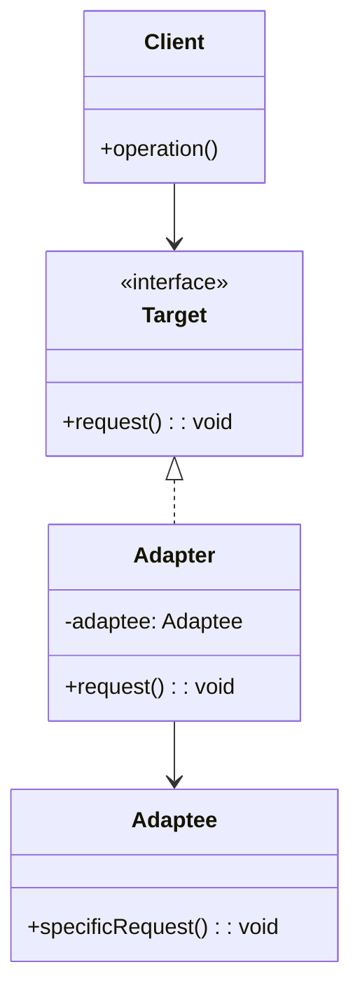

# Design Pattern : Adapter

## 1. Introduction

### Objectifs du cours
Après ce cours, vous serez capable de :
- Comprendre le pattern Adapter et son utilité
- Uniformiser des API externes différentes
- Adapter des interfaces incompatibles
- Intégrer des bibliothèques tierces sans couplage fort
- Créer des wrappers pour isoler les dépendances externes

### Scope et applications
Le pattern Adapter est essentiel dans les applications web métier pour :
- Uniformiser des API tierces (différents fournisseurs de paiement, SMS, email)
- Adapter des bibliothèques avec des interfaces incompatibles
- Créer une couche d'abstraction pour les services externes
- Faciliter le changement de fournisseur sans modifier le code métier
- Isoler le code de l'application des dépendances externes

---

## 2. Définitions et concepts clés

### 2.1 Qu'est-ce que le pattern Adapter ?

Le **Adapter** (aussi appelé **Wrapper**) est un pattern structurel qui permet à des interfaces incompatibles de travailler ensemble. Il agit comme un **traducteur** entre deux interfaces qui ne peuvent pas communiquer directement.

**Analogie de la vie quotidienne :**
Imaginez que vous voyagez aux États-Unis avec votre chargeur de téléphone européen. Les prises américaines sont différentes des prises françaises. Vous ne pouvez pas brancher directement votre chargeur. Que faites-vous ? Vous utilisez un **adaptateur de prise** !

L'adaptateur :
- A une prise **côté français** (interface que vous connaissez)
- A une prise **côté américain** (interface du réseau local)
- **Traduit** la connexion entre les deux

De la même façon en programmation, l'Adapter permet à votre code (qui attend une certaine interface) de fonctionner avec une bibliothèque externe (qui a une interface différente).

### 2.2 Concepts clés

| Concept | Description |
|---------|-------------|
| **Target** | Interface que le client attend |
| **Adaptee** | Classe existante avec interface incompatible |
| **Adapter** | Classe qui adapte l'Adaptee au Target |
| **Client** | Code qui utilise le Target |
| **Wrapper** | Autre nom pour l'Adapter |

### 2.3 Types d'Adapter

| Type | Description |
|------|-------------|
| **Object Adapter** | Utilise la composition (a un Adaptee) |
| **Class Adapter** | Utilise l'héritage (étend Adaptee) |

---

## 3. Pourquoi utiliser le pattern Adapter ?

### 3.1 Problèmes sans Adapter

**❌ Problème 1 : Couplage fort avec API externe**
```typescript
// Service couplé directement à Stripe
@Injectable()
export class PaymentService {
  async processPayment(amount: number, token: string): Promise<void> {
    // ❌ Couplage direct avec Stripe
    const stripe = new Stripe(process.env.STRIPE_KEY);
    await stripe.charges.create({
      amount: amount * 100,
      currency: 'eur',
      source: token
    });
  }
}

// Si on veut changer pour PayPal, il faut :
// 1. Modifier tout le code du service
// 2. Changer la structure des appels
// 3. Risquer de casser l'application
```

**❌ Problème 2 : API incompatibles dispersées**
```typescript
// Utilisation directe de plusieurs API SMS
class NotificationService {
  async sendViaTwilio(to: string, message: string): Promise<void> {
    const client = twilio(accountSid, authToken);
    await client.messages.create({
      body: message,
      to: to,
      from: '+1234567890'
    });
  }
  
  async sendViaMessageBird(to: string, message: string): Promise<void> {
    const messagebird = new MessageBird(apiKey);
    messagebird.messages.create({
      recipients: [to],
      originator: 'YourCompany',
      body: message
    });
  }
  
  // ❌ Deux APIs différentes
  // ❌ Code dupliqué
  // ❌ Difficile à tester
  // ❌ Difficile à changer de provider
}
```

**❌ Problème 3 : Tests difficiles**
```typescript
class UserService {
  async getUser(id: string): Promise<User> {
    // ❌ Appel direct à une API externe
    const response = await axios.get(`https://api.external.com/users/${id}`);
    return response.data;
  }
}

// Impossible de tester sans vraiment appeler l'API externe!
```

### 3.2 Avantages de l'Adapter

| Avantage | Description |
|----------|-------------|
| **Découplage** | Code client indépendant de l'API externe |
| **Uniformisation** | Interface commune pour différents fournisseurs |
| **Testabilité** | Facile de créer des mocks |
| **Flexibilité** | Changement de fournisseur sans modifier le code métier |
| **Single Responsibility** | Adaptation séparée de la logique métier |
| **Open/Closed** | Ajout de nouveaux adapters sans modifier l'existant |

---

## 4. Implémentation du pattern Adapter

### 4.1 Structure de base



### 4.2 Exemple concret : SMS Provider Adapter

**✅ Implémentation avec Adapter**
```typescript
// 1. Target Interface (ce que notre application attend)
interface SmsProvider {
  sendSms(to: string, message: string): Promise<SmsResult>;
  checkDeliveryStatus(messageId: string): Promise<DeliveryStatus>;
}

interface SmsResult {
  success: boolean;
  messageId: string;
  cost: number;
}

interface DeliveryStatus {
  delivered: boolean;
  timestamp: Date;
}

// 2. Adaptee - API Twilio (interface incompatible)
class TwilioClient {
  constructor(private accountSid: string, private authToken: string) {}
  
  async createMessage(params: {
    body: string;
    to: string;
    from: string;
  }): Promise<any> {
    // Appel réel à l'API Twilio
    console.log('[Twilio] Sending SMS:', params);
    return {
      sid: 'twilio_msg_123',
      price: '-0.05',
      status: 'queued'
    };
  }
  
  async fetchMessage(sid: string): Promise<any> {
    console.log('[Twilio] Fetching message:', sid);
    return {
      sid: sid,
      status: 'delivered',
      dateUpdated: new Date()
    };
  }
}

// 3. Adapter pour Twilio
class TwilioSmsAdapter implements SmsProvider {
  private client: TwilioClient;
  private fromNumber: string;
  
  constructor(accountSid: string, authToken: string, fromNumber: string) {
    this.client = new TwilioClient(accountSid, authToken);
    this.fromNumber = fromNumber;
  }
  
  async sendSms(to: string, message: string): Promise<SmsResult> {
    // Adaptation : interface Twilio → interface commune
    const result = await this.client.createMessage({
      body: message,
      to: to,
      from: this.fromNumber
    });
    
    return {
      success: true,
      messageId: result.sid,
      cost: Math.abs(parseFloat(result.price))
    };
  }
  
  async checkDeliveryStatus(messageId: string): Promise<DeliveryStatus> {
    const message = await this.client.fetchMessage(messageId);
    
    return {
      delivered: message.status === 'delivered',
      timestamp: message.dateUpdated
    };
  }
}

// 4. Adaptee - API MessageBird (interface incompatible)
class MessageBirdClient {
  constructor(private apiKey: string) {}
  
  async messages_create(params: {
    recipients: string[];
    originator: string;
    body: string;
  }): Promise<any> {
    console.log('[MessageBird] Sending SMS:', params);
    return {
      id: 'mb_msg_456',
      pricing: { amount: 0.04 }
    };
  }
  
  async messages_read(id: string): Promise<any> {
    console.log('[MessageBird] Reading message:', id);
    return {
      id: id,
      recipients: {
        items: [{ status: 'delivered', statusDatetime: new Date() }]
      }
    };
  }
}

// 5. Adapter pour MessageBird
class MessageBirdSmsAdapter implements SmsProvider {
  private client: MessageBirdClient;
  private originator: string;
  
  constructor(apiKey: string, originator: string) {
    this.client = new MessageBirdClient(apiKey);
    this.originator = originator;
  }
  
  async sendSms(to: string, message: string): Promise<SmsResult> {
    // Adaptation : interface MessageBird → interface commune
    const result = await this.client.messages_create({
      recipients: [to],
      originator: this.originator,
      body: message
    });
    
    return {
      success: true,
      messageId: result.id,
      cost: result.pricing.amount
    };
  }
  
  async checkDeliveryStatus(messageId: string): Promise<DeliveryStatus> {
    const message = await this.client.messages_read(messageId);
    const firstRecipient = message.recipients.items[0];
    
    return {
      delivered: firstRecipient.status === 'delivered',
      timestamp: firstRecipient.statusDatetime
    };
  }
}

// 6. Service métier utilisant l'interface commune
@Injectable()
export class NotificationService {
  constructor(
    @Inject('SMS_PROVIDER') private smsProvider: SmsProvider
  ) {}
  
  async sendNotification(phoneNumber: string, message: string): Promise<void> {
    // ✅ Code découplé de l'implémentation concrète
    const result = await this.smsProvider.sendSms(phoneNumber, message);
    
    if (result.success) {
      console.log(`SMS sent successfully. ID: ${result.messageId}, Cost: €${result.cost}`);
    }
  }
  
  async verifyDelivery(messageId: string): Promise<boolean> {
    const status = await this.smsProvider.checkDeliveryStatus(messageId);
    return status.delivered;
  }
}

// 7. Configuration (choix du provider)
@Module({
  providers: [
    {
      provide: 'SMS_PROVIDER',
      useFactory: (config: ConfigService): SmsProvider => {
        const provider = config.get('SMS_PROVIDER');
        
        if (provider === 'twilio') {
          return new TwilioSmsAdapter(
            config.get('TWILIO_SID'),
            config.get('TWILIO_TOKEN'),
            config.get('TWILIO_FROM')
          );
        } else {
          return new MessageBirdSmsAdapter(
            config.get('MESSAGEBIRD_KEY'),
            config.get('MESSAGEBIRD_ORIGINATOR')
          );
        }
      },
      inject: [ConfigService]
    },
    NotificationService
  ]
})
export class NotificationModule {}
```

### 4.3 Exemple : Payment Gateway Adapter

```typescript
// Interface commune pour les passerelles de paiement
interface PaymentGateway {
  charge(amount: number, currency: string, token: string): Promise<PaymentResult>;
  refund(transactionId: string, amount: number): Promise<RefundResult>;
  getTransaction(transactionId: string): Promise<Transaction>;
}

interface PaymentResult {
  success: boolean;
  transactionId: string;
  amount: number;
  fees: number;
}

interface RefundResult {
  success: boolean;
  refundId: string;
  amount: number;
}

interface Transaction {
  id: string;
  amount: number;
  status: 'pending' | 'completed' | 'failed' | 'refunded';
  createdAt: Date;
}

// Adaptee - Stripe SDK
class StripeSDK {
  constructor(private apiKey: string) {}
  
  async charges_create(params: {
    amount: number;  // En centimes!
    currency: string;
    source: string;
  }): Promise<any> {
    console.log('[Stripe] Creating charge:', params);
    return {
      id: 'ch_stripe_123',
      amount: params.amount,
      application_fee_amount: params.amount * 0.029 + 30,
      status: 'succeeded'
    };
  }
  
  async refunds_create(params: {
    charge: string;
    amount?: number;
  }): Promise<any> {
    console.log('[Stripe] Creating refund:', params);
    return {
      id: 're_stripe_456',
      amount: params.amount,
      status: 'succeeded'
    };
  }
  
  async charges_retrieve(chargeId: string): Promise<any> {
    console.log('[Stripe] Retrieving charge:', chargeId);
    return {
      id: chargeId,
      amount: 5000,
      status: 'succeeded',
      created: Math.floor(Date.now() / 1000)
    };
  }
}

// Adapter pour Stripe
class StripeAdapter implements PaymentGateway {
  private stripe: StripeSDK;
  
  constructor(apiKey: string) {
    this.stripe = new StripeSDK(apiKey);
  }
  
  async charge(amount: number, currency: string, token: string): Promise<PaymentResult> {
    // Conversion : euros → centimes pour Stripe
    const amountInCents = Math.round(amount * 100);
    
    const charge = await this.stripe.charges_create({
      amount: amountInCents,
      currency: currency.toLowerCase(),
      source: token
    });
    
    return {
      success: charge.status === 'succeeded',
      transactionId: charge.id,
      amount: charge.amount / 100,  // Reconversion centimes → euros
      fees: charge.application_fee_amount / 100
    };
  }
  
  async refund(transactionId: string, amount: number): Promise<RefundResult> {
    const amountInCents = Math.round(amount * 100);
    
    const refund = await this.stripe.refunds_create({
      charge: transactionId,
      amount: amountInCents
    });
    
    return {
      success: refund.status === 'succeeded',
      refundId: refund.id,
      amount: refund.amount / 100
    };
  }
  
  async getTransaction(transactionId: string): Promise<Transaction> {
    const charge = await this.stripe.charges_retrieve(transactionId);
    
    return {
      id: charge.id,
      amount: charge.amount / 100,
      status: this.mapStatus(charge.status),
      createdAt: new Date(charge.created * 1000)
    };
  }
  
  private mapStatus(stripeStatus: string): 'pending' | 'completed' | 'failed' | 'refunded' {
    switch (stripeStatus) {
      case 'succeeded': return 'completed';
      case 'pending': return 'pending';
      case 'failed': return 'failed';
      default: return 'pending';
    }
  }
}

// Adaptee - PayPal SDK
class PayPalSDK {
  constructor(private clientId: string, private secret: string) {}
  
  async payment_create(params: {
    intent: string;
    transactions: Array<{
      amount: { total: string; currency: string };
    }>;
    payer: { payment_method: string };
  }): Promise<any> {
    console.log('[PayPal] Creating payment:', params);
    return {
      id: 'PAYID-123',
      state: 'approved',
      transactions: params.transactions
    };
  }
  
  async payment_refund(params: {
    sale_id: string;
    amount: { total: string; currency: string };
  }): Promise<any> {
    console.log('[PayPal] Creating refund:', params);
    return {
      id: 'REFUND-456',
      state: 'completed',
      amount: params.amount
    };
  }
  
  async payment_get(paymentId: string): Promise<any> {
    console.log('[PayPal] Getting payment:', paymentId);
    return {
      id: paymentId,
      state: 'approved',
      create_time: new Date().toISOString(),
      transactions: [{
        amount: { total: '50.00', currency: 'EUR' }
      }]
    };
  }
}

// Adapter pour PayPal
class PayPalAdapter implements PaymentGateway {
  private paypal: PayPalSDK;
  
  constructor(clientId: string, secret: string) {
    this.paypal = new PayPalSDK(clientId, secret);
  }
  
  async charge(amount: number, currency: string, token: string): Promise<PaymentResult> {
    const payment = await this.paypal.payment_create({
      intent: 'sale',
      payer: { payment_method: 'paypal' },
      transactions: [{
        amount: {
          total: amount.toFixed(2),
          currency: currency.toUpperCase()
        }
      }]
    });
    
    return {
      success: payment.state === 'approved',
      transactionId: payment.id,
      amount: parseFloat(payment.transactions[0].amount.total),
      fees: parseFloat(payment.transactions[0].amount.total) * 0.035  // 3.5% PayPal fees
    };
  }
  
  async refund(transactionId: string, amount: number): Promise<RefundResult> {
    const refund = await this.paypal.payment_refund({
      sale_id: transactionId,
      amount: {
        total: amount.toFixed(2),
        currency: 'EUR'
      }
    });
    
    return {
      success: refund.state === 'completed',
      refundId: refund.id,
      amount: parseFloat(refund.amount.total)
    };
  }
  
  async getTransaction(transactionId: string): Promise<Transaction> {
    const payment = await this.paypal.payment_get(transactionId);
    
    return {
      id: payment.id,
      amount: parseFloat(payment.transactions[0].amount.total),
      status: this.mapStatus(payment.state),
      createdAt: new Date(payment.create_time)
    };
  }
  
  private mapStatus(paypalState: string): 'pending' | 'completed' | 'failed' | 'refunded' {
    switch (paypalState) {
      case 'approved': return 'completed';
      case 'created': return 'pending';
      case 'failed': return 'failed';
      default: return 'pending';
    }
  }
}

// Service utilisant l'adapter
@Injectable()
export class PaymentService {
  constructor(
    @Inject('PAYMENT_GATEWAY') private gateway: PaymentGateway
  ) {}
  
  async processPayment(
    amount: number,
    currency: string,
    token: string
  ): Promise<string> {
    const result = await this.gateway.charge(amount, currency, token);
    
    if (!result.success) {
      throw new Error('Payment failed');
    }
    
    console.log(`Payment successful! Transaction ID: ${result.transactionId}`);
    console.log(`Fees: €${result.fees.toFixed(2)}`);
    
    return result.transactionId;
  }
}
```

### 4.4 Exemple : Storage Adapter (Angular)

```typescript
// Interface commune pour le stockage
interface StorageAdapter {
  save(key: string, value: any): Promise<void>;
  get(key: string): Promise<any>;
  remove(key: string): Promise<void>;
  clear(): Promise<void>;
}

// Adapter pour LocalStorage
class LocalStorageAdapter implements StorageAdapter {
  async save(key: string, value: any): Promise<void> {
    localStorage.setItem(key, JSON.stringify(value));
  }
  
  async get(key: string): Promise<any> {
    const item = localStorage.getItem(key);
    return item ? JSON.parse(item) : null;
  }
  
  async remove(key: string): Promise<void> {
    localStorage.removeItem(key);
  }
  
  async clear(): Promise<void> {
    localStorage.clear();
  }
}

// Adapter pour IndexedDB
class IndexedDBAdapter implements StorageAdapter {
  private dbName = 'app-storage';
  private storeName = 'key-value-store';
  
  private async getDB(): Promise<IDBDatabase> {
    return new Promise((resolve, reject) => {
      const request = indexedDB.open(this.dbName, 1);
      
      request.onerror = () => reject(request.error);
      request.onsuccess = () => resolve(request.result);
      
      request.onupgradeneeded = (event) => {
        const db = (event.target as IDBOpenDBRequest).result;
        if (!db.objectStoreNames.contains(this.storeName)) {
          db.createObjectStore(this.storeName);
        }
      };
    });
  }
  
  async save(key: string, value: any): Promise<void> {
    const db = await this.getDB();
    return new Promise((resolve, reject) => {
      const transaction = db.transaction([this.storeName], 'readwrite');
      const store = transaction.objectStore(this.storeName);
      const request = store.put(value, key);
      
      request.onsuccess = () => resolve();
      request.onerror = () => reject(request.error);
    });
  }
  
  async get(key: string): Promise<any> {
    const db = await this.getDB();
    return new Promise((resolve, reject) => {
      const transaction = db.transaction([this.storeName], 'readonly');
      const store = transaction.objectStore(this.storeName);
      const request = store.get(key);
      
      request.onsuccess = () => resolve(request.result);
      request.onerror = () => reject(request.error);
    });
  }
  
  async remove(key: string): Promise<void> {
    const db = await this.getDB();
    return new Promise((resolve, reject) => {
      const transaction = db.transaction([this.storeName], 'readwrite');
      const store = transaction.objectStore(this.storeName);
      const request = store.delete(key);
      
      request.onsuccess = () => resolve();
      request.onerror = () => reject(request.error);
    });
  }
  
  async clear(): Promise<void> {
    const db = await this.getDB();
    return new Promise((resolve, reject) => {
      const transaction = db.transaction([this.storeName], 'readwrite');
      const store = transaction.objectStore(this.storeName);
      const request = store.clear();
      
      request.onsuccess = () => resolve();
      request.onerror = () => reject(request.error);
    });
  }
}

// Adapter pour API Backend
class BackendStorageAdapter implements StorageAdapter {
  constructor(private http: HttpClient, private apiUrl: string) {}
  
  async save(key: string, value: any): Promise<void> {
    await this.http.put(`${this.apiUrl}/storage/${key}`, { value }).toPromise();
  }
  
  async get(key: string): Promise<any> {
    const response = await this.http.get<any>(`${this.apiUrl}/storage/${key}`).toPromise();
    return response?.value || null;
  }
  
  async remove(key: string): Promise<void> {
    await this.http.delete(`${this.apiUrl}/storage/${key}`).toPromise();
  }
  
  async clear(): Promise<void> {
    await this.http.delete(`${this.apiUrl}/storage`).toPromise();
  }
}

// Service utilisant l'adapter
@Injectable({ providedIn: 'root' })
export class StorageService {
  private adapter: StorageAdapter;
  
  constructor(private http: HttpClient) {
    // Choix de l'adapter selon les capacités du navigateur
    if (this.isIndexedDBAvailable()) {
      this.adapter = new IndexedDBAdapter();
    } else {
      this.adapter = new LocalStorageAdapter();
    }
  }
  
  async saveUserPreferences(preferences: any): Promise<void> {
    await this.adapter.save('user-preferences', preferences);
  }
  
  async getUserPreferences(): Promise<any> {
    return this.adapter.get('user-preferences');
  }
  
  private isIndexedDBAvailable(): boolean {
    return 'indexedDB' in window;
  }
}
```

---

## 5. Erreurs courantes et comment les éviter

### 5.1 Erreurs fréquentes

| Erreur | Problème | Solution |
|--------|----------|----------|
| **Adapter trop complexe** | Logique métier dans l'adapter | Adapter = traduction uniquement |
| **Pas d'interface Target** | Couplage à l'adapter | Définir interface claire |
| **Fuite d'abstraction** | Détails de l'Adaptee exposés | Encapsulation complète |
| **Adaptation partielle** | Méthodes non adaptées | Implémenter toute l'interface |
| **Sur-adaptation** | Adapter pour des API similaires | Adapter seulement si nécessaire |

### 5.2 Exemples d'erreurs

**❌ Erreur 1 : Logique métier dans l'adapter**
```typescript
class PaymentAdapter implements PaymentGateway {
  async charge(amount: number, currency: string, token: string): Promise<PaymentResult> {
    // ❌ Logique métier dans l'adapter
    if (amount > 10000) {
      await this.notifyFinancialTeam(amount);
    }
    
    // ❌ Validation métier
    if (!this.isValidCurrency(currency)) {
      throw new Error('Invalid currency');
    }
    
    // Adaptation réelle
    return this.stripe.charge(...);
  }
}
```

**✅ Correction : Adapter = traduction pure**
```typescript
class StripeAdapter implements PaymentGateway {
  async charge(amount: number, currency: string, token: string): Promise<PaymentResult> {
    // ✅ Seulement traduction d'interface
    const amountInCents = Math.round(amount * 100);
    const charge = await this.stripe.charges_create({
      amount: amountInCents,
      currency: currency.toLowerCase(),
      source: token
    });
    
    return {
      success: charge.status === 'succeeded',
      transactionId: charge.id,
      amount: charge.amount / 100,
      fees: charge.application_fee_amount / 100
    };
  }
}

// ✅ Logique métier dans le service
@Injectable()
export class PaymentService {
  async processPayment(amount: number, currency: string, token: string): Promise<string> {
    // Validation métier
    if (amount > 10000) {
      await this.notifyFinancialTeam(amount);
    }
    
    if (!this.isValidCurrency(currency)) {
      throw new Error('Invalid currency');
    }
    
    // Utilisation de l'adapter
    return this.gateway.charge(amount, currency, token);
  }
}
```

**❌ Erreur 2 : Fuite d'abstraction**
```typescript
interface EmailProvider {
  send(email: Email): Promise<void>;
  getOriginalClient(): any;  // ❌ Expose l'implémentation interne
}

class SendGridAdapter implements EmailProvider {
  private client: SendGridClient;
  
  async send(email: Email): Promise<void> { }
  
  getOriginalClient(): SendGridClient {  // ❌ Fuite d'abstraction
    return this.client;
  }
}

// Client peut contourner l'abstraction
const client = emailProvider.getOriginalClient();
client.sendGridSpecificMethod();  // ❌ Couplage fort
```

**✅ Correction : Encapsulation complète**
```typescript
interface EmailProvider {
  send(email: Email): Promise<void>;
  // ✅ Pas de méthode exposant l'implémentation
}

class SendGridAdapter implements EmailProvider {
  private client: SendGridClient;  // ✅ Privé
  
  async send(email: Email): Promise<void> {
    // Traduction complète
  }
}
```

---

## 6. Exercices pratiques

### Exercice 1 : Weather API Adapter (Facile)

Créez des adapters pour uniformiser différentes APIs météo :
- OpenWeatherMap
- WeatherAPI
- AccuWeather

Interface commune :
```typescript
interface WeatherProvider {
  getCurrentWeather(city: string): Promise<WeatherData>;
  getForecast(city: string, days: number): Promise<ForecastData[]>;
}

interface WeatherData {
  temperature: number;
  humidity: number;
  description: string;
  windSpeed: number;
}
```

### Exercice 2 : Database Adapter (Intermédiaire)

Créez des adapters pour différentes bases de données :
- PostgreSQL (avec pg)
- MongoDB (avec mongoose)
- MySQL (avec mysql2)

Interface commune pour les opérations CRUD.

---

## 7. Comportement senior : Recommandations et astuces

### 7.1 Quand utiliser Adapter

**✅ Utilisez Adapter quand :**
- Vous voulez utiliser une **bibliothèque tierce** avec interface incompatible
- Vous devez **uniformiser** plusieurs API externes similaires
- Vous voulez **isoler** votre code des dépendances externes
- Vous prévoyez de **changer de fournisseur** (paiement, SMS, email)
- Vous voulez faciliter les **tests** (mocks)

**❌ N'utilisez PAS Adapter quand :**
- Les interfaces sont déjà compatibles
- Sur-engineering pour une seule API simple
- L'API externe ne changera jamais

### 7.2 Astuces de développeur senior

**1. Combinez Adapter avec Factory**
```typescript
class SmsProviderFactory {
  static create(provider: string): SmsProvider {
    switch (provider) {
      case 'twilio':
        return new TwilioAdapter(/* config */);
      case 'messagebird':
        return new MessageBirdAdapter(/* config */);
      default:
        throw new Error(`Unknown provider: ${provider}`);
    }
  }
}
```

**2. Adapter avec cache**
```typescript
class CachedApiAdapter implements ApiClient {
  private cache = new Map<string, any>();
  
  constructor(private adaptee: ExternalApi) {}
  
  async get(url: string): Promise<any> {
    if (this.cache.has(url)) {
      return this.cache.get(url);
    }
    
    const data = await this.adaptee.fetch(url);
    this.cache.set(url, data);
    return data;
  }
}
```

**3. Adapter avec retry logic**
```typescript
class ResilientAdapter implements PaymentGateway {
  constructor(
    private adaptee: PaymentGatewaySDK,
    private maxRetries: number = 3
  ) {}
  
  async charge(amount: number, currency: string, token: string): Promise<PaymentResult> {
    let lastError: Error;
    
    for (let i = 0; i < this.maxRetries; i++) {
      try {
        return await this.adaptee.processPayment({
          amount: amount * 100,
          currency,
          token
        });
      } catch (error) {
        lastError = error;
        await this.delay(Math.pow(2, i) * 1000);  // Exponential backoff
      }
    }
    
    throw lastError!;
  }
  
  private delay(ms: number): Promise<void> {
    return new Promise(resolve => setTimeout(resolve, ms));
  }
}
```

**4. Adapter avec logging**
```typescript
class LoggingAdapter implements EmailProvider {
  constructor(
    private adaptee: EmailService,
    private logger: Logger
  ) {}
  
  async send(email: Email): Promise<void> {
    this.logger.info(`Sending email to ${email.to}`);
    
    try {
      await this.adaptee.sendEmail({
        to: email.to,
        subject: email.subject,
        body: email.body
      });
      
      this.logger.info(`Email sent successfully to ${email.to}`);
    } catch (error) {
      this.logger.error(`Failed to send email to ${email.to}`, error);
      throw error;
    }
  }
}
```

### 7.3 Best practices

| Pratique | Description |
|----------|-------------|
| **Interface claire** | Target bien défini et documenté |
| **Traduction pure** | Pas de logique métier dans l'adapter |
| **Encapsulation** | Détails de l'Adaptee cachés |
| **Tests** | Tester chaque adapter indépendamment |
| **Factory** | Combiner avec Factory pour création |
| **Injection** | Utiliser DI pour flexibilité |

---

## 8. Résumé

### Points clés à retenir

Le pattern **Adapter** permet de :
- ✅ **Uniformiser** des API externes différentes
- ✅ **Isoler** le code métier des dépendances externes
- ✅ Faciliter le **changement de fournisseur**
- ✅ Améliorer la **testabilité** (mocks faciles)
- ✅ Respecter **Dependency Inversion** principle

### Structure

**Adapter = Traducteur d'interfaces**
- Target : interface attendue par le client
- Adaptee : classe existante incompatible
- Adapter : traduit Adaptee → Target

### Quand l'utiliser

**✅ OUI** pour :
- APIs tierces (paiement, SMS, email, météo)
- Bibliothèques avec interfaces incompatibles
- Isolation des dépendances externes
- Changement de fournisseur prévu

**❌ NON** pour :
- Interfaces déjà compatibles
- Sur-engineering
- API simple et stable

### Template de base

```typescript
// 1. Target
interface Target {
  request(data: any): Promise<any>;
}

// 2. Adaptee (externe)
class Adaptee {
  specificRequest(params: SpecificParams): SpecificResult {
    // Implémentation externe
  }
}

// 3. Adapter
class Adapter implements Target {
  constructor(private adaptee: Adaptee) {}
  
  async request(data: any): Promise<any> {
    // Traduction : Target → Adaptee
    const params = this.convertToSpecificParams(data);
    const result = this.adaptee.specificRequest(params);
    // Traduction : Adaptee → Target
    return this.convertFromSpecificResult(result);
  }
  
  private convertToSpecificParams(data: any): SpecificParams {
    // Conversion
  }
  
  private convertFromSpecificResult(result: SpecificResult): any {
    // Conversion
  }
}
```

---

## 9. Ressources complémentaires

### Français
- 📚 [Refactoring Guru - Adapter](https://refactoring.guru/fr/design-patterns/adapter)
- 🎥 [Grafikart - Adapter Pattern](https://grafikart.fr/tutoriels/adapter-1065)
- 📖 [Design Patterns en TypeScript](https://blog.logrocket.com/design-patterns-in-typescript/)

### Anglais
- 📚 [TypeScript Design Patterns - Adapter](https://sbcode.net/typescript/adapter/)
- 🎥 [Adapter Pattern - Christopher Okhravi](https://www.youtube.com/watch?v=2PKQtcJjYvc)
- 📖 [Head First Design Patterns](https://www.oreilly.com/library/view/head-first-design/0596007124/)

### Documentation
- [NestJS - Custom Providers](https://docs.nestjs.com/fundamentals/custom-providers)
- [Angular - HttpClient](https://angular.io/guide/http)
- [Stripe API Documentation](https://stripe.com/docs/api)

---

**En une phrase :**

> Le pattern Adapter permet d'uniformiser des API externes avec des interfaces incompatibles en créant une couche de traduction, facilitant le changement de fournisseur et l'isolation du code métier dans les applications web.
