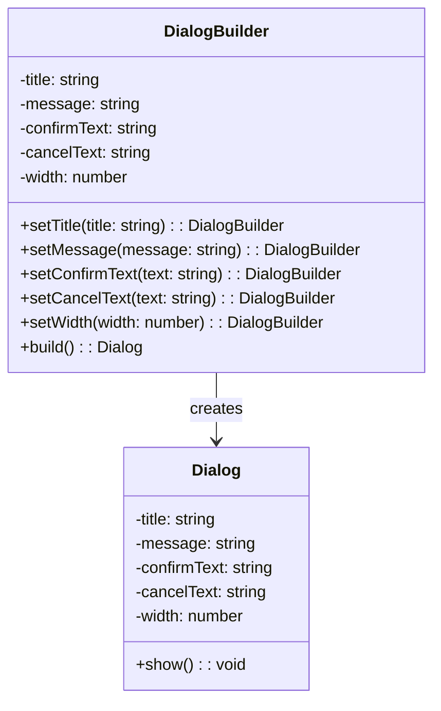

# Design Pattern : Builder

## 1. Introduction

### Objectifs du cours
Après ce cours, vous serez capable de :
- Comprendre le pattern Builder et ses cas d'usage
- Créer des objets complexes de manière fluide et lisible
- Configurer des composants UI (modals, snackbars, formulaires) de façon élégante
- Distinguer quand utiliser le Builder plutôt que des constructeurs classiques

### Scope et applications
Le pattern Builder est particulièrement utile dans les applications web métier pour :
- Configurer des composants UI complexes (dialogues, notifications, formulaires)
- Créer des requêtes HTTP avec multiples options
- Construire des objets de configuration
- Générer des documents ou rapports avec de nombreuses options

---

## 2. Définitions et concepts clés

### 2.1 Qu'est-ce que le pattern Builder ?

Le **Builder** est un pattern de création qui permet de construire des objets complexes **étape par étape**. Il sépare la construction d'un objet de sa représentation finale.

**Analogie de la vie quotidienne :**
Imaginez que vous commandez un burger dans un fast-food. Vous ne dites pas : "Je veux un burger avec pain, viande, salade, tomate, fromage, sauce, oignon". Au lieu de cela, vous dites progressivement :
- "Je voudrais un burger..."
- "...avec fromage..."
- "...sans oignon..."
- "...avec sauce barbecue..."

Chaque étape ajoute quelque chose à votre commande finale. C'est exactement le principe du Builder !

### 2.2 Concepts clés

| Concept | Description |
|---------|-------------|
| **Builder** | Classe qui construit l'objet étape par étape |
| **Product** | L'objet final que l'on veut créer |
| **Fluent Interface** | Chaînage de méthodes grâce au retour de `this` |
| **Director** (optionnel) | Classe qui orchestre la construction |
| **Immutabilité** | Le builder peut créer des objets immutables |

---

## 3. Pourquoi utiliser le pattern Builder ?

### 3.1 Problèmes sans Builder

**❌ Problème 1 : Constructeur avec trop de paramètres**
```typescript
// Difficile à lire et à maintenir
const dialog = new Dialog(
  'Confirmation',
  'Êtes-vous sûr de vouloir continuer ?',
  true,
  false,
  'Oui',
  'Non',
  null,
  'primary',
  true,
  300
);
// Quel paramètre est quoi ? 🤔
```

**❌ Problème 2 : Multiples constructeurs (impossible en TypeScript)**
```typescript
// En Java on pourrait faire plusieurs constructeurs
// Mais en TypeScript, c'est impossible !
class Dialog {
  constructor(title: string) { }
  constructor(title: string, message: string) { } // ❌ Erreur
  constructor(title: string, message: string, width: number) { } // ❌ Erreur
}
```

**❌ Problème 3 : Objet incomplet ou invalide**
```typescript
const notification = new Notification();
notification.title = 'Alerte';
// Oubli de définir le message
notification.show(); // ⚠️ Notification incomplète
```

### 3.2 Avantages du Builder

| Avantage | Description |
|----------|-------------|
| **Lisibilité** | Code auto-documenté et fluide |
| **Flexibilité** | Création d'objets avec différentes configurations |
| **Validation** | Possibilité de valider l'objet avant création |
| **Immutabilité** | Création d'objets immutables |
| **Paramètres optionnels** | Gestion élégante des options facultatives |

---

## 4. Implémentation du pattern Builder

### 4.1 Structure de base



### 4.2 Exemple concret : Dialog Builder

**✅ Implémentation du Builder**
```typescript
// 1. L'objet final (Product)
class Dialog {
  private constructor(
    public readonly title: string,
    public readonly message: string,
    public readonly confirmText: string,
    public readonly cancelText: string | null,
    public readonly width: number,
    public readonly type: 'info' | 'warning' | 'error' | 'success'
  ) {}

  show(): void {
    console.log(`Affichage du dialog: ${this.title}`);
    // Logique d'affichage...
  }

  // Méthode statique pour obtenir le builder
  static builder(): DialogBuilder {
    return new DialogBuilder();
  }
}

// 2. Le Builder
class DialogBuilder {
  private title: string = '';
  private message: string = '';
  private confirmText: string = 'OK';
  private cancelText: string | null = null;
  private width: number = 400;
  private type: 'info' | 'warning' | 'error' | 'success' = 'info';

  setTitle(title: string): this {
    this.title = title;
    return this; // Retour de this pour le chaînage
  }

  setMessage(message: string): this {
    this.message = message;
    return this;
  }

  setConfirmText(text: string): this {
    this.confirmText = text;
    return this;
  }

  setCancelText(text: string): this {
    this.cancelText = text;
    return this;
  }

  setWidth(width: number): this {
    if (width < 200 || width > 800) {
      throw new Error('La largeur doit être entre 200 et 800 pixels');
    }
    this.width = width;
    return this;
  }

  setType(type: 'info' | 'warning' | 'error' | 'success'): this {
    this.type = type;
    return this;
  }

  build(): Dialog {
    // Validation avant construction
    if (!this.title) {
      throw new Error('Le titre est obligatoire');
    }
    if (!this.message) {
      throw new Error('Le message est obligatoire');
    }

    return new Dialog(
      this.title,
      this.message,
      this.confirmText,
      this.cancelText,
      this.width,
      this.type
    );
  }
}

// 3. Utilisation fluide et lisible
const dialog = Dialog.builder()
  .setTitle('Confirmation de suppression')
  .setMessage('Êtes-vous sûr de vouloir supprimer cet élément ?')
  .setConfirmText('Supprimer')
  .setCancelText('Annuler')
  .setType('warning')
  .setWidth(500)
  .build();

dialog.show();
```

### 4.3 Exemple : Snackbar/Toast Builder (Angular)

```typescript
// Configuration d'une notification toast
interface SnackbarConfig {
  message: string;
  duration: number;
  action?: string;
  position: 'top' | 'bottom';
  type: 'info' | 'success' | 'warning' | 'error';
}

class SnackbarBuilder {
  private message: string = '';
  private duration: number = 3000;
  private action?: string;
  private position: 'top' | 'bottom' = 'bottom';
  private type: 'info' | 'success' | 'warning' | 'error' = 'info';

  setMessage(message: string): this {
    this.message = message;
    return this;
  }

  setDuration(duration: number): this {
    this.duration = duration;
    return this;
  }

  setAction(action: string): this {
    this.action = action;
    return this;
  }

  setPosition(position: 'top' | 'bottom'): this {
    this.position = position;
    return this;
  }

  setType(type: 'info' | 'success' | 'warning' | 'error'): this {
    this.type = type;
    return this;
  }

  // Méthodes de commodité
  asSuccess(): this {
    return this.setType('success').setDuration(2000);
  }

  asError(): this {
    return this.setType('error').setDuration(5000);
  }

  asWarning(): this {
    return this.setType('warning').setDuration(4000);
  }

  build(): SnackbarConfig {
    if (!this.message) {
      throw new Error('Le message est obligatoire');
    }

    return {
      message: this.message,
      duration: this.duration,
      action: this.action,
      position: this.position,
      type: this.type
    };
  }
}

// Service Angular utilisant le builder
@Injectable({ providedIn: 'root' })
export class NotificationService {
  constructor(private snackBar: MatSnackBar) {}

  builder(): SnackbarBuilder {
    return new SnackbarBuilder();
  }

  show(config: SnackbarConfig): void {
    this.snackBar.open(config.message, config.action, {
      duration: config.duration,
      verticalPosition: config.position,
      panelClass: [`snackbar-${config.type}`]
    });
  }
}

// Utilisation dans un composant
@Component({ /* ... */ })
export class UserComponent {
  constructor(private notificationService: NotificationService) {}

  deleteUser(userId: string): void {
    this.userService.delete(userId).subscribe({
      next: () => {
        const notification = this.notificationService.builder()
          .setMessage('Utilisateur supprimé avec succès')
          .asSuccess()
          .setAction('Annuler')
          .build();
        
        this.notificationService.show(notification);
      },
      error: () => {
        const notification = this.notificationService.builder()
          .setMessage('Erreur lors de la suppression')
          .asError()
          .build();
        
        this.notificationService.show(notification);
      }
    });
  }
}
```

### 4.4 Exemple : HTTP Request Builder (NestJS)

```typescript
// Builder pour créer des requêtes HTTP complexes
interface HttpRequestConfig {
  url: string;
  method: 'GET' | 'POST' | 'PUT' | 'DELETE' | 'PATCH';
  headers: Record<string, string>;
  params: Record<string, string>;
  body?: any;
  timeout: number;
  retries: number;
}

class HttpRequestBuilder {
  private url: string = '';
  private method: 'GET' | 'POST' | 'PUT' | 'DELETE' | 'PATCH' = 'GET';
  private headers: Record<string, string> = {};
  private params: Record<string, string> = {};
  private body?: any;
  private timeout: number = 5000;
  private retries: number = 0;

  setUrl(url: string): this {
    this.url = url;
    return this;
  }

  setMethod(method: 'GET' | 'POST' | 'PUT' | 'DELETE' | 'PATCH'): this {
    this.method = method;
    return this;
  }

  addHeader(key: string, value: string): this {
    this.headers[key] = value;
    return this;
  }

  addParam(key: string, value: string): this {
    this.params[key] = value;
    return this;
  }

  setBody(body: any): this {
    this.body = body;
    return this;
  }

  setTimeout(timeout: number): this {
    this.timeout = timeout;
    return this;
  }

  setRetries(retries: number): this {
    this.retries = retries;
    return this;
  }

  // Méthodes de commodité
  asJson(): this {
    return this.addHeader('Content-Type', 'application/json');
  }

  withAuth(token: string): this {
    return this.addHeader('Authorization', `Bearer ${token}`);
  }

  withApiKey(apiKey: string): this {
    return this.addHeader('X-API-Key', apiKey);
  }

  build(): HttpRequestConfig {
    if (!this.url) {
      throw new Error('L\'URL est obligatoire');
    }

    return {
      url: this.url,
      method: this.method,
      headers: this.headers,
      params: this.params,
      body: this.body,
      timeout: this.timeout,
      retries: this.retries
    };
  }
}

// Utilisation dans un service NestJS
@Injectable()
export class ApiClientService {
  constructor(private httpService: HttpService) {}

  async fetchUserData(userId: string, token: string): Promise<User> {
    const request = new HttpRequestBuilder()
      .setUrl(`https://api.example.com/users/${userId}`)
      .setMethod('GET')
      .withAuth(token)
      .asJson()
      .setTimeout(10000)
      .setRetries(3)
      .addParam('include', 'profile,settings')
      .build();

    const response = await this.executeRequest(request);
    return response.data;
  }

  async createOrder(orderData: CreateOrderDto, token: string): Promise<Order> {
    const request = new HttpRequestBuilder()
      .setUrl('https://api.example.com/orders')
      .setMethod('POST')
      .withAuth(token)
      .asJson()
      .setBody(orderData)
      .setTimeout(15000)
      .setRetries(2)
      .build();

    const response = await this.executeRequest(request);
    return response.data;
  }

  private async executeRequest(config: HttpRequestConfig): Promise<any> {
    // Logique d'exécution de la requête...
  }
}
```

### 4.5 Exemple : Form Builder (Angular Reactive Forms)

```typescript
// Builder pour créer des formulaires complexes
import { FormBuilder, FormGroup, Validators } from '@angular/forms';

class UserFormBuilder {
  constructor(private fb: FormBuilder) {}

  private includeAddress: boolean = false;
  private includePhone: boolean = false;
  private includeNewsletter: boolean = false;

  withAddress(): this {
    this.includeAddress = true;
    return this;
  }

  withPhone(): this {
    this.includePhone = true;
    return this;
  }

  withNewsletter(): this {
    this.includeNewsletter = true;
    return this;
  }

  build(): FormGroup {
    const formConfig: any = {
      firstName: ['', [Validators.required, Validators.minLength(2)]],
      lastName: ['', [Validators.required, Validators.minLength(2)]],
      email: ['', [Validators.required, Validators.email]]
    };

    if (this.includeAddress) {
      formConfig.address = this.fb.group({
        street: ['', Validators.required],
        city: ['', Validators.required],
        postalCode: ['', [Validators.required, Validators.pattern(/^\d{5}$/)]]
      });
    }

    if (this.includePhone) {
      formConfig.phone = ['', [Validators.required, Validators.pattern(/^[0-9]{10}$/)]];
    }

    if (this.includeNewsletter) {
      formConfig.newsletter = [false];
      formConfig.newsletterFrequency = ['weekly'];
    }

    return this.fb.group(formConfig);
  }
}

// Utilisation
@Component({ /* ... */ })
export class RegisterComponent {
  userForm: FormGroup;

  constructor(private fb: FormBuilder) {
    this.userForm = new UserFormBuilder(this.fb)
      .withAddress()
      .withPhone()
      .withNewsletter()
      .build();
  }
}
```

---

## 5. Erreurs courantes et comment les éviter

### 5.1 Erreurs fréquentes

| Erreur | Problème | Solution |
|--------|----------|----------|
| **Oublier de retourner `this`** | Chaînage impossible | Toujours retourner `this` dans les setters |
| **Pas de validation** | Objets invalides créés | Valider dans `build()` |
| **Builder mutable** | État partagé dangereux | Créer nouveau builder à chaque fois |
| **Trop de responsabilités** | Builder complexe | Un builder par type d'objet |
| **Pas de valeurs par défaut** | Configuration incomplète | Définir des valeurs sensées par défaut |

### 5.2 Exemples d'erreurs

**❌ Erreur 1 : Oublier `this`**
```typescript
class DialogBuilder {
  setTitle(title: string): void {  // ❌ Pas de retour
    this.title = title;
  }
}

// Impossible à chaîner
const dialog = new DialogBuilder()
  .setTitle('Test')  // ❌ Erreur : setTitle retourne void
  .setMessage('Message');
```

**✅ Correction**
```typescript
class DialogBuilder {
  setTitle(title: string): this {  // ✅ Retourne this
    this.title = title;
    return this;
  }
}
```

**❌ Erreur 2 : Pas de validation**
```typescript
build(): Dialog {
  return new Dialog(this.title, this.message);  // ❌ Pas de vérification
}
```

**✅ Correction**
```typescript
build(): Dialog {
  if (!this.title || !this.message) {
    throw new Error('Titre et message sont obligatoires');
  }
  return new Dialog(this.title, this.message);
}
```

**❌ Erreur 3 : Builder réutilisé (état partagé)**
```typescript
// ❌ Danger : réutilisation du builder
const builder = new DialogBuilder();

const dialog1 = builder
  .setTitle('Dialog 1')
  .build();

const dialog2 = builder
  .setTitle('Dialog 2')
  .build();
// dialog2 hérite de la configuration de dialog1 !
```

**✅ Correction**
```typescript
// ✅ Nouveau builder à chaque fois
const dialog1 = new DialogBuilder()
  .setTitle('Dialog 1')
  .build();

const dialog2 = new DialogBuilder()
  .setTitle('Dialog 2')
  .build();
```

---

## 6. Exercices pratiques

### Exercice 1 : Email Builder (Facile)

Créez un builder pour construire des emails avec les propriétés suivantes :
- `to` (obligatoire)
- `subject` (obligatoire)
- `body` (obligatoire)
- `cc` (optionnel, liste d'emails)
- `bcc` (optionnel, liste d'emails)
- `attachments` (optionnel, liste de fichiers)
- `priority` ('low' | 'normal' | 'high', défaut: 'normal')

**Critères de succès :**
- API fluide avec chaînage
- Validation des emails obligatoires
- Méthode `addCc()` et `addBcc()` pour ajouter des destinataires un par un
- Méthode `addAttachment()` pour ajouter des pièces jointes

### Exercice 2 : Query Builder pour API REST (Intermédiaire)

Créez un builder pour construire des URLs de requêtes API avec :
- URL de base
- Path parameters
- Query parameters (filtres, pagination, tri)
- Méthodes de commodité : `paginate()`, `sort()`, `filter()`

**Exemple d'utilisation attendue :**
```typescript
const url = new QueryBuilder()
  .setBaseUrl('https://api.example.com')
  .setPath('/users')
  .filter('status', 'active')
  .filter('role', 'admin')
  .paginate(1, 20)
  .sort('createdAt', 'desc')
  .build();

// Résultat: https://api.example.com/users?status=active&role=admin&page=1&limit=20&sort=createdAt:desc
```

---

## 7. Comportement senior : Recommandations et astuces

### 7.1 Quand utiliser le Builder

**✅ Utilisez le Builder quand :**
- L'objet a **plus de 3-4 paramètres** de configuration
- Beaucoup de paramètres sont **optionnels**
- Vous devez créer différentes **représentations** du même objet
- La **validation** de l'objet est complexe
- Vous voulez une **API fluide** et lisible

**❌ N'utilisez PAS le Builder quand :**
- L'objet est simple (1-2 paramètres) → Utilisez un constructeur
- Tous les paramètres sont obligatoires → Utilisez un constructeur
- L'objet change rarement → Sur-engineering

### 7.2 Astuces de développeur senior

**1. Utilisez TypeScript pour forcer la validation**
```typescript
// Builder avec étapes obligatoires
class DialogBuilder {
  setTitle(title: string): DialogBuilderWithTitle {
    return new DialogBuilderWithTitle(title);
  }
}

class DialogBuilderWithTitle {
  constructor(private title: string) {}
  
  setMessage(message: string): DialogBuilderComplete {
    return new DialogBuilderComplete(this.title, message);
  }
}

class DialogBuilderComplete {
  constructor(
    private title: string,
    private message: string
  ) {}
  
  build(): Dialog {
    return new Dialog(this.title, this.message);
  }
}

// Compilation échoue si title ou message manquant
const dialog = new DialogBuilder()
  .setTitle('Test')
  .setMessage('Message')  // ← Obligatoire grâce au typage
  .build();
```

**2. Combinez avec le pattern Factory**
```typescript
class DialogFactory {
  static confirm(message: string): Dialog {
    return Dialog.builder()
      .setTitle('Confirmation')
      .setMessage(message)
      .setConfirmText('Oui')
      .setCancelText('Non')
      .setType('warning')
      .build();
  }

  static error(message: string): Dialog {
    return Dialog.builder()
      .setTitle('Erreur')
      .setMessage(message)
      .setConfirmText('OK')
      .setType('error')
      .build();
  }
}

// Utilisation simple
const confirmDialog = DialogFactory.confirm('Voulez-vous continuer ?');
```

**3. Ajoutez des méthodes de commodité**
```typescript
class HttpRequestBuilder {
  // Au lieu de setMethod('GET')
  get(): this {
    return this.setMethod('GET');
  }

  post(): this {
    return this.setMethod('POST');
  }

  // Au lieu de addHeader + addHeader
  withStandardHeaders(): this {
    return this
      .addHeader('Content-Type', 'application/json')
      .addHeader('Accept', 'application/json');
  }
}

// Utilisation plus fluide
const request = new HttpRequestBuilder()
  .setUrl('/api/users')
  .post()
  .withStandardHeaders()
  .build();
```

**4. Implémentez des presets**
```typescript
class SnackbarBuilder {
  // Presets pour configurations courantes
  static success(message: string): SnackbarBuilder {
    return new SnackbarBuilder()
      .setMessage(message)
      .setType('success')
      .setDuration(2000);
  }

  static error(message: string): SnackbarBuilder {
    return new SnackbarBuilder()
      .setMessage(message)
      .setType('error')
      .setDuration(5000);
  }
}

// Utilisation rapide
const notification = SnackbarBuilder.success('Sauvegarde réussie').build();
```

### 7.3 Best practices

| Pratique | Description |
|----------|-------------|
| **Immutabilité** | Le builder crée des objets immutables |
| **Validation centralisée** | Toute la validation dans `build()` |
| **Méthodes explicites** | Noms clairs : `setTitle()` pas `title()` |
| **Valeurs par défaut** | Toujours définir des valeurs sensées |
| **Documentation** | JSDoc pour chaque méthode du builder |
| **Tests** | Tester les cas limites et validations |

---

## 8. Résumé

### Points clés à retenir

Le pattern **Builder** permet de :
- ✅ Créer des objets complexes de façon **lisible** et **fluide**
- ✅ Gérer élégamment les **paramètres optionnels**
- ✅ Séparer la **construction** de la **représentation**
- ✅ Valider les objets avant leur création
- ✅ Créer des objets **immutables**

### Quand l'utiliser

**✅ OUI** pour :
- Configuration d'UI complexes (modals, formulaires, notifications)
- Requêtes HTTP avec multiples options
- Objets avec beaucoup de paramètres optionnels
- Création d'objets nécessitant validation

**❌ NON** pour :
- Objets simples (1-3 paramètres)
- Tous les paramètres obligatoires
- Performance critique (overhead léger)

### Template de base

```typescript
class Product {
  private constructor(/* paramètres */) {}
  
  static builder(): ProductBuilder {
    return new ProductBuilder();
  }
}

class ProductBuilder {
  private field1: Type = defaultValue;
  
  setField1(value: Type): this {
    this.field1 = value;
    return this;
  }
  
  build(): Product {
    // Validation
    if (!this.field1) {
      throw new Error('field1 est obligatoire');
    }
    
    return new Product(this.field1);
  }
}

// Utilisation
const product = Product.builder()
  .setField1(value)
  .build();
```

---

## 9. Ressources complémentaires

### Français
- 📚 [Refactoring Guru - Builder](https://refactoring.guru/fr/design-patterns/builder)
- 🎥 [Grafikart - Pattern Builder](https://grafikart.fr/tutoriels/builder-pattern-1066)
- 📖 [Design Patterns en TypeScript](https://blog.logrocket.com/design-patterns-in-typescript/)

### Anglais
- 📚 [TypeScript Design Patterns - Builder](https://sbcode.net/typescript/builder/)
- 🎥 [Builder Pattern - Fireship](https://www.youtube.com/watch?v=M7Xi1yO_s8E)
- 📖 [Head First Design Patterns](https://www.oreilly.com/library/view/head-first-design/0596007124/)

### Documentation
- [Angular Material - Snackbar](https://material.angular.io/components/snack-bar/overview)
- [Angular - Reactive Forms](https://angular.io/guide/reactive-forms)
- [NestJS - HTTP Module](https://docs.nestjs.com/techniques/http-module)

---

**En une phrase :**

> Le pattern Builder permet de construire des objets complexes étape par étape avec une API fluide et lisible, particulièrement utile pour configurer des composants UI et des requêtes HTTP dans les applications web métier.
