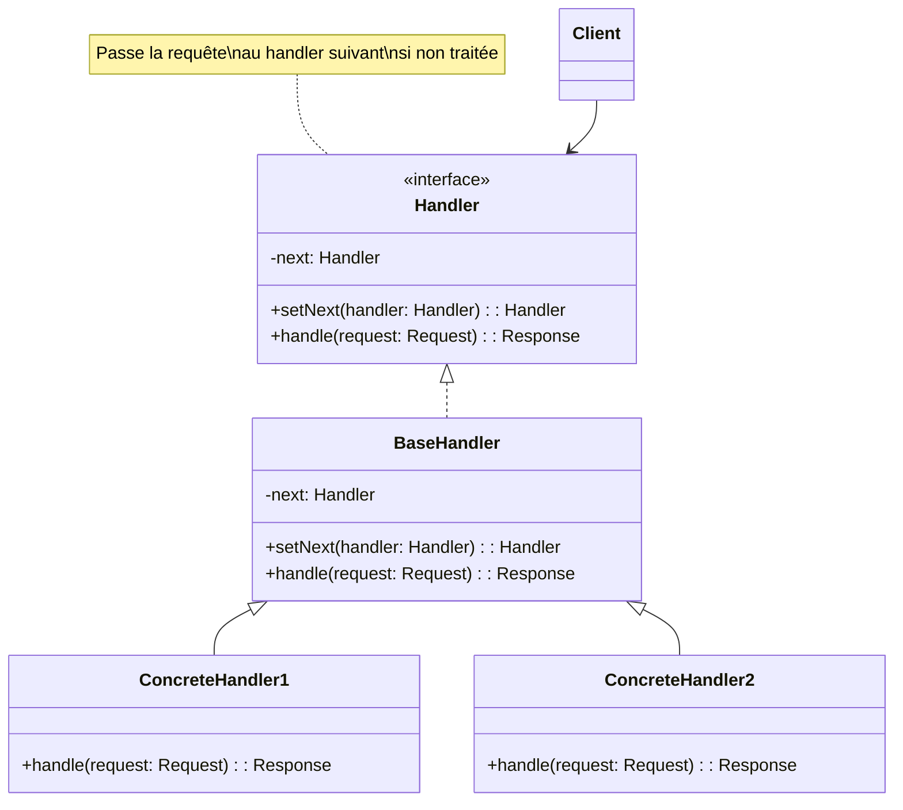

# Design Pattern : Chain of Responsibility

## 1. Introduction

### Objectifs du cours
Après ce cours, vous serez capable de :
- Comprendre le pattern Chain of Responsibility
- Créer des chaînes de traitement flexibles
- Implémenter des middlewares et interceptors
- Gérer la validation en chaîne
- Découpler émetteurs et récepteurs de requêtes

### Scope et applications
Le pattern Chain of Responsibility est massivement utilisé dans les applications web, particulièrement pour :
- **Middleware** : Express.js, NestJS (authentication, logging, etc.)
- **Validation en chaîne** : formulaires, données API
- **Error handling** : propagation et gestion d'erreurs
- **Interceptors** : Angular/NestJS HTTP interceptors
- **Event bubbling** : propagation d'événements UI
- **Filtres de sécurité** : authentification, autorisation, rate limiting

---

## 2. Définitions et concepts clés

### 2.1 Qu'est-ce que le pattern Chain of Responsibility ?

Le **Chain of Responsibility** est un pattern comportemental qui permet de **passer une requête le long d'une chaîne de handlers**. Chaque handler décide soit de **traiter la requête**, soit de la **passer au suivant**.

**Analogie de la vie quotidienne :**
Imaginez le **support technique** d'une entreprise :
- **Niveau 1** (hotline) : Gère les questions simples
  - Si trop complexe → passe au Niveau 2
- **Niveau 2** (technicien) : Gère les problèmes techniques
  - Si trop complexe → passe au Niveau 3
- **Niveau 3** (expert) : Gère les cas critiques
  - Si impossible → passe au développement

Chaque niveau :
- **Essaye de traiter** le problème
- Si impossible, **passe au suivant** dans la chaîne
- Le client n'a **pas besoin de savoir** qui va traiter

De la même façon en programmation :
- **Handler** : Maillon de la chaîne
- **Next Handler** : Handler suivant
- **Request** : Données à traiter
- **Chain** : Séquence de handlers

### 2.2 Concepts clés

| Concept | Description |
|---------|-------------|
| **Handler** | Interface avec méthode handle() |
| **Concrete Handler** | Implémentation spécifique |
| **Next Handler** | Référence au handler suivant |
| **Chain** | Séquence de handlers liés |
| **Request** | Données passées dans la chaîne |
| **Short-circuit** | Arrêt de la chaîne si traité |

### 2.3 Structure de la Chain of Responsibility



---

## 3. Pourquoi utiliser le pattern Chain of Responsibility ?

### 3.1 Problèmes sans Chain of Responsibility

**❌ Problème 1 : If/else en cascade**
```typescript
// ❌ Code rigide et difficile à maintenir
class RequestProcessor {
  process(request: Request): Response {
    if (request.type === 'authentication') {
      return this.handleAuth(request);
    } else if (request.type === 'validation') {
      return this.handleValidation(request);
    } else if (request.type === 'authorization') {
      return this.handleAuthz(request);
    } else if (request.type === 'logging') {
      return this.handleLogging(request);
    } else if (request.type === 'caching') {
      return this.handleCaching(request);
    } else {
      throw new Error('Unknown request type');
    }
  }
  
  // ❌ Problèmes :
  // - Difficile d'ajouter un nouveau type
  // - Violation du Open/Closed principle
  // - Code monolithique
  // - Impossible de réordonner les traitements
}
```

**❌ Problème 2 : Couplage fort**
```typescript
// ❌ Chaque handler connaît le suivant
class AuthHandler {
  constructor(private validationHandler: ValidationHandler) {}
  
  handle(request: Request): void {
    // Traiter auth
    this.validationHandler.handle(request);  // ❌ Couplage
  }
}

class ValidationHandler {
  constructor(private loggingHandler: LoggingHandler) {}
  
  handle(request: Request): void {
    // Traiter validation
    this.loggingHandler.handle(request);  // ❌ Couplage
  }
}
// ❌ Impossible de réorganiser ou supprimer un handler
```

**❌ Problème 3 : Pas de flexibilité**
```typescript
// ❌ Ordre fixe, impossible de personnaliser
function processRequest(req: Request): Response {
  // Toujours le même ordre
  authenticate(req);
  validate(req);
  authorize(req);
  execute(req);
  // ❌ Impossible de sauter une étape ou changer l'ordre
}
```

### 3.2 Avantages de la Chain of Responsibility

| Avantage | Description |
|----------|-------------|
| **Découplage** | Émetteur ne connaît pas le récepteur |
| **Flexibilité** | Facile de réordonner ou ajouter handlers |
| **Single Responsibility** | Chaque handler a une responsabilité |
| **Open/Closed** | Ajouter handlers sans modifier existants |
| **Runtime configuration** | Chaîne configurable dynamiquement |

---

## 4. Implémentation du pattern Chain of Responsibility

### 4.1 Chain of Responsibility basique

```typescript
// Interface Handler
interface Handler<T = any> {
  setNext(handler: Handler<T>): Handler<T>;
  handle(request: T): T | null;
}

// Classe de base abstraite
abstract class AbstractHandler<T = any> implements Handler<T> {
  private nextHandler: Handler<T> | null = null;
  
  setNext(handler: Handler<T>): Handler<T> {
    this.nextHandler = handler;
    return handler;  // Permet chaînage fluent
  }
  
  handle(request: T): T | null {
    if (this.nextHandler) {
      return this.nextHandler.handle(request);
    }
    return null;
  }
}

// Handler concret : Authentication
class AuthenticationHandler extends AbstractHandler<Request> {
  handle(request: Request): Request | null {
    if (!request.headers['authorization']) {
      console.log('❌ Auth: No authorization header');
      throw new Error('Unauthorized');
    }
    
    console.log('✓ Auth: Authorized');
    request.user = { id: 1, name: 'John' };
    
    // Passer au suivant
    return super.handle(request);
  }
}

// Handler concret : Validation
class ValidationHandler extends AbstractHandler<Request> {
  handle(request: Request): Request | null {
    if (!request.body || Object.keys(request.body).length === 0) {
      console.log('❌ Validation: Empty body');
      throw new Error('Invalid request body');
    }
    
    console.log('✓ Validation: Body is valid');
    
    // Passer au suivant
    return super.handle(request);
  }
}

// Handler concret : Logging
class LoggingHandler extends AbstractHandler<Request> {
  handle(request: Request): Request | null {
    console.log(`📝 Logging: ${request.method} ${request.path}`);
    console.log(`   User: ${request.user?.name || 'Anonymous'}`);
    console.log(`   Body:`, request.body);
    
    // Passer au suivant
    return super.handle(request);
  }
}

// Handler concret : Rate Limiting
class RateLimitHandler extends AbstractHandler<Request> {
  private requests = new Map<number, number[]>();
  private readonly LIMIT = 5;
  private readonly WINDOW = 60000;  // 1 minute
  
  handle(request: Request): Request | null {
    const userId = request.user?.id;
    if (!userId) {
      return super.handle(request);
    }
    
    const now = Date.now();
    const userRequests = this.requests.get(userId) || [];
    
    // Nettoyer les requêtes anciennes
    const recentRequests = userRequests.filter(
      time => now - time < this.WINDOW
    );
    
    if (recentRequests.length >= this.LIMIT) {
      console.log('❌ Rate limit exceeded');
      throw new Error('Too many requests');
    }
    
    recentRequests.push(now);
    this.requests.set(userId, recentRequests);
    
    console.log(`✓ Rate limit: ${recentRequests.length}/${this.LIMIT}`);
    
    // Passer au suivant
    return super.handle(request);
  }
}

interface Request {
  method: string;
  path: string;
  headers: Record<string, string>;
  body: any;
  user?: { id: number; name: string };
}

// Utilisation : Construction de la chaîne
const auth = new AuthenticationHandler();
const validation = new ValidationHandler();
const rateLimit = new RateLimitHandler();
const logging = new LoggingHandler();

// Chaînage fluent
auth
  .setNext(validation)
  .setNext(rateLimit)
  .setNext(logging);

// Requête
const request: Request = {
  method: 'POST',
  path: '/api/users',
  headers: { authorization: 'Bearer token123' },
  body: { name: 'Jane', email: 'jane@example.com' }
};

// Traiter la requête
try {
  auth.handle(request);
  console.log('✅ Request processed successfully');
} catch (error) {
  console.error('❌ Request failed:', error.message);
}

// Output:
// ✓ Auth: Authorized
// ✓ Validation: Body is valid
// ✓ Rate limit: 1/5
// 📝 Logging: POST /api/users
//    User: John
//    Body: { name: 'Jane', email: 'jane@example.com' }
// ✅ Request processed successfully
```

### 4.2 Middleware NestJS (Chain of Responsibility)

```typescript
import { Injectable, NestMiddleware } from '@nestjs/common';
import { Request, Response, NextFunction } from 'express';

// Middleware d'authentification
@Injectable()
export class AuthMiddleware implements NestMiddleware {
  use(req: Request, res: Response, next: NextFunction): void {
    const token = req.headers.authorization;
    
    if (!token) {
      console.log('❌ Auth middleware: No token');
      res.status(401).json({ error: 'Unauthorized' });
      return;  // Arrête la chaîne
    }
    
    console.log('✓ Auth middleware: Token validated');
    (req as any).user = { id: 1, name: 'John' };
    
    next();  // Continue la chaîne
  }
}

// Middleware de logging
@Injectable()
export class LoggerMiddleware implements NestMiddleware {
  use(req: Request, res: Response, next: NextFunction): void {
    const start = Date.now();
    
    console.log(`→ ${req.method} ${req.path}`);
    
    res.on('finish', () => {
      const duration = Date.now() - start;
      console.log(`← ${req.method} ${req.path} ${res.statusCode} (${duration}ms)`);
    });
    
    next();
  }
}

// Middleware de validation
@Injectable()
export class ValidationMiddleware implements NestMiddleware {
  use(req: Request, res: Response, next: NextFunction): void {
    if (req.method === 'POST' || req.method === 'PUT') {
      if (!req.body || Object.keys(req.body).length === 0) {
        console.log('❌ Validation middleware: Empty body');
        res.status(400).json({ error: 'Invalid request body' });
        return;
      }
    }
    
    console.log('✓ Validation middleware: Request valid');
    next();
  }
}

// Configuration dans AppModule
@Module({
  // ...
})
export class AppModule implements NestModule {
  configure(consumer: MiddlewareConsumer): void {
    // Chaîne de middlewares
    consumer
      .apply(
        LoggerMiddleware,      // 1. Log
        AuthMiddleware,        // 2. Auth
        ValidationMiddleware   // 3. Validation
      )
      .forRoutes('*');  // Pour toutes les routes
  }
}
```

### 4.3 Validation en chaîne

```typescript
// Validateur de base
abstract class Validator<T> {
  private next: Validator<T> | null = null;
  
  setNext(validator: Validator<T>): Validator<T> {
    this.next = validator;
    return validator;
  }
  
  validate(data: T): ValidationResult {
    // Valider avec ce validateur
    const result = this.check(data);
    
    if (!result.isValid) {
      return result;  // Arrêter si invalide
    }
    
    // Passer au suivant si valide
    if (this.next) {
      return this.next.validate(data);
    }
    
    return { isValid: true };
  }
  
  protected abstract check(data: T): ValidationResult;
}

interface ValidationResult {
  isValid: boolean;
  error?: string;
}

// Validateurs concrets
class RequiredFieldsValidator extends Validator<UserData> {
  protected check(data: UserData): ValidationResult {
    const required = ['email', 'name', 'password'];
    
    for (const field of required) {
      if (!data[field as keyof UserData]) {
        return {
          isValid: false,
          error: `Field "${field}" is required`
        };
      }
    }
    
    return { isValid: true };
  }
}

class EmailValidator extends Validator<UserData> {
  protected check(data: UserData): ValidationResult {
    const emailRegex = /^[^\s@]+@[^\s@]+\.[^\s@]+$/;
    
    if (!emailRegex.test(data.email)) {
      return {
        isValid: false,
        error: 'Invalid email format'
      };
    }
    
    return { isValid: true };
  }
}

class PasswordStrengthValidator extends Validator<UserData> {
  protected check(data: UserData): ValidationResult {
    if (data.password.length < 8) {
      return {
        isValid: false,
        error: 'Password must be at least 8 characters'
      };
    }
    
    if (!/[A-Z]/.test(data.password)) {
      return {
        isValid: false,
        error: 'Password must contain uppercase letter'
      };
    }
    
    if (!/[0-9]/.test(data.password)) {
      return {
        isValid: false,
        error: 'Password must contain a number'
      };
    }
    
    return { isValid: true };
  }
}

class AgeValidator extends Validator<UserData> {
  protected check(data: UserData): ValidationResult {
    if (data.age < 18) {
      return {
        isValid: false,
        error: 'Must be at least 18 years old'
      };
    }
    
    if (data.age > 120) {
      return {
        isValid: false,
        error: 'Invalid age'
      };
    }
    
    return { isValid: true };
  }
}

interface UserData {
  email: string;
  name: string;
  password: string;
  age: number;
}

// Construction de la chaîne
const requiredFields = new RequiredFieldsValidator();
const emailValidator = new EmailValidator();
const passwordValidator = new PasswordStrengthValidator();
const ageValidator = new AgeValidator();

requiredFields
  .setNext(emailValidator)
  .setNext(passwordValidator)
  .setNext(ageValidator);

// Test de validation
const userData: UserData = {
  email: 'john@example.com',
  name: 'John',
  password: 'SecurePass123',
  age: 25
};

const result = requiredFields.validate(userData);

if (result.isValid) {
  console.log('✅ Validation passed');
} else {
  console.log('❌ Validation failed:', result.error);
}
```

### 4.4 Error Handler Chain

```typescript
// Handler d'erreur
abstract class ErrorHandler {
  private next: ErrorHandler | null = null;
  
  setNext(handler: ErrorHandler): ErrorHandler {
    this.next = handler;
    return handler;
  }
  
  handle(error: Error): ErrorResponse | null {
    if (this.canHandle(error)) {
      return this.process(error);
    }
    
    if (this.next) {
      return this.next.handle(error);
    }
    
    return null;  // Aucun handler ne peut traiter
  }
  
  protected abstract canHandle(error: Error): boolean;
  protected abstract process(error: Error): ErrorResponse;
}

interface ErrorResponse {
  statusCode: number;
  message: string;
  details?: any;
}

// Handlers spécifiques
class ValidationErrorHandler extends ErrorHandler {
  protected canHandle(error: Error): boolean {
    return error.name === 'ValidationError';
  }
  
  protected process(error: Error): ErrorResponse {
    console.log('Handling ValidationError');
    return {
      statusCode: 400,
      message: 'Validation failed',
      details: error.message
    };
  }
}

class AuthenticationErrorHandler extends ErrorHandler {
  protected canHandle(error: Error): boolean {
    return error.message.includes('Unauthorized') ||
           error.name === 'AuthenticationError';
  }
  
  protected process(error: Error): ErrorResponse {
    console.log('Handling AuthenticationError');
    return {
      statusCode: 401,
      message: 'Authentication required'
    };
  }
}

class NotFoundErrorHandler extends ErrorHandler {
  protected canHandle(error: Error): boolean {
    return error.name === 'NotFoundError';
  }
  
  protected process(error: Error): ErrorResponse {
    console.log('Handling NotFoundError');
    return {
      statusCode: 404,
      message: 'Resource not found',
      details: error.message
    };
  }
}

class GenericErrorHandler extends ErrorHandler {
  protected canHandle(error: Error): boolean {
    return true;  // Catch-all
  }
  
  protected process(error: Error): ErrorResponse {
    console.log('Handling generic error');
    return {
      statusCode: 500,
      message: 'Internal server error',
      details: process.env.NODE_ENV === 'development' ? error.message : undefined
    };
  }
}

// Construction de la chaîne d'error handlers
const validationHandler = new ValidationErrorHandler();
const authHandler = new AuthenticationErrorHandler();
const notFoundHandler = new NotFoundErrorHandler();
const genericHandler = new GenericErrorHandler();

validationHandler
  .setNext(authHandler)
  .setNext(notFoundHandler)
  .setNext(genericHandler);  // Toujours en dernier

// Utilisation
function handleError(error: Error): ErrorResponse {
  const response = validationHandler.handle(error);
  return response || {
    statusCode: 500,
    message: 'Unknown error'
  };
}

// Tests
const validationError = new Error('Invalid email');
validationError.name = 'ValidationError';
console.log(handleError(validationError));
// { statusCode: 400, message: 'Validation failed', details: 'Invalid email' }

const authError = new Error('Unauthorized access');
console.log(handleError(authError));
// { statusCode: 401, message: 'Authentication required' }
```

---

## 5. Erreurs courantes et comment les éviter

### 5.1 Erreurs fréquentes

| Erreur | Problème | Solution |
|--------|----------|----------|
| **Oubli de next()** | Chaîne s'arrête | Toujours appeler next() ou super.handle() |
| **Ordre incorrect** | Logique cassée | Bien réfléchir à l'ordre |
| **Pas de handler final** | Requête non traitée | Ajouter catch-all handler |
| **État partagé** | Side effects | Handlers indépendants |

---

## 6. Exercices pratiques

### Exercice 1 : Logger Chain (Facile)
Créez une chaîne de loggers (Console, File, Database) qui logguent selon le niveau (DEBUG, INFO, ERROR).

### Exercice 2 : Approval Workflow (Intermédiaire)
Créez un workflow d'approbation avec chaîne (Manager → Director → CEO) selon le montant.

---

## 7. Comportement senior : Recommandations et astuces

### 7.1 Quand utiliser Chain of Responsibility

**✅ Utilisez Chain of Responsibility quand :**
- **Middleware** HTTP
- **Validation multi-étapes**
- **Error handling** hiérarchique
- **Filtres** de sécurité
- **Event bubbling**

**❌ N'utilisez PAS quand :**
- Simple if/else suffit
- Ordre fixe et simple
- Over-engineering

---

## 8. Résumé

**La Chain of Responsibility** permet de :
- ✅ **Découpler** émetteur et récepteur
- ✅ Créer des **pipelines** flexibles
- ✅ Ajouter/retirer handlers **dynamiquement**
- ✅ Implémenter **middleware**
- ✅ Respecter **Single Responsibility**

---

## 9. Ressources complémentaires

### Français
- 📚 [Refactoring Guru - Chain of Responsibility](https://refactoring.guru/fr/design-patterns/chain-of-responsibility)

### Anglais
- 🎥 [Chain of Responsibility Pattern](https://www.youtube.com/watch?v=jDX6x8qmjbA)
- 📖 [NestJS Middleware](https://docs.nestjs.com/middleware)

---

**En une phrase :**

> Le pattern Chain of Responsibility permet de passer une requête le long d'une chaîne de handlers où chaque maillon décide de la traiter ou de la passer au suivant, massivement utilisé dans les webapps via les middlewares NestJS/Express pour l'authentification, la validation, le logging et la gestion d'erreurs.
