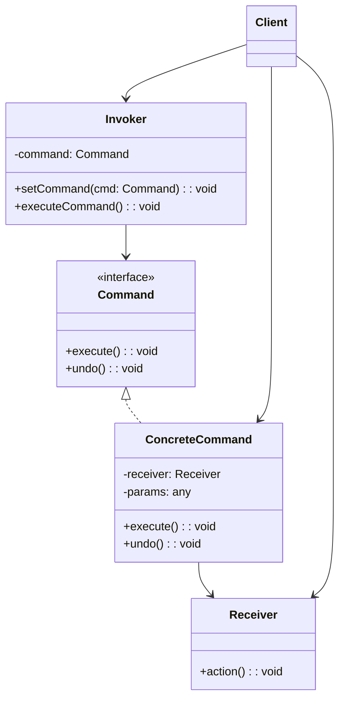

# Design Pattern : Command

## 1. Introduction

### Objectifs du cours
Après ce cours, vous serez capable de :
- Comprendre le pattern Command et son utilité
- Implémenter undo/redo dans vos applications
- Créer des systèmes de queues de tâches
- Utiliser le pattern pour event sourcing
- Découpler l'invocation d'une opération de son exécution

### Scope et applications
Le pattern Command est très utilisé dans les applications web métier, particulièrement pour :
- **Undo/Redo** : annuler/refaire des actions (éditeurs, formulaires)
- **Queue de tâches** : traitement asynchrone, batch processing
- **Event Sourcing** : stockage d'événements pour audit
- **Macros** : enregistrement et replay d'actions
- **Transactions** : commit/rollback d'opérations
- **Menu actions** : découpler UI et logique métier

---

## 2. Définitions et concepts clés

### 2.1 Qu'est-ce que le pattern Command ?

Le **Command** est un pattern comportemental qui transforme une **requête** en un **objet autonome** contenant toute l'information nécessaire à son exécution. Cela permet de paramétrer, mettre en queue, logger, ou annuler des opérations.

**Analogie de la vie quotidienne :**
Imaginez une **commande de restaurant** :
- Vous ne criez pas directement en cuisine "Préparez-moi un burger !"
- Vous donnez une **commande écrite** au serveur (objet Command)
- La commande contient **toutes les informations** : plat, modifications, table
- Le serveur peut **mettre en queue** plusieurs commandes
- La cuisine **exécute** les commandes dans l'ordre
- Vous pouvez **annuler** la commande si elle n'est pas encore prête
- Le restaurant garde un **historique** des commandes pour comptabilité

De la même façon en programmation :
- **Command** : Objet qui encapsule une action
- **Invoker** : Déclenche l'exécution (serveur)
- **Receiver** : Exécute l'action (cuisine)
- **Client** : Crée la commande (client du restaurant)

### 2.2 Concepts clés

| Concept | Description |
|---------|-------------|
| **Command** | Interface avec méthode execute() |
| **Concrete Command** | Implémentation spécifique d'une action |
| **Invoker** | Demande l'exécution de la commande |
| **Receiver** | Objet qui effectue le travail réel |
| **Client** | Crée et configure les commandes |
| **Undo** | Annulation de la commande |

### 2.3 Structure du Command



---

## 3. Pourquoi utiliser le pattern Command ?

### 3.1 Problèmes sans Command

**❌ Problème 1 : Pas d'historique/undo**
```typescript
// ❌ Modification directe, impossible d'annuler
class TextEditor {
  private content = '';
  
  insertText(text: string): void {
    this.content += text;
    // ❌ Comment annuler cette insertion ?
  }
  
  deleteText(length: number): void {
    this.content = this.content.slice(0, -length);
    // ❌ Texte supprimé = perdu !
  }
}

const editor = new TextEditor();
editor.insertText('Hello');
editor.insertText(' World');
editor.deleteText(6);
// ❌ Impossible de revenir en arrière !
```

**❌ Problème 2 : Couplage fort UI/logique**
```typescript
// ❌ Boutons couplés à la logique
@Component({
  template: `
    <button (click)="user.save()">Save</button>
    <button (click)="user.delete()">Delete</button>
    <button (click)="user.update()">Update</button>
  `
})
export class UserComponent {
  // ❌ UI connaît les détails de l'implémentation
  // Difficile de changer, tester, ou réutiliser
}
```

**❌ Problème 3 : Pas de queue/planification**
```typescript
// ❌ Opérations exécutées immédiatement
class DataProcessor {
  process(data: Data): void {
    this.validate(data);    // Immédiat
    this.transform(data);   // Immédiat
    this.save(data);        // Immédiat
  }
}

// ❌ Impossible de :
// - Mettre en queue
// - Planifier pour plus tard
// - Grouper plusieurs opérations
// - Annuler si erreur
```

### 3.2 Avantages du Command

| Avantage | Description |
|----------|-------------|
| **Undo/Redo** | Annulation et reprise d'actions |
| **Découplage** | Sépare invocation et exécution |
| **Queue** | File d'attente d'opérations |
| **Logging** | Historique des actions |
| **Macro** | Composition de commandes |
| **Transactionnel** | Commit/rollback |

---

## 4. Implémentation du pattern Command

### 4.1 Command simple avec Undo

```typescript
// Interface Command
interface Command {
  execute(): void;
  undo(): void;
}

// Receiver
class TextDocument {
  private content = '';
  
  insert(text: string, position: number): void {
    this.content = 
      this.content.slice(0, position) + 
      text + 
      this.content.slice(position);
    console.log(`Content: "${this.content}"`);
  }
  
  delete(position: number, length: number): string {
    const deleted = this.content.slice(position, position + length);
    this.content = 
      this.content.slice(0, position) + 
      this.content.slice(position + length);
    console.log(`Content: "${this.content}"`);
    return deleted;
  }
  
  getContent(): string {
    return this.content;
  }
}

// Commande concrète : Insertion
class InsertTextCommand implements Command {
  constructor(
    private document: TextDocument,
    private text: string,
    private position: number
  ) {}
  
  execute(): void {
    console.log(`Executing: Insert "${this.text}" at ${this.position}`);
    this.document.insert(this.text, this.position);
  }
  
  undo(): void {
    console.log(`Undoing: Delete "${this.text}" at ${this.position}`);
    this.document.delete(this.position, this.text.length);
  }
}

// Commande concrète : Suppression
class DeleteTextCommand implements Command {
  private deletedText = '';
  
  constructor(
    private document: TextDocument,
    private position: number,
    private length: number
  ) {}
  
  execute(): void {
    console.log(`Executing: Delete ${this.length} chars at ${this.position}`);
    this.deletedText = this.document.delete(this.position, this.length);
  }
  
  undo(): void {
    console.log(`Undoing: Restore "${this.deletedText}"`);
    this.document.insert(this.deletedText, this.position);
  }
}

// Invoker avec historique
class CommandHistory {
  private history: Command[] = [];
  private currentIndex = -1;
  
  execute(command: Command): void {
    // Supprimer les commandes après currentIndex (si on a fait undo)
    this.history = this.history.slice(0, this.currentIndex + 1);
    
    // Exécuter et ajouter à l'historique
    command.execute();
    this.history.push(command);
    this.currentIndex++;
  }
  
  undo(): void {
    if (this.currentIndex < 0) {
      console.log('Nothing to undo');
      return;
    }
    
    const command = this.history[this.currentIndex];
    command.undo();
    this.currentIndex--;
  }
  
  redo(): void {
    if (this.currentIndex >= this.history.length - 1) {
      console.log('Nothing to redo');
      return;
    }
    
    this.currentIndex++;
    const command = this.history[this.currentIndex];
    command.execute();
  }
}

// Utilisation
const doc = new TextDocument();
const history = new CommandHistory();

// Exécuter des commandes
history.execute(new InsertTextCommand(doc, 'Hello', 0));
// Content: "Hello"

history.execute(new InsertTextCommand(doc, ' World', 5));
// Content: "Hello World"

history.execute(new DeleteTextCommand(doc, 5, 6));
// Content: "Hello"

// Undo
history.undo();  // Restore " World"
// Content: "Hello World"

history.undo();  // Delete " World"
// Content: "Hello"

// Redo
history.redo();  // Insert " World"
// Content: "Hello World"
```

### 4.2 Command avec paramètres (Angular)

```typescript
// Interface Command générique
interface ICommand<T = void> {
  execute(): T;
  undo?(): void;
}

// Command pour sauvegarder un utilisateur
class SaveUserCommand implements ICommand<Promise<User>> {
  private previousState: User | null = null;
  
  constructor(
    private userService: UserService,
    private user: User
  ) {}
  
  async execute(): Promise<User> {
    console.log('Saving user:', this.user.name);
    this.previousState = { ...this.user };
    return await this.userService.save(this.user);
  }
  
  async undo(): Promise<void> {
    if (this.previousState) {
      console.log('Restoring user:', this.previousState.name);
      await this.userService.save(this.previousState);
    }
  }
}

// Command pour supprimer un utilisateur
class DeleteUserCommand implements ICommand<Promise<void>> {
  private deletedUser: User | null = null;
  
  constructor(
    private userService: UserService,
    private userId: number
  ) {}
  
  async execute(): Promise<void> {
    console.log('Deleting user:', this.userId);
    this.deletedUser = await this.userService.getById(this.userId);
    await this.userService.delete(this.userId);
  }
  
  async undo(): Promise<void> {
    if (this.deletedUser) {
      console.log('Restoring user:', this.deletedUser.name);
      await this.userService.save(this.deletedUser);
    }
  }
}

// Invoker service
@Injectable({ providedIn: 'root' })
export class CommandService {
  private history: ICommand[] = [];
  private currentIndex = -1;
  
  async execute<T>(command: ICommand<T>): Promise<T> {
    this.history = this.history.slice(0, this.currentIndex + 1);
    
    const result = await command.execute();
    this.history.push(command);
    this.currentIndex++;
    
    return result;
  }
  
  async undo(): Promise<void> {
    if (this.currentIndex < 0) {
      console.log('Nothing to undo');
      return;
    }
    
    const command = this.history[this.currentIndex];
    if (command.undo) {
      await command.undo();
    }
    this.currentIndex--;
  }
  
  canUndo(): boolean {
    return this.currentIndex >= 0;
  }
}

// Utilisation dans un composant
@Component({
  selector: 'app-user-editor',
  template: `
    <button (click)="save()">Save</button>
    <button (click)="delete()">Delete</button>
    <button (click)="undo()" [disabled]="!canUndo">Undo</button>
  `
})
export class UserEditorComponent {
  user: User = { id: 1, name: 'John', email: 'john@example.com' };
  
  get canUndo(): boolean {
    return this.commandService.canUndo();
  }
  
  constructor(
    private commandService: CommandService,
    private userService: UserService
  ) {}
  
  async save(): Promise<void> {
    const command = new SaveUserCommand(this.userService, this.user);
    await this.commandService.execute(command);
  }
  
  async delete(): Promise<void> {
    const command = new DeleteUserCommand(this.userService, this.user.id);
    await this.commandService.execute(command);
  }
  
  async undo(): Promise<void> {
    await this.commandService.undo();
  }
}

interface User {
  id: number;
  name: string;
  email: string;
}
```

### 4.3 Macro Commands (composition)

```typescript
// Commande composée
class MacroCommand implements Command {
  private commands: Command[] = [];
  
  add(command: Command): void {
    this.commands.push(command);
  }
  
  execute(): void {
    console.log('Executing macro command...');
    for (const command of this.commands) {
      command.execute();
    }
  }
  
  undo(): void {
    console.log('Undoing macro command...');
    // Undo en ordre inverse
    for (let i = this.commands.length - 1; i >= 0; i--) {
      this.commands[i].undo();
    }
  }
}

// Exemple : Créer un document complet
const doc = new TextDocument();
const history = new CommandHistory();

const createDocument = new MacroCommand();
createDocument.add(new InsertTextCommand(doc, '# Title\n\n', 0));
createDocument.add(new InsertTextCommand(doc, 'This is the content.\n', 10));
createDocument.add(new InsertTextCommand(doc, '## Conclusion\n', 31));

history.execute(createDocument);
// Exécute toutes les commandes

history.undo();
// Annule toutes les commandes dans l'ordre inverse
```

### 4.4 Queue de commandes (NestJS)

```typescript
// Command pour traitement asynchrone
interface TaskCommand {
  execute(): Promise<void>;
  getName(): string;
}

class SendEmailCommand implements TaskCommand {
  constructor(
    private emailService: EmailService,
    private to: string,
    private subject: string,
    private body: string
  ) {}
  
  async execute(): Promise<void> {
    console.log(`Sending email to ${this.to}`);
    await this.emailService.send({
      to: this.to,
      subject: this.subject,
      body: this.body
    });
  }
  
  getName(): string {
    return `SendEmail:${this.to}`;
  }
}

class GenerateReportCommand implements TaskCommand {
  constructor(
    private reportService: ReportService,
    private userId: number
  ) {}
  
  async execute(): Promise<void> {
    console.log(`Generating report for user ${this.userId}`);
    await this.reportService.generate(this.userId);
  }
  
  getName(): string {
    return `GenerateReport:${this.userId}`;
  }
}

// Queue processor
@Injectable()
export class CommandQueue {
  private queue: TaskCommand[] = [];
  private processing = false;
  
  add(command: TaskCommand): void {
    console.log(`Adding to queue: ${command.getName()}`);
    this.queue.push(command);
    this.processQueue();
  }
  
  private async processQueue(): Promise<void> {
    if (this.processing || this.queue.length === 0) {
      return;
    }
    
    this.processing = true;
    
    while (this.queue.length > 0) {
      const command = this.queue.shift();
      if (command) {
        try {
          console.log(`Processing: ${command.getName()}`);
          await command.execute();
          console.log(`Completed: ${command.getName()}`);
        } catch (error) {
          console.error(`Failed: ${command.getName()}`, error);
        }
      }
    }
    
    this.processing = false;
  }
}

// Utilisation
@Controller('tasks')
export class TasksController {
  constructor(
    private queue: CommandQueue,
    private emailService: EmailService,
    private reportService: ReportService
  ) {}
  
  @Post('send-email')
  sendEmail(@Body() dto: EmailDto): { message: string } {
    const command = new SendEmailCommand(
      this.emailService,
      dto.to,
      dto.subject,
      dto.body
    );
    this.queue.add(command);
    return { message: 'Email queued for sending' };
  }
  
  @Post('generate-report')
  generateReport(@Body() dto: ReportDto): { message: string } {
    const command = new GenerateReportCommand(
      this.reportService,
      dto.userId
    );
    this.queue.add(command);
    return { message: 'Report generation queued' };
  }
}
```

---

## 5. Erreurs courantes et comment les éviter

### 5.1 Erreurs fréquentes

| Erreur | Problème | Solution |
|--------|----------|----------|
| **Undo non implémenté** | Impossible d'annuler | Implémenter undo() |
| **État non sauvegardé** | Undo incorrect | Sauvegarder état avant execute() |
| **Commands trop complexes** | Difficile à maintenir | Simplifier, décomposer |
| **Pas de gestion d'erreurs** | Historique incohérent | try/catch, rollback |

---

## 6. Exercices pratiques

### Exercice 1 : Todo List avec Undo (Facile)
Créez une todo list avec undo/redo pour add, delete, et toggle.

### Exercice 2 : Form Builder avec History (Intermédiaire)
Créez un éditeur de formulaire avec historique des modifications.

---

## 7. Comportement senior : Recommandations et astuces

### 7.1 Quand utiliser Command

**✅ Utilisez Command quand :**
- **Undo/Redo** nécessaire
- **Queue de tâches** asynchrones
- **Event sourcing** ou audit trail
- **Découplage** UI/logique métier
- **Macros** ou batch operations

**❌ N'utilisez PAS Command quand :**
- Simple callback suffit
- Pas besoin d'historique
- Over-engineering

---

## 8. Résumé

**Le pattern Command** permet de :
- ✅ Encapsuler des **actions** en objets
- ✅ Implémenter **undo/redo**
- ✅ Créer des **queues** de tâches
- ✅ **Découpler** invocation et exécution
- ✅ Logger et auditer les **opérations**

---

## 9. Ressources complémentaires

### Français
- 📚 [Refactoring Guru - Command](https://refactoring.guru/fr/design-patterns/command)

### Anglais
- 🎥 [Command Pattern](https://www.youtube.com/watch?v=9qA5kw8dcSU)
- 📖 [Command Pattern in TypeScript](https://sbcode.net/typescript/command/)

---

**En une phrase :**

> Le pattern Command encapsule des requêtes en objets autonomes, permettant d'implémenter undo/redo, queues de tâches, et event sourcing dans les applications web, tout en découplant l'invocation de l'exécution des opérations.
