# Design Pattern : Decorator

## 1. Introduction

### Objectifs du cours
Après ce cours, vous serez capable de :
- Comprendre le pattern Decorator et ses cas d'utilisation
- Implémenter des décorateurs en TypeScript
- Utiliser les Interceptors Angular et NestJS
- Créer des décorateurs personnalisés (annotations)
- Appliquer le Decorator pour ajouter des fonctionnalités dynamiquement

### Scope et applications
Le pattern Decorator est omniprésent dans les applications web modernes, particulièrement pour :
- **Interceptors** Angular/NestJS (logging, auth, transformation)
- **Decorators TypeScript** (@Component, @Injectable, @Get)
- **Middleware** : logging, validation, caching
- **Guards** : authentification, autorisation
- **Pipes** : transformation et validation de données
- **HOC** (Higher-Order Components) en React

---

## 2. Définitions et concepts clés

### 2.1 Qu'est-ce que le pattern Decorator ?

Le **Decorator** est un pattern structurel qui permet d'**ajouter dynamiquement** de nouvelles fonctionnalités à un objet **sans modifier sa structure** de base. Il fournit une alternative flexible à l'héritage pour étendre les fonctionnalités.

**Analogie de la vie quotidienne :**
Imaginez une **pizza de base** :
- Vous commencez avec une pizza Margherita (objet de base)
- Vous **ajoutez** des ingrédients : jambon, champignons, olives (décorateurs)
- Chaque ingrédient **enrobe** la pizza précédente
- La pizza de base n'est **pas modifiée**, on ajoute par-dessus
- Vous pouvez **combiner** plusieurs ajouts dans l'ordre que vous voulez
- Le prix final est la **somme** de tous les ajouts

De la même façon en programmation :
- **Composant de base** : Objet original avec fonctionnalité de base
- **Decorators** : Enrobent l'objet et ajoutent des fonctionnalités
- **Composition** : Plusieurs décorateurs peuvent s'empiler
- **Transparence** : L'interface reste la même
- **Dynamique** : Ajout/retrait à l'exécution

### 2.2 Concepts clés

| Concept | Description |
|---------|-------------|
| **Component** | Interface commune au composant et aux décorateurs |
| **Concrete Component** | Objet de base à décorer |
| **Decorator** | Classe abstraite qui wrappe un Component |
| **Concrete Decorators** | Ajoutent des fonctionnalités spécifiques |
| **Wrapping** | Décorateur enrobe le composant |
| **Composition** | Empilement de décorateurs |

### 2.3 Structure du Decorator

```mermaid
classDiagram
    class Component {
        <<interface>>
        +operation(): string
    }
    
    class ConcreteComponent {
        +operation(): string
    }
    
    class Decorator {
        -component: Component
        +operation(): string
    }
    
    class ConcreteDecoratorA {
        +operation(): string
        +addedBehavior(): void
    }
    
    class ConcreteDecoratorB {
        +operation(): string
    }
    
    Component <|.. ConcreteComponent
    Component <|.. Decorator
    Component --o Decorator
    Decorator <|-- ConcreteDecoratorA
    Decorator <|-- ConcreteDecoratorB
    
    note for Decorator "Wrappe un Component\net délègue les appels"
```



---

## 3. Pourquoi utiliser le pattern Decorator ?

### 3.1 Problèmes sans Decorator

**❌ Problème 1 : Explosion de sous-classes (héritage)**
```typescript
// ❌ Avec héritage : combinaisons exponentielles
class Pizza {
  getDescription(): string {
    return 'Pizza de base';
  }
  
  getPrice(): number {
    return 5;
  }
}

class PizzaWithCheese extends Pizza {
  getDescription(): string {
    return super.getDescription() + ', fromage';
  }
  getPrice(): number {
    return super.getPrice() + 1;
  }
}

class PizzaWithHam extends Pizza { /* ... */ }
class PizzaWithCheeseAndHam extends Pizza { /* ... */ }
class PizzaWithCheeseAndHamAndMushrooms extends Pizza { /* ... */ }
// ❌ Pour N ingrédients : 2^N classes !
// ❌ Pizza avec 5 ingrédients = 32 classes différentes !
```

**❌ Problème 2 : Modification de la classe de base**
```typescript
// ❌ Modifier la classe pour ajouter des fonctionnalités
class UserService {
  getUser(id: number): User {
    // Ajouter du logging
    console.log(`Getting user ${id}`);
    
    // Ajouter du caching
    if (cache.has(id)) {
      console.log('Cache hit');
      return cache.get(id);
    }
    
    // Ajouter de l'auth
    if (!this.isAuthorized()) {
      throw new Error('Unauthorized');
    }
    
    const user = this.fetchUser(id);
    
    // Ajouter de la validation
    if (!this.isValid(user)) {
      throw new Error('Invalid user');
    }
    
    cache.set(id, user);
    return user;
  }
  
  // ❌ Problèmes :
  // - Violation du Single Responsibility Principle
  // - Impossible de réutiliser le logging/caching ailleurs
  // - Difficile à tester
  // - Code non modulaire
}
```

**❌ Problème 3 : Code dupliqué**
```typescript
// ❌ Même logique répétée partout
class OrderService {
  createOrder(order: Order): Order {
    console.log('Creating order...');  // Logging dupliqué
    const result = this.save(order);
    console.log('Order created');
    return result;
  }
}

class ProductService {
  createProduct(product: Product): Product {
    console.log('Creating product...');  // Logging dupliqué
    const result = this.save(product);
    console.log('Product created');
    return result;
  }
}
// ❌ Même pattern répété dans chaque service
```

### 3.2 Avantages du Decorator

| Avantage | Description |
|----------|-------------|
| **Extensibilité** | Ajouter fonctionnalités sans modifier code existant |
| **Composition flexible** | Combiner décorateurs dans n'importe quel ordre |
| **Single Responsibility** | Chaque décorateur a une responsabilité unique |
| **Open/Closed** | Ouvert à l'extension, fermé à la modification |
| **Réutilisabilité** | Décorateurs réutilisables sur différents objets |
| **Runtime** | Ajout/retrait dynamique à l'exécution |

---

## 4. Implémentation du pattern Decorator

### 4.1 Decorator classique en TypeScript

```typescript
// 1. Interface commune
interface DataSource {
  writeData(data: string): void;
  readData(): string;
}

// 2. Composant concret de base
class FileDataSource implements DataSource {
  private filename: string;
  
  constructor(filename: string) {
    this.filename = filename;
  }
  
  writeData(data: string): void {
    console.log(`Writing to file ${this.filename}: ${data}`);
    // Écrire dans fichier
  }
  
  readData(): string {
    console.log(`Reading from file ${this.filename}`);
    return 'data from file';
  }
}

// 3. Decorator de base
abstract class DataSourceDecorator implements DataSource {
  protected wrappee: DataSource;
  
  constructor(source: DataSource) {
    this.wrappee = source;
  }
  
  writeData(data: string): void {
    this.wrappee.writeData(data);
  }
  
  readData(): string {
    return this.wrappee.readData();
  }
}

// 4. Decorator concret : Encryption
class EncryptionDecorator extends DataSourceDecorator {
  writeData(data: string): void {
    const encrypted = this.encrypt(data);
    console.log('Encrypting data...');
    super.writeData(encrypted);
  }
  
  readData(): string {
    const data = super.readData();
    console.log('Decrypting data...');
    return this.decrypt(data);
  }
  
  private encrypt(data: string): string {
    // Simuler encryption
    return Buffer.from(data).toString('base64');
  }
  
  private decrypt(data: string): string {
    // Simuler decryption
    return Buffer.from(data, 'base64').toString();
  }
}

// 5. Decorator concret : Compression
class CompressionDecorator extends DataSourceDecorator {
  writeData(data: string): void {
    const compressed = this.compress(data);
    console.log('Compressing data...');
    super.writeData(compressed);
  }
  
  readData(): string {
    const data = super.readData();
    console.log('Decompressing data...');
    return this.decompress(data);
  }
  
  private compress(data: string): string {
    // Simuler compression
    return `[COMPRESSED]${data}`;
  }
  
  private decompress(data: string): string {
    // Simuler decompression
    return data.replace('[COMPRESSED]', '');
  }
}

// 6. Decorator concret : Logging
class LoggingDecorator extends DataSourceDecorator {
  writeData(data: string): void {
    console.log(`[LOG] Writing data: ${data.substring(0, 50)}...`);
    super.writeData(data);
    console.log('[LOG] Write completed');
  }
  
  readData(): string {
    console.log('[LOG] Reading data...');
    const data = super.readData();
    console.log(`[LOG] Read completed: ${data.substring(0, 50)}...`);
    return data;
  }
}

// Utilisation : Empilement de décorateurs
let source: DataSource = new FileDataSource('data.txt');

// Ajouter encryption
source = new EncryptionDecorator(source);

// Ajouter compression
source = new CompressionDecorator(source);

// Ajouter logging
source = new LoggingDecorator(source);

// Utiliser normalement
source.writeData('Secret data');
// Output:
// [LOG] Writing data: Secret data...
// Compressing data...
// Encrypting data...
// Writing to file data.txt: W0NPTVBSRVNTRURF...
// [LOG] Write completed

const data = source.readData();
// Output:
// [LOG] Reading data...
// Reading from file data.txt
// Decrypting data...
// Decompressing data...
// [LOG] Read completed: Secret data...
```

### 4.2 Decorator TypeScript (Annotations)

```typescript
// Decorator de méthode : Logger
function Log(target: any, propertyKey: string, descriptor: PropertyDescriptor) {
  const originalMethod = descriptor.value;
  
  descriptor.value = function (...args: any[]) {
    console.log(`Calling ${propertyKey} with args:`, args);
    const result = originalMethod.apply(this, args);
    console.log(`${propertyKey} returned:`, result);
    return result;
  };
  
  return descriptor;
}

// Decorator de méthode : Mesure de performance
function Measure(target: any, propertyKey: string, descriptor: PropertyDescriptor) {
  const originalMethod = descriptor.value;
  
  descriptor.value = function (...args: any[]) {
    const start = performance.now();
    const result = originalMethod.apply(this, args);
    const end = performance.now();
    console.log(`${propertyKey} took ${(end - start).toFixed(2)}ms`);
    return result;
  };
  
  return descriptor;
}

// Decorator de méthode : Cache
function Cache(ttl: number = 60000) {
  const cache = new Map<string, { value: any; expiresAt: number }>();
  
  return function (target: any, propertyKey: string, descriptor: PropertyDescriptor) {
    const originalMethod = descriptor.value;
    
    descriptor.value = function (...args: any[]) {
      const cacheKey = JSON.stringify(args);
      const cached = cache.get(cacheKey);
      
      if (cached && Date.now() < cached.expiresAt) {
        console.log(`Cache hit for ${propertyKey}`);
        return cached.value;
      }
      
      const result = originalMethod.apply(this, args);
      cache.set(cacheKey, {
        value: result,
        expiresAt: Date.now() + ttl
      });
      console.log(`Cache miss for ${propertyKey}, caching result`);
      return result;
    };
    
    return descriptor;
  };
}

// Utilisation des decorators
class UserService {
  @Log
  @Measure
  getUser(id: number): User {
    console.log('Fetching user from database...');
    // Simuler requête DB
    return { id, name: 'John Doe', email: 'john@example.com' };
  }
  
  @Cache(10000)  // Cache 10 secondes
  @Log
  getUserPosts(userId: number): Post[] {
    console.log('Fetching posts from API...');
    // Simuler appel API
    return [
      { id: 1, title: 'Post 1', userId },
      { id: 2, title: 'Post 2', userId }
    ];
  }
}

const service = new UserService();

// Premier appel
service.getUserPosts(1);
// Output:
// Calling getUserPosts with args: [1]
// Cache miss for getUserPosts, caching result
// Fetching posts from API...
// getUserPosts returned: [{ id: 1, ... }, { id: 2, ... }]

// Deuxième appel (dans les 10 secondes)
service.getUserPosts(1);
// Output:
// Calling getUserPosts with args: [1]
// Cache hit for getUserPosts
// getUserPosts returned: [{ id: 1, ... }, { id: 2, ... }]

interface User {
  id: number;
  name: string;
  email: string;
}

interface Post {
  id: number;
  title: string;
  userId: number;
}
```

### 4.3 Angular Interceptors (HTTP Decorator)

```typescript
import { Injectable } from '@angular/core';
import {
  HttpInterceptor,
  HttpRequest,
  HttpHandler,
  HttpEvent,
  HttpResponse
} from '@angular/common/http';
import { Observable } from 'rxjs';
import { tap, finalize } from 'rxjs/operators';

// Interceptor de logging
@Injectable()
export class LoggingInterceptor implements HttpInterceptor {
  intercept(req: HttpRequest<any>, next: HttpHandler): Observable<HttpEvent<any>> {
    const started = Date.now();
    console.log(`HTTP ${req.method} ${req.url} - Request started`);
    
    return next.handle(req).pipe(
      tap(event => {
        if (event instanceof HttpResponse) {
          const elapsed = Date.now() - started;
          console.log(`HTTP ${req.method} ${req.url} - Response received in ${elapsed}ms`);
        }
      }),
      finalize(() => {
        console.log(`HTTP ${req.method} ${req.url} - Request completed`);
      })
    );
  }
}

// Interceptor d'authentification
@Injectable()
export class AuthInterceptor implements HttpInterceptor {
  constructor(private authService: AuthService) {}
  
  intercept(req: HttpRequest<any>, next: HttpHandler): Observable<HttpEvent<any>> {
    const token = this.authService.getToken();
    
    if (token) {
      // Cloner la requête et ajouter le header Authorization
      const authReq = req.clone({
        headers: req.headers.set('Authorization', `Bearer ${token}`)
      });
      
      console.log('Adding auth token to request');
      return next.handle(authReq);
    }
    
    return next.handle(req);
  }
}

// Interceptor de cache
@Injectable()
export class CacheInterceptor implements HttpInterceptor {
  private cache = new Map<string, HttpResponse<any>>();
  
  intercept(req: HttpRequest<any>, next: HttpHandler): Observable<HttpEvent<any>> {
    // Cacher seulement les GET
    if (req.method !== 'GET') {
      return next.handle(req);
    }
    
    const cachedResponse = this.cache.get(req.url);
    if (cachedResponse) {
      console.log(`Cache hit for ${req.url}`);
      return of(cachedResponse.clone());
    }
    
    return next.handle(req).pipe(
      tap(event => {
        if (event instanceof HttpResponse) {
          console.log(`Caching response for ${req.url}`);
          this.cache.set(req.url, event.clone());
        }
      })
    );
  }
}

// Configuration dans AppModule
@NgModule({
  providers: [
    { provide: HTTP_INTERCEPTORS, useClass: LoggingInterceptor, multi: true },
    { provide: HTTP_INTERCEPTORS, useClass: AuthInterceptor, multi: true },
    { provide: HTTP_INTERCEPTORS, useClass: CacheInterceptor, multi: true }
  ]
})
export class AppModule {}

// Les interceptors s'appliquent automatiquement à toutes les requêtes HTTP
// Ordre d'exécution : Logging → Auth → Cache → HttpClient → Cache → Auth → Logging
```

### 4.4 NestJS Interceptors

```typescript
import {
  Injectable,
  NestInterceptor,
  ExecutionContext,
  CallHandler
} from '@nestjs/common';
import { Observable } from 'rxjs';
import { tap, map } from 'rxjs/operators';

// Interceptor de logging
@Injectable()
export class LoggingInterceptor implements NestInterceptor {
  intercept(context: ExecutionContext, next: CallHandler): Observable<any> {
    const request = context.switchToHttp().getRequest();
    const { method, url } = request;
    const now = Date.now();
    
    console.log(`[Request] ${method} ${url}`);
    
    return next.handle().pipe(
      tap(data => {
        const elapsed = Date.now() - now;
        console.log(`[Response] ${method} ${url} - ${elapsed}ms`);
      })
    );
  }
}

// Interceptor de transformation
@Injectable()
export class TransformInterceptor<T> implements NestInterceptor<T, Response<T>> {
  intercept(context: ExecutionContext, next: CallHandler): Observable<Response<T>> {
    return next.handle().pipe(
      map(data => ({
        success: true,
        data,
        timestamp: new Date().toISOString()
      }))
    );
  }
}

interface Response<T> {
  success: boolean;
  data: T;
  timestamp: string;
}

// Interceptor de cache
@Injectable()
export class CacheInterceptor implements NestInterceptor {
  private cache = new Map<string, any>();
  
  intercept(context: ExecutionContext, next: CallHandler): Observable<any> {
    const request = context.switchToHttp().getRequest();
    const cacheKey = `${request.method}:${request.url}`;
    
    const cached = this.cache.get(cacheKey);
    if (cached) {
      console.log(`Cache hit: ${cacheKey}`);
      return of(cached);
    }
    
    return next.handle().pipe(
      tap(response => {
        console.log(`Caching: ${cacheKey}`);
        this.cache.set(cacheKey, response);
      })
    );
  }
}

// Utilisation dans un controller
@Controller('users')
@UseInterceptors(LoggingInterceptor, TransformInterceptor)
export class UsersController {
  @Get()
  findAll(): User[] {
    return [
      { id: 1, name: 'John' },
      { id: 2, name: 'Jane' }
    ];
  }
  
  @Get(':id')
  @UseInterceptors(CacheInterceptor)
  findOne(@Param('id') id: string): User {
    return { id: parseInt(id), name: 'John' };
  }
}

// Response transformée automatiquement :
// {
//   "success": true,
//   "data": [{ "id": 1, "name": "John" }, { "id": 2, "name": "Jane" }],
//   "timestamp": "2024-01-15T10:30:00.000Z"
// }
```

### 4.5 Decorators personnalisés NestJS

```typescript
import { SetMetadata } from '@nestjs/common';
import { createParamDecorator, ExecutionContext } from '@nestjs/common';

// Decorator de rôles
export const Roles = (...roles: string[]) => SetMetadata('roles', roles);

// Guard qui utilise le decorator
@Injectable()
export class RolesGuard implements CanActivate {
  constructor(private reflector: Reflector) {}
  
  canActivate(context: ExecutionContext): boolean {
    const requiredRoles = this.reflector.get<string[]>('roles', context.getHandler());
    if (!requiredRoles) {
      return true;
    }
    
    const request = context.switchToHttp().getRequest();
    const user = request.user;
    
    return requiredRoles.some(role => user.roles?.includes(role));
  }
}

// Decorator pour extraire l'utilisateur
export const CurrentUser = createParamDecorator(
  (data: unknown, ctx: ExecutionContext) => {
    const request = ctx.switchToHttp().getRequest();
    return request.user;
  }
);

// Decorator pour valider
export function ValidateEmail() {
  return function (target: any, propertyKey: string) {
    let value: string;
    
    const getter = function () {
      return value;
    };
    
    const setter = function (newValue: string) {
      const emailRegex = /^[^\s@]+@[^\s@]+\.[^\s@]+$/;
      if (!emailRegex.test(newValue)) {
        throw new Error(`Invalid email: ${newValue}`);
      }
      value = newValue;
    };
    
    Object.defineProperty(target, propertyKey, {
      get: getter,
      set: setter,
      enumerable: true,
      configurable: true
    });
  };
}

// Utilisation dans un controller
@Controller('admin')
@UseGuards(RolesGuard)
export class AdminController {
  @Get('users')
  @Roles('admin', 'moderator')
  getUsers(@CurrentUser() user: User): User[] {
    console.log('Current user:', user);
    return [];
  }
  
  @Delete('users/:id')
  @Roles('admin')
  deleteUser(@Param('id') id: string): void {
    console.log('Deleting user:', id);
  }
}

// Utilisation dans un DTO
export class CreateUserDto {
  @ValidateEmail()
  email: string;
  
  name: string;
}

const dto = new CreateUserDto();
dto.email = 'john@example.com';  // ✅ OK
dto.email = 'invalid-email';     // ❌ Error: Invalid email
```

### 4.6 Exemple concret : API Response Wrapper

```typescript
// Decorator qui wrappe toutes les réponses dans un format standard
@Injectable()
export class ResponseWrapperInterceptor implements NestInterceptor {
  intercept(context: ExecutionContext, next: CallHandler): Observable<ApiResponse<any>> {
    const request = context.switchToHttp().getRequest();
    const startTime = Date.now();
    
    return next.handle().pipe(
      map(data => {
        const response: ApiResponse<any> = {
          success: true,
          data,
          metadata: {
            timestamp: new Date().toISOString(),
            path: request.url,
            method: request.method,
            duration: Date.now() - startTime
          }
        };
        return response;
      }),
      catchError(error => {
        const errorResponse: ApiResponse<null> = {
          success: false,
          data: null,
          error: {
            message: error.message,
            code: error.status || 500
          },
          metadata: {
            timestamp: new Date().toISOString(),
            path: request.url,
            method: request.method,
            duration: Date.now() - startTime
          }
        };
        return of(errorResponse);
      })
    );
  }
}

interface ApiResponse<T> {
  success: boolean;
  data: T | null;
  error?: {
    message: string;
    code: number;
  };
  metadata: {
    timestamp: string;
    path: string;
    method: string;
    duration: number;
  };
}

// Application globale
@Module({
  providers: [
    {
      provide: APP_INTERCEPTOR,
      useClass: ResponseWrapperInterceptor
    }
  ]
})
export class AppModule {}

// Toutes les réponses sont maintenant wrappées :
// GET /api/users/1
// {
//   "success": true,
//   "data": { "id": 1, "name": "John" },
//   "metadata": {
//     "timestamp": "2024-01-15T10:30:00.000Z",
//     "path": "/api/users/1",
//     "method": "GET",
//     "duration": 45
//   }
// }
```

---

## 5. Erreurs courantes et comment les éviter

### 5.1 Erreurs fréquentes

| Erreur | Problème | Solution |
|--------|----------|----------|
| **Trop de decorators** | Code illisible, complexité | Limiter à 2-3 decorators max |
| **Ordre important** | Résultats inattendus | Documenter l'ordre requis |
| **Fuites mémoire** | Cache non nettoyé | TTL, limite de taille |
| **Decorators non réutilisables** | Logique spécifique | Garder decorators génériques |
| **Tests difficiles** | Decorators imbriqués | Tester individuellement |

### 5.2 Exemples d'erreurs

**❌ Erreur 1 : Ordre des decorators important**
```typescript
// ❌ Mauvais ordre
class UserService {
  @Cache(10000)
  @Log  // Log avant cache = on log toujours !
  getUsers(): User[] {
    return this.fetchUsers();
  }
}

// Premier appel : Log + Fetch + Cache
// Deuxième appel : Log + Cache hit (log inutile)
```

**✅ Correction : Bon ordre**
```typescript
class UserService {
  @Log  // Log en premier
  @Cache(10000)  // Cache après
  getUsers(): User[] {
    return this.fetchUsers();
  }
}

// Premier appel : Log + Fetch + Cache
// Deuxième appel : Cache hit (pas de log)
```

**❌ Erreur 2 : Cache sans limite**
```typescript
// ❌ Cache illimité = fuite mémoire
function Cache() {
  const cache = new Map();  // ❌ Grandit indéfiniment
  
  return function (target: any, propertyKey: string, descriptor: PropertyDescriptor) {
    const originalMethod = descriptor.value;
    
    descriptor.value = function (...args: any[]) {
      const key = JSON.stringify(args);
      if (cache.has(key)) {
        return cache.get(key);
      }
      
      const result = originalMethod.apply(this, args);
      cache.set(key, result);  // ❌ Jamais nettoyé
      return result;
    };
  };
}
```

**✅ Correction : Cache avec TTL et limite**
```typescript
function Cache(ttl: number = 60000, maxSize: number = 100) {
  const cache = new Map<string, CacheEntry>();
  
  return function (target: any, propertyKey: string, descriptor: PropertyDescriptor) {
    const originalMethod = descriptor.value;
    
    descriptor.value = function (...args: any[]) {
      const key = JSON.stringify(args);
      
      // Nettoyer entrées expirées
      cleanExpired();
      
      // Vérifier cache
      const entry = cache.get(key);
      if (entry && Date.now() < entry.expiresAt) {
        return entry.value;
      }
      
      const result = originalMethod.apply(this, args);
      
      // Limiter taille du cache
      if (cache.size >= maxSize) {
        const firstKey = cache.keys().next().value;
        cache.delete(firstKey);
      }
      
      cache.set(key, {
        value: result,
        expiresAt: Date.now() + ttl
      });
      
      return result;
    };
    
    function cleanExpired() {
      const now = Date.now();
      for (const [key, entry] of cache.entries()) {
        if (now >= entry.expiresAt) {
          cache.delete(key);
        }
      }
    }
  };
}

interface CacheEntry {
  value: any;
  expiresAt: number;
}
```

---

## 6. Exercices pratiques

### Exercice 1 : Retry Decorator (Facile)

Créez un decorator `@Retry` qui :
- Réessaye une méthode en cas d'erreur
- Paramètres : nombre de tentatives, délai entre tentatives
- Log chaque tentative
- Lance l'erreur après toutes les tentatives

### Exercice 2 : Rate Limiting Interceptor (Intermédiaire)

Créez un interceptor NestJS qui :
- Limite le nombre de requêtes par IP
- Fenêtre glissante de temps
- Retourne 429 Too Many Requests si dépassé
- Headers avec limite restante

---

## 7. Comportement senior : Recommandations et astuces

### 7.1 Quand utiliser Decorator

**✅ Utilisez Decorator quand :**
- **Cross-cutting concerns** : logging, auth, cache, validation
- **Fonctionnalités optionnelles** : peuvent être ajoutées/retirées
- **Composition flexible** : plusieurs combinaisons possibles
- **Interceptors** : Angular/NestJS HTTP, Guards, Pipes
- **AOP** (Aspect-Oriented Programming)

**❌ N'utilisez PAS Decorator quand :**
- Fonctionnalité essentielle (pas optionnelle)
- Alternative simple existe (héritage suffit)
- Over-engineering

### 7.2 Best practices

| Pratique | Description |
|----------|-------------|
| **Single Responsibility** | Un decorator = une fonctionnalité |
| **Ordre documenté** | Expliquer l'ordre d'application |
| **Génériques** | Decorators réutilisables |
| **Performance** | Attention au coût des decorators |
| **Limites** | Cache, retry avec limites |
| **Tests** | Tester decorators individuellement |

---

## 8. Résumé

### Points clés à retenir

Le pattern **Decorator** permet de :
- ✅ Ajouter **fonctionnalités dynamiquement** sans modifier le code
- ✅ **Composer** plusieurs decorators
- ✅ Respecter **Open/Closed** et **Single Responsibility**
- ✅ Implémenter **cross-cutting concerns** (logging, auth, cache)
- ✅ Utiliser **Interceptors** Angular/NestJS

### Decorator en Web

| Framework | Implémentation |
|-----------|---------------|
| **TypeScript** | @Decorator syntax |
| **Angular** | HTTP Interceptors, @Component |
| **NestJS** | Interceptors, Guards, Pipes, @Get |

### Quand l'utiliser

**✅ OUI** pour :
- Interceptors (logging, auth, cache)
- Cross-cutting concerns
- Fonctionnalités optionnelles
- Composition flexible

**❌ NON** pour :
- Fonctionnalité essentielle
- Simple héritage suffit
- Over-engineering

---

## 9. Ressources complémentaires

### Français
- 📚 [Refactoring Guru - Decorator](https://refactoring.guru/fr/design-patterns/decorator)
- 🎥 [Decorators TypeScript](https://grafikart.fr/tutoriels/typescript-decorator-1234)

### Anglais
- 📚 [Angular HTTP Interceptors](https://angular.io/guide/http-intercept-requests-and-responses)
- 📚 [NestJS Interceptors](https://docs.nestjs.com/interceptors)
- 🎥 [TypeScript Decorators](https://www.youtube.com/watch?v=O6A-u_FoEX8)
- 📖 [Decorator Pattern](https://sbcode.net/typescript/decorator/)

---

**En une phrase :**

> Le pattern Decorator permet d'ajouter dynamiquement des fonctionnalités à un objet en l'enrobant dans des décorateurs, massivement utilisé dans Angular et NestJS via les Interceptors, Guards et Pipes pour implémenter des cross-cutting concerns comme le logging, l'authentification et le caching.
