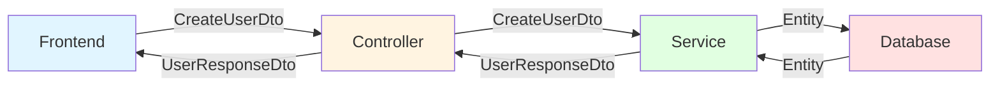

# Design Pattern : DTO (Data Transfer Object)

## 1. Introduction

### Objectifs du cours
Après ce cours, vous serez capable de :
- Comprendre le pattern DTO et son rôle dans les architectures web
- Créer des contrats clairs entre Frontend et Backend
- Valider et transformer les données entre les couches
- Implémenter des DTOs avec class-validator et class-transformer
- Séparer les modèles de domaine des modèles de transport

### Scope et applications
Le pattern DTO est fondamental dans les applications web métier pour :
- Définir des contrats Front ↔ Back explicites
- Valider les données reçues du client
- Transformer les données avant de les envoyer
- Sécuriser l'application (ne pas exposer toute l'entité)
- Versionner les APIs
- Optimiser les transferts réseau

---

## 2. Définitions et concepts clés

### 2.1 Qu'est-ce qu'un DTO ?

Un **DTO (Data Transfer Object)** est un objet simple dont le seul but est de **transporter des données** entre des processus ou des couches d'application. Il ne contient **aucune logique métier**, seulement des données et éventuellement de la validation.

**Analogie de la vie quotidienne :**
Imaginez que vous envoyez un colis :
- Vous ne mettez pas tous vos meubles dans le colis (vous ne partagez pas tout)
- Vous emballez soigneusement ce que vous voulez envoyer (transformation)
- Vous mettez une étiquette avec l'adresse (métadonnées)
- Le contenu est adapté au transport (format optimisé)

De la même façon, un DTO :
- Ne contient que les données **nécessaires** pour le transfert
- Est **optimisé** pour la sérialisation (JSON)
- Peut avoir une **structure différente** du modèle interne
- Protège les **données sensibles** (pas de mot de passe, etc.)

### 2.2 Concepts clés

| Concept | Description |
|---------|-------------|
| **DTO** | Objet de transfert de données |
| **Entity** | Modèle de domaine (base de données) |
| **Mapping** | Conversion Entity ↔ DTO |
| **Validation** | Vérification des données entrantes |
| **Transformation** | Adaptation des données |
| **Serialization** | Conversion objet → JSON |

### 2.3 DTO vs Entity vs ViewModel

| Type | Rôle | Localisation | Logique |
|------|------|--------------|---------|
| **Entity** | Modèle de domaine | Backend (BDD) | Logique métier |
| **DTO** | Transport de données | Frontend ↔ Backend | Validation |
| **ViewModel** | Présentation | Frontend (UI) | Logique d'affichage |

---

## 3. Pourquoi utiliser des DTOs ?

### 3.1 Problèmes sans DTO

**❌ Problème 1 : Exposition de l'entité complète**
```typescript
// Entity (modèle de base de données)
@Entity()
export class User {
  @PrimaryGeneratedColumn()
  id: number;
  
  @Column()
  email: string;
  
  @Column()
  password: string;  // ❌ Sensible !
  
  @Column()
  salt: string;  // ❌ Sensible !
  
  @Column()
  resetToken: string | null;  // ❌ Sensible !
  
  @Column()
  createdAt: Date;
  
  @Column()
  updatedAt: Date;
  
  @Column()
  lastLoginAt: Date;
}

// Controller qui retourne l'entité directement
@Get(':id')
async getUser(@Param('id') id: number): Promise<User> {
  return this.userService.findOne(id);  // ❌ Retourne TOUT
}

// Réponse JSON exposée au client :
{
  "id": 1,
  "email": "user@example.com",
  "password": "$2b$10$abcd...",  // ❌ Mot de passe haché exposé !
  "salt": "xyz123",  // ❌ Salt exposé !
  "resetToken": "token123",  // ❌ Token exposé !
  "createdAt": "2024-01-01T00:00:00Z",
  "updatedAt": "2024-01-15T10:30:00Z",
  "lastLoginAt": "2024-01-15T10:30:00Z"
}
```

**❌ Problème 2 : Pas de validation**
```typescript
@Post()
async createUser(@Body() data: any): Promise<User> {
  // ❌ Aucune validation des données
  return this.userService.create(data);
}

// Client peut envoyer n'importe quoi :
{
  "email": "not-an-email",  // ❌ Email invalide
  "password": "123",  // ❌ Trop court
  "role": "admin",  // ❌ Élévation de privilège !
  "maliciousField": "hack"  // ❌ Champ non attendu
}
```

**❌ Problème 3 : Structure inadaptée**
```typescript
// Entity avec relations
@Entity()
export class Order {
  @PrimaryGeneratedColumn()
  id: number;
  
  @ManyToOne(() => User)
  user: User;  // ❌ Relation complète exposée
  
  @OneToMany(() => OrderItem, item => item.order)
  items: OrderItem[];  // ❌ Toute la relation chargée
  
  @Column()
  status: string;
}

// Frontend a besoin seulement de :
// - user.id et user.name (pas toute l'entité User)
// - items avec product.name et quantity (pas tout OrderItem)
```

### 3.2 Avantages des DTOs

| Avantage | Description |
|----------|-------------|
| **Sécurité** | Ne pas exposer les données sensibles |
| **Validation** | Contrôle des données entrantes |
| **Découplage** | Frontend indépendant du modèle BDD |
| **Performance** | Transfert uniquement des données nécessaires |
| **Versionning** | Multiples DTOs pour différentes versions API |
| **Clarté** | Contrat explicite Front ↔ Back |

---

## 4. Implémentation du pattern DTO

### 4.1 Structure de base



### 4.2 Exemple concret : User DTOs (NestJS)

```typescript
// 1. Entity (modèle de base de données)
import { Entity, PrimaryGeneratedColumn, Column } from 'typeorm';

@Entity()
export class User {
  @PrimaryGeneratedColumn()
  id: number;
  
  @Column({ unique: true })
  email: string;
  
  @Column()
  password: string;  // Haché
  
  @Column()
  firstName: string;
  
  @Column()
  lastName: string;
  
  @Column({ default: 'user' })
  role: string;
  
  @Column({ type: 'timestamp', default: () => 'CURRENT_TIMESTAMP' })
  createdAt: Date;
  
  @Column({ type: 'timestamp', default: () => 'CURRENT_TIMESTAMP' })
  updatedAt: Date;
}

// 2. DTO pour créer un utilisateur
import { IsEmail, IsString, MinLength, MaxLength, IsOptional } from 'class-validator';
import { ApiProperty } from '@nestjs/swagger';

export class CreateUserDto {
  @ApiProperty({ example: 'user@example.com' })
  @IsEmail({}, { message: 'Email invalide' })
  email: string;
  
  @ApiProperty({ example: 'SecurePassword123!' })
  @IsString()
  @MinLength(8, { message: 'Le mot de passe doit contenir au moins 8 caractères' })
  @MaxLength(100)
  password: string;
  
  @ApiProperty({ example: 'John' })
  @IsString()
  @MinLength(2)
  @MaxLength(50)
  firstName: string;
  
  @ApiProperty({ example: 'Doe' })
  @IsString()
  @MinLength(2)
  @MaxLength(50)
  lastName: string;
}

// 3. DTO pour mettre à jour un utilisateur
export class UpdateUserDto {
  @ApiProperty({ required: false })
  @IsOptional()
  @IsString()
  @MinLength(2)
  @MaxLength(50)
  firstName?: string;
  
  @ApiProperty({ required: false })
  @IsOptional()
  @IsString()
  @MinLength(2)
  @MaxLength(50)
  lastName?: string;
  
  // ❌ Pas de password ici (endpoint séparé pour changer le mot de passe)
  // ❌ Pas de role ici (sécurité)
}

// 4. DTO de réponse (ce qui est envoyé au client)
import { Exclude, Expose } from 'class-transformer';

export class UserResponseDto {
  @Expose()
  id: number;
  
  @Expose()
  email: string;
  
  @Expose()
  firstName: string;
  
  @Expose()
  lastName: string;
  
  @Expose()
  role: string;
  
  @Expose()
  createdAt: Date;
  
  // ❌ password n'est PAS exposé
  // ❌ updatedAt n'est PAS exposé
  
  // Propriété calculée
  @Expose()
  get fullName(): string {
    return `${this.firstName} ${this.lastName}`;
  }
}

// 5. Mapper (conversion Entity → DTO)
import { plainToClass } from 'class-transformer';

export class UserMapper {
  static toResponseDto(user: User): UserResponseDto {
    return plainToClass(UserResponseDto, user, {
      excludeExtraneousValues: true  // Exclure tout ce qui n'est pas @Expose()
    });
  }
  
  static toResponseDtoArray(users: User[]): UserResponseDto[] {
    return users.map(user => this.toResponseDto(user));
  }
}

// 6. Controller
@Controller('users')
export class UserController {
  constructor(private readonly userService: UserService) {}
  
  @Post()
  async create(@Body() createUserDto: CreateUserDto): Promise<UserResponseDto> {
    // ✅ Validation automatique grâce aux décorateurs
    const user = await this.userService.create(createUserDto);
    
    // ✅ Conversion Entity → DTO avant de retourner
    return UserMapper.toResponseDto(user);
  }
  
  @Get(':id')
  async findOne(@Param('id') id: number): Promise<UserResponseDto> {
    const user = await this.userService.findOne(id);
    
    if (!user) {
      throw new NotFoundException('User not found');
    }
    
    return UserMapper.toResponseDto(user);
  }
  
  @Get()
  async findAll(): Promise<UserResponseDto[]> {
    const users = await this.userService.findAll();
    return UserMapper.toResponseDtoArray(users);
  }
  
  @Patch(':id')
  async update(
    @Param('id') id: number,
    @Body() updateUserDto: UpdateUserDto
  ): Promise<UserResponseDto> {
    const user = await this.userService.update(id, updateUserDto);
    return UserMapper.toResponseDto(user);
  }
}

// 7. Service
@Injectable()
export class UserService {
  constructor(
    @InjectRepository(User)
    private userRepository: Repository<User>
  ) {}
  
  async create(createUserDto: CreateUserDto): Promise<User> {
    // Hash du mot de passe
    const hashedPassword = await bcrypt.hash(createUserDto.password, 10);
    
    // Création de l'entité
    const user = this.userRepository.create({
      email: createUserDto.email,
      password: hashedPassword,
      firstName: createUserDto.firstName,
      lastName: createUserDto.lastName
    });
    
    return this.userRepository.save(user);
  }
  
  async findOne(id: number): Promise<User | null> {
    return this.userRepository.findOne({ where: { id } });
  }
  
  async findAll(): Promise<User[]> {
    return this.userRepository.find();
  }
  
  async update(id: number, updateUserDto: UpdateUserDto): Promise<User> {
    await this.userRepository.update(id, updateUserDto);
    return this.findOne(id);
  }
}
```

### 4.3 Exemple : DTOs imbriqués (Order avec relations)

```typescript
// Entities
@Entity()
export class Order {
  @PrimaryGeneratedColumn()
  id: number;
  
  @ManyToOne(() => User)
  user: User;
  
  @OneToMany(() => OrderItem, item => item.order)
  items: OrderItem[];
  
  @Column()
  status: 'pending' | 'processing' | 'shipped' | 'delivered';
  
  @Column({ type: 'decimal', precision: 10, scale: 2 })
  total: number;
  
  @Column()
  createdAt: Date;
}

@Entity()
export class OrderItem {
  @PrimaryGeneratedColumn()
  id: number;
  
  @ManyToOne(() => Order, order => order.items)
  order: Order;
  
  @ManyToOne(() => Product)
  product: Product;
  
  @Column()
  quantity: number;
  
  @Column({ type: 'decimal', precision: 10, scale: 2 })
  price: number;
}

@Entity()
export class Product {
  @PrimaryGeneratedColumn()
  id: number;
  
  @Column()
  name: string;
  
  @Column({ type: 'decimal', precision: 10, scale: 2 })
  price: number;
}

// DTOs
export class CreateOrderItemDto {
  @IsNumber()
  productId: number;
  
  @IsNumber()
  @Min(1)
  quantity: number;
}

export class CreateOrderDto {
  @ValidateNested({ each: true })
  @Type(() => CreateOrderItemDto)
  @ArrayMinSize(1, { message: 'Au moins un article requis' })
  items: CreateOrderItemDto[];
}

// DTO de réponse simplifié
export class OrderItemResponseDto {
  @Expose()
  id: number;
  
  @Expose()
  productId: number;
  
  @Expose()
  productName: string;
  
  @Expose()
  quantity: number;
  
  @Expose()
  price: number;
  
  @Expose()
  get subtotal(): number {
    return this.price * this.quantity;
  }
}

export class OrderResponseDto {
  @Expose()
  id: number;
  
  @Expose()
  userId: number;
  
  @Expose()
  userEmail: string;
  
  @Expose()
  @Type(() => OrderItemResponseDto)
  items: OrderItemResponseDto[];
  
  @Expose()
  status: string;
  
  @Expose()
  total: number;
  
  @Expose()
  createdAt: Date;
}

// Mapper
export class OrderMapper {
  static toResponseDto(order: Order): OrderResponseDto {
    const dto = new OrderResponseDto();
    dto.id = order.id;
    dto.userId = order.user.id;
    dto.userEmail = order.user.email;
    dto.status = order.status;
    dto.total = order.total;
    dto.createdAt = order.createdAt;
    
    dto.items = order.items.map(item => {
      const itemDto = new OrderItemResponseDto();
      itemDto.id = item.id;
      itemDto.productId = item.product.id;
      itemDto.productName = item.product.name;
      itemDto.quantity = item.quantity;
      itemDto.price = item.price;
      return itemDto;
    });
    
    return dto;
  }
}

// Controller
@Controller('orders')
export class OrderController {
  @Post()
  async create(
    @Body() createOrderDto: CreateOrderDto,
    @CurrentUser() user: User
  ): Promise<OrderResponseDto> {
    const order = await this.orderService.create(user.id, createOrderDto);
    return OrderMapper.toResponseDto(order);
  }
  
  @Get(':id')
  async findOne(@Param('id') id: number): Promise<OrderResponseDto> {
    const order = await this.orderService.findOne(id, {
      relations: ['user', 'items', 'items.product']
    });
    
    if (!order) {
      throw new NotFoundException('Order not found');
    }
    
    return OrderMapper.toResponseDto(order);
  }
}
```

### 4.4 Exemple : DTOs côté Frontend (Angular)

```typescript
// models/user.model.ts (Entity côté frontend)
export interface User {
  id: number;
  email: string;
  firstName: string;
  lastName: string;
  role: string;
  createdAt: Date;
  fullName: string;
}

// dtos/create-user.dto.ts
export interface CreateUserDto {
  email: string;
  password: string;
  firstName: string;
  lastName: string;
}

// dtos/update-user.dto.ts
export interface UpdateUserDto {
  firstName?: string;
  lastName?: string;
}

// services/user.service.ts
@Injectable({ providedIn: 'root' })
export class UserService {
  private apiUrl = '/api/users';
  
  constructor(private http: HttpClient) {}
  
  create(dto: CreateUserDto): Observable<User> {
    // ✅ Envoi du DTO, réception de User
    return this.http.post<User>(this.apiUrl, dto);
  }
  
  update(id: number, dto: UpdateUserDto): Observable<User> {
    return this.http.patch<User>(`${this.apiUrl}/${id}`, dto);
  }
  
  findOne(id: number): Observable<User> {
    return this.http.get<User>(`${this.apiUrl}/${id}`);
  }
  
  findAll(): Observable<User[]> {
    return this.http.get<User[]>(this.apiUrl);
  }
}

// components/user-form.component.ts
@Component({
  selector: 'app-user-form',
  template: `
    <form [formGroup]="form" (ngSubmit)="onSubmit()">
      <input formControlName="email" placeholder="Email" />
      <input formControlName="password" type="password" placeholder="Password" />
      <input formControlName="firstName" placeholder="First Name" />
      <input formControlName="lastName" placeholder="Last Name" />
      <button type="submit" [disabled]="form.invalid">Create User</button>
    </form>
  `
})
export class UserFormComponent {
  form: FormGroup;
  
  constructor(
    private fb: FormBuilder,
    private userService: UserService
  ) {
    this.form = this.fb.group({
      email: ['', [Validators.required, Validators.email]],
      password: ['', [Validators.required, Validators.minLength(8)]],
      firstName: ['', [Validators.required, Validators.minLength(2)]],
      lastName: ['', [Validators.required, Validators.minLength(2)]]
    });
  }
  
  onSubmit(): void {
    if (this.form.valid) {
      const dto: CreateUserDto = this.form.value;
      
      this.userService.create(dto).subscribe({
        next: (user) => {
          console.log('User created:', user);
          // Redirection ou notification
        },
        error: (error) => {
          console.error('Error creating user:', error);
          // Afficher les erreurs
        }
      });
    }
  }
}
```

---

## 5. Erreurs courantes et comment les éviter

### 5.1 Erreurs fréquentes

| Erreur | Problème | Solution |
|--------|----------|----------|
| **Retourner l'Entity** | Exposition de données sensibles | Toujours mapper vers DTO |
| **Pas de validation** | Données invalides acceptées | Utiliser class-validator |
| **DTO trop large** | Trop de champs optionnels | DTOs spécifiques par action |
| **Mapping manuel** | Code répétitif et erreurs | Utiliser class-transformer |
| **DTO avec logique métier** | Violation du principe | DTO = données uniquement |

### 5.2 Exemples d'erreurs

**❌ Erreur 1 : Retourner l'entité directement**
```typescript
@Get(':id')
async getUser(@Param('id') id: number): Promise<User> {
  return this.userService.findOne(id);  // ❌ Retourne Entity avec password!
}
```

**✅ Correction**
```typescript
@Get(':id')
async getUser(@Param('id') id: number): Promise<UserResponseDto> {
  const user = await this.userService.findOne(id);
  return UserMapper.toResponseDto(user);  // ✅ Seulement les champs exposés
}
```

**❌ Erreur 2 : DTO unique pour tout**
```typescript
// ❌ Un seul DTO pour create, update, response
export class UserDto {
  id?: number;  // Optionnel pour create
  email?: string;  // Tout optionnel...
  password?: string;
  firstName?: string;
  lastName?: string;
  role?: string;
}
```

**✅ Correction : DTOs spécialisés**
```typescript
// ✅ DTO spécifique pour chaque action
export class CreateUserDto {
  email: string;  // Requis
  password: string;  // Requis
  firstName: string;  // Requis
  lastName: string;  // Requis
}

export class UpdateUserDto {
  firstName?: string;  // Optionnel
  lastName?: string;  // Optionnel
}

export class UserResponseDto {
  id: number;
  email: string;
  firstName: string;
  lastName: string;
  role: string;
  // Pas de password !
}
```

**❌ Erreur 3 : Logique métier dans le DTO**
```typescript
export class CreateOrderDto {
  items: OrderItemDto[];
  
  // ❌ Logique métier dans le DTO
  calculateTotal(): number {
    return this.items.reduce((sum, item) => sum + item.price * item.quantity, 0);
  }
  
  // ❌ Validation métier
  isValid(): boolean {
    return this.items.length > 0 && this.calculateTotal() > 0;
  }
}
```

**✅ Correction : Logique dans le Service**
```typescript
export class CreateOrderDto {
  items: OrderItemDto[];
  // ✅ Seulement les données
}

@Injectable()
export class OrderService {
  create(dto: CreateOrderDto): Promise<Order> {
    // ✅ Validation et calcul dans le service
    const total = this.calculateTotal(dto.items);
    this.validateOrder(dto);
    // ...
  }
  
  private calculateTotal(items: OrderItemDto[]): number {
    return items.reduce((sum, item) => sum + item.price * item.quantity, 0);
  }
  
  private validateOrder(dto: CreateOrderDto): void {
    if (dto.items.length === 0) {
      throw new BadRequestException('Order must contain at least one item');
    }
  }
}
```

---

## 6. Exercices pratiques

### Exercice 1 : Product DTOs (Facile)

Créez les DTOs pour un produit :
- `CreateProductDto` : name, description, price, categoryId
- `UpdateProductDto` : tous les champs optionnels
- `ProductResponseDto` : id, name, description, price, categoryName, createdAt
- Validations : price > 0, name non vide, etc.

### Exercice 2 : Blog DTOs avec relations (Intermédiaire)

Créez les DTOs pour un système de blog :
- `CreatePostDto` : title, content, tags[]
- `UpdatePostDto` : champs optionnels
- `PostResponseDto` : id, title, content, authorName, tags, commentCount, createdAt
- `CreateCommentDto` : content, postId
- `CommentResponseDto` : id, content, authorName, createdAt

---

## 7. Comportement senior : Recommandations et astuces

### 7.1 Quand utiliser les DTOs

**✅ Utilisez TOUJOURS les DTOs pour :**
- **Toutes les APIs** publiques
- **Validation** des données entrantes
- **Sécurité** (ne pas exposer les entités)
- **Versionning** d'API
- **Documentation** (Swagger/OpenAPI)

**❌ DTOs peuvent être optionnels pour :**
- APIs internes micro-services (selon architecture)
- Prototypes rapides (mais passer aux DTOs rapidement)

### 7.2 Astuces de développeur senior

**1. Utilisez class-validator pour validation robuste**
```typescript
export class CreateUserDto {
  @IsEmail()
  @Transform(({ value }) => value.toLowerCase())  // Normalisation
  email: string;
  
  @IsString()
  @MinLength(8)
  @MaxLength(100)
  @Matches(/^(?=.*[A-Z])(?=.*[0-9])/, {
    message: 'Le mot de passe doit contenir au moins une majuscule et un chiffre'
  })
  password: string;
  
  @IsString()
  @MinLength(2)
  @MaxLength(50)
  @Transform(({ value }) => value.trim())  // Trim automatique
  firstName: string;
}
```

**2. Versionning d'API avec DTOs**
```typescript
// v1/dtos/user.dto.ts
export class UserResponseDtoV1 {
  id: number;
  email: string;
  name: string;  // Un seul champ "name"
}

// v2/dtos/user.dto.ts
export class UserResponseDtoV2 {
  id: number;
  email: string;
  firstName: string;  // Séparé en firstName/lastName
  lastName: string;
}

// Controller
@Controller('v1/users')
export class UserControllerV1 {
  @Get(':id')
  async getUser(@Param('id') id: number): Promise<UserResponseDtoV1> {
    const user = await this.userService.findOne(id);
    return UserMapperV1.toDto(user);
  }
}

@Controller('v2/users')
export class UserControllerV2 {
  @Get(':id')
  async getUser(@Param('id') id: number): Promise<UserResponseDtoV2> {
    const user = await this.userService.findOne(id);
    return UserMapperV2.toDto(user);
  }
}
```

**3. DTOs partiels avec PartialType**
```typescript
import { PartialType, OmitType, PickType } from '@nestjs/mapped-types';

// DTO de base
export class CreateUserDto {
  email: string;
  password: string;
  firstName: string;
  lastName: string;
}

// Tous les champs optionnels
export class UpdateUserDto extends PartialType(CreateUserDto) {}

// Omit : exclure certains champs
export class UpdateUserWithoutEmailDto extends OmitType(CreateUserDto, ['email']) {}

// Pick : garder seulement certains champs
export class UpdateUserNameDto extends PickType(CreateUserDto, ['firstName', 'lastName']) {}
```

**4. Pagination DTO réutilisable**
```typescript
export class PaginationDto {
  @IsOptional()
  @Type(() => Number)
  @IsInt()
  @Min(1)
  page?: number = 1;
  
  @IsOptional()
  @Type(() => Number)
  @IsInt()
  @Min(1)
  @Max(100)
  limit?: number = 10;
  
  @IsOptional()
  @IsString()
  sort?: string;
  
  @IsOptional()
  @IsEnum(['asc', 'desc'])
  order?: 'asc' | 'desc' = 'asc';
}

export class PaginatedResponseDto<T> {
  data: T[];
  total: number;
  page: number;
  limit: number;
  totalPages: number;
}

// Utilisation
@Get()
async findAll(
  @Query() pagination: PaginationDto
): Promise<PaginatedResponseDto<UserResponseDto>> {
  const [users, total] = await this.userService.findAll(pagination);
  
  return {
    data: UserMapper.toResponseDtoArray(users),
    total,
    page: pagination.page,
    limit: pagination.limit,
    totalPages: Math.ceil(total / pagination.limit)
  };
}
```

### 7.3 Best practices

| Pratique | Description |
|----------|-------------|
| **1 DTO = 1 action** | CreateDto, UpdateDto, ResponseDto séparés |
| **Validation stricte** | Utiliser class-validator partout |
| **Mapping systématique** | Toujours mapper Entity → DTO |
| **Documentation** | Utiliser @ApiProperty pour Swagger |
| **Immutabilité** | DTOs en readonly quand possible |
| **Nommage clair** | Suffixe Dto explicite |

---

## 8. Résumé

### Points clés à retenir

Le pattern **DTO** permet de :
- ✅ **Sécuriser** l'application (ne pas exposer les entités)
- ✅ **Valider** les données entrantes
- ✅ Définir des **contrats clairs** Front ↔ Back
- ✅ **Découpler** le modèle de domaine de l'API
- ✅ **Optimiser** les transferts réseau
- ✅ **Versionner** les APIs facilement

### Structure

**DTO = Contrat de données**
- Entrée : CreateDto, UpdateDto (validation)
- Sortie : ResponseDto (sécurité)
- Mapping : Entity ↔ DTO

### Quand l'utiliser

**✅ TOUJOURS** pour :
- APIs publiques
- Validation de données
- Sécurité
- Documentation

**❌ Optionnel** pour :
- APIs internes (selon contexte)
- Prototypes (mais passer aux DTOs rapidement)

### Template de base

```typescript
// Create DTO
export class CreateEntityDto {
  @IsString()
  field1: string;
  
  @IsNumber()
  field2: number;
}

// Update DTO
export class UpdateEntityDto extends PartialType(CreateEntityDto) {}

// Response DTO
export class EntityResponseDto {
  @Expose()
  id: number;
  
  @Expose()
  field1: string;
  
  @Expose()
  field2: number;
  
  // Pas de champs sensibles
}

// Mapper
export class EntityMapper {
  static toResponseDto(entity: Entity): EntityResponseDto {
    return plainToClass(EntityResponseDto, entity, {
      excludeExtraneousValues: true
    });
  }
}

// Controller
@Post()
async create(@Body() dto: CreateEntityDto): Promise<EntityResponseDto> {
  const entity = await this.service.create(dto);
  return EntityMapper.toResponseDto(entity);
}
```

---

## 9. Ressources complémentaires

### Français
- 📚 [NestJS - Validation](https://docs.nestjs.com/techniques/validation)
- 📖 [class-validator Documentation](https://github.com/typestack/class-validator)
- 📖 [class-transformer Documentation](https://github.com/typestack/class-transformer)

### Anglais
- 📚 [Martin Fowler - DTO](https://martinfowler.com/eaaCatalog/dataTransferObject.html)
- 🎥 [NestJS DTOs Tutorial](https://www.youtube.com/watch?v=9S5Kly3uj_g)
- 📖 [Clean Architecture - DTOs](https://blog.cleancoder.com/uncle-bob/2012/08/13/the-clean-architecture.html)

### Documentation
- [NestJS - Mapped Types](https://docs.nestjs.com/openapi/mapped-types)
- [NestJS - Swagger](https://docs.nestjs.com/openapi/introduction)
- [TypeORM - Entities](https://typeorm.io/entities)

---

**En une phrase :**

> Le pattern DTO définit des contrats clairs entre Frontend et Backend en créant des objets de transfert validés et sécurisés, séparant le modèle de domaine de l'API et protégeant les données sensibles dans les applications web métier.
