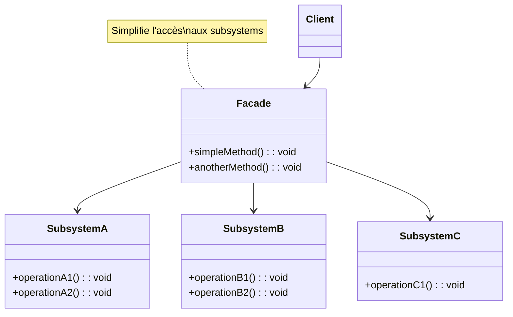

# Design Pattern : Facade

## 1. Introduction

### Objectifs du cours
Après ce cours, vous serez capable de :
- Comprendre le pattern Facade et son utilité
- Simplifier des API complexes avec une facade
- Créer des wrappers de services propres
- Masquer la complexité interne d'un système
- Améliorer l'utilisabilité et la maintenabilité du code

### Scope et applications
Le pattern Facade est très utilisé dans les applications web, particulièrement pour :
- **Wrappers de librairies tierces** (Angular Material, RxJS, Axios)
- **API simplifiées** pour systèmes complexes
- **Services Angular** qui agrègent plusieurs services
- **Couche de services** dans l'architecture
- **Abstraction** de logique complexe (paiement, auth, email)

---

## 2. Définitions et concepts clés

### 2.1 Qu'est-ce que le pattern Facade ?

Le **Facade** est un pattern structurel qui fournit une **interface simplifiée** à un ensemble complexe de classes, bibliothèques ou frameworks. Il cache la complexité du système derrière une interface claire et facile à utiliser.

**Analogie de la vie quotidienne :**
Imaginez un **réceptionniste d'hôtel** :
- Vous voulez organiser votre séjour : chambre, restaurant, spa, excursions
- Au lieu de contacter **chaque service séparément** (réservation, cuisine, spa, agence)
- Vous parlez au **réceptionniste** (facade) qui coordonne tout
- Le réceptionniste connaît tous les **sous-systèmes** et sait comment les utiliser
- Vous avez une **interface simple** : une seule personne à contacter
- Le réceptionniste **cache la complexité** des interactions internes

De la même façon en programmation :
- **Facade** : Interface simplifiée pour le client
- **Subsystems** : Classes complexes sous-jacentes
- **Simplification** : Une méthode facade = plusieurs appels internes
- **Découplage** : Client ne connaît que la facade

### 2.2 Concepts clés

| Concept | Description |
|---------|-------------|
| **Facade** | Interface simplifiée vers un système complexe |
| **Subsystems** | Classes complexes utilisées en interne |
| **Simplification** | Réduit le nombre d'appels nécessaires |
| **Découplage** | Client ne dépend que de la facade |
| **Agrégation** | Combine plusieurs opérations |

### 2.3 Structure du Facade



---

## 3. Pourquoi utiliser le pattern Facade ?

### 3.1 Problèmes sans Facade

**❌ Problème 1 : Code client complexe**
```typescript
// ❌ Client doit connaître tous les sous-systèmes
class CheckoutComponent {
  constructor(
    private cartService: CartService,
    private inventoryService: InventoryService,
    private paymentGateway: PaymentGateway,
    private orderService: OrderService,
    private emailService: EmailService,
    private loyaltyService: LoyaltyService,
    private invoiceService: InvoiceService
  ) {}
  
  async checkout(): Promise<void> {
    // ❌ Le client doit orchestrer 7 services !
    const cart = this.cartService.getCart();
    
    // Vérifier stock
    for (const item of cart.items) {
      const available = await this.inventoryService.checkStock(item.productId);
      if (!available) {
        throw new Error(`Product ${item.productId} out of stock`);
      }
    }
    
    // Réserver stock
    for (const item of cart.items) {
      await this.inventoryService.reserveStock(item.productId, item.quantity);
    }
    
    // Paiement
    const amount = cart.total;
    const payment = await this.paymentGateway.charge(amount);
    
    if (!payment.success) {
      // Libérer stock
      for (const item of cart.items) {
        await this.inventoryService.releaseStock(item.productId, item.quantity);
      }
      throw new Error('Payment failed');
    }
    
    // Créer commande
    const order = await this.orderService.create({
      items: cart.items,
      total: amount,
      paymentId: payment.id
    });
    
    // Points de fidélité
    const points = Math.floor(amount / 10);
    await this.loyaltyService.addPoints(order.userId, points);
    
    // Facture
    await this.invoiceService.generate(order.id);
    
    // Email
    await this.emailService.sendOrderConfirmation(order.userId, order.id);
    
    // Vider panier
    this.cartService.clear();
  }
  
  // ❌ Problèmes :
  // - Code très complexe et long
  // - Couplage fort avec 7 services
  // - Difficile à tester
  // - Gestion d'erreurs compliquée
  // - Logique dupliquée si utilisée ailleurs
}
```

**❌ Problème 2 : Duplication de code**
```typescript
// ❌ Même orchestration répétée partout
class AdminOrderComponent {
  async createManualOrder(): Promise<void> {
    // Même code que checkout...
    const cart = this.cartService.getCart();
    // Vérifier stock...
    // Réserver stock...
    // Paiement...
    // Etc. (code dupliqué)
  }
}

class ApiOrderController {
  async createOrder(): Promise<void> {
    // Encore la même orchestration...
  }
}
```

**❌ Problème 3 : Changements difficiles**
```typescript
// ❌ Si on change un service, tous les clients doivent changer
// Exemple : PaymentGateway change d'API
class OldPaymentGateway {
  charge(amount: number): Promise<Payment> { /* ... */ }
}

class NewPaymentGateway {
  processPayment(request: PaymentRequest): Promise<PaymentResult> { /* ... */ }
}

// ❌ Il faut modifier TOUS les endroits qui utilisent PaymentGateway !
```

### 3.2 Avantages du Facade

| Avantage | Description |
|----------|-------------|
| **Simplicité** | Interface simple pour système complexe |
| **Découplage** | Client ne connaît que la facade |
| **Maintenabilité** | Changements isolés dans la facade |
| **Réutilisabilité** | Logique centralisée |
| **Testabilité** | Facile à mocker la facade |
| **Abstraction** | Cache détails d'implémentation |

---

## 4. Implémentation du pattern Facade

### 4.1 Facade simple en TypeScript

```typescript
// Sous-systèmes complexes
class InventoryService {
  checkStock(productId: number, quantity: number): boolean {
    console.log(`Checking stock for product ${productId}`);
    return true;
  }
  
  reserveStock(productId: number, quantity: number): void {
    console.log(`Reserving ${quantity} units of product ${productId}`);
  }
  
  releaseStock(productId: number, quantity: number): void {
    console.log(`Releasing ${quantity} units of product ${productId}`);
  }
}

class PaymentService {
  processPayment(amount: number, method: string): Promise<PaymentResult> {
    console.log(`Processing payment: €${amount} via ${method}`);
    return Promise.resolve({
      success: true,
      transactionId: 'TXN123',
      amount
    });
  }
}

class OrderService {
  createOrder(order: OrderData): Promise<Order> {
    console.log('Creating order:', order);
    return Promise.resolve({
      id: 1,
      ...order,
      status: 'pending'
    });
  }
}

class EmailService {
  sendConfirmation(email: string, orderId: number): Promise<void> {
    console.log(`Sending confirmation to ${email} for order ${orderId}`);
    return Promise.resolve();
  }
}

// Facade qui simplifie tout
class CheckoutFacade {
  constructor(
    private inventory: InventoryService,
    private payment: PaymentService,
    private orders: OrderService,
    private email: EmailService
  ) {}
  
  async checkout(cart: Cart, userEmail: string): Promise<CheckoutResult> {
    console.log('=== Starting checkout ===');
    
    try {
      // 1. Vérifier stock
      for (const item of cart.items) {
        const available = this.inventory.checkStock(item.productId, item.quantity);
        if (!available) {
          return {
            success: false,
            error: `Product ${item.productId} out of stock`
          };
        }
      }
      
      // 2. Réserver stock
      for (const item of cart.items) {
        this.inventory.reserveStock(item.productId, item.quantity);
      }
      
      // 3. Paiement
      const paymentResult = await this.payment.processPayment(cart.total, 'card');
      
      if (!paymentResult.success) {
        // Rollback stock
        for (const item of cart.items) {
          this.inventory.releaseStock(item.productId, item.quantity);
        }
        return {
          success: false,
          error: 'Payment failed'
        };
      }
      
      // 4. Créer commande
      const order = await this.orders.createOrder({
        items: cart.items,
        total: cart.total,
        transactionId: paymentResult.transactionId
      });
      
      // 5. Envoyer email
      await this.email.sendConfirmation(userEmail, order.id);
      
      console.log('=== Checkout completed ===');
      
      return {
        success: true,
        orderId: order.id
      };
      
    } catch (error) {
      console.error('Checkout failed:', error);
      return {
        success: false,
        error: 'An error occurred during checkout'
      };
    }
  }
}

// Types
interface Cart {
  items: CartItem[];
  total: number;
}

interface CartItem {
  productId: number;
  quantity: number;
  price: number;
}

interface OrderData {
  items: CartItem[];
  total: number;
  transactionId: string;
}

interface Order extends OrderData {
  id: number;
  status: string;
}

interface PaymentResult {
  success: boolean;
  transactionId: string;
  amount: number;
}

interface CheckoutResult {
  success: boolean;
  orderId?: number;
  error?: string;
}

// Utilisation - BEAUCOUP plus simple !
const facade = new CheckoutFacade(
  new InventoryService(),
  new PaymentService(),
  new OrderService(),
  new EmailService()
);

const cart: Cart = {
  items: [
    { productId: 1, quantity: 2, price: 10 },
    { productId: 2, quantity: 1, price: 20 }
  ],
  total: 40
};

const result = await facade.checkout(cart, 'user@example.com');
console.log('Checkout result:', result);
// ✅ Une seule méthode au lieu de 10+ appels !
```

### 4.2 Facade Angular pour API externe

```typescript
// Facade pour l'API GitHub (simplifie les appels)
@Injectable({ providedIn: 'root' })
export class GitHubFacade {
  private readonly API_URL = 'https://api.github.com';
  
  constructor(private http: HttpClient) {}
  
  // Méthode simple qui cache la complexité
  getUserWithStats(username: string): Observable<UserStats> {
    // En interne : 3 appels API différents
    return forkJoin({
      user: this.getUser(username),
      repos: this.getRepositories(username),
      followers: this.getFollowers(username)
    }).pipe(
      map(({ user, repos, followers }) => ({
        username: user.login,
        name: user.name,
        avatar: user.avatar_url,
        bio: user.bio,
        totalRepos: repos.length,
        totalStars: repos.reduce((sum, repo) => sum + repo.stargazers_count, 0),
        totalForks: repos.reduce((sum, repo) => sum + repo.forks_count, 0),
        followerCount: followers.length,
        topLanguages: this.extractTopLanguages(repos)
      }))
    );
  }
  
  // Méthodes privées pour les appels API
  private getUser(username: string): Observable<GitHubUser> {
    return this.http.get<GitHubUser>(`${this.API_URL}/users/${username}`);
  }
  
  private getRepositories(username: string): Observable<GitHubRepo[]> {
    return this.http.get<GitHubRepo[]>(`${this.API_URL}/users/${username}/repos`);
  }
  
  private getFollowers(username: string): Observable<GitHubUser[]> {
    return this.http.get<GitHubUser[]>(`${this.API_URL}/users/${username}/followers`);
  }
  
  private extractTopLanguages(repos: GitHubRepo[]): string[] {
    const languages = repos
      .map(repo => repo.language)
      .filter(lang => lang !== null);
    
    const counts = new Map<string, number>();
    languages.forEach(lang => {
      counts.set(lang, (counts.get(lang) || 0) + 1);
    });
    
    return Array.from(counts.entries())
      .sort((a, b) => b[1] - a[1])
      .slice(0, 3)
      .map(([lang]) => lang);
  }
}

interface UserStats {
  username: string;
  name: string;
  avatar: string;
  bio: string;
  totalRepos: number;
  totalStars: number;
  totalForks: number;
  followerCount: number;
  topLanguages: string[];
}

interface GitHubUser {
  login: string;
  name: string;
  avatar_url: string;
  bio: string;
}

interface GitHubRepo {
  name: string;
  stargazers_count: number;
  forks_count: number;
  language: string | null;
}

// Utilisation dans un composant
@Component({
  selector: 'app-github-profile',
  template: `
    <div *ngIf="stats$ | async as stats">
      
      <h1>{{ stats.name }} (@{{ stats.username }})</h1>
      <p>{{ stats.bio }}</p>
      <div>
        <span>Repos: {{ stats.totalRepos }}</span>
        <span>Stars: {{ stats.totalStars }}</span>
        <span>Followers: {{ stats.followerCount }}</span>
      </div>
      <div>Top languages: {{ stats.topLanguages.join(', ') }}</div>
    </div>
  `
})
export class GitHubProfileComponent implements OnInit {
  stats$: Observable<UserStats>;
  
  constructor(private githubFacade: GitHubFacade) {}
  
  ngOnInit(): void {
    // ✅ Une seule méthode simple !
    this.stats$ = this.githubFacade.getUserWithStats('octocat');
  }
}
```

### 4.3 Facade NestJS pour système de paiement

```typescript
// Services sous-jacents
@Injectable()
export class StripeService {
  async charge(amount: number, token: string): Promise<StripeCharge> {
    console.log(`Stripe: Charging ${amount} with token ${token}`);
    return { id: 'ch_123', amount, status: 'succeeded' };
  }
}

@Injectable()
export class PayPalService {
  async createPayment(amount: number): Promise<PayPalPayment> {
    console.log(`PayPal: Creating payment for ${amount}`);
    return { id: 'pp_123', amount, approvalUrl: 'https://paypal.com/approve' };
  }
  
  async executePayment(paymentId: string, payerId: string): Promise<boolean> {
    console.log(`PayPal: Executing payment ${paymentId}`);
    return true;
  }
}

@Injectable()
export class BankTransferService {
  async initiate(amount: number, iban: string): Promise<BankTransfer> {
    console.log(`Bank: Initiating transfer of ${amount} to ${iban}`);
    return { id: 'bt_123', amount, status: 'pending' };
  }
}

// Facade qui unifie tous les moyens de paiement
@Injectable()
export class PaymentFacade {
  constructor(
    private stripe: StripeService,
    private paypal: PayPalService,
    private bankTransfer: BankTransferService
  ) {}
  
  // Interface unifiée pour tous les paiements
  async processPayment(request: PaymentRequest): Promise<PaymentResponse> {
    console.log(`Processing payment via ${request.method}`);
    
    try {
      switch (request.method) {
        case 'card':
          return await this.processCardPayment(request);
        
        case 'paypal':
          return await this.processPayPalPayment(request);
        
        case 'bank_transfer':
          return await this.processBankTransfer(request);
        
        default:
          throw new Error(`Unsupported payment method: ${request.method}`);
      }
    } catch (error) {
      console.error('Payment failed:', error);
      return {
        success: false,
        error: error.message
      };
    }
  }
  
  private async processCardPayment(request: PaymentRequest): Promise<PaymentResponse> {
    const charge = await this.stripe.charge(request.amount, request.token);
    
    return {
      success: charge.status === 'succeeded',
      transactionId: charge.id,
      amount: charge.amount
    };
  }
  
  private async processPayPalPayment(request: PaymentRequest): Promise<PaymentResponse> {
    if (!request.payerId) {
      // Créer paiement
      const payment = await this.paypal.createPayment(request.amount);
      return {
        success: false,
        requiresApproval: true,
        approvalUrl: payment.approvalUrl,
        paymentId: payment.id
      };
    } else {
      // Exécuter paiement
      const success = await this.paypal.executePayment(request.paymentId, request.payerId);
      return {
        success,
        transactionId: request.paymentId,
        amount: request.amount
      };
    }
  }
  
  private async processBankTransfer(request: PaymentRequest): Promise<PaymentResponse> {
    const transfer = await this.bankTransfer.initiate(request.amount, request.iban);
    
    return {
      success: true,
      transactionId: transfer.id,
      amount: transfer.amount,
      status: 'pending'
    };
  }
}

interface PaymentRequest {
  method: 'card' | 'paypal' | 'bank_transfer';
  amount: number;
  token?: string;
  paymentId?: string;
  payerId?: string;
  iban?: string;
}

interface PaymentResponse {
  success: boolean;
  transactionId?: string;
  amount?: number;
  error?: string;
  requiresApproval?: boolean;
  approvalUrl?: string;
  paymentId?: string;
  status?: string;
}

// Controller utilise la facade
@Controller('payments')
export class PaymentsController {
  constructor(private paymentFacade: PaymentFacade) {}
  
  @Post()
  async createPayment(@Body() request: PaymentRequest): Promise<PaymentResponse> {
    // ✅ Interface simple et uniforme !
    return this.paymentFacade.processPayment(request);
  }
}
```

### 4.4 Facade pour wrapper de librairie tierce

```typescript
// Wrapper Angular Material avec Facade
@Injectable({ providedIn: 'root' })
export class NotificationFacade {
  constructor(
    private snackBar: MatSnackBar,
    private dialog: MatDialog
  ) {}
  
  // Méthodes simplifiées
  success(message: string): void {
    this.snackBar.open(message, 'OK', {
      duration: 3000,
      horizontalPosition: 'right',
      verticalPosition: 'top',
      panelClass: ['success-snackbar']
    });
  }
  
  error(message: string): void {
    this.snackBar.open(message, 'Close', {
      duration: 5000,
      horizontalPosition: 'right',
      verticalPosition: 'top',
      panelClass: ['error-snackbar']
    });
  }
  
  info(message: string): void {
    this.snackBar.open(message, 'OK', {
      duration: 3000,
      horizontalPosition: 'right',
      verticalPosition: 'top',
      panelClass: ['info-snackbar']
    });
  }
  
  confirm(title: string, message: string): Observable<boolean> {
    const dialogRef = this.dialog.open(ConfirmDialogComponent, {
      width: '400px',
      data: { title, message }
    });
    
    return dialogRef.afterClosed().pipe(
      map(result => result === true)
    );
  }
  
  loading(message: string = 'Loading...'): MatDialogRef<LoadingDialogComponent> {
    return this.dialog.open(LoadingDialogComponent, {
      width: '300px',
      disableClose: true,
      data: { message }
    });
  }
}

// Utilisation dans composants
@Component({ /* ... */ })
export class UserComponent {
  constructor(private notifications: NotificationFacade) {}
  
  saveUser(): void {
    const loading = this.notifications.loading('Saving user...');
    
    this.userService.save(this.user).subscribe({
      next: () => {
        loading.close();
        this.notifications.success('User saved successfully!');
      },
      error: (error) => {
        loading.close();
        this.notifications.error('Failed to save user');
      }
    });
  }
  
  deleteUser(): void {
    this.notifications.confirm(
      'Delete User',
      'Are you sure you want to delete this user?'
    ).subscribe(confirmed => {
      if (confirmed) {
        this.userService.delete(this.user.id).subscribe();
      }
    });
  }
}
```

---

## 5. Erreurs courantes et comment les éviter

### 5.1 Erreurs fréquentes

| Erreur | Problème | Solution |
|--------|----------|----------|
| **Facade trop complexe** | Devient difficile à maintenir | Diviser en plusieurs facades |
| **Logique métier dans facade** | Violation SRP | Déléguer aux services |
| **Facade accède aux facades** | Couplage indirect | Accéder directement aux services |
| **Pas de gestion d'erreurs** | Erreurs non catchées | try/catch, rollback |
| **Tests insuffisants** | Bugs cachés | Tester scenarios complets |

### 5.2 Exemples d'erreurs

**❌ Erreur 1 : Logique métier dans la facade**
```typescript
// ❌ Facade fait trop de logique
class OrderFacade {
  async createOrder(cart: Cart): Promise<Order> {
    // ❌ Calcul de prix dans la facade
    let total = 0;
    for (const item of cart.items) {
      const product = await this.productService.get(item.productId);
      total += product.price * item.quantity;
    }
    
    // ❌ Logique de réduction dans la facade
    if (total > 100) {
      total *= 0.9;  // 10% discount
    }
    
    return this.orderService.create({ total, items: cart.items });
  }
}
```

**✅ Correction : Déléguer aux services**
```typescript
class OrderFacade {
  async createOrder(cart: Cart): Promise<Order> {
    // ✅ Déléguer le calcul au service approprié
    const total = await this.pricingService.calculateTotal(cart);
    
    // ✅ Juste orchestrer
    return this.orderService.create({ total, items: cart.items });
  }
}

class PricingService {
  async calculateTotal(cart: Cart): Promise<number> {
    let total = 0;
    for (const item of cart.items) {
      const product = await this.productService.get(item.productId);
      total += product.price * item.quantity;
    }
    
    // Appliquer réductions
    return this.discountService.apply(total);
  }
}
```

---

## 6. Exercices pratiques

### Exercice 1 : Email Facade (Facile)

Créez une facade qui simplifie l'envoi d'emails via plusieurs providers (SendGrid, Mailgun, SMTP) avec une interface unifiée.

### Exercice 2 : Storage Facade (Intermédiaire)

Créez une facade qui unifie localStorage, sessionStorage et IndexedDB avec des méthodes simples : `set()`, `get()`, `remove()`, `clear()`.

---

## 7. Comportement senior : Recommandations et astuces

### 7.1 Quand utiliser Facade

**✅ Utilisez Facade quand :**
- **Système complexe** avec beaucoup de sous-systèmes
- **Librairie tierce** complexe à utiliser
- **Orchestration** de plusieurs services
- **API simplifiée** pour cas d'usage fréquents
- **Découplage** nécessaire

**❌ N'utilisez PAS Facade quand :**
- Système déjà simple
- Perte de flexibilité importante
- Over-engineering

### 7.2 Best practices

| Pratique | Description |
|----------|-------------|
| **Interface claire** | Méthodes simples et intuitives |
| **Pas de logique métier** | Juste orchestration |
| **Gestion d'erreurs** | Centraliser error handling |
| **Documentation** | Expliquer ce qui est caché |
| **Tests** | Tester scenarios complets |

---

## 8. Résumé

**Le pattern Facade** permet de :
- ✅ **Simplifier** l'accès à des systèmes complexes
- ✅ **Découpler** clients des sous-systèmes
- ✅ **Centraliser** l'orchestration
- ✅ **Améliorer** l'utilisabilité
- ✅ **Wrapper** des librairies tierces

### Quand l'utiliser

**✅ OUI** pour :
- Wrappers de librairies
- Orchestration de services
- API simplifiées
- Abstraction de complexité

**❌ NON** pour :
- Système déjà simple
- Sur-abstraction
- Over-engineering

---

## 9. Ressources complémentaires

### Français
- 📚 [Refactoring Guru - Facade](https://refactoring.guru/fr/design-patterns/facade)

### Anglais
- 📚 [Facade Pattern](https://sbcode.net/typescript/facade/)
- 🎥 [Facade Pattern Explained](https://www.youtube.com/watch?v=K4FkHVO5iac)

---

**En une phrase :**

> Le pattern Facade fournit une interface simplifiée à un ensemble complexe de classes ou systèmes, massivement utilisé dans les webapps pour wrapper des librairies tierces, orchestrer plusieurs services et créer des API simplifiées pour les cas d'usage courants.
