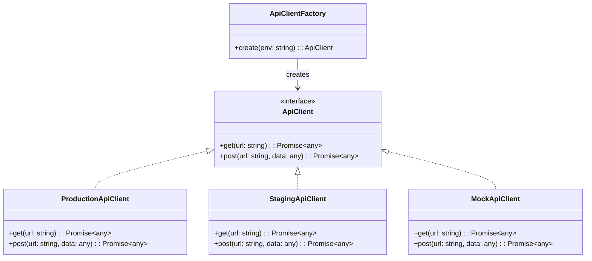

# Design Pattern : Factory

## 1. Introduction

### Objectifs du cours
Après ce cours, vous serez capable de :
- Comprendre le pattern Factory et Factory Method
- Créer des objets sans spécifier leurs classes exactes
- Implémenter des factories pour des services API selon l'environnement
- Gérer la création d'objets complexes de façon centralisée
- Distinguer entre Simple Factory, Factory Method et Abstract Factory

### Scope et applications
Le pattern Factory est essentiel dans les applications web métier pour :
- Créer des services API selon l'environnement (dev, staging, production)
- Instancier différents types de validateurs ou processeurs
- Générer des composants UI selon le contexte
- Créer des stratégies de paiement ou d'authentification
- Abstraire la logique de création d'objets complexes

---

## 2. Définitions et concepts clés

### 2.1 Qu'est-ce que le pattern Factory ?

Le **Factory** est un pattern de création qui fournit une **interface pour créer des objets** sans spécifier leur classe concrète. La décision de quel objet créer est déléguée aux sous-classes ou à une méthode de fabrique.

**Analogie de la vie quotidienne :**
Imaginez une usine de véhicules. Quand vous commandez un véhicule, vous ne dites pas : "Je veux un objet avec 4 roues, un moteur essence de 150cv, une carrosserie berline...". Vous dites simplement : "Je veux une voiture de type berline". L'usine (la factory) sait comment construire cette voiture selon vos spécifications.

De la même façon, dans le code, au lieu de faire `new CarImpl()`, vous appelez `vehicleFactory.create('sedan')` et la factory décide quelle classe instancier.

### 2.2 Concepts clés

| Concept | Description |
|---------|-------------|
| **Factory** | Classe responsable de créer des objets |
| **Product** | Interface commune des objets créés |
| **Concrete Product** | Implémentation spécifique du produit |
| **Creator** | Classe qui déclare la factory method |
| **Encapsulation** | La logique de création est cachée |

### 2.3 Types de Factory

| Type | Description | Utilisation |
|------|-------------|-------------|
| **Simple Factory** | Méthode statique qui crée des objets | Cas simples, peu de variations |
| **Factory Method** | Méthode virtuelle surchargée par sous-classes | Délégation aux sous-classes |
| **Abstract Factory** | Famille de factories liées | Création de familles d'objets |

---

## 3. Pourquoi utiliser le pattern Factory ?

### 3.1 Problèmes sans Factory

**❌ Problème 1 : Couplage fort avec les classes concrètes**
```typescript
// Service dépend directement des implémentations
class UserService {
  private apiClient: ApiClient;
  
  constructor() {
    if (environment === 'production') {
      this.apiClient = new ProductionApiClient(); // ❌ Couplage fort
    } else if (environment === 'staging') {
      this.apiClient = new StagingApiClient(); // ❌ Couplage fort
    } else {
      this.apiClient = new MockApiClient(); // ❌ Couplage fort
    }
  }
}
```

**❌ Problème 2 : Logique de création dispersée**
```typescript
// Création dupliquée dans plusieurs endroits
class ComponentA {
  constructor() {
    this.logger = new ConsoleLogger(); // ❌ Duplication
  }
}

class ComponentB {
  constructor() {
    this.logger = new ConsoleLogger(); // ❌ Duplication
  }
}

// Si on veut changer de logger → modifier partout !
```

**❌ Problème 3 : Difficile à tester**
```typescript
class OrderService {
  constructor() {
    this.paymentProcessor = new StripePaymentProcessor(); // ❌ Impossible de mocker
  }
  
  processOrder(order: Order): void {
    this.paymentProcessor.charge(order.total);
  }
}

// Impossible de tester sans vraiment appeler Stripe!
```

### 3.2 Avantages du Factory

| Avantage | Description |
|----------|-------------|
| **Découplage** | Code client indépendant des classes concrètes |
| **Centralisation** | Logique de création en un seul endroit |
| **Testabilité** | Facile d'injecter des mocks |
| **Flexibilité** | Changement d'implémentation sans modifier le client |
| **Single Responsibility** | Création séparée de l'utilisation |
| **Open/Closed** | Ajout de nouveaux types sans modifier le code existant |

---

## 4. Implémentation du pattern Factory

### 4.1 Simple Factory

La forme la plus simple : une méthode statique qui crée des objets.



**✅ Implémentation Simple Factory**
```typescript
// 1. Interface commune (Product)
interface ApiClient {
  get(url: string): Promise<any>;
  post(url: string, data: any): Promise<any>;
  put(url: string, data: any): Promise<any>;
  delete(url: string): Promise<any>;
}

// 2. Implémentations concrètes (Concrete Products)
class ProductionApiClient implements ApiClient {
  private baseUrl = 'https://api.production.com';
  
  async get(url: string): Promise<any> {
    console.log(`[PROD] GET ${this.baseUrl}${url}`);
    const response = await fetch(`${this.baseUrl}${url}`);
    return response.json();
  }
  
  async post(url: string, data: any): Promise<any> {
    console.log(`[PROD] POST ${this.baseUrl}${url}`);
    const response = await fetch(`${this.baseUrl}${url}`, {
      method: 'POST',
      body: JSON.stringify(data),
      headers: { 'Content-Type': 'application/json' }
    });
    return response.json();
  }
  
  async put(url: string, data: any): Promise<any> {
    console.log(`[PROD] PUT ${this.baseUrl}${url}`);
    // Implémentation...
    return {};
  }
  
  async delete(url: string): Promise<any> {
    console.log(`[PROD] DELETE ${this.baseUrl}${url}`);
    // Implémentation...
    return {};
  }
}

class StagingApiClient implements ApiClient {
  private baseUrl = 'https://api.staging.com';
  
  async get(url: string): Promise<any> {
    console.log(`[STAGING] GET ${this.baseUrl}${url}`);
    // Implémentation similaire avec logs plus détaillés
    return {};
  }
  
  async post(url: string, data: any): Promise<any> {
    console.log(`[STAGING] POST ${this.baseUrl}${url}`, data);
    return {};
  }
  
  async put(url: string, data: any): Promise<any> {
    console.log(`[STAGING] PUT ${this.baseUrl}${url}`, data);
    return {};
  }
  
  async delete(url: string): Promise<any> {
    console.log(`[STAGING] DELETE ${this.baseUrl}${url}`);
    return {};
  }
}

class MockApiClient implements ApiClient {
  private mockData: Record<string, any> = {
    '/users': [{ id: 1, name: 'John Doe' }],
    '/products': [{ id: 1, name: 'Product 1', price: 99 }]
  };
  
  async get(url: string): Promise<any> {
    console.log(`[MOCK] GET ${url}`);
    return this.mockData[url] || [];
  }
  
  async post(url: string, data: any): Promise<any> {
    console.log(`[MOCK] POST ${url}`, data);
    return { success: true, data };
  }
  
  async put(url: string, data: any): Promise<any> {
    console.log(`[MOCK] PUT ${url}`, data);
    return { success: true, data };
  }
  
  async delete(url: string): Promise<any> {
    console.log(`[MOCK] DELETE ${url}`);
    return { success: true };
  }
}

// 3. Factory (Simple Factory)
class ApiClientFactory {
  static create(environment: 'production' | 'staging' | 'development' | 'test'): ApiClient {
    switch (environment) {
      case 'production':
        return new ProductionApiClient();
      case 'staging':
        return new StagingApiClient();
      case 'development':
      case 'test':
        return new MockApiClient();
      default:
        throw new Error(`Unknown environment: ${environment}`);
    }
  }
}

// 4. Utilisation
class UserService {
  private apiClient: ApiClient;
  
  constructor(environment: string) {
    // ✅ Pas de dépendance aux classes concrètes
    this.apiClient = ApiClientFactory.create(environment as any);
  }
  
  async getUsers(): Promise<User[]> {
    return this.apiClient.get('/users');
  }
  
  async createUser(user: CreateUserDto): Promise<User> {
    return this.apiClient.post('/users', user);
  }
}

// Utilisation selon l'environnement
const env = process.env.NODE_ENV || 'development';
const userService = new UserService(env);
```

### 4.2 Factory Method

Version plus avancée où les sous-classes décident quelle classe instancier.

```typescript
// 1. Product interface
interface Logger {
  log(message: string): void;
  error(message: string): void;
  warn(message: string): void;
}

// 2. Concrete Products
class ConsoleLogger implements Logger {
  log(message: string): void {
    console.log(`[LOG] ${message}`);
  }
  
  error(message: string): void {
    console.error(`[ERROR] ${message}`);
  }
  
  warn(message: string): void {
    console.warn(`[WARN] ${message}`);
  }
}

class FileLogger implements Logger {
  constructor(private filePath: string) {}
  
  log(message: string): void {
    // Écrire dans un fichier
    this.writeToFile(`[LOG] ${message}`);
  }
  
  error(message: string): void {
    this.writeToFile(`[ERROR] ${message}`);
  }
  
  warn(message: string): void {
    this.writeToFile(`[WARN] ${message}`);
  }
  
  private writeToFile(message: string): void {
    // Logique d'écriture dans fichier
    console.log(`Writing to ${this.filePath}: ${message}`);
  }
}

class CloudLogger implements Logger {
  constructor(private apiKey: string) {}
  
  log(message: string): void {
    this.sendToCloud('info', message);
  }
  
  error(message: string): void {
    this.sendToCloud('error', message);
  }
  
  warn(message: string): void {
    this.sendToCloud('warning', message);
  }
  
  private sendToCloud(level: string, message: string): void {
    // Envoyer vers service cloud (CloudWatch, DataDog, etc.)
    console.log(`Sending to cloud [${level}]: ${message}`);
  }
}

// 3. Creator (avec Factory Method abstraite)
abstract class Application {
  // Factory Method - à implémenter par les sous-classes
  protected abstract createLogger(): Logger;
  
  run(): void {
    const logger = this.createLogger(); // ✅ Utilise la factory method
    logger.log('Application started');
    
    try {
      this.executeBusinessLogic();
    } catch (error) {
      logger.error(`Error: ${error}`);
    }
  }
  
  protected executeBusinessLogic(): void {
    // Logique métier...
  }
}

// 4. Concrete Creators
class DevelopmentApplication extends Application {
  protected createLogger(): Logger {
    return new ConsoleLogger(); // ✅ Création spécifique
  }
}

class ProductionApplication extends Application {
  protected createLogger(): Logger {
    return new CloudLogger(process.env.CLOUD_API_KEY!);
  }
}

class TestApplication extends Application {
  protected createLogger(): Logger {
    return new FileLogger('/tmp/test.log');
  }
}

// 5. Utilisation
let app: Application;

if (process.env.NODE_ENV === 'production') {
  app = new ProductionApplication();
} else if (process.env.NODE_ENV === 'test') {
  app = new TestApplication();
} else {
  app = new DevelopmentApplication();
}

app.run();
```

### 4.3 Exemple concret : Validators Factory (Angular)

```typescript
// Validators pour différents types de champs
interface FieldValidator {
  validate(value: any): boolean;
  getErrorMessage(): string;
}

class EmailValidator implements FieldValidator {
  private emailRegex = /^[^\s@]+@[^\s@]+\.[^\s@]+$/;
  
  validate(value: string): boolean {
    return this.emailRegex.test(value);
  }
  
  getErrorMessage(): string {
    return 'Email invalide';
  }
}

class PhoneValidator implements FieldValidator {
  private phoneRegex = /^[0-9]{10}$/;
  
  validate(value: string): boolean {
    return this.phoneRegex.test(value);
  }
  
  getErrorMessage(): string {
    return 'Numéro de téléphone invalide (10 chiffres requis)';
  }
}

class PasswordValidator implements FieldValidator {
  private minLength = 8;
  
  validate(value: string): boolean {
    if (value.length < this.minLength) return false;
    if (!/[A-Z]/.test(value)) return false; // Au moins une majuscule
    if (!/[0-9]/.test(value)) return false; // Au moins un chiffre
    return true;
  }
  
  getErrorMessage(): string {
    return 'Mot de passe invalide (min 8 caractères, 1 majuscule, 1 chiffre)';
  }
}

class SiretValidator implements FieldValidator {
  validate(value: string): boolean {
    // Validation du SIRET (14 chiffres + algorithme de Luhn)
    if (!/^[0-9]{14}$/.test(value)) return false;
    return this.luhnCheck(value);
  }
  
  getErrorMessage(): string {
    return 'Numéro SIRET invalide';
  }
  
  private luhnCheck(value: string): boolean {
    // Algorithme de Luhn
    let sum = 0;
    let isEven = false;
    
    for (let i = value.length - 1; i >= 0; i--) {
      let digit = parseInt(value[i]);
      
      if (isEven) {
        digit *= 2;
        if (digit > 9) digit -= 9;
      }
      
      sum += digit;
      isEven = !isEven;
    }
    
    return sum % 10 === 0;
  }
}

// Factory pour créer les validateurs
class ValidatorFactory {
  static create(type: string): FieldValidator {
    switch (type) {
      case 'email':
        return new EmailValidator();
      case 'phone':
        return new PhoneValidator();
      case 'password':
        return new PasswordValidator();
      case 'siret':
        return new SiretValidator();
      default:
        throw new Error(`Unknown validator type: ${type}`);
    }
  }
  
  // Version améliorée avec Map pour extensibilité
  private static validators = new Map<string, () => FieldValidator>([
    ['email', () => new EmailValidator()],
    ['phone', () => new PhoneValidator()],
    ['password', () => new PasswordValidator()],
    ['siret', () => new SiretValidator()]
  ]);
  
  static createFromMap(type: string): FieldValidator {
    const creator = this.validators.get(type);
    if (!creator) {
      throw new Error(`Unknown validator type: ${type}`);
    }
    return creator();
  }
  
  // Enregistrer un nouveau validator (Open/Closed principle)
  static register(type: string, creator: () => FieldValidator): void {
    this.validators.set(type, creator);
  }
}

// Utilisation dans un composant Angular
@Component({
  selector: 'app-registration-form',
  template: `
    <form [formGroup]="form" (ngSubmit)="onSubmit()">
      <input formControlName="email" placeholder="Email">
      <div *ngIf="errors.email">{{ errors.email }}</div>
      
      <input formControlName="phone" placeholder="Téléphone">
      <div *ngIf="errors.phone">{{ errors.phone }}</div>
      
      <input type="password" formControlName="password" placeholder="Mot de passe">
      <div *ngIf="errors.password">{{ errors.password }}</div>
      
      <button type="submit">S'inscrire</button>
    </form>
  `
})
export class RegistrationFormComponent {
  form: FormGroup;
  errors: Record<string, string> = {};
  
  constructor(private fb: FormBuilder) {
    this.form = this.fb.group({
      email: [''],
      phone: [''],
      password: ['']
    });
  }
  
  onSubmit(): void {
    this.errors = {};
    
    // Utilisation de la factory pour créer les validateurs
    const emailValidator = ValidatorFactory.create('email');
    const phoneValidator = ValidatorFactory.create('phone');
    const passwordValidator = ValidatorFactory.create('password');
    
    // Validation
    if (!emailValidator.validate(this.form.value.email)) {
      this.errors.email = emailValidator.getErrorMessage();
    }
    
    if (!phoneValidator.validate(this.form.value.phone)) {
      this.errors.phone = phoneValidator.getErrorMessage();
    }
    
    if (!passwordValidator.validate(this.form.value.password)) {
      this.errors.password = passwordValidator.getErrorMessage();
    }
    
    if (Object.keys(this.errors).length === 0) {
      // Formulaire valide
      console.log('Form valid', this.form.value);
    }
  }
}
```

### 4.4 Exemple : Payment Processor Factory (NestJS)

```typescript
// Interface commune pour les processeurs de paiement
interface PaymentProcessor {
  processPayment(amount: number, currency: string): Promise<PaymentResult>;
  processRefund(transactionId: string, amount: number): Promise<RefundResult>;
}

interface PaymentResult {
  success: boolean;
  transactionId: string;
  message: string;
}

interface RefundResult {
  success: boolean;
  refundId: string;
  message: string;
}

// Implémentations concrètes
class StripePaymentProcessor implements PaymentProcessor {
  constructor(private apiKey: string) {}
  
  async processPayment(amount: number, currency: string): Promise<PaymentResult> {
    console.log(`[Stripe] Processing payment: ${amount} ${currency}`);
    // Logique Stripe
    return {
      success: true,
      transactionId: `stripe_${Date.now()}`,
      message: 'Payment processed via Stripe'
    };
  }
  
  async processRefund(transactionId: string, amount: number): Promise<RefundResult> {
    console.log(`[Stripe] Processing refund: ${transactionId}`);
    return {
      success: true,
      refundId: `refund_${Date.now()}`,
      message: 'Refund processed via Stripe'
    };
  }
}

class PayPalPaymentProcessor implements PaymentProcessor {
  constructor(
    private clientId: string,
    private clientSecret: string
  ) {}
  
  async processPayment(amount: number, currency: string): Promise<PaymentResult> {
    console.log(`[PayPal] Processing payment: ${amount} ${currency}`);
    // Logique PayPal
    return {
      success: true,
      transactionId: `paypal_${Date.now()}`,
      message: 'Payment processed via PayPal'
    };
  }
  
  async processRefund(transactionId: string, amount: number): Promise<RefundResult> {
    console.log(`[PayPal] Processing refund: ${transactionId}`);
    return {
      success: true,
      refundId: `pp_refund_${Date.now()}`,
      message: 'Refund processed via PayPal'
    };
  }
}

class MockPaymentProcessor implements PaymentProcessor {
  async processPayment(amount: number, currency: string): Promise<PaymentResult> {
    console.log(`[MOCK] Processing payment: ${amount} ${currency}`);
    return {
      success: true,
      transactionId: `mock_${Date.now()}`,
      message: 'Mock payment processed'
    };
  }
  
  async processRefund(transactionId: string, amount: number): Promise<RefundResult> {
    console.log(`[MOCK] Processing refund: ${transactionId}`);
    return {
      success: true,
      refundId: `mock_refund_${Date.now()}`,
      message: 'Mock refund processed'
    };
  }
}

// Factory
@Injectable()
export class PaymentProcessorFactory {
  create(provider: 'stripe' | 'paypal' | 'mock'): PaymentProcessor {
    switch (provider) {
      case 'stripe':
        return new StripePaymentProcessor(process.env.STRIPE_API_KEY!);
      case 'paypal':
        return new PayPalPaymentProcessor(
          process.env.PAYPAL_CLIENT_ID!,
          process.env.PAYPAL_CLIENT_SECRET!
        );
      case 'mock':
        return new MockPaymentProcessor();
      default:
        throw new Error(`Unknown payment provider: ${provider}`);
    }
  }
}

// Service utilisant la factory
@Injectable()
export class OrderService {
  constructor(private paymentFactory: PaymentProcessorFactory) {}
  
  async processOrder(order: Order): Promise<void> {
    // Déterminer le provider selon l'utilisateur
    const provider = this.getPaymentProvider(order.user);
    
    // Créer le processeur via la factory
    const processor = this.paymentFactory.create(provider);
    
    // Traiter le paiement
    const result = await processor.processPayment(order.total, order.currency);
    
    if (result.success) {
      await this.saveOrder(order, result.transactionId);
    } else {
      throw new Error('Payment failed');
    }
  }
  
  private getPaymentProvider(user: User): 'stripe' | 'paypal' | 'mock' {
    // Logique pour déterminer le provider
    if (process.env.NODE_ENV === 'test') {
      return 'mock';
    }
    return user.preferredPaymentMethod === 'paypal' ? 'paypal' : 'stripe';
  }
  
  private async saveOrder(order: Order, transactionId: string): Promise<void> {
    // Sauvegarder la commande
  }
}
```

---

## 5. Erreurs courantes et comment les éviter

### 5.1 Erreurs fréquentes

| Erreur | Problème | Solution |
|--------|----------|----------|
| **Factory trop complexe** | Switch avec 20+ cas | Utiliser Map ou registry |
| **Pas d'interface** | Retour de types différents | Définir interface commune |
| **Factory Stateful** | État dans la factory | Factory stateless, état dans les produits |
| **Pas de gestion d'erreurs** | Type inconnu → crash | Valider type et lancer exception claire |
| **Sur-utilisation** | Factory pour objets simples | Utiliser constructeur direct |

### 5.2 Exemples d'erreurs

**❌ Erreur 1 : Switch trop long**
```typescript
class NotificationFactory {
  create(type: string): Notification {
    switch (type) {
      case 'email': return new EmailNotification();
      case 'sms': return new SmsNotification();
      case 'push': return new PushNotification();
      case 'slack': return new SlackNotification();
      case 'teams': return new TeamsNotification();
      case 'discord': return new DiscordNotification();
      // ... 15 autres cas
      default: throw new Error('Unknown type');
    }
  }
}
```

**✅ Correction : Registry pattern**
```typescript
class NotificationFactory {
  private registry = new Map<string, () => Notification>([
    ['email', () => new EmailNotification()],
    ['sms', () => new SmsNotification()],
    ['push', () => new PushNotification()],
    ['slack', () => new SlackNotification()],
    ['teams', () => new TeamsNotification()],
    ['discord', () => new DiscordNotification()]
  ]);
  
  create(type: string): Notification {
    const creator = this.registry.get(type);
    if (!creator) {
      throw new Error(`Unknown notification type: ${type}`);
    }
    return creator();
  }
  
  // Permettre l'ajout de nouveaux types (Open/Closed)
  register(type: string, creator: () => Notification): void {
    this.registry.set(type, creator);
  }
}
```

**❌ Erreur 2 : Pas d'interface commune**
```typescript
class VehicleFactory {
  create(type: string) {  // ❌ Pas de type de retour
    if (type === 'car') {
      return new Car();  // A drive() method
    } else {
      return new Boat();  // A sail() method
    }
  }
}

const vehicle = factory.create('car');
vehicle.drive();  // ❌ TypeScript ne sait pas si drive() existe
```

**✅ Correction**
```typescript
interface Vehicle {
  move(): void;
}

class Car implements Vehicle {
  move(): void {
    console.log('Driving...');
  }
}

class Boat implements Vehicle {
  move(): void {
    console.log('Sailing...');
  }
}

class VehicleFactory {
  create(type: 'car' | 'boat'): Vehicle {  // ✅ Type de retour clair
    switch (type) {
      case 'car': return new Car();
      case 'boat': return new Boat();
    }
  }
}

const vehicle = factory.create('car');
vehicle.move();  // ✅ TypeScript sait que move() existe
```

**❌ Erreur 3 : Factory avec état**
```typescript
class DatabaseFactory {
  private lastCreated: Database | null = null;  // ❌ État partagé
  
  create(type: string): Database {
    const db = type === 'postgres' ? new PostgresDB() : new MongoDb();
    this.lastCreated = db;  // ❌ Effet de bord
    return db;
  }
  
  getLastCreated(): Database | null {
    return this.lastCreated;  // ❌ État global
  }
}
```

**✅ Correction : Factory stateless**
```typescript
class DatabaseFactory {
  create(type: string): Database {
    return type === 'postgres' ? new PostgresDB() : new MongoDb();
  }
}

// Si besoin de tracking, le faire ailleurs
class DatabaseManager {
  private databases: Database[] = [];
  
  createAndTrack(type: string): Database {
    const db = DatabaseFactory.create(type);
    this.databases.push(db);
    return db;
  }
}
```

---

## 6. Exercices pratiques

### Exercice 1 : Report Generator Factory (Facile)

Créez une factory pour générer différents types de rapports :
- PDF Report
- Excel Report
- CSV Report
- HTML Report

Chaque rapport doit implémenter l'interface :
```typescript
interface Report {
  generate(data: any[]): string;
  getExtension(): string;
}
```

### Exercice 2 : Authentication Strategy Factory (Intermédiaire)

Créez une factory pour différentes stratégies d'authentification :
- JWT Authentication
- OAuth2 Authentication
- API Key Authentication
- Basic Authentication

Interface commune :
```typescript
interface AuthStrategy {
  authenticate(credentials: any): Promise<User | null>;
  validateToken(token: string): Promise<boolean>;
}
```

---

## 7. Comportement senior : Recommandations et astuces

### 7.1 Quand utiliser Factory

**✅ Utilisez Factory quand :**
- La classe à instancier dépend du **contexte** (environnement, config, user)
- Vous avez plusieurs **implémentations** d'une même interface
- La **logique de création** est complexe
- Vous voulez **découpler** le code client des classes concrètes
- Vous devez respecter **Open/Closed** principle

**❌ N'utilisez PAS Factory quand :**
- Objet simple avec `new` suffit
- Une seule implémentation qui ne changera pas
- Sur-engineering pour des cas triviaux

### 7.2 Astuces de développeur senior

**1. Combinez Factory avec Dependency Injection**
```typescript
// NestJS
@Module({
  providers: [
    {
      provide: 'API_CLIENT',
      useFactory: (configService: ConfigService) => {
        const env = configService.get('NODE_ENV');
        return ApiClientFactory.create(env);
      },
      inject: [ConfigService]
    }
  ]
})
export class AppModule {}
```

**2. Utilisez Registry pour l'extensibilité**
```typescript
class PluginFactory {
  private static plugins = new Map<string, new () => Plugin>();
  
  static register(name: string, pluginClass: new () => Plugin): void {
    this.plugins.set(name, pluginClass);
  }
  
  static create(name: string): Plugin {
    const PluginClass = this.plugins.get(name);
    if (!PluginClass) {
      throw new Error(`Plugin ${name} not found`);
    }
    return new PluginClass();
  }
}

// Les plugins peuvent s'auto-enregistrer
PluginFactory.register('analytics', AnalyticsPlugin);
PluginFactory.register('logging', LoggingPlugin);
```

**3. Factory avec configuration**
```typescript
class EmailServiceFactory {
  static create(config: EmailConfig): EmailService {
    const { provider, apiKey, fromEmail } = config;
    
    switch (provider) {
      case 'sendgrid':
        return new SendGridEmailService(apiKey, fromEmail);
      case 'mailgun':
        return new MailgunEmailService(apiKey, fromEmail);
      default:
        throw new Error(`Unknown provider: ${provider}`);
    }
  }
}
```

**4. Lazy Loading avec Factory**
```typescript
class ComponentFactory {
  private cache = new Map<string, any>();
  
  async create(componentName: string): Promise<Component> {
    if (this.cache.has(componentName)) {
      return this.cache.get(componentName);
    }
    
    // Lazy loading du composant
    const component = await this.loadComponent(componentName);
    this.cache.set(componentName, component);
    return component;
  }
  
  private async loadComponent(name: string): Promise<Component> {
    const module = await import(`./components/${name}`);
    return new module.default();
  }
}
```

### 7.3 Best practices

| Pratique | Description |
|----------|-------------|
| **Interface commune** | Tous les produits implémentent la même interface |
| **Stateless factory** | Pas d'état dans la factory |
| **Gestion d'erreurs** | Exceptions claires pour types inconnus |
| **Registry pattern** | Pour éviter les longs switch |
| **Documentation** | JSDoc indiquant les types disponibles |
| **Tests** | Tester tous les chemins de création |

---

## 8. Résumé

### Points clés à retenir

Le pattern **Factory** permet de :
- ✅ **Découpler** le code client des classes concrètes
- ✅ **Centraliser** la logique de création
- ✅ Respecter **Open/Closed** principle
- ✅ Faciliter les **tests** (injection de mocks)
- ✅ Gérer différents **environnements** (dev, staging, prod)

### Types de Factory

| Type | Quand l'utiliser |
|------|------------------|
| **Simple Factory** | Cas simples, méthode statique suffit |
| **Factory Method** | Délégation aux sous-classes |
| **Abstract Factory** | Familles d'objets liés |

### Quand l'utiliser

**✅ OUI** pour :
- Services API selon environnement
- Stratégies de paiement/authentification
- Validators, parsers, formatters
- Logique de création complexe

**❌ NON** pour :
- Objets simples (new suffit)
- Une seule implémentation
- Sur-engineering

### Template de base

```typescript
// 1. Interface
interface Product {
  operation(): void;
}

// 2. Implémentations
class ConcreteProductA implements Product {
  operation(): void { }
}

class ConcreteProductB implements Product {
  operation(): void { }
}

// 3. Factory
class ProductFactory {
  static create(type: string): Product {
    switch (type) {
      case 'A': return new ConcreteProductA();
      case 'B': return new ConcreteProductB();
      default: throw new Error(`Unknown type: ${type}`);
    }
  }
}

// 4. Utilisation
const product = ProductFactory.create('A');
product.operation();
```

---

## 9. Ressources complémentaires

### Français
- 📚 [Refactoring Guru - Factory](https://refactoring.guru/fr/design-patterns/factory-method)
- 📚 [Refactoring Guru - Abstract Factory](https://refactoring.guru/fr/design-patterns/abstract-factory)
- 🎥 [Grafikart - Factory Pattern](https://grafikart.fr/tutoriels/factory-1067)

### Anglais
- 📚 [TypeScript Design Patterns - Factory](https://sbcode.net/typescript/factory/)
- 🎥 [Factory Pattern - Fireship](https://www.youtube.com/watch?v=EcFVTgRHJLM)
- 📖 [Gang of Four - Design Patterns](https://en.wikipedia.org/wiki/Design_Patterns)

### Documentation
- [NestJS - Custom Providers](https://docs.nestjs.com/fundamentals/custom-providers)
- [Angular - Dependency Injection](https://angular.io/guide/dependency-injection)
- [TypeScript - Advanced Types](https://www.typescriptlang.org/docs/handbook/2/types-from-types.html)

---

**En une phrase :**

> Le pattern Factory permet de créer des objets sans spécifier leur classe concrète, centralisant la logique de création et facilitant la gestion de multiples implémentations selon le contexte (environnement, configuration, type d'utilisateur).
