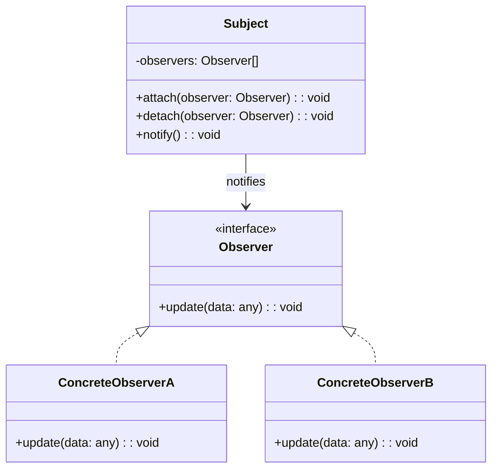

# Design Pattern : Observer

## 1. Introduction

### Objectifs du cours
Après ce cours, vous serez capable de :
- Comprendre le pattern Observer et sa relation avec RxJS
- Implémenter des systèmes de notification et d'événements
- Utiliser les Observables, Subjects et BehaviorSubjects d'RxJS
- Créer des flux de données réactifs dans Angular
- Gérer les événements UI et les mises à jour en temps réel

### Scope et applications
Le pattern Observer est au cœur des applications web modernes, particulièrement pour :
- Streaming d'événements UI (clicks, inputs, scrolls)
- Mise à jour automatique de l'interface (data binding)
- Communication entre composants Angular
- WebSockets et Server-Sent Events
- Gestion d'état réactive (state management)
- Notifications en temps réel

---

## 2. Définitions et concepts clés

### 2.1 Qu'est-ce que le pattern Observer ?

Le **Observer** est un pattern comportemental qui définit une **relation de dépendance un-à-plusieurs** entre objets : quand un objet change d'état, tous ses **observateurs** sont automatiquement **notifiés** et mis à jour.

**Analogie de la vie quotidienne :**
Imaginez que vous êtes abonné à une chaîne YouTube. Vous êtes un **observateur** de cette chaîne :
- Quand une nouvelle vidéo est publiée (changement d'état), vous recevez une **notification**
- Vous pouvez **vous désabonner** à tout moment
- La chaîne ne sait pas combien d'abonnés elle a ni qui ils sont exactement
- Chaque abonné reçoit la même notification mais peut réagir différemment

De la même façon en programmation :
- **Subject** (chaîne YouTube) : objet qui émet des événements
- **Observers** (abonnés) : objets qui écoutent ces événements
- **Notification** : événement envoyé aux observateurs
- **Subscribe** : s'abonner pour recevoir les notifications
- **Unsubscribe** : se désabonner

### 2.2 Concepts clés

| Concept | Description |
|---------|-------------|
| **Subject** | Objet qui émet des événements (Observable) |
| **Observer** | Objet qui écoute les événements |
| **Subscribe** | S'abonner pour recevoir les notifications |
| **Unsubscribe** | Se désabonner pour ne plus recevoir |
| **Notification** | Message envoyé aux observateurs |
| **Push-based** | Les données sont "poussées" vers les observateurs |

### 2.3 Observer vs RxJS

| Aspect | Pattern Observer classique | RxJS (Reactive Extensions) |
|--------|---------------------------|----------------------------|
| **Implémentation** | Manuelle (listes d'observateurs) | Bibliothèque robuste |
| **Opérateurs** | Aucun | Nombreux (map, filter, debounce...) |
| **Gestion erreurs** | Manuelle | Intégrée (catchError) |
| **Completion** | Pas de concept | Stream peut se terminer |
| **Utilisation** | Simple, éducatif | Production, Angular |

---

## 3. Pourquoi utiliser le pattern Observer ?

### 3.1 Problèmes sans Observer

**❌ Problème 1 : Polling (vérification répétée)**
```typescript
// ❌ Vérifier régulièrement si des données ont changé
class Dashboard {
  private data: any;
  
  constructor(private dataService: DataService) {
    // Polling toutes les secondes
    setInterval(() => {
      const newData = this.dataService.getData();
      if (newData !== this.data) {
        this.data = newData;
        this.updateUI();
      }
    }, 1000);
  }
}

// ❌ Problèmes :
// - Gaspillage de ressources (vérifications inutiles)
// - Délai de 1 seconde maximum
// - Pas scalable
```

**❌ Problème 2 : Couplage fort**
```typescript
// ❌ Service appelle directement les composants
class UserService {
  private dashboard: Dashboard;
  private userList: UserList;
  private notification: NotificationComponent;
  
  updateUser(user: User): void {
    // Sauvegarder
    this.saveUser(user);
    
    // ❌ Appels directs = couplage fort
    this.dashboard.refresh();
    this.userList.updateUser(user);
    this.notification.show('User updated');
  }
}

// ❌ Problèmes :
// - UserService connaît tous les composants
// - Impossible d'ajouter un nouveau composant sans modifier UserService
// - Difficile à tester
```

**❌ Problème 3 : État partagé mutable**
```typescript
// ❌ État global mutable
let currentUser: User | null = null;

class ComponentA {
  checkUser(): void {
    if (currentUser) {
      this.render(currentUser);
    }
  }
}

class ComponentB {
  updateUser(): void {
    currentUser = { ...currentUser, name: 'New Name' };
    // ❌ Comment notifier ComponentA du changement ?
  }
}
```

### 3.2 Avantages de l'Observer

| Avantage | Description |
|----------|-------------|
| **Découplage** | Subject ne connaît pas les observers |
| **Dynamique** | Ajout/suppression d'observers à l'exécution |
| **Réactivité** | Mise à jour automatique et immédiate |
| **Scalabilité** | Peut gérer de nombreux observers |
| **Open/Closed** | Nouveaux observers sans modifier le subject |
| **Real-time** | Idéal pour les mises à jour en temps réel |

---

## 4. Implémentation du pattern Observer

### 4.1 Structure de base (Pattern classique)



### 4.2 Implémentation classique en TypeScript

```typescript
// 1. Interface Observer
interface Observer<T> {
  update(data: T): void;
}

// 2. Interface Subject
interface Subject<T> {
  attach(observer: Observer<T>): void;
  detach(observer: Observer<T>): void;
  notify(data: T): void;
}

// 3. Implémentation Subject
class EventEmitter<T> implements Subject<T> {
  private observers: Observer<T>[] = [];
  
  attach(observer: Observer<T>): void {
    const isExist = this.observers.includes(observer);
    if (!isExist) {
      this.observers.push(observer);
      console.log('Observer attached');
    }
  }
  
  detach(observer: Observer<T>): void {
    const index = this.observers.indexOf(observer);
    if (index !== -1) {
      this.observers.splice(index, 1);
      console.log('Observer detached');
    }
  }
  
  notify(data: T): void {
    console.log(`Notifying ${this.observers.length} observers`);
    for (const observer of this.observers) {
      observer.update(data);
    }
  }
}

// 4. Concrete Observers
class DashboardObserver implements Observer<User> {
  update(user: User): void {
    console.log('[Dashboard] User updated:', user.name);
    this.refreshDashboard(user);
  }
  
  private refreshDashboard(user: User): void {
    // Mettre à jour l'interface
  }
}

class NotificationObserver implements Observer<User> {
  update(user: User): void {
    console.log('[Notification] Showing notification for:', user.name);
    this.showNotification(`User ${user.name} updated`);
  }
  
  private showNotification(message: string): void {
    // Afficher notification
  }
}

class LoggerObserver implements Observer<User> {
  update(user: User): void {
    console.log('[Logger] Logging user update:', user);
    this.logToFile(user);
  }
  
  private logToFile(user: User): void {
    // Logger dans un fichier
  }
}

// 5. Utilisation
class UserService {
  private userUpdated = new EventEmitter<User>();
  
  // Permettre aux observers de s'abonner
  onUserUpdated(): Subject<User> {
    return this.userUpdated;
  }
  
  updateUser(user: User): void {
    // Logique de mise à jour
    console.log('Updating user in database...');
    
    // Notifier tous les observers
    this.userUpdated.notify(user);
  }
}

// Utilisation
const userService = new UserService();

// Créer les observers
const dashboard = new DashboardObserver();
const notification = new NotificationObserver();
const logger = new LoggerObserver();

// S'abonner
const subject = userService.onUserUpdated();
subject.attach(dashboard);
subject.attach(notification);
subject.attach(logger);

// Mettre à jour un utilisateur
userService.updateUser({ id: 1, name: 'John Doe', email: 'john@example.com' });
// Output:
// Updating user in database...
// Notifying 3 observers
// [Dashboard] User updated: John Doe
// [Notification] Showing notification for: John Doe
// [Logger] Logging user update: { id: 1, name: 'John Doe', ... }

// Se désabonner
subject.detach(logger);

interface User {
  id: number;
  name: string;
  email: string;
}
```

### 4.3 RxJS : Observer pattern moderne

RxJS est l'implémentation la plus utilisée de l'Observer pattern dans le monde Angular.

```typescript
import { Observable, Subject, BehaviorSubject, ReplaySubject } from 'rxjs';

// 1. Observable simple (valeurs émises dans le temps)
const observable$ = new Observable<number>(subscriber => {
  subscriber.next(1);
  subscriber.next(2);
  subscriber.next(3);
  
  setTimeout(() => {
    subscriber.next(4);
    subscriber.complete();  // Fin du stream
  }, 1000);
});

// S'abonner
const subscription = observable$.subscribe({
  next: (value) => console.log('Received:', value),
  error: (error) => console.error('Error:', error),
  complete: () => console.log('Complete!')
});

// Se désabonner
subscription.unsubscribe();

// 2. Subject (peut émettre et être observé)
const userUpdated$ = new Subject<User>();

// Plusieurs observateurs
userUpdated$.subscribe(user => console.log('[Observer 1]', user.name));
userUpdated$.subscribe(user => console.log('[Observer 2]', user.name));

// Émettre une valeur
userUpdated$.next({ id: 1, name: 'Alice', email: 'alice@example.com' });
// Output:
// [Observer 1] Alice
// [Observer 2] Alice

// 3. BehaviorSubject (garde la dernière valeur)
const currentUser$ = new BehaviorSubject<User | null>(null);

// Premier abonné reçoit la valeur initiale (null)
currentUser$.subscribe(user => console.log('[Sub 1]', user));  // null

// Émettre une nouvelle valeur
currentUser$.next({ id: 1, name: 'Bob', email: 'bob@example.com' });
// [Sub 1] { id: 1, name: 'Bob', ... }

// Nouvel abonné reçoit immédiatement la dernière valeur
currentUser$.subscribe(user => console.log('[Sub 2]', user));
// [Sub 2] { id: 1, name: 'Bob', ... }

// 4. ReplaySubject (garde N dernières valeurs)
const messages$ = new ReplaySubject<string>(3);  // Garde les 3 dernières

messages$.next('Message 1');
messages$.next('Message 2');
messages$.next('Message 3');
messages$.next('Message 4');

// Nouvel abonné reçoit les 3 dernières
messages$.subscribe(msg => console.log(msg));
// Output:
// Message 2
// Message 3
// Message 4
```

### 4.4 Exemple : State Management avec BehaviorSubject (Angular)

```typescript
// Service de gestion d'état pour un panier d'achat
@Injectable({ providedIn: 'root' })
export class CartService {
  // État privé (BehaviorSubject)
  private cartItems$ = new BehaviorSubject<CartItem[]>([]);
  
  // Exposition publique en lecture seule (Observable)
  readonly items$ = this.cartItems$.asObservable();
  
  // Valeur dérivée : total
  readonly total$ = this.items$.pipe(
    map(items => items.reduce((sum, item) => sum + item.price * item.quantity, 0))
  );
  
  // Valeur dérivée : nombre d'articles
  readonly itemCount$ = this.items$.pipe(
    map(items => items.reduce((count, item) => count + item.quantity, 0))
  );
  
  addItem(product: Product): void {
    const currentItems = this.cartItems$.value;
    const existingItem = currentItems.find(item => item.productId === product.id);
    
    if (existingItem) {
      // Incrémenter quantité
      const updatedItems = currentItems.map(item =>
        item.productId === product.id
          ? { ...item, quantity: item.quantity + 1 }
          : item
      );
      this.cartItems$.next(updatedItems);
    } else {
      // Ajouter nouveau item
      const newItem: CartItem = {
        productId: product.id,
        name: product.name,
        price: product.price,
        quantity: 1
      };
      this.cartItems$.next([...currentItems, newItem]);
    }
  }
  
  removeItem(productId: number): void {
    const currentItems = this.cartItems$.value;
    const updatedItems = currentItems.filter(item => item.productId !== productId);
    this.cartItems$.next(updatedItems);
  }
  
  updateQuantity(productId: number, quantity: number): void {
    if (quantity <= 0) {
      this.removeItem(productId);
      return;
    }
    
    const currentItems = this.cartItems$.value;
    const updatedItems = currentItems.map(item =>
      item.productId === productId
        ? { ...item, quantity }
        : item
    );
    this.cartItems$.next(updatedItems);
  }
  
  clear(): void {
    this.cartItems$.next([]);
  }
}

interface CartItem {
  productId: number;
  name: string;
  price: number;
  quantity: number;
}

interface Product {
  id: number;
  name: string;
  price: number;
}

// Composant qui observe le panier
@Component({
  selector: 'app-cart',
  template: `
    <div class="cart">
      <h2>Shopping Cart ({{ itemCount$ | async }} items)</h2>
      
      <div *ngFor="let item of items$ | async" class="cart-item">
        <span>{{ item.name }}</span>
        <span>€{{ item.price }}</span>
        <input
          type="number"
          [value]="item.quantity"
          (change)="updateQuantity(item.productId, $event)"
        />
        <button (click)="removeItem(item.productId)">Remove</button>
      </div>
      
      <div class="cart-total">
        <strong>Total: €{{ total$ | async }}</strong>
      </div>
      
      <button (click)="clearCart()">Clear Cart</button>
    </div>
  `
})
export class CartComponent {
  // Exposition des observables pour le template
  items$ = this.cartService.items$;
  total$ = this.cartService.total$;
  itemCount$ = this.cartService.itemCount$;
  
  constructor(private cartService: CartService) {}
  
  updateQuantity(productId: number, event: Event): void {
    const quantity = parseInt((event.target as HTMLInputElement).value);
    this.cartService.updateQuantity(productId, quantity);
  }
  
  removeItem(productId: number): void {
    this.cartService.removeItem(productId);
  }
  
  clearCart(): void {
    this.cartService.clear();
  }
}

// Autre composant qui affiche le compteur dans le header
@Component({
  selector: 'app-header',
  template: `
    <header>
      <nav>
        <a routerLink="/">Home</a>
        <a routerLink="/cart">
          Cart ({{ itemCount$ | async }})
        </a>
      </nav>
    </header>
  `
})
export class HeaderComponent {
  itemCount$ = this.cartService.itemCount$;
  
  constructor(private cartService: CartService) {}
}

// ✅ Les deux composants sont automatiquement mis à jour
// ✅ Pas de couplage entre composants
// ✅ État centralisé et cohérent
```

### 4.5 Exemple : Communication entre composants

```typescript
// Service de communication
@Injectable({ providedIn: 'root' })
export class MessageService {
  private messageSource$ = new Subject<Message>();
  
  // Observable public
  readonly messages$ = this.messageSource$.asObservable();
  
  sendMessage(message: Message): void {
    this.messageSource$.next(message);
  }
}

interface Message {
  type: 'info' | 'warning' | 'error' | 'success';
  content: string;
  duration?: number;
}

// Composant émetteur
@Component({
  selector: 'app-user-form',
  template: `
    <form (ngSubmit)="saveUser()">
      <input [(ngModel)]="userName" name="userName" />
      <button type="submit">Save</button>
    </form>
  `
})
export class UserFormComponent {
  userName = '';
  
  constructor(private messageService: MessageService) {}
  
  saveUser(): void {
    // Logique de sauvegarde
    console.log('Saving user:', this.userName);
    
    // Émettre un message
    this.messageService.sendMessage({
      type: 'success',
      content: 'User saved successfully!',
      duration: 3000
    });
  }
}

// Composant récepteur
@Component({
  selector: 'app-notification',
  template: `
    <div *ngFor="let message of messages" 
         [class]="'notification notification-' + message.type">
      {{ message.content }}
    </div>
  `
})
export class NotificationComponent implements OnInit, OnDestroy {
  messages: Message[] = [];
  private subscription?: Subscription;
  
  constructor(private messageService: MessageService) {}
  
  ngOnInit(): void {
    // S'abonner aux messages
    this.subscription = this.messageService.messages$.subscribe(message => {
      this.messages.push(message);
      
      // Auto-suppression après duration
      if (message.duration) {
        setTimeout(() => {
          this.messages = this.messages.filter(m => m !== message);
        }, message.duration);
      }
    });
  }
  
  ngOnDestroy(): void {
    // ✅ IMPORTANT : Se désabonner pour éviter les fuites mémoire
    this.subscription?.unsubscribe();
  }
}
```

### 4.6 Exemple : WebSocket avec RxJS

```typescript
// Service WebSocket
@Injectable({ providedIn: 'root' })
export class WebSocketService {
  private socket$: WebSocketSubject<any>;
  
  constructor() {
    this.socket$ = webSocket('ws://localhost:8080');
  }
  
  // Écouter les messages
  onMessage(): Observable<any> {
    return this.socket$.asObservable();
  }
  
  // Envoyer un message
  sendMessage(message: any): void {
    this.socket$.next(message);
  }
  
  // Fermer la connexion
  close(): void {
    this.socket$.complete();
  }
}

// Composant de chat en temps réel
@Component({
  selector: 'app-chat',
  template: `
    <div class="chat-messages">
      <div *ngFor="let message of messages$ | async" class="message">
        <strong>{{ message.user }}:</strong> {{ message.text }}
      </div>
    </div>
    
    <form (ngSubmit)="sendMessage()">
      <input [(ngModel)]="newMessage" name="message" />
      <button type="submit">Send</button>
    </form>
  `
})
export class ChatComponent {
  messages$: Observable<ChatMessage[]>;
  newMessage = '';
  
  constructor(private wsService: WebSocketService) {
    // Observer les messages WebSocket
    this.messages$ = this.wsService.onMessage().pipe(
      scan((acc: ChatMessage[], message: ChatMessage) => [...acc, message], [])
    );
  }
  
  sendMessage(): void {
    if (this.newMessage.trim()) {
      this.wsService.sendMessage({
        user: 'Current User',
        text: this.newMessage,
        timestamp: new Date()
      });
      this.newMessage = '';
    }
  }
}

interface ChatMessage {
  user: string;
  text: string;
  timestamp: Date;
}
```

---

## 5. Erreurs courantes et comment les éviter

### 5.1 Erreurs fréquentes

| Erreur | Problème | Solution |
|--------|----------|----------|
| **Oubli de unsubscribe** | Fuites mémoire | Toujours unsubscribe dans ngOnDestroy |
| **Subject exposé** | Modification externe possible | Exposer asObservable() |
| **Subscription dans template** | Multiples abonnements | Utiliser async pipe |
| **Subscribe dans subscribe** | Callback hell | Utiliser opérateurs (switchMap, mergeMap) |
| **Gestion d'erreurs** | Crash de l'observable | Utiliser catchError |

### 5.2 Exemples d'erreurs

**❌ Erreur 1 : Oubli de unsubscribe**
```typescript
@Component({ /* ... */ })
export class MyComponent implements OnInit {
  ngOnInit(): void {
    // ❌ Pas de unsubscribe = fuite mémoire
    this.userService.getUsers().subscribe(users => {
      this.users = users;
    });
  }
}
```

**✅ Correction : Plusieurs solutions**
```typescript
// Solution 1 : async pipe (préférée)
@Component({
  template: `
    <div *ngFor="let user of users$ | async">
      {{ user.name }}
    </div>
  `
})
export class MyComponent {
  users$ = this.userService.getUsers();
  constructor(private userService: UserService) {}
}

// Solution 2 : unsubscribe manuel
@Component({ /* ... */ })
export class MyComponent implements OnInit, OnDestroy {
  private subscription: Subscription;
  
  ngOnInit(): void {
    this.subscription = this.userService.getUsers().subscribe(users => {
      this.users = users;
    });
  }
  
  ngOnDestroy(): void {
    this.subscription.unsubscribe();  // ✅
  }
}

// Solution 3 : takeUntil
@Component({ /* ... */ })
export class MyComponent implements OnInit, OnDestroy {
  private destroy$ = new Subject<void>();
  
  ngOnInit(): void {
    this.userService.getUsers()
      .pipe(takeUntil(this.destroy$))
      .subscribe(users => {
        this.users = users;
      });
  }
  
  ngOnDestroy(): void {
    this.destroy$.next();
    this.destroy$.complete();
  }
}
```

**❌ Erreur 2 : Exposer le Subject**
```typescript
@Injectable()
export class UserService {
  userUpdated$ = new Subject<User>();  // ❌ Public et mutable
  
  updateUser(user: User): void {
    this.userUpdated$.next(user);
  }
}

// N'importe qui peut émettre !
userService.userUpdated$.next({ id: 999, name: 'Hacker' });  // ❌
```

**✅ Correction : Exposer Observable en lecture seule**
```typescript
@Injectable()
export class UserService {
  private userUpdatedSubject$ = new Subject<User>();  // ✅ Privé
  readonly userUpdated$ = this.userUpdatedSubject$.asObservable();  // ✅ Lecture seule
  
  updateUser(user: User): void {
    this.userUpdatedSubject$.next(user);
  }
}

// Impossible d'émettre depuis l'extérieur
// userService.userUpdated$.next(...);  // ❌ Erreur de compilation
```

**❌ Erreur 3 : Subscribe imbriqués (Callback Hell)**
```typescript
this.userService.getUser(1).subscribe(user => {
  this.orderService.getOrders(user.id).subscribe(orders => {
    this.productService.getProduct(orders[0].productId).subscribe(product => {
      console.log(product);  // ❌ Imbrication profonde
    });
  });
});
```

**✅ Correction : Utiliser les opérateurs RxJS**
```typescript
this.userService.getUser(1).pipe(
  switchMap(user => this.orderService.getOrders(user.id)),
  switchMap(orders => this.productService.getProduct(orders[0].productId))
).subscribe(product => {
  console.log(product);  // ✅ Plat et lisible
});
```

---

## 6. Exercices pratiques

### Exercice 1 : Notification System (Facile)

Créez un système de notifications avec :
- Service qui émet des notifications
- Composant qui affiche les notifications
- Auto-suppression après 3 secondes
- Types : info, warning, error, success

### Exercice 2 : Real-time Search (Intermédiaire)

Créez une barre de recherche avec :
- Debounce de 300ms
- Appel API uniquement si > 2 caractères
- Annulation de la requête précédente
- Affichage des résultats en temps réel

Utilisez les opérateurs RxJS : `debounceTime`, `distinctUntilChanged`, `switchMap`, `filter`.

---

## 7. Comportement senior : Recommandations et astuces

### 7.1 Quand utiliser Observer

**✅ Utilisez Observer quand :**
- Mises à jour en **temps réel**
- Communication entre **composants découplés**
- **Événements UI** (clicks, inputs, scrolls)
- **State management** réactif
- **WebSockets** et Server-Sent Events
- **Streams de données** asynchrones

**❌ N'utilisez PAS Observer quand :**
- Simple callback suffit (une seule fois)
- Pas besoin de multiples observateurs
- Over-engineering pour cas simple

### 7.2 Astuces de développeur senior

**1. Utilisez async pipe autant que possible**
```typescript
// ❌ Éviter
@Component({
  template: `<div>{{ userName }}</div>`
})
export class MyComponent implements OnInit, OnDestroy {
  userName: string;
  private subscription: Subscription;
  
  ngOnInit(): void {
    this.subscription = this.userService.currentUser$.subscribe(
      user => this.userName = user.name
    );
  }
  
  ngOnDestroy(): void {
    this.subscription.unsubscribe();
  }
}

// ✅ Préférer
@Component({
  template: `<div>{{ (user$ | async)?.name }}</div>`
})
export class MyComponent {
  user$ = this.userService.currentUser$;
}
```

**2. Combinez les observables avec opérateurs**
```typescript
// Combiner plusieurs sources
@Component({ /* ... */ })
export class DashboardComponent {
  viewModel$ = combineLatest([
    this.userService.currentUser$,
    this.orderService.recentOrders$,
    this.statsService.stats$
  ]).pipe(
    map(([user, orders, stats]) => ({
      user,
      orders,
      stats,
      totalSpent: orders.reduce((sum, order) => sum + order.total, 0)
    }))
  );
}

// Template
<div *ngIf="viewModel$ | async as vm">
  <h1>Welcome {{ vm.user.name }}</h1>
  <p>Recent orders: {{ vm.orders.length }}</p>
  <p>Total spent: €{{ vm.totalSpent }}</p>
</div>
```

**3. Gestion d'erreurs robuste**
```typescript
@Injectable()
export class ApiService {
  getUsers(): Observable<User[]> {
    return this.http.get<User[]>('/api/users').pipe(
      retry(3),  // Retry 3 fois en cas d'erreur
      catchError(error => {
        console.error('Failed to load users:', error);
        return of([]);  // Retourner tableau vide en cas d'erreur
      })
    );
  }
}
```

**4. Pattern takeUntil pour cleanup**
```typescript
@Component({ /* ... */ })
export class MyComponent implements OnInit, OnDestroy {
  private destroy$ = new Subject<void>();
  
  ngOnInit(): void {
    // Tous les observables se désabonnent automatiquement
    this.source1$.pipe(takeUntil(this.destroy$)).subscribe();
    this.source2$.pipe(takeUntil(this.destroy$)).subscribe();
    this.source3$.pipe(takeUntil(this.destroy$)).subscribe();
  }
  
  ngOnDestroy(): void {
    this.destroy$.next();
    this.destroy$.complete();
  }
}
```

### 7.3 Best practices

| Pratique | Description |
|----------|-------------|
| **Async pipe** | Préférer async pipe aux subscribe manuels |
| **Unsubscribe** | Toujours se désabonner dans ngOnDestroy |
| **Subject privé** | Exposer Observable en lecture seule |
| **Opérateurs RxJS** | Éviter subscribe imbriqués |
| **Gestion erreurs** | Toujours utiliser catchError |
| **Nommage** | Suffixe $ pour les observables |

---

## 8. Résumé

### Points clés à retenir

Le pattern **Observer** permet de :
- ✅ Créer des **systèmes réactifs** et en temps réel
- ✅ **Découpler** les composants (subject ne connaît pas les observers)
- ✅ Gérer des **flux de données** asynchrones
- ✅ Mettre à jour **automatiquement** l'interface
- ✅ Implémenter **state management** réactif

### RxJS vs Observer classique

| Aspect | Observer classique | RxJS |
|--------|-------------------|------|
| Usage | Éducatif | Production |
| Opérateurs | Aucun | Nombreux |
| Erreurs | Manuel | Intégré |
| Angular | Non | Oui |

### Quand l'utiliser

**✅ OUI** pour :
- Communication entre composants
- Événements UI et formulaires
- WebSockets et temps réel
- State management
- Streams de données

**❌ NON** pour :
- Simple callback
- Une seule utilisation
- Over-engineering

### Template de base RxJS

```typescript
// Service
@Injectable()
export class DataService {
  private dataSubject$ = new BehaviorSubject<Data[]>([]);
  readonly data$ = this.dataSubject$.asObservable();
  
  updateData(newData: Data[]): void {
    this.dataSubject$.next(newData);
  }
}

// Composant
@Component({
  template: `<div *ngFor="let item of data$ | async">{{ item.name }}</div>`
})
export class MyComponent {
  data$ = this.dataService.data$;
  
  constructor(private dataService: DataService) {}
}
```

---

## 9. Ressources complémentaires

### Français
- 📚 [Refactoring Guru - Observer](https://refactoring.guru/fr/design-patterns/observer)
- 🎥 [RxJS en français - Grafikart](https://grafikart.fr/tutoriels/rxjs-1070)
- 📖 [Learn RxJS (français)](https://www.learnrxjs.io/)

### Anglais
- 📚 [RxJS Official Documentation](https://rxjs.dev/)
- 🎥 [RxJS Top 10 - Fireship](https://www.youtube.com/watch?v=ewcoEYS85Co)
- 📖 [RxJS Marbles - Interactive diagrams](https://rxmarbles.com/)
- 🎥 [RxJS Quick Start](https://www.youtube.com/watch?v=2LCo926NFLI)

### Documentation
- [Angular - RxJS Library](https://angular.io/guide/rx-library)
- [Angular - Observables](https://angular.io/guide/observables)
- [RxJS Operators](https://rxjs.dev/guide/operators)

---

**En une phrase :**

> Le pattern Observer permet de créer des systèmes réactifs où les changements d'état sont automatiquement propagés aux observateurs, essentiel dans Angular via RxJS pour gérer les événements UI, le state management et les communications en temps réel.
