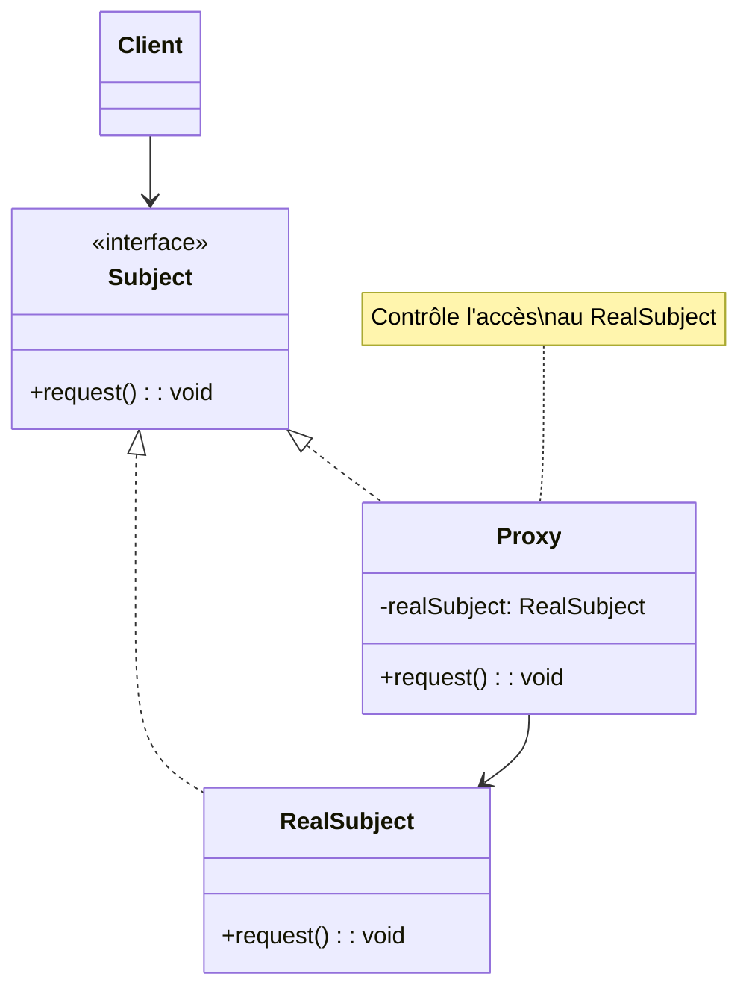

# Design Pattern : Proxy

## 1. Introduction

### Objectifs du cours
Après ce cours, vous serez capable de :
- Comprendre le pattern Proxy et ses variantes
- Implémenter des proxies pour lazy loading, caching, et protection
- Utiliser les Proxies JavaScript/TypeScript natifs
- Créer des Guards Angular pour contrôle d'accès
- Optimiser les performances avec des proxies

### Scope et applications
Le pattern Proxy est essentiel dans les applications web modernes, particulièrement pour :
- **Guards Angular** : authentification, autorisation, navigation
- **Lazy Loading** : chargement différé de modules/composants
- **Caching** : mise en cache de données coûteuses
- **Logging** : traçage transparent des accès
- **Validation** : vérification avant accès aux données
- **Protection** : contrôle d'accès aux ressources sensibles

---

## 2. Définitions et concepts clés

### 2.1 Qu'est-ce que le pattern Proxy ?

Le **Proxy** est un pattern structurel qui fournit un **substitut ou représentant** d'un autre objet pour **contrôler l'accès** à celui-ci. Le proxy a la même interface que l'objet réel et délègue les opérations, tout en ajoutant un comportement supplémentaire.

**Analogie de la vie quotidienne :**
Imaginez un **avocat** (proxy) qui vous représente :
- Vous ne pouvez pas assister au tribunal (objet réel)
- L'**avocat** vous **représente** (proxy)
- Il a le **même rôle** que vous au tribunal (même interface)
- Il peut **filtrer** ce qui est dit (contrôle d'accès)
- Il peut **préparer** le dossier avant (lazy loading)
- Il **protège** vos intérêts (protection)

De la même façon en programmation :
- **Real Subject** : Objet réel coûteux ou sensible
- **Proxy** : Substitut qui contrôle l'accès
- **Même interface** : Client ne voit pas la différence
- **Contrôle** : Ajout de logique avant/après délégation

### 2.2 Types de Proxy

| Type | Usage | Exemple |
|------|-------|---------|
| **Virtual Proxy** | Lazy loading | Charger image seulement quand visible |
| **Protection Proxy** | Contrôle d'accès | Guards Angular, permissions |
| **Remote Proxy** | Objet distant | API REST, RPC |
| **Cache Proxy** | Mise en cache | Cache de requêtes HTTP |
| **Smart Reference** | Comptage de références | Gestion mémoire |
| **Logging Proxy** | Traçabilité | Log tous les appels |

### 2.3 Structure du Proxy



---

## 3. Pourquoi utiliser le pattern Proxy ?

### 3.1 Problèmes sans Proxy

**❌ Problème 1 : Chargement coûteux immédiat**
```typescript
// ❌ Charge toutes les images immédiatement
class ProductGallery {
  private images: HTMLImageElement[] = [];
  
  constructor(private imageUrls: string[]) {
    // ❌ Charge TOUTES les images au démarrage
    imageUrls.forEach(url => {
      const img = new Image();
      img.src = url;  // Téléchargement immédiat
      this.images.push(img);
    });
  }
}

// ❌ Problème : 100 images = 100 téléchargements simultanés
// Gaspillage de bande passante pour images non visibles
```

**❌ Problème 2 : Pas de contrôle d'accès**
```typescript
// ❌ Accès direct aux données sensibles
class UserService {
  getUser(id: number): User {
    return database.users.find(u => u.id === id);
  }
  
  deleteUser(id: number): void {
    database.users = database.users.filter(u => u.id !== id);
  }
}

// N'importe qui peut accéder/supprimer !
const service = new UserService();
service.deleteUser(1);  // ❌ Pas de vérification d'autorisation
```

**❌ Problème 3 : Requêtes répétées**
```typescript
// ❌ Même requête exécutée plusieurs fois
@Component({ /* ... */ })
export class DashboardComponent {
  ngOnInit(): void {
    // Appel 1
    this.userService.getUsers().subscribe();
    
    // Appel 2 (même requête)
    this.userService.getUsers().subscribe();
    
    // Appel 3 (encore la même !)
    this.userService.getUsers().subscribe();
  }
}
// ❌ 3 requêtes HTTP identiques !
```

### 3.2 Avantages du Proxy

| Avantage | Description |
|----------|-------------|
| **Lazy Loading** | Charge l'objet seulement quand nécessaire |
| **Contrôle d'accès** | Vérifications avant accès |
| **Caching** | Évite calculs/requêtes redondants |
| **Logging** | Trace automatique des opérations |
| **Sécurité** | Protection des ressources sensibles |
| **Performance** | Optimise utilisation ressources |

---

## 4. Implémentation du pattern Proxy

### 4.1 Virtual Proxy (Lazy Loading)

```typescript
// Interface commune
interface Image {
  display(): void;
  getSize(): number;
}

// Objet réel (coûteux à créer)
class RealImage implements Image {
  private filename: string;
  private imageData: Uint8Array;
  
  constructor(filename: string) {
    this.filename = filename;
    this.loadFromDisk();  // Opération coûteuse
  }
  
  private loadFromDisk(): void {
    console.log(`Loading image from disk: ${this.filename}`);
    // Simuler chargement lourd
    this.imageData = new Uint8Array(1024 * 1024);  // 1MB
  }
  
  display(): void {
    console.log(`Displaying: ${this.filename}`);
  }
  
  getSize(): number {
    return this.imageData.length;
  }
}

// Proxy (lazy loading)
class ImageProxy implements Image {
  private filename: string;
  private realImage: RealImage | null = null;
  
  constructor(filename: string) {
    this.filename = filename;
    console.log(`ImageProxy created for: ${filename} (not loaded yet)`);
  }
  
  display(): void {
    // Charge l'image seulement à la première utilisation
    if (this.realImage === null) {
      console.log('First access - loading real image...');
      this.realImage = new RealImage(this.filename);
    }
    this.realImage.display();
  }
  
  getSize(): number {
    if (this.realImage === null) {
      return 0;  // Pas encore chargé
    }
    return this.realImage.getSize();
  }
}

// Utilisation
console.log('=== Creating proxies ===');
const image1: Image = new ImageProxy('photo1.jpg');
const image2: Image = new ImageProxy('photo2.jpg');
const image3: Image = new ImageProxy('photo3.jpg');

console.log('\n=== Displaying only image1 ===');
image1.display();  // Seule photo1 est chargée

// Output:
// === Creating proxies ===
// ImageProxy created for: photo1.jpg (not loaded yet)
// ImageProxy created for: photo2.jpg (not loaded yet)
// ImageProxy created for: photo3.jpg (not loaded yet)
//
// === Displaying only image1 ===
// First access - loading real image...
// Loading image from disk: photo1.jpg
// Displaying: photo1.jpg
```

### 4.2 Protection Proxy (Contrôle d'accès)

```typescript
// Interface
interface BankAccount {
  withdraw(amount: number): boolean;
  deposit(amount: number): void;
  getBalance(): number;
}

// Objet réel
class RealBankAccount implements BankAccount {
  private balance: number = 0;
  
  withdraw(amount: number): boolean {
    if (this.balance >= amount) {
      this.balance -= amount;
      console.log(`Withdrew €${amount}. Balance: €${this.balance}`);
      return true;
    }
    console.log('Insufficient funds');
    return false;
  }
  
  deposit(amount: number): void {
    this.balance += amount;
    console.log(`Deposited €${amount}. Balance: €${this.balance}`);
  }
  
  getBalance(): number {
    return this.balance;
  }
}

// Proxy avec contrôle d'accès
class ProtectedBankAccount implements BankAccount {
  private realAccount: RealBankAccount;
  private currentUser: User;
  
  constructor(realAccount: RealBankAccount, user: User) {
    this.realAccount = realAccount;
    this.currentUser = user;
  }
  
  withdraw(amount: number): boolean {
    // Vérification d'autorisation
    if (!this.currentUser.permissions.includes('WITHDRAW')) {
      console.log('❌ Access denied: No WITHDRAW permission');
      return false;
    }
    
    // Limite de retrait
    if (amount > 1000 && !this.currentUser.permissions.includes('LARGE_WITHDRAW')) {
      console.log('❌ Access denied: Amount exceeds limit');
      return false;
    }
    
    // Logging
    console.log(`User ${this.currentUser.name} withdrawing €${amount}`);
    
    return this.realAccount.withdraw(amount);
  }
  
  deposit(amount: number): void {
    if (!this.currentUser.permissions.includes('DEPOSIT')) {
      console.log('❌ Access denied: No DEPOSIT permission');
      return;
    }
    
    console.log(`User ${this.currentUser.name} depositing €${amount}`);
    this.realAccount.deposit(amount);
  }
  
  getBalance(): number {
    if (!this.currentUser.permissions.includes('VIEW_BALANCE')) {
      console.log('❌ Access denied: No VIEW_BALANCE permission');
      return 0;
    }
    
    return this.realAccount.getBalance();
  }
}

interface User {
  name: string;
  permissions: string[];
}

// Utilisation
const account = new RealBankAccount();
account.deposit(1000);

// Utilisateur normal
const normalUser: User = {
  name: 'John',
  permissions: ['DEPOSIT', 'VIEW_BALANCE', 'WITHDRAW']
};

const normalProxy = new ProtectedBankAccount(account, normalUser);
normalProxy.withdraw(500);  // ✅ OK
normalProxy.withdraw(1500); // ❌ Dépasse la limite

// Utilisateur admin
const adminUser: User = {
  name: 'Admin',
  permissions: ['DEPOSIT', 'VIEW_BALANCE', 'WITHDRAW', 'LARGE_WITHDRAW']
};

const adminProxy = new ProtectedBankAccount(account, adminUser);
adminProxy.withdraw(1500);  // ✅ OK pour admin
```

### 4.3 Cache Proxy

```typescript
// Service réel (requêtes coûteuses)
interface UserService {
  getUserById(id: number): Promise<User>;
  getUserPosts(userId: number): Promise<Post[]>;
}

class RealUserService implements UserService {
  async getUserById(id: number): Promise<User> {
    console.log(`🌐 Fetching user ${id} from API...`);
    await this.delay(1000);  // Simuler latence réseau
    return {
      id,
      name: `User ${id}`,
      email: `user${id}@example.com`
    };
  }
  
  async getUserPosts(userId: number): Promise<Post[]> {
    console.log(`🌐 Fetching posts for user ${userId} from API...`);
    await this.delay(800);
    return [
      { id: 1, userId, title: 'Post 1' },
      { id: 2, userId, title: 'Post 2' }
    ];
  }
  
  private delay(ms: number): Promise<void> {
    return new Promise(resolve => setTimeout(resolve, ms));
  }
}

// Proxy avec cache
class CachedUserService implements UserService {
  private realService: UserService;
  private userCache = new Map<number, CacheEntry<User>>();
  private postsCache = new Map<number, CacheEntry<Post[]>>();
  private readonly TTL = 60000;  // 1 minute
  
  constructor(realService: UserService) {
    this.realService = realService;
  }
  
  async getUserById(id: number): Promise<User> {
    const cached = this.userCache.get(id);
    
    if (cached && Date.now() < cached.expiresAt) {
      console.log(`✅ Cache hit for user ${id}`);
      return cached.value;
    }
    
    console.log(`❌ Cache miss for user ${id}`);
    const user = await this.realService.getUserById(id);
    
    this.userCache.set(id, {
      value: user,
      expiresAt: Date.now() + this.TTL
    });
    
    return user;
  }
  
  async getUserPosts(userId: number): Promise<Post[]> {
    const cached = this.postsCache.get(userId);
    
    if (cached && Date.now() < cached.expiresAt) {
      console.log(`✅ Cache hit for posts of user ${userId}`);
      return cached.value;
    }
    
    console.log(`❌ Cache miss for posts of user ${userId}`);
    const posts = await this.realService.getUserPosts(userId);
    
    this.postsCache.set(userId, {
      value: posts,
      expiresAt: Date.now() + this.TTL
    });
    
    return posts;
  }
}

interface CacheEntry<T> {
  value: T;
  expiresAt: number;
}

interface User {
  id: number;
  name: string;
  email: string;
}

interface Post {
  id: number;
  userId: number;
  title: string;
}

// Utilisation
const service: UserService = new CachedUserService(new RealUserService());

// Premier appel - cache miss
await service.getUserById(1);  // Requête API
await service.getUserById(1);  // Cache hit !
await service.getUserById(1);  // Cache hit !

// Output:
// ❌ Cache miss for user 1
// 🌐 Fetching user 1 from API...
// ✅ Cache hit for user 1
// ✅ Cache hit for user 1
```

### 4.4 Angular Guards (Protection Proxy)

```typescript
import { Injectable } from '@angular/core';
import { CanActivate, ActivatedRouteSnapshot, Router } from '@angular/router';
import { Observable } from 'rxjs';
import { map } from 'rxjs/operators';

// Guard d'authentification
@Injectable({ providedIn: 'root' })
export class AuthGuard implements CanActivate {
  constructor(
    private authService: AuthService,
    private router: Router
  ) {}
  
  canActivate(): Observable<boolean> {
    return this.authService.isAuthenticated$.pipe(
      map(isAuth => {
        if (!isAuth) {
          console.log('🚫 Not authenticated - redirecting to login');
          this.router.navigate(['/login']);
          return false;
        }
        console.log('✅ Authenticated - access granted');
        return true;
      })
    );
  }
}

// Guard de rôles
@Injectable({ providedIn: 'root' })
export class RoleGuard implements CanActivate {
  constructor(
    private authService: AuthService,
    private router: Router
  ) {}
  
  canActivate(route: ActivatedRouteSnapshot): Observable<boolean> {
    const requiredRoles = route.data['roles'] as string[];
    
    return this.authService.currentUser$.pipe(
      map(user => {
        if (!user) {
          this.router.navigate(['/login']);
          return false;
        }
        
        const hasRole = requiredRoles.some(role => user.roles.includes(role));
        
        if (!hasRole) {
          console.log(`🚫 Insufficient permissions. Required: ${requiredRoles}`);
          this.router.navigate(['/forbidden']);
          return false;
        }
        
        console.log('✅ Role check passed');
        return true;
      })
    );
  }
}

// Configuration des routes
const routes: Routes = [
  {
    path: 'dashboard',
    component: DashboardComponent,
    canActivate: [AuthGuard]  // Proxy de protection
  },
  {
    path: 'admin',
    component: AdminComponent,
    canActivate: [AuthGuard, RoleGuard],
    data: { roles: ['admin'] }
  },
  {
    path: 'login',
    component: LoginComponent
  }
];
```

### 4.5 JavaScript Proxy (natif)

```typescript
// Utiliser le Proxy natif JavaScript pour validation
interface Product {
  name: string;
  price: number;
  stock: number;
}

const product: Product = {
  name: 'Laptop',
  price: 999,
  stock: 10
};

// Proxy avec validation
const validatedProduct = new Proxy(product, {
  get(target, prop) {
    console.log(`Reading property: ${String(prop)}`);
    return target[prop as keyof Product];
  },
  
  set(target, prop, value) {
    console.log(`Setting ${String(prop)} = ${value}`);
    
    // Validation
    if (prop === 'price') {
      if (typeof value !== 'number' || value < 0) {
        throw new Error('Price must be a positive number');
      }
    }
    
    if (prop === 'stock') {
      if (typeof value !== 'number' || value < 0) {
        throw new Error('Stock must be a positive number');
      }
    }
    
    if (prop === 'name') {
      if (typeof value !== 'string' || value.trim() === '') {
        throw new Error('Name cannot be empty');
      }
    }
    
    target[prop as keyof Product] = value;
    return true;
  }
});

// Utilisation
validatedProduct.price = 899;  // ✅ OK
console.log(validatedProduct.price);

try {
  validatedProduct.price = -100;  // ❌ Error
} catch (error) {
  console.error(error.message);  // "Price must be a positive number"
}
```

---

## 5. Erreurs courantes et comment les éviter

### 5.1 Erreurs fréquentes

| Erreur | Problème | Solution |
|--------|----------|----------|
| **Cache sans TTL** | Données obsolètes | Ajouter expiration |
| **Proxy trop lourd** | Overhead de performance | Garder proxy léger |
| **Pas de gestion d'erreurs** | Crash si objet réel échoue | try/catch |
| **Oubli de délégation** | Comportement incomplet | Implémenter toute l'interface |

---

## 6. Exercices pratiques

### Exercice 1 : Lazy Loading Service (Facile)
Créez un proxy qui charge un service lourd seulement à la première utilisation.

### Exercice 2 : Rate Limiting Proxy (Intermédiaire)
Créez un proxy qui limite le nombre d'appels par minute à une API.

---

## 7. Comportement senior : Recommandations et astuces

### 7.1 Quand utiliser Proxy

**✅ Utilisez Proxy quand :**
- **Lazy loading** de ressources coûteuses
- **Contrôle d'accès** (guards, permissions)
- **Caching** de données
- **Logging** transparent
- **Validation** automatique

**❌ N'utilisez PAS Proxy quand :**
- Overhead non justifié
- Simplicité suffit
- Over-engineering

### 7.2 Best practices

| Pratique | Description |
|----------|-------------|
| **Même interface** | Proxy = même interface que l'objet réel |
| **Léger** | Minimiser overhead |
| **TTL** | Cache avec expiration |
| **Logging** | Tracer les accès |
| **Tests** | Tester avec et sans proxy |

---

## 8. Résumé

**Le pattern Proxy** permet de :
- ✅ Contrôler l'**accès** à un objet
- ✅ Implémenter le **lazy loading**
- ✅ Ajouter du **caching**
- ✅ **Logger** les opérations
- ✅ **Protéger** les ressources

### Quand l'utiliser

**✅ OUI** pour :
- Guards Angular
- Lazy loading
- Caching
- Contrôle d'accès
- Validation

**❌ NON** pour :
- Overhead injustifié
- Over-engineering

---

## 9. Ressources complémentaires

### Français
- 📚 [Refactoring Guru - Proxy](https://refactoring.guru/fr/design-patterns/proxy)

### Anglais
- 📚 [Angular Route Guards](https://angular.io/guide/router#preventing-unauthorized-access)
- 🎥 [Proxy Pattern](https://www.youtube.com/watch?v=NwaabHqPHeM)
- 📖 [JavaScript Proxy](https://developer.mozilla.org/en-US/docs/Web/JavaScript/Reference/Global_Objects/Proxy)

---

**En une phrase :**

> Le pattern Proxy fournit un substitut qui contrôle l'accès à un objet réel, massivement utilisé dans les webapps via les Guards Angular pour l'authentification, le lazy loading de modules, et le caching de données pour optimiser les performances.
