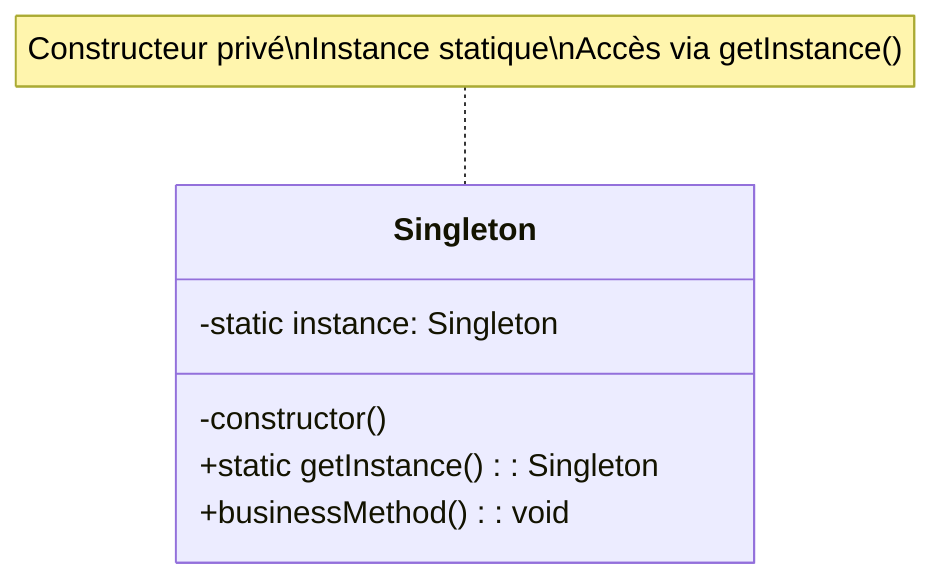

# Design Pattern : Singleton

## 1. Introduction

### Objectifs du cours
Après ce cours, vous serez capable de :
- Comprendre le pattern Singleton et ses cas d'utilisation
- Implémenter un Singleton en TypeScript
- Utiliser les services Angular comme des Singletons
- Identifier quand utiliser (et ne pas utiliser) ce pattern
- Gérer les pièges et problèmes courants du Singleton

### Scope et applications
Le pattern Singleton est fondamental dans les applications web, particulièrement pour :
- Services Angular avec `providedIn: 'root'`
- Gestion de configurations globales
- Connexions aux bases de données (NestJS)
- Caches applicatifs
- Logger unique pour toute l'application
- Gestion d'état global (stores)

---

## 2. Définitions et concepts clés

### 2.1 Qu'est-ce que le pattern Singleton ?

Le **Singleton** est un pattern créationnel qui garantit qu'**une classe n'a qu'une seule instance** dans toute l'application et fournit un **point d'accès global** à cette instance.

**Analogie de la vie quotidienne :**
Imaginez le **président d'un pays** :
- Il ne peut y avoir qu'**un seul** président à la fois (instance unique)
- Tout le monde sait **comment le contacter** (point d'accès global)
- Si quelqu'un veut parler au président, il obtient toujours la **même personne** (même instance)
- On ne peut pas créer un "deuxième président" (empêche la création multiple)

De la même façon en programmation :
- **Instance unique** : Une seule instance de la classe existe
- **Accès global** : Accessible depuis n'importe où dans l'application
- **Contrôle de création** : Le constructeur est privé ou contrôlé
- **Lazy initialization** : L'instance est créée à la première demande

### 2.2 Concepts clés

| Concept | Description |
|---------|-------------|
| **Instance unique** | Une seule instance existe dans toute l'application |
| **Point d'accès global** | Méthode statique pour obtenir l'instance |
| **Constructeur privé** | Empêche la création d'instances multiples |
| **Lazy loading** | Instance créée seulement quand nécessaire |
| **Thread-safe** | Gestion de la concurrence (important en backend) |

### 2.3 Structure du Singleton



---

## 3. Pourquoi utiliser le pattern Singleton ?

### 3.1 Problèmes sans Singleton

**❌ Problème 1 : Instances multiples incontrôlées**
```typescript
// ❌ Chaque appel crée une nouvelle instance
class Logger {
  private logs: string[] = [];
  
  log(message: string): void {
    this.logs.push(message);
    console.log(`[${new Date().toISOString()}] ${message}`);
  }
  
  getAllLogs(): string[] {
    return this.logs;
  }
}

// Utilisation
const logger1 = new Logger();
logger1.log('User logged in');

const logger2 = new Logger();  // ❌ Nouvelle instance, logs différents
logger2.log('Data saved');

console.log(logger1.getAllLogs());  // ['User logged in']
console.log(logger2.getAllLogs());  // ['Data saved']
// ❌ Les logs sont fragmentés entre plusieurs instances !
```

**❌ Problème 2 : Configuration incohérente**
```typescript
// ❌ Configuration non synchronisée
class AppConfig {
  private settings: Record<string, any> = {};
  
  set(key: string, value: any): void {
    this.settings[key] = value;
  }
  
  get(key: string): any {
    return this.settings[key];
  }
}

// Service A
const configA = new AppConfig();
configA.set('apiUrl', 'http://localhost:3000');

// Service B
const configB = new AppConfig();  // ❌ Nouvelle instance
console.log(configB.get('apiUrl'));  // undefined
// ❌ Service B ne voit pas la configuration de Service A !
```

**❌ Problème 3 : Connexions DB multiples**
```typescript
// ❌ Chaque service crée sa propre connexion
class DatabaseConnection {
  constructor() {
    console.log('Creating new database connection...');
    // Connexion coûteuse
  }
  
  query(sql: string): any {
    // Exécuter requête
  }
}

const userService = new DatabaseConnection();  // Connexion 1
const orderService = new DatabaseConnection();  // Connexion 2
const productService = new DatabaseConnection();  // Connexion 3
// ❌ 3 connexions inutiles ! Gaspillage de ressources
```

### 3.2 Avantages du Singleton

| Avantage | Description |
|----------|-------------|
| **Instance unique** | Garantit une seule instance dans l'application |
| **Accès global** | Accessible depuis n'importe où |
| **Économie ressources** | Évite la création d'instances multiples |
| **État partagé** | Tous les clients voient le même état |
| **Contrôle strict** | Contrôle total sur l'instanciation |
| **Lazy loading** | Instance créée seulement si nécessaire |

### 3.3 Inconvénients du Singleton

| Inconvénient | Description |
|--------------|-------------|
| **État global** | Peut créer des dépendances cachées |
| **Tests difficiles** | Complique les tests unitaires (état partagé) |
| **Couplage fort** | Clients couplés à l'implémentation |
| **Violation SRP** | Responsabilité création + logique métier |
| **Thread-safety** | Problèmes potentiels en multi-threading |

---

## 4. Implémentation du pattern Singleton

### 4.1 Singleton classique en TypeScript

```typescript
// Singleton basique
class Logger {
  private static instance: Logger;
  private logs: string[] = [];
  
  // Constructeur privé empêche new Logger()
  private constructor() {
    console.log('Logger instance created');
  }
  
  // Point d'accès global
  public static getInstance(): Logger {
    if (!Logger.instance) {
      Logger.instance = new Logger();
    }
    return Logger.instance;
  }
  
  // Méthodes métier
  public log(message: string): void {
    const timestamp = new Date().toISOString();
    const logEntry = `[${timestamp}] ${message}`;
    this.logs.push(logEntry);
    console.log(logEntry);
  }
  
  public getAllLogs(): string[] {
    return [...this.logs];  // Retourner une copie
  }
  
  public clearLogs(): void {
    this.logs = [];
  }
}

// Utilisation
const logger1 = Logger.getInstance();
logger1.log('Application started');

const logger2 = Logger.getInstance();
logger2.log('User connected');

console.log(logger1 === logger2);  // true - Même instance !
console.log(logger1.getAllLogs());
// Output:
// [2024-01-15T10:30:00.000Z] Application started
// [2024-01-15T10:30:01.000Z] User connected

// ❌ Impossible de créer avec new
// const logger3 = new Logger();  // Erreur : Constructor is private
```

### 4.2 Singleton avec Lazy Initialization

```typescript
// Singleton avec création retardée
class AppConfig {
  private static instance: AppConfig | null = null;
  private config: Map<string, any>;
  
  private constructor() {
    console.log('Loading configuration...');
    this.config = new Map();
    this.loadDefaultConfig();
  }
  
  public static getInstance(): AppConfig {
    if (AppConfig.instance === null) {
      console.log('Creating AppConfig instance for the first time');
      AppConfig.instance = new AppConfig();
    }
    return AppConfig.instance;
  }
  
  private loadDefaultConfig(): void {
    this.config.set('apiUrl', 'http://localhost:3000');
    this.config.set('timeout', 5000);
    this.config.set('retries', 3);
  }
  
  public get<T>(key: string): T | undefined {
    return this.config.get(key) as T;
  }
  
  public set(key: string, value: any): void {
    this.config.set(key, value);
  }
  
  public has(key: string): boolean {
    return this.config.has(key);
  }
}

// L'instance n'est créée qu'au premier appel
const config = AppConfig.getInstance();  // "Creating AppConfig instance..."
config.set('theme', 'dark');

const config2 = AppConfig.getInstance();  // Pas de création, réutilise l'instance
console.log(config2.get('theme'));  // 'dark'
```

### 4.3 Singleton avec Module Pattern (TypeScript/ES6)

```typescript
// Singleton via export de module
class DatabaseConnection {
  private isConnected = false;
  
  public connect(): void {
    if (this.isConnected) {
      console.log('Already connected');
      return;
    }
    console.log('Connecting to database...');
    this.isConnected = true;
  }
  
  public disconnect(): void {
    if (!this.isConnected) {
      console.log('Not connected');
      return;
    }
    console.log('Disconnecting from database...');
    this.isConnected = false;
  }
  
  public query(sql: string): any[] {
    if (!this.isConnected) {
      throw new Error('Not connected to database');
    }
    console.log(`Executing: ${sql}`);
    return [];
  }
}

// Export d'une instance unique
export const database = new DatabaseConnection();

// Utilisation dans d'autres fichiers
// import { database } from './database';
// database.connect();
// database.query('SELECT * FROM users');
```

### 4.4 Singleton Angular avec Services

```typescript
// Angular crée automatiquement des Singletons avec providedIn: 'root'
import { Injectable } from '@angular/core';
import { BehaviorSubject, Observable } from 'rxjs';

@Injectable({
  providedIn: 'root'  // ✅ Singleton au niveau application
})
export class AuthService {
  private currentUserSubject$ = new BehaviorSubject<User | null>(null);
  public readonly currentUser$: Observable<User | null> = 
    this.currentUserSubject$.asObservable();
  
  constructor() {
    console.log('AuthService instance created');
    this.loadUserFromStorage();
  }
  
  private loadUserFromStorage(): void {
    const userJson = localStorage.getItem('currentUser');
    if (userJson) {
      const user = JSON.parse(userJson);
      this.currentUserSubject$.next(user);
    }
  }
  
  public login(email: string, password: string): Observable<User> {
    // Appel API
    return this.http.post<User>('/api/auth/login', { email, password }).pipe(
      tap(user => {
        this.currentUserSubject$.next(user);
        localStorage.setItem('currentUser', JSON.stringify(user));
      })
    );
  }
  
  public logout(): void {
    this.currentUserSubject$.next(null);
    localStorage.removeItem('currentUser');
  }
  
  public isAuthenticated(): boolean {
    return this.currentUserSubject$.value !== null;
  }
}

interface User {
  id: number;
  email: string;
  name: string;
}

// Utilisation dans composants
@Component({ /* ... */ })
export class HeaderComponent {
  currentUser$ = this.authService.currentUser$;
  
  // Même instance d'AuthService partout
  constructor(private authService: AuthService) {}
  
  logout(): void {
    this.authService.logout();
  }
}

@Component({ /* ... */ })
export class ProfileComponent {
  // Même instance que dans HeaderComponent
  constructor(private authService: AuthService) {}
}
```

### 4.5 Singleton NestJS avec Services

```typescript
// NestJS utilise aussi des Singletons pour les providers
import { Injectable } from '@nestjs/common';
import { ConfigService } from '@nestjs/config';

@Injectable()  // Singleton par défaut dans NestJS
export class DatabaseService {
  private connection: any;
  
  constructor(private configService: ConfigService) {
    console.log('DatabaseService instance created');
    this.initializeConnection();
  }
  
  private async initializeConnection(): Promise<void> {
    const dbUrl = this.configService.get<string>('DATABASE_URL');
    console.log('Connecting to database...');
    // Créer connexion
  }
  
  async query(sql: string, params: any[] = []): Promise<any[]> {
    console.log(`Executing: ${sql}`);
    // Exécuter requête
    return [];
  }
  
  async transaction<T>(callback: () => Promise<T>): Promise<T> {
    console.log('Starting transaction...');
    try {
      const result = await callback();
      console.log('Committing transaction...');
      return result;
    } catch (error) {
      console.log('Rolling back transaction...');
      throw error;
    }
  }
}

// Module NestJS
@Module({
  providers: [DatabaseService],  // Instance unique partagée
  exports: [DatabaseService]
})
export class DatabaseModule {}

// Utilisation dans controllers/services
@Controller('users')
export class UsersController {
  // Même instance dans tous les controllers
  constructor(private databaseService: DatabaseService) {}
  
  @Get()
  async findAll(): Promise<User[]> {
    return this.databaseService.query('SELECT * FROM users');
  }
}
```

### 4.6 Exemple concret : Cache Service

```typescript
// Service de cache Singleton
@Injectable({ providedIn: 'root' })
export class CacheService {
  private cache = new Map<string, CacheEntry>();
  private readonly DEFAULT_TTL = 5 * 60 * 1000;  // 5 minutes
  
  constructor() {
    console.log('CacheService initialized');
    this.startCleanupInterval();
  }
  
  public set<T>(key: string, value: T, ttl: number = this.DEFAULT_TTL): void {
    const expiresAt = Date.now() + ttl;
    this.cache.set(key, { value, expiresAt });
    console.log(`Cache SET: ${key} (expires in ${ttl}ms)`);
  }
  
  public get<T>(key: string): T | null {
    const entry = this.cache.get(key);
    
    if (!entry) {
      console.log(`Cache MISS: ${key}`);
      return null;
    }
    
    if (Date.now() > entry.expiresAt) {
      console.log(`Cache EXPIRED: ${key}`);
      this.cache.delete(key);
      return null;
    }
    
    console.log(`Cache HIT: ${key}`);
    return entry.value as T;
  }
  
  public has(key: string): boolean {
    const entry = this.cache.get(key);
    if (!entry) return false;
    
    if (Date.now() > entry.expiresAt) {
      this.cache.delete(key);
      return false;
    }
    
    return true;
  }
  
  public delete(key: string): boolean {
    console.log(`Cache DELETE: ${key}`);
    return this.cache.delete(key);
  }
  
  public clear(): void {
    console.log('Cache CLEAR');
    this.cache.clear();
  }
  
  public getStats(): CacheStats {
    return {
      size: this.cache.size,
      keys: Array.from(this.cache.keys())
    };
  }
  
  private startCleanupInterval(): void {
    setInterval(() => {
      const now = Date.now();
      let deletedCount = 0;
      
      for (const [key, entry] of this.cache.entries()) {
        if (now > entry.expiresAt) {
          this.cache.delete(key);
          deletedCount++;
        }
      }
      
      if (deletedCount > 0) {
        console.log(`Cache cleanup: removed ${deletedCount} expired entries`);
      }
    }, 60 * 1000);  // Toutes les minutes
  }
}

interface CacheEntry {
  value: any;
  expiresAt: number;
}

interface CacheStats {
  size: number;
  keys: string[];
}

// Service API utilisant le cache
@Injectable({ providedIn: 'root' })
export class UserApiService {
  constructor(
    private http: HttpClient,
    private cache: CacheService  // Même instance partout
  ) {}
  
  getUser(id: number): Observable<User> {
    const cacheKey = `user:${id}`;
    
    // Vérifier le cache
    const cached = this.cache.get<User>(cacheKey);
    if (cached) {
      return of(cached);
    }
    
    // Appel API
    return this.http.get<User>(`/api/users/${id}`).pipe(
      tap(user => {
        this.cache.set(cacheKey, user, 10 * 60 * 1000);  // 10 min
      })
    );
  }
  
  invalidateUser(id: number): void {
    this.cache.delete(`user:${id}`);
  }
}
```

---

## 5. Erreurs courantes et comment les éviter

### 5.1 Erreurs fréquentes

| Erreur | Problème | Solution |
|--------|----------|----------|
| **État global mutable** | Effets de bord, bugs difficiles | Immutabilité, getters/setters |
| **Tests difficiles** | Instance partagée entre tests | Reset dans beforeEach, mock |
| **Singleton dans module** | Instance par module | Utiliser providedIn: 'root' |
| **Constructeur non privé** | Création multiple possible | Constructeur privé |
| **Oubli thread-safety** | Race conditions (backend) | Locks, lazy initialization sûre |

### 5.2 Exemples d'erreurs

**❌ Erreur 1 : Constructeur public**
```typescript
// ❌ Constructeur public permet new Logger()
class Logger {
  private static instance: Logger;
  
  constructor() {  // ❌ Public !
    console.log('Logger created');
  }
  
  static getInstance(): Logger {
    if (!Logger.instance) {
      Logger.instance = new Logger();
    }
    return Logger.instance;
  }
}

// Quelqu'un peut créer des instances directement
const logger1 = Logger.getInstance();
const logger2 = new Logger();  // ❌ Nouvelle instance !
console.log(logger1 === logger2);  // false
```

**✅ Correction : Constructeur privé**
```typescript
class Logger {
  private static instance: Logger;
  
  private constructor() {  // ✅ Privé
    console.log('Logger created');
  }
  
  static getInstance(): Logger {
    if (!Logger.instance) {
      Logger.instance = new Logger();
    }
    return Logger.instance;
  }
}

// const logger = new Logger();  // ✅ Erreur de compilation
```

**❌ Erreur 2 : État mutable non contrôlé**
```typescript
class AppState {
  private static instance: AppState;
  public data: any = {};  // ❌ Public et mutable
  
  private constructor() {}
  
  static getInstance(): AppState {
    if (!AppState.instance) {
      AppState.instance = new AppState();
    }
    return AppState.instance;
  }
}

// N'importe qui peut modifier directement
const state = AppState.getInstance();
state.data = { hacked: true };  // ❌ Pas de contrôle !
```

**✅ Correction : Encapsulation**
```typescript
class AppState {
  private static instance: AppState;
  private data: Map<string, any> = new Map();  // ✅ Privé
  
  private constructor() {}
  
  static getInstance(): AppState {
    if (!AppState.instance) {
      AppState.instance = new AppState();
    }
    return AppState.instance;
  }
  
  // ✅ Accès contrôlé
  public get<T>(key: string): T | undefined {
    return this.data.get(key);
  }
  
  public set(key: string, value: any): void {
    this.data.set(key, value);
  }
}
```

**❌ Erreur 3 : Tests avec Singleton**
```typescript
// ❌ Les tests partagent l'état
describe('UserService', () => {
  it('should add user', () => {
    const logger = Logger.getInstance();
    logger.log('Test 1');
    expect(logger.getAllLogs().length).toBe(1);
  });
  
  it('should log error', () => {
    const logger = Logger.getInstance();  // Même instance !
    logger.log('Test 2');
    expect(logger.getAllLogs().length).toBe(1);  // ❌ FAIL: c'est 2 !
  });
});
```

**✅ Correction : Reset entre tests**
```typescript
class Logger {
  private static instance: Logger;
  private logs: string[] = [];
  
  private constructor() {}
  
  static getInstance(): Logger {
    if (!Logger.instance) {
      Logger.instance = new Logger();
    }
    return Logger.instance;
  }
  
  // ✅ Méthode pour tests
  static resetInstance(): void {
    Logger.instance = null as any;
  }
  
  clearLogs(): void {
    this.logs = [];
  }
}

describe('UserService', () => {
  beforeEach(() => {
    // ✅ Reset avant chaque test
    Logger.getInstance().clearLogs();
  });
  
  it('should add user', () => {
    const logger = Logger.getInstance();
    logger.log('Test 1');
    expect(logger.getAllLogs().length).toBe(1);  // ✅ PASS
  });
  
  it('should log error', () => {
    const logger = Logger.getInstance();
    logger.log('Test 2');
    expect(logger.getAllLogs().length).toBe(1);  // ✅ PASS
  });
});
```

---

## 6. Exercices pratiques

### Exercice 1 : Configuration Service (Facile)

Créez un service de configuration Singleton avec :
- Chargement de configuration depuis fichier
- Méthodes get/set avec typage
- Valeurs par défaut
- Validation des clés

### Exercice 2 : Logger avec niveaux (Intermédiaire)

Créez un logger Singleton avec :
- Niveaux : DEBUG, INFO, WARN, ERROR
- Filtrage par niveau minimum
- Export des logs vers fichier
- Formatage personnalisable

---

## 7. Comportement senior : Recommandations et astuces

### 7.1 Quand utiliser Singleton

**✅ Utilisez Singleton quand :**
- **Services Angular/NestJS** (providedIn: 'root', @Injectable)
- **Connexions DB** : Une seule connexion partagée
- **Cache applicatif** : Cache centralisé
- **Logger** : Logs centralisés
- **Configuration** : Config unique et cohérente
- **Ressources coûteuses** : Éviter créations multiples

**❌ N'utilisez PAS Singleton quand :**
- État modifiable fréquent (préférer state management)
- Testabilité importante (difficile à mocker)
- Multiples configurations (préférer injection de dépendances)
- Pattern non nécessaire (YAGNI)

### 7.2 Astuces de développeur senior

**1. Préférez les services Angular/NestJS aux Singletons manuels**
```typescript
// ✅ Angular/NestJS gère le Singleton automatiquement
@Injectable({ providedIn: 'root' })
export class MyService {
  // Pas besoin de getInstance(), constructeur privé, etc.
}

// ❌ Éviter la création manuelle
class MySingleton {
  private static instance: MySingleton;
  private constructor() {}
  static getInstance(): MySingleton { /* ... */ }
}
```

**2. Utilisez l'injection de dépendances**
```typescript
// ✅ Injection de dépendances (testable, flexible)
@Injectable({ providedIn: 'root' })
export class UserService {
  constructor(
    private http: HttpClient,
    private logger: LoggerService  // Singleton injecté
  ) {}
}

// ❌ Accès direct au Singleton
export class UserService {
  logUser(): void {
    Logger.getInstance().log('User action');  // Couplage fort
  }
}
```

**3. Immutabilité et encapsulation**
```typescript
@Injectable({ providedIn: 'root' })
export class ConfigService {
  private config = new Map<string, any>();
  
  // ✅ Retourner copie, pas référence
  public getAll(): Record<string, any> {
    return Object.fromEntries(this.config);
  }
  
  // ✅ Validation
  public set(key: string, value: any): void {
    if (!key) throw new Error('Key required');
    this.config.set(key, value);
  }
}
```

**4. Tests avec mocks**
```typescript
// Service testable
describe('UserComponent', () => {
  let mockLogger: jasmine.SpyObj<LoggerService>;
  
  beforeEach(() => {
    // ✅ Mock du Singleton
    mockLogger = jasmine.createSpyObj('LoggerService', ['log']);
    
    TestBed.configureTestingModule({
      providers: [
        { provide: LoggerService, useValue: mockLogger }
      ]
    });
  });
  
  it('should log user action', () => {
    component.doSomething();
    expect(mockLogger.log).toHaveBeenCalledWith('Action');
  });
});
```

### 7.3 Best practices

| Pratique | Description |
|----------|-------------|
| **DI over static** | Injection de dépendances plutôt que getInstance() |
| **Immutabilité** | État non mutable ou contrôlé |
| **Encapsulation** | Propriétés privées, accès par méthodes |
| **Thread-safety** | Attention en backend Node.js avec async |
| **Testabilité** | Prévoir reset/mock pour tests |
| **Documentation** | Expliquer pourquoi Singleton |

---

## 8. Résumé

### Points clés à retenir

Le pattern **Singleton** permet de :
- ✅ Garantir **une seule instance** dans l'application
- ✅ Fournir un **point d'accès global**
- ✅ **Économiser ressources** (connexions, cache)
- ✅ Partager **état cohérent** entre composants
- ⚠️ Attention à la **testabilité** et à l'**état global**

### Singleton en Angular/NestJS

| Framework | Implémentation |
|-----------|---------------|
| **Angular** | `@Injectable({ providedIn: 'root' })` |
| **NestJS** | `@Injectable()` dans module |
| **TypeScript** | Constructeur privé + getInstance() |

### Quand l'utiliser

**✅ OUI** pour :
- Services Angular/NestJS
- Connexions DB
- Cache, Logger, Config
- Ressources coûteuses

**❌ NON** pour :
- État très dynamique
- Tests complexes
- Sur-engineering

### Template de base

```typescript
// Angular/NestJS (recommandé)
@Injectable({ providedIn: 'root' })
export class MyService {
  private data = new Map<string, any>();
  
  constructor() {
    console.log('Service initialized');
  }
  
  // Méthodes métier
}

// TypeScript pur (si nécessaire)
class MySingleton {
  private static instance: MySingleton;
  
  private constructor() {}
  
  public static getInstance(): MySingleton {
    if (!MySingleton.instance) {
      MySingleton.instance = new MySingleton();
    }
    return MySingleton.instance;
  }
}
```

---

## 9. Ressources complémentaires

### Français
- 📚 [Refactoring Guru - Singleton](https://refactoring.guru/fr/design-patterns/singleton)
- 🎥 [Singleton en TypeScript - Grafikart](https://grafikart.fr/tutoriels/singleton-1234)
- 📖 [Angular Services - Guide officiel](https://angular.io/guide/singleton-services)

### Anglais
- 📚 [Angular Dependency Injection](https://angular.io/guide/dependency-injection)
- 🎥 [Singleton Pattern - Fireship](https://www.youtube.com/watch?v=hUE_j6q0LTQ)
- 📖 [NestJS Providers](https://docs.nestjs.com/providers)
- 🎥 [Design Patterns in TypeScript](https://www.youtube.com/watch?v=tv-_1er1mWI)

### Documentation
- [TypeScript Classes](https://www.typescriptlang.org/docs/handbook/2/classes.html)
- [Angular providedIn](https://angular.io/api/core/Injectable#providedIn)
- [NestJS Custom providers](https://docs.nestjs.com/fundamentals/custom-providers)

---

**En une phrase :**

> Le pattern Singleton garantit qu'une classe n'a qu'une seule instance dans toute l'application avec un point d'accès global, utilisé massivement dans Angular et NestJS via l'injection de dépendances pour les services, connexions DB, cache et configuration.
