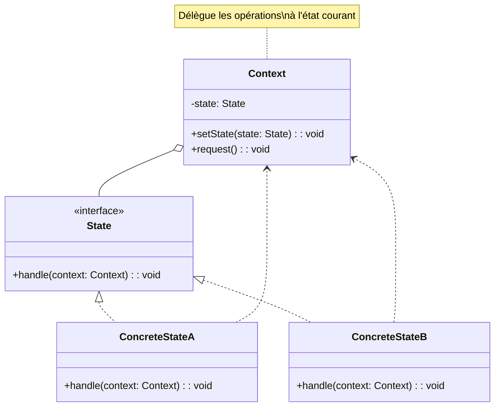

# Design Pattern : State

## 1. Introduction

### Objectifs du cours
Après ce cours, vous serez capable de :
- Comprendre le pattern State et ses cas d'utilisation
- Implémenter des machines à états pour workflows
- Gérer proprement les états de formulaires et documents
- Éviter les if/else complexes liés aux états
- Créer des systèmes de statut robustes et maintenables

### Scope et applications
Le pattern State est très utile dans les applications web métier, particulièrement pour :
- **États de formulaire** : draft, submitted, validated, rejected
- **Workflow de documents** : new, in_review, approved, published
- **États de commande** : pending, processing, shipped, delivered, cancelled
- **Statut utilisateur** : active, inactive, suspended, banned
- **Connexion** : disconnected, connecting, connected, error
- **Lecteurs média** : stopped, playing, paused

---

## 2. Définitions et concepts clés

### 2.1 Qu'est-ce que le pattern State ?

Le **State** est un pattern comportemental qui permet à un objet de **modifier son comportement** lorsque son **état interne change**. L'objet semble changer de classe.

**Analogie de la vie quotidienne :**
Imaginez un **feu de circulation** :
- Il a **3 états** : Rouge, Orange, Vert
- Chaque état a un **comportement différent** :
  - **Rouge** : Les voitures doivent s'arrêter
  - **Orange** : Les voitures ralentissent
  - **Vert** : Les voitures passent
- Les **transitions** sont contrôlées : Rouge → Vert → Orange → Rouge
- Le feu change de comportement selon son état
- On ne peut pas passer directement de Rouge à Orange

De la même façon en programmation :
- **Context** : L'objet dont le comportement change (le feu)
- **State** : Interface pour les états possibles
- **Concrete States** : Implémentations des états (Rouge, Vert, Orange)
- **Transitions** : Changements d'état contrôlés

### 2.2 Concepts clés

| Concept | Description |
|---------|-------------|
| **Context** | Objet dont le comportement dépend de l'état |
| **State Interface** | Interface commune à tous les états |
| **Concrete States** | Implémentations spécifiques de chaque état |
| **Transition** | Passage d'un état à un autre |
| **State Machine** | Ensemble des états et transitions |

### 2.3 Structure du State



---

## 3. Pourquoi utiliser le pattern State ?

### 3.1 Problèmes sans State

**❌ Problème 1 : If/else géant**
```typescript
// ❌ Code difficile à maintenir
class Order {
  status: string;
  
  process(): void {
    if (this.status === 'pending') {
      console.log('Processing payment...');
      this.status = 'processing';
    } else if (this.status === 'processing') {
      console.log('Payment processed, shipping...');
      this.status = 'shipped';
    } else if (this.status === 'shipped') {
      console.log('Order delivered');
      this.status = 'delivered';
    } else if (this.status === 'delivered') {
      console.log('Cannot process: already delivered');
    } else if (this.status === 'cancelled') {
      console.log('Cannot process: order cancelled');
    }
  }
  
  cancel(): void {
    if (this.status === 'pending') {
      this.status = 'cancelled';
    } else if (this.status === 'processing') {
      console.log('Refunding...');
      this.status = 'cancelled';
    } else if (this.status === 'shipped') {
      console.log('Cannot cancel: already shipped');
    } else if (this.status === 'delivered') {
      console.log('Cannot cancel: already delivered');
    } else if (this.status === 'cancelled') {
      console.log('Already cancelled');
    }
  }
  
  // ❌ Problèmes :
  // - Code répétitif et complexe
  // - Difficile d'ajouter un nouvel état
  // - Logique éparpillée
  // - Transitions non contrôlées
}
```

**❌ Problème 2 : États invalides**
```typescript
// ❌ Rien n'empêche les transitions invalides
class Document {
  status: string = 'draft';
  
  publish(): void {
    this.status = 'published';  // ❌ Peut passer de draft à published directement
  }
}

const doc = new Document();
doc.status = 'published';  // ❌ Modification directe, pas de contrôle
```

### 3.2 Avantages du State

| Avantage | Description |
|----------|-------------|
| **Clarté** | Chaque état est une classe séparée |
| **Maintenabilité** | Facile d'ajouter/modifier des états |
| **Single Responsibility** | Chaque état gère son comportement |
| **Transitions contrôlées** | Impossible de passer à un état invalide |
| **Open/Closed** | Nouveaux états sans modifier l'existant |

---

## 4. Implémentation du pattern State

### 4.1 State simple - Machine à états

```typescript
// Interface State
interface OrderState {
  process(order: OrderContext): void;
  cancel(order: OrderContext): void;
  getStatus(): string;
}

// Context
class OrderContext {
  private state: OrderState;
  
  constructor() {
    this.state = new PendingState();
  }
  
  setState(state: OrderState): void {
    console.log(`État changé: ${this.state.getStatus()} → ${state.getStatus()}`);
    this.state = state;
  }
  
  process(): void {
    this.state.process(this);
  }
  
  cancel(): void {
    this.state.cancel(this);
  }
  
  getStatus(): string {
    return this.state.getStatus();
  }
}

// États concrets
class PendingState implements OrderState {
  process(order: OrderContext): void {
    console.log('Traitement du paiement...');
    order.setState(new ProcessingState());
  }
  
  cancel(order: OrderContext): void {
    console.log('Commande annulée');
    order.setState(new CancelledState());
  }
  
  getStatus(): string {
    return 'En attente';
  }
}

class ProcessingState implements OrderState {
  process(order: OrderContext): void {
    console.log('Paiement traité, expédition en cours...');
    order.setState(new ShippedState());
  }
  
  cancel(order: OrderContext): void {
    console.log('Remboursement en cours...');
    order.setState(new CancelledState());
  }
  
  getStatus(): string {
    return 'En traitement';
  }
}

class ShippedState implements OrderState {
  process(order: OrderContext): void {
    console.log('Commande livrée');
    order.setState(new DeliveredState());
  }
  
  cancel(order: OrderContext): void {
    console.log('❌ Impossible d\'annuler: déjà expédiée');
  }
  
  getStatus(): string {
    return 'Expédiée';
  }
}

class DeliveredState implements OrderState {
  process(order: OrderContext): void {
    console.log('❌ Commande déjà livrée');
  }
  
  cancel(order: OrderContext): void {
    console.log('❌ Impossible d\'annuler: déjà livrée');
  }
  
  getStatus(): string {
    return 'Livrée';
  }
}

class CancelledState implements OrderState {
  process(order: OrderContext): void {
    console.log('❌ Commande annulée, impossible de traiter');
  }
  
  cancel(order: OrderContext): void {
    console.log('❌ Déjà annulée');
  }
  
  getStatus(): string {
    return 'Annulée';
  }
}

// Utilisation
const order = new OrderContext();

console.log(`Status: ${order.getStatus()}`);  // En attente

order.process();  // Traitement du paiement...
// État changé: En attente → En traitement

order.process();  // Paiement traité, expédition en cours...
// État changé: En traitement → Expédiée

order.cancel();  // ❌ Impossible d'annuler: déjà expédiée

order.process();  // Commande livrée
// État changé: Expédiée → Livrée

console.log(`Status final: ${order.getStatus()}`);  // Livrée
```

### 4.2 Gestion d'états de formulaire Angular

```typescript
// États de formulaire
interface FormState {
  submit(form: FormContext): void;
  save(form: FormContext): void;
  edit(form: FormContext): void;
  reset(form: FormContext): void;
  canEdit(): boolean;
}

// Context
class FormContext {
  private state: FormState;
  private data: any = {};
  
  constructor() {
    this.state = new DraftState();
  }
  
  setState(state: FormState): void {
    this.state = state;
  }
  
  submit(): void {
    this.state.submit(this);
  }
  
  save(): void {
    this.state.save(this);
  }
  
  edit(): void {
    this.state.edit(this);
  }
  
  reset(): void {
    this.state.reset(this);
  }
  
  canEdit(): boolean {
    return this.state.canEdit();
  }
  
  getData(): any {
    return this.data;
  }
  
  setData(data: any): void {
    this.data = data;
  }
  
  getState(): FormState {
    return this.state;
  }
}

// États
class DraftState implements FormState {
  submit(form: FormContext): void {
    console.log('Soumission du formulaire...');
    form.setState(new SubmittedState());
  }
  
  save(form: FormContext): void {
    console.log('Sauvegarde du brouillon...');
    // Reste en draft
  }
  
  edit(form: FormContext): void {
    console.log('Déjà en mode édition');
  }
  
  reset(form: FormContext): void {
    console.log('Réinitialisation du formulaire');
    form.setData({});
  }
  
  canEdit(): boolean {
    return true;
  }
}

class SubmittedState implements FormState {
  submit(form: FormContext): void {
    console.log('❌ Déjà soumis');
  }
  
  save(form: FormContext): void {
    console.log('❌ Impossible de sauvegarder: formulaire soumis');
  }
  
  edit(form: FormContext): void {
    console.log('Retour en mode édition');
    form.setState(new DraftState());
  }
  
  reset(form: FormContext): void {
    console.log('❌ Impossible de réinitialiser: formulaire soumis');
  }
  
  canEdit(): boolean {
    return false;
  }
}

// Service Angular
@Injectable({ providedIn: 'root' })
export class FormStateService {
  private formContext = new FormContext();
  
  submit(): void {
    this.formContext.submit();
  }
  
  save(): void {
    this.formContext.save();
  }
  
  edit(): void {
    this.formContext.edit();
  }
  
  reset(): void {
    this.formContext.reset();
  }
  
  canEdit(): boolean {
    return this.formContext.canEdit();
  }
  
  setData(data: any): void {
    this.formContext.setData(data);
  }
  
  getData(): any {
    return this.formContext.getData();
  }
}

// Composant
@Component({
  selector: 'app-user-form',
  template: `
    <form>
      <input [disabled]="!canEdit" [(ngModel)]="formData.name" />
      <button (click)="save()" [disabled]="!canEdit">Sauvegarder</button>
      <button (click)="submit()" [disabled]="!canEdit">Soumettre</button>
      <button (click)="edit()" [disabled]="canEdit">Modifier</button>
      <button (click)="reset()">Réinitialiser</button>
    </form>
  `
})
export class UserFormComponent {
  formData = { name: '' };
  
  get canEdit(): boolean {
    return this.formStateService.canEdit();
  }
  
  constructor(private formStateService: FormStateService) {}
  
  save(): void {
    this.formStateService.setData(this.formData);
    this.formStateService.save();
  }
  
  submit(): void {
    this.formStateService.setData(this.formData);
    this.formStateService.submit();
  }
  
  edit(): void {
    this.formStateService.edit();
  }
  
  reset(): void {
    this.formStateService.reset();
    this.formData = {};
  }
}
```

### 4.3 Workflow de document avec NestJS

```typescript
// États de document
enum DocumentStatus {
  DRAFT = 'draft',
  IN_REVIEW = 'in_review',
  APPROVED = 'approved',
  PUBLISHED = 'published',
  ARCHIVED = 'archived'
}

interface DocumentState {
  submit(doc: Document): Promise<void>;
  approve(doc: Document): Promise<void>;
  publish(doc: Document): Promise<void>;
  archive(doc: Document): Promise<void>;
  reject(doc: Document): Promise<void>;
}

// Entity
@Entity()
export class Document {
  @PrimaryGeneratedColumn()
  id: number;
  
  @Column()
  title: string;
  
  @Column({ type: 'enum', enum: DocumentStatus })
  status: DocumentStatus;
  
  private state: DocumentState;
  
  constructor() {
    this.status = DocumentStatus.DRAFT;
    this.updateState();
  }
  
  private updateState(): void {
    switch (this.status) {
      case DocumentStatus.DRAFT:
        this.state = new DraftDocumentState();
        break;
      case DocumentStatus.IN_REVIEW:
        this.state = new InReviewDocumentState();
        break;
      case DocumentStatus.APPROVED:
        this.state = new ApprovedDocumentState();
        break;
      case DocumentStatus.PUBLISHED:
        this.state = new PublishedDocumentState();
        break;
      case DocumentStatus.ARCHIVED:
        this.state = new ArchivedDocumentState();
        break;
    }
  }
  
  async submit(): Promise<void> {
    await this.state.submit(this);
    this.updateState();
  }
  
  async approve(): Promise<void> {
    await this.state.approve(this);
    this.updateState();
  }
  
  async publish(): Promise<void> {
    await this.state.publish(this);
    this.updateState();
  }
  
  async archive(): Promise<void> {
    await this.state.archive(this);
    this.updateState();
  }
  
  async reject(): Promise<void> {
    await this.state.reject(this);
    this.updateState();
  }
}

// États concrets
class DraftDocumentState implements DocumentState {
  async submit(doc: Document): Promise<void> {
    console.log('Document soumis pour révision');
    doc.status = DocumentStatus.IN_REVIEW;
  }
  
  async approve(doc: Document): Promise<void> {
    throw new BadRequestException('Cannot approve draft document');
  }
  
  async publish(doc: Document): Promise<void> {
    throw new BadRequestException('Cannot publish draft document');
  }
  
  async archive(doc: Document): Promise<void> {
    console.log('Document archivé sans révision');
    doc.status = DocumentStatus.ARCHIVED;
  }
  
  async reject(doc: Document): Promise<void> {
    console.log('Document déjà en brouillon');
  }
}

class InReviewDocumentState implements DocumentState {
  async submit(doc: Document): Promise<void> {
    console.log('Document déjà en révision');
  }
  
  async approve(doc: Document): Promise<void> {
    console.log('Document approuvé');
    doc.status = DocumentStatus.APPROVED;
  }
  
  async publish(doc: Document): Promise<void> {
    throw new BadRequestException('Must approve before publishing');
  }
  
  async archive(doc: Document): Promise<void> {
    console.log('Document archivé sans approbation');
    doc.status = DocumentStatus.ARCHIVED;
  }
  
  async reject(doc: Document): Promise<void> {
    console.log('Document rejeté, retour en brouillon');
    doc.status = DocumentStatus.DRAFT;
  }
}

class ApprovedDocumentState implements DocumentState {
  async submit(doc: Document): Promise<void> {
    console.log('Document déjà approuvé');
  }
  
  async approve(doc: Document): Promise<void> {
    console.log('Document déjà approuvé');
  }
  
  async publish(doc: Document): Promise<void> {
    console.log('Publication du document');
    doc.status = DocumentStatus.PUBLISHED;
  }
  
  async archive(doc: Document): Promise<void> {
    console.log('Document archivé');
    doc.status = DocumentStatus.ARCHIVED;
  }
  
  async reject(doc: Document): Promise<void> {
    console.log('Approbation révoquée');
    doc.status = DocumentStatus.DRAFT;
  }
}

class PublishedDocumentState implements DocumentState {
  async submit(doc: Document): Promise<void> {
    throw new BadRequestException('Cannot submit published document');
  }
  
  async approve(doc: Document): Promise<void> {
    console.log('Document déjà publié');
  }
  
  async publish(doc: Document): Promise<void> {
    console.log('Document déjà publié');
  }
  
  async archive(doc: Document): Promise<void> {
    console.log('Document archivé');
    doc.status = DocumentStatus.ARCHIVED;
  }
  
  async reject(doc: Document): Promise<void> {
    throw new BadRequestException('Cannot reject published document');
  }
}

class ArchivedDocumentState implements DocumentState {
  async submit(doc: Document): Promise<void> {
    throw new BadRequestException('Cannot submit archived document');
  }
  
  async approve(doc: Document): Promise<void> {
    throw new BadRequestException('Cannot approve archived document');
  }
  
  async publish(doc: Document): Promise<void> {
    throw new BadRequestException('Cannot publish archived document');
  }
  
  async archive(doc: Document): Promise<void> {
    console.log('Document déjà archivé');
  }
  
  async reject(doc: Document): Promise<void> {
    throw new BadRequestException('Cannot reject archived document');
  }
}

// Controller
@Controller('documents')
export class DocumentsController {
  constructor(
    @InjectRepository(Document)
    private documentsRepository: Repository<Document>
  ) {}
  
  @Post(':id/submit')
  async submit(@Param('id') id: number): Promise<Document> {
    const doc = await this.documentsRepository.findOne({ where: { id } });
    await doc.submit();
    return this.documentsRepository.save(doc);
  }
  
  @Post(':id/approve')
  async approve(@Param('id') id: number): Promise<Document> {
    const doc = await this.documentsRepository.findOne({ where: { id } });
    await doc.approve();
    return this.documentsRepository.save(doc);
  }
  
  @Post(':id/publish')
  async publish(@Param('id') id: number): Promise<Document> {
    const doc = await this.documentsRepository.findOne({ where: { id } });
    await doc.publish();
    return this.documentsRepository.save(doc);
  }
}
```

---

## 5. Erreurs courantes et comment les éviter

### 5.1 Erreurs fréquentes

| Erreur | Problème | Solution |
|--------|----------|----------|
| **Trop d'états** | Complexité excessive | Regrouper états similaires |
| **État non mis à jour** | State obsolète | Toujours appeler setState() |
| **Transitions non contrôlées** | États invalides | Valider dans chaque état |
| **Logique dans Context** | Violation SRP | Logique dans les états |

---

## 6. Exercices pratiques

### Exercice 1 : Traffic Light (Facile)
Créez un feu tricolore avec transitions automatiques : Rouge → Vert → Orange → Rouge.

### Exercice 2 : User Account States (Intermédiaire)
Créez un système de gestion de compte utilisateur avec états : Active, Suspended, Banned, Deleted.

---

## 7. Comportement senior : Recommandations et astuces

### 7.1 Quand utiliser State

**✅ Utilisez State quand :**
- **Nombreux états** avec comportements différents
- **Transitions complexes** entre états
- **if/else** basés sur l'état
- **Workflows** métier
- **États de documents/commandes**

**❌ N'utilisez PAS State quand :**
- 2-3 états simples (simple enum suffit)
- Pas de comportement spécifique par état
- Over-engineering

---

## 8. Résumé

**Le pattern State** permet de :
- ✅ **Encapsuler** le comportement lié à chaque état
- ✅ **Contrôler** les transitions
- ✅ Éliminer les **if/else** complexes
- ✅ Respecter **Single Responsibility**
- ✅ Faciliter l'ajout de **nouveaux états**

---

## 9. Ressources complémentaires

### Français
- 📚 [Refactoring Guru - State](https://refactoring.guru/fr/design-patterns/state)

### Anglais
- 🎥 [State Pattern](https://www.youtube.com/watch?v=N12L5D78MAA)
- 📖 [State Pattern in TypeScript](https://sbcode.net/typescript/state/)

---

**En une phrase :**

> Le pattern State permet à un objet de modifier son comportement lorsque son état interne change en encapsulant chaque état dans une classe séparée, massivement utilisé dans les webapps pour gérer les workflows de documents, états de commandes, et formulaires multi-étapes avec des transitions contrôlées.
