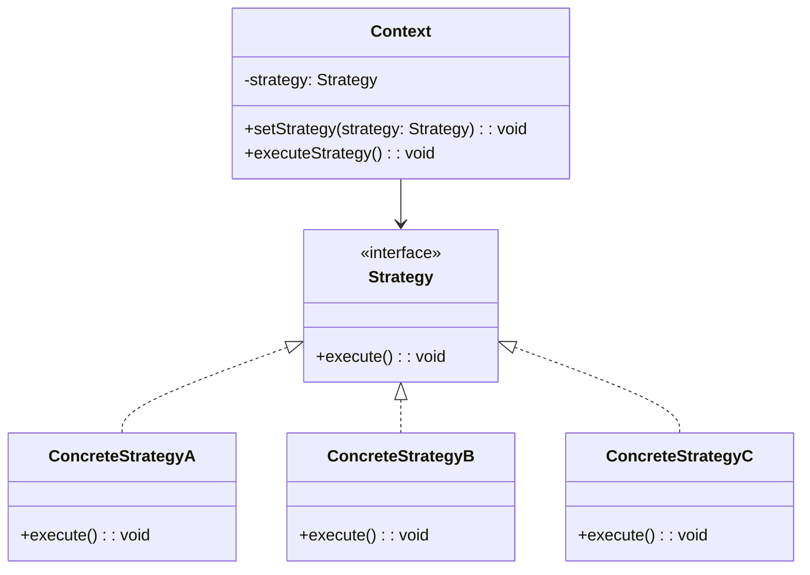

# Design Pattern : Strategy

## 1. Introduction

### Objectifs du cours
Après ce cours, vous serez capable de :
- Comprendre le pattern Strategy et ses applications
- Remplacer les structures `if/else` et `switch` complexes par des stratégies
- Implémenter différents algorithmes interchangeables
- Gérer dynamiquement le comportement d'une classe
- Appliquer Strategy pour les calculs de TVA, tarification, validation

### Scope et applications
Le pattern Strategy est particulièrement utile dans les applications web métier pour :
- Calculs de prix avec différentes règles (TVA, promotions, tarification)
- Algorithmes de tri ou de filtrage variables
- Stratégies de paiement ou d'authentification
- Règles métier différentes selon le contexte
- Validation de données avec règles multiples

---

## 2. Définitions et concepts clés

### 2.1 Qu'est-ce que le pattern Strategy ?

Le **Strategy** est un pattern comportemental qui permet de définir une **famille d'algorithmes**, de les **encapsuler** chacun dans une classe, et de les rendre **interchangeables**. Le pattern Strategy permet à l'algorithme de varier indépendamment des clients qui l'utilisent.

**Analogie de la vie quotidienne :**
Imaginez que vous devez vous rendre au travail. Vous avez plusieurs stratégies :
- 🚗 En voiture (rapide mais cher en essence)
- 🚌 En bus (économique mais lent)
- 🚲 À vélo (écologique mais fatigant)
- 🚶 À pied (gratuit mais très lent)

Chaque jour, vous **choisissez** une stratégie selon le contexte (météo, budget, temps disponible). Le but reste le même (aller au travail), mais la **méthode change**. C'est exactement le principe du pattern Strategy !

### 2.2 Concepts clés

| Concept | Description |
|---------|-------------|
| **Strategy** | Interface commune pour tous les algorithmes |
| **Concrete Strategy** | Implémentation spécifique d'un algorithme |
| **Context** | Classe qui utilise une stratégie |
| **Interchangeabilité** | Possibilité de changer de stratégie à l'exécution |
| **Encapsulation** | Chaque algorithme dans sa propre classe |

---

## 3. Pourquoi utiliser le pattern Strategy ?

### 3.1 Problèmes sans Strategy

**❌ Problème 1 : if/else en cascade**
```typescript
class PriceCalculator {
  calculatePrice(product: Product, customerType: string): number {
    let price = product.basePrice;
    
    if (customerType === 'regular') {
      // Pas de réduction
      return price;
    } else if (customerType === 'premium') {
      // 10% de réduction
      return price * 0.9;
    } else if (customerType === 'vip') {
      // 20% de réduction
      return price * 0.8;
    } else if (customerType === 'employee') {
      // 50% de réduction
      return price * 0.5;
    } else if (customerType === 'partner') {
      // 15% de réduction
      return price * 0.85;
    } else {
      return price;
    }
  }
}

// ❌ Problèmes :
// - Difficile à tester chaque cas
// - Difficile à ajouter un nouveau type
// - Viole Open/Closed principle
// - Code dupliqué et peu maintenable
```

**❌ Problème 2 : Switch géant**
```typescript
function calculateTax(amount: number, country: string): number {
  switch (country) {
    case 'FR':
      return amount * 0.20;  // TVA française 20%
    case 'BE':
      return amount * 0.21;  // TVA belge 21%
    case 'DE':
      return amount * 0.19;  // TVA allemande 19%
    case 'ES':
      return amount * 0.21;  // TVA espagnole 21%
    case 'IT':
      return amount * 0.22;  // TVA italienne 22%
    // ... 27 pays de l'UE
    default:
      return amount * 0.20;
  }
}

// ❌ Problèmes :
// - Fonction qui grandit sans cesse
// - Impossible d'ajouter des règles complexes (réduit/plein/super-réduit)
// - Difficile à tester
// - Pas de réutilisation possible
```

**❌ Problème 3 : Logique métier dispersée**
```typescript
class Order {
  calculateShipping(weight: number, destination: string, express: boolean): number {
    if (express) {
      if (destination === 'domestic') {
        if (weight < 1) return 15;
        else if (weight < 5) return 25;
        else return 40;
      } else {
        if (weight < 1) return 50;
        else if (weight < 5) return 80;
        else return 120;
      }
    } else {
      if (destination === 'domestic') {
        if (weight < 1) return 5;
        else if (weight < 5) return 10;
        else return 20;
      } else {
        if (weight < 1) return 20;
        else if (weight < 5) return 35;
        else return 50;
      }
    }
  }
}

// ❌ Complexité cyclomatique très élevée
// ❌ Impossible à lire et maintenir
// ❌ Risque de bugs élevé
```

### 3.2 Avantages du Strategy

| Avantage | Description |
|----------|-------------|
| **Élimination des if/else** | Code plus clair et structuré |
| **Open/Closed** | Ajout de stratégies sans modifier le code existant |
| **Single Responsibility** | Chaque stratégie dans sa classe |
| **Testabilité** | Tests unitaires simples par stratégie |
| **Réutilisabilité** | Stratégies utilisables ailleurs |
| **Runtime flexibility** | Changement de stratégie à l'exécution |

---

## 4. Implémentation du pattern Strategy

### 4.1 Structure de base



### 4.2 Exemple concret : Calcul de TVA

**✅ Implémentation avec Strategy**
```typescript
// 1. Interface Strategy
interface TaxStrategy {
  calculateTax(amount: number): number;
  getTaxRate(): number;
  getCountry(): string;
}

// 2. Concrete Strategies
class FrenchTaxStrategy implements TaxStrategy {
  calculateTax(amount: number): number {
    return amount * 0.20;
  }
  
  getTaxRate(): number {
    return 0.20;
  }
  
  getCountry(): string {
    return 'France';
  }
}

class BelgianTaxStrategy implements TaxStrategy {
  calculateTax(amount: number): number {
    return amount * 0.21;
  }
  
  getTaxRate(): number {
    return 0.21;
  }
  
  getCountry(): string {
    return 'Belgium';
  }
}

class GermanTaxStrategy implements TaxStrategy {
  calculateTax(amount: number): number {
    return amount * 0.19;
  }
  
  getTaxRate(): number {
    return 0.19;
  }
  
  getCountry(): string {
    return 'Germany';
  }
}

// Stratégie avec logique plus complexe
class SwissTaxStrategy implements TaxStrategy {
  calculateTax(amount: number): number {
    // Suisse : TVA progressive selon le montant
    if (amount < 100) {
      return amount * 0.077; // 7.7% taux réduit
    } else if (amount < 1000) {
      return amount * 0.077; // 7.7% taux normal
    } else {
      return amount * 0.077; // 7.7% (simplifié pour l'exemple)
    }
  }
  
  getTaxRate(): number {
    return 0.077;
  }
  
  getCountry(): string {
    return 'Switzerland';
  }
}

// 3. Context
class PriceCalculator {
  private taxStrategy: TaxStrategy;
  
  constructor(taxStrategy: TaxStrategy) {
    this.taxStrategy = taxStrategy;
  }
  
  // Permet de changer la stratégie à l'exécution
  setTaxStrategy(taxStrategy: TaxStrategy): void {
    this.taxStrategy = taxStrategy;
  }
  
  calculateTotalPrice(basePrice: number): number {
    const tax = this.taxStrategy.calculateTax(basePrice);
    return basePrice + tax;
  }
  
  getTaxInfo(): string {
    return `Tax rate for ${this.taxStrategy.getCountry()}: ${this.taxStrategy.getTaxRate() * 100}%`;
  }
}

// 4. Utilisation
const calculator = new PriceCalculator(new FrenchTaxStrategy());
console.log(calculator.calculateTotalPrice(100)); // 120€
console.log(calculator.getTaxInfo()); // Tax rate for France: 20%

// Changement de stratégie
calculator.setTaxStrategy(new GermanTaxStrategy());
console.log(calculator.calculateTotalPrice(100)); // 119€
console.log(calculator.getTaxInfo()); // Tax rate for Germany: 19%
```

### 4.3 Exemple : Discount Strategy (Promotions)

```typescript
// Interface pour les stratégies de réduction
interface DiscountStrategy {
  applyDiscount(price: number): number;
  getDescription(): string;
}

// Pas de réduction
class NoDiscountStrategy implements DiscountStrategy {
  applyDiscount(price: number): number {
    return price;
  }
  
  getDescription(): string {
    return 'No discount';
  }
}

// Réduction en pourcentage
class PercentageDiscountStrategy implements DiscountStrategy {
  constructor(private percentage: number) {
    if (percentage < 0 || percentage > 100) {
      throw new Error('Percentage must be between 0 and 100');
    }
  }
  
  applyDiscount(price: number): number {
    return price * (1 - this.percentage / 100);
  }
  
  getDescription(): string {
    return `${this.percentage}% discount`;
  }
}

// Réduction fixe
class FixedAmountDiscountStrategy implements DiscountStrategy {
  constructor(private amount: number) {
    if (amount < 0) {
      throw new Error('Amount must be positive');
    }
  }
  
  applyDiscount(price: number): number {
    return Math.max(0, price - this.amount);
  }
  
  getDescription(): string {
    return `€${this.amount} discount`;
  }
}

// Réduction par paliers
class TieredDiscountStrategy implements DiscountStrategy {
  private tiers = [
    { minAmount: 0, discount: 0 },
    { minAmount: 100, discount: 5 },
    { minAmount: 500, discount: 10 },
    { minAmount: 1000, discount: 15 },
    { minAmount: 5000, discount: 20 }
  ];
  
  applyDiscount(price: number): number {
    let discountPercentage = 0;
    
    for (const tier of this.tiers) {
      if (price >= tier.minAmount) {
        discountPercentage = tier.discount;
      }
    }
    
    return price * (1 - discountPercentage / 100);
  }
  
  getDescription(): string {
    return 'Tiered discount (up to 20%)';
  }
}

// Buy X Get Y Free
class BuyXGetYStrategy implements DiscountStrategy {
  constructor(
    private buyQuantity: number,
    private freeQuantity: number,
    private unitPrice: number
  ) {}
  
  applyDiscount(price: number): number {
    const quantity = Math.floor(price / this.unitPrice);
    const sets = Math.floor(quantity / (this.buyQuantity + this.freeQuantity));
    const freeItems = sets * this.freeQuantity;
    const discountAmount = freeItems * this.unitPrice;
    return price - discountAmount;
  }
  
  getDescription(): string {
    return `Buy ${this.buyQuantity} get ${this.freeQuantity} free`;
  }
}

// Context : Shopping Cart
class ShoppingCart {
  private items: CartItem[] = [];
  private discountStrategy: DiscountStrategy = new NoDiscountStrategy();
  
  addItem(item: CartItem): void {
    this.items.push(item);
  }
  
  setDiscountStrategy(strategy: DiscountStrategy): void {
    this.discountStrategy = strategy;
  }
  
  getSubtotal(): number {
    return this.items.reduce((sum, item) => sum + item.price * item.quantity, 0);
  }
  
  getTotal(): number {
    const subtotal = this.getSubtotal();
    return this.discountStrategy.applyDiscount(subtotal);
  }
  
  getDiscount(): number {
    return this.getSubtotal() - this.getTotal();
  }
  
  getSummary(): string {
    const subtotal = this.getSubtotal();
    const total = this.getTotal();
    const discount = this.getDiscount();
    
    return `
      Subtotal: €${subtotal.toFixed(2)}
      Discount (${this.discountStrategy.getDescription()}): -€${discount.toFixed(2)}
      Total: €${total.toFixed(2)}
    `;
  }
}

interface CartItem {
  name: string;
  price: number;
  quantity: number;
}

// Utilisation
const cart = new ShoppingCart();
cart.addItem({ name: 'Laptop', price: 1000, quantity: 1 });
cart.addItem({ name: 'Mouse', price: 25, quantity: 2 });

// Pas de réduction
console.log(cart.getSummary());
// Subtotal: €1050.00
// Discount (No discount): -€0.00
// Total: €1050.00

// Réduction de 10%
cart.setDiscountStrategy(new PercentageDiscountStrategy(10));
console.log(cart.getSummary());
// Subtotal: €1050.00
// Discount (10% discount): -€105.00
// Total: €945.00

// Réduction par paliers
cart.setDiscountStrategy(new TieredDiscountStrategy());
console.log(cart.getSummary());
// Subtotal: €1050.00
// Discount (Tiered discount (up to 20%)): -€157.50
// Total: €892.50
```

### 4.4 Exemple : Shipping Strategy

```typescript
interface ShippingStrategy {
  calculateCost(weight: number, distance: number): number;
  getEstimatedDays(): number;
  getName(): string;
}

class StandardShippingStrategy implements ShippingStrategy {
  calculateCost(weight: number, distance: number): number {
    return 5 + (weight * 0.5) + (distance * 0.01);
  }
  
  getEstimatedDays(): number {
    return 5;
  }
  
  getName(): string {
    return 'Standard Shipping';
  }
}

class ExpressShippingStrategy implements ShippingStrategy {
  calculateCost(weight: number, distance: number): number {
    return 15 + (weight * 1) + (distance * 0.02);
  }
  
  getEstimatedDays(): number {
    return 2;
  }
  
  getName(): string {
    return 'Express Shipping';
  }
}

class OvernightShippingStrategy implements ShippingStrategy {
  calculateCost(weight: number, distance: number): number {
    return 30 + (weight * 2) + (distance * 0.05);
  }
  
  getEstimatedDays(): number {
    return 1;
  }
  
  getName(): string {
    return 'Overnight Shipping';
  }
}

class FreeShippingStrategy implements ShippingStrategy {
  private minimumOrderAmount: number;
  
  constructor(minimumOrderAmount: number = 50) {
    this.minimumOrderAmount = minimumOrderAmount;
  }
  
  calculateCost(weight: number, distance: number): number {
    return 0; // Gratuit si commande > minimumOrderAmount
  }
  
  getEstimatedDays(): number {
    return 7;
  }
  
  getName(): string {
    return `Free Shipping (orders over €${this.minimumOrderAmount})`;
  }
}

// Utilisation dans un service NestJS
@Injectable()
export class OrderService {
  calculateShippingCost(
    order: Order,
    shippingType: 'standard' | 'express' | 'overnight' | 'free'
  ): number {
    let strategy: ShippingStrategy;
    
    switch (shippingType) {
      case 'standard':
        strategy = new StandardShippingStrategy();
        break;
      case 'express':
        strategy = new ExpressShippingStrategy();
        break;
      case 'overnight':
        strategy = new OvernightShippingStrategy();
        break;
      case 'free':
        strategy = new FreeShippingStrategy(50);
        break;
    }
    
    const weight = order.items.reduce((sum, item) => sum + item.weight, 0);
    const distance = this.calculateDistance(order.shippingAddress);
    
    return strategy.calculateCost(weight, distance);
  }
  
  private calculateDistance(address: Address): number {
    // Calcul de la distance
    return 100; // km (exemple)
  }
}
```

### 4.5 Exemple : Sorting Strategy (Angular)

```typescript
// Stratégies de tri
interface SortStrategy<T> {
  sort(items: T[]): T[];
  getName(): string;
}

class AlphabeticalSortStrategy implements SortStrategy<Product> {
  sort(items: Product[]): Product[] {
    return [...items].sort((a, b) => a.name.localeCompare(b.name));
  }
  
  getName(): string {
    return 'A-Z';
  }
}

class PriceAscendingSortStrategy implements SortStrategy<Product> {
  sort(items: Product[]): Product[] {
    return [...items].sort((a, b) => a.price - b.price);
  }
  
  getName(): string {
    return 'Price: Low to High';
  }
}

class PriceDescendingSortStrategy implements SortStrategy<Product> {
  sort(items: Product[]): Product[] {
    return [...items].sort((a, b) => b.price - a.price);
  }
  
  getName(): string {
    return 'Price: High to Low';
  }
}

class DateSortStrategy implements SortStrategy<Product> {
  sort(items: Product[]): Product[] {
    return [...items].sort((a, b) => 
      new Date(b.createdAt).getTime() - new Date(a.createdAt).getTime()
    );
  }
  
  getName(): string {
    return 'Newest First';
  }
}

class PopularitySortStrategy implements SortStrategy<Product> {
  sort(items: Product[]): Product[] {
    return [...items].sort((a, b) => b.salesCount - a.salesCount);
  }
  
  getName(): string {
    return 'Most Popular';
  }
}

// Composant Angular
@Component({
  selector: 'app-product-list',
  template: `
    <div class="sort-controls">
      <label>Sort by:</label>
      <select (change)="onSortChange($event)">
        <option value="alphabetical">A-Z</option>
        <option value="price-asc">Price: Low to High</option>
        <option value="price-desc">Price: High to Low</option>
        <option value="date">Newest First</option>
        <option value="popularity">Most Popular</option>
      </select>
    </div>
    
    <div class="product-grid">
      <div *ngFor="let product of sortedProducts" class="product-card">
        <h3>{{ product.name }}</h3>
        <p>€{{ product.price }}</p>
      </div>
    </div>
  `
})
export class ProductListComponent implements OnInit {
  products: Product[] = [];
  sortedProducts: Product[] = [];
  private sortStrategy: SortStrategy<Product> = new AlphabeticalSortStrategy();
  
  ngOnInit(): void {
    this.loadProducts();
  }
  
  loadProducts(): void {
    this.productService.getProducts().subscribe(products => {
      this.products = products;
      this.applySort();
    });
  }
  
  onSortChange(event: Event): void {
    const value = (event.target as HTMLSelectElement).value;
    
    switch (value) {
      case 'alphabetical':
        this.sortStrategy = new AlphabeticalSortStrategy();
        break;
      case 'price-asc':
        this.sortStrategy = new PriceAscendingSortStrategy();
        break;
      case 'price-desc':
        this.sortStrategy = new PriceDescendingSortStrategy();
        break;
      case 'date':
        this.sortStrategy = new DateSortStrategy();
        break;
      case 'popularity':
        this.sortStrategy = new PopularitySortStrategy();
        break;
    }
    
    this.applySort();
  }
  
  private applySort(): void {
    this.sortedProducts = this.sortStrategy.sort(this.products);
  }
}

interface Product {
  id: number;
  name: string;
  price: number;
  createdAt: string;
  salesCount: number;
}
```

---

## 5. Erreurs courantes et comment les éviter

### 5.1 Erreurs fréquentes

| Erreur | Problème | Solution |
|--------|----------|----------|
| **Switch dans le Context** | Défait le but du pattern | Utiliser Factory ou Dependency Injection |
| **Stratégies avec état** | Effets de bord | Stratégies stateless et pures |
| **Pas d'interface commune** | Couplage fort | Définir interface claire |
| **Trop de stratégies** | Over-engineering | Grouper si possible |
| **Stratégie inutile** | Une seule implémentation | Utiliser directement |

### 5.2 Exemples d'erreurs

**❌ Erreur 1 : Switch dans le Context**
```typescript
class PaymentProcessor {
  processPayment(amount: number, method: string): void {
    // ❌ Le switch défait le but du pattern
    switch (method) {
      case 'credit-card':
        new CreditCardStrategy().process(amount);
        break;
      case 'paypal':
        new PayPalStrategy().process(amount);
        break;
      case 'crypto':
        new CryptoStrategy().process(amount);
        break;
    }
  }
}
```

**✅ Correction : Injection de la stratégie**
```typescript
class PaymentProcessor {
  constructor(private strategy: PaymentStrategy) {}
  
  processPayment(amount: number): void {
    this.strategy.process(amount);
  }
}

// Création avec Factory
const processor = new PaymentProcessor(
  PaymentStrategyFactory.create('credit-card')
);
```

**❌ Erreur 2 : Stratégie avec état partagé**
```typescript
class TaxStrategy {
  private lastCalculation: number = 0; // ❌ État partagé
  
  calculateTax(amount: number): number {
    this.lastCalculation = amount * 0.2; // ❌ Effet de bord
    return this.lastCalculation;
  }
  
  getLastCalculation(): number {
    return this.lastCalculation; // ❌ État global
  }
}
```

**✅ Correction : Stratégie pure et stateless**
```typescript
class TaxStrategy {
  calculateTax(amount: number): number {
    return amount * 0.2; // ✅ Pure function
  }
}

// Si besoin de tracking, le faire ailleurs
class TaxCalculator {
  private history: number[] = [];
  
  calculateTax(amount: number, strategy: TaxStrategy): number {
    const tax = strategy.calculateTax(amount);
    this.history.push(tax);
    return tax;
  }
}
```

---

## 6. Exercices pratiques

### Exercice 1 : Payment Strategy (Facile)

Créez des stratégies de paiement :
- Credit Card (frais de 2%)
- PayPal (frais de 3.5%)
- Bank Transfer (frais fixes de 1€)
- Cryptocurrency (frais de 1%)

Interface :
```typescript
interface PaymentStrategy {
  processPayment(amount: number): PaymentResult;
  calculateFees(amount: number): number;
}
```

### Exercice 2 : Compression Strategy (Intermédiaire)

Créez des stratégies de compression de fichiers :
- ZIP compression
- GZIP compression
- RAR compression
- No compression

Incluez des méthodes pour compresser et décompresser.

---

## 7. Comportement senior : Recommandations et astuces

### 7.1 Quand utiliser Strategy

**✅ Utilisez Strategy quand :**
- Vous avez des **if/else** ou **switch** multiples sur un type/état
- Plusieurs **algorithmes** font la même chose différemment
- Vous voulez changer le **comportement à l'exécution**
- Chaque algorithme a une **logique complexe** méritant sa classe
- Vous devez respecter **Open/Closed** principle

**❌ N'utilisez PAS Strategy quand :**
- Un simple `if/else` suffit (2-3 cas simples)
- Les algorithmes ne changeront jamais
- Sur-engineering pour des cas triviaux

### 7.2 Astuces de développeur senior

**1. Combinez Strategy avec Factory**
```typescript
class DiscountStrategyFactory {
  static create(customerType: string): DiscountStrategy {
    const strategies: Record<string, DiscountStrategy> = {
      'regular': new NoDiscountStrategy(),
      'premium': new PercentageDiscountStrategy(10),
      'vip': new PercentageDiscountStrategy(20),
      'employee': new PercentageDiscountStrategy(50)
    };
    
    return strategies[customerType] || new NoDiscountStrategy();
  }
}

// Utilisation
const strategy = DiscountStrategyFactory.create(user.type);
const price = strategy.applyDiscount(100);
```

**2. Strategy avec configuration**
```typescript
interface StrategyConfig {
  percentage?: number;
  fixedAmount?: number;
  tiers?: Array<{ min: number; discount: number }>;
}

class ConfigurableDiscountStrategy implements DiscountStrategy {
  constructor(private config: StrategyConfig) {}
  
  applyDiscount(price: number): number {
    if (this.config.percentage) {
      return price * (1 - this.config.percentage / 100);
    }
    if (this.config.fixedAmount) {
      return Math.max(0, price - this.config.fixedAmount);
    }
    // ... autres configurations
    return price;
  }
}
```

**3. Strategy avec Dependency Injection (NestJS)**
```typescript
@Injectable()
export class OrderService {
  constructor(
    @Inject('TAX_STRATEGY') private taxStrategy: TaxStrategy,
    @Inject('SHIPPING_STRATEGY') private shippingStrategy: ShippingStrategy
  ) {}
  
  calculateTotal(order: Order): number {
    const tax = this.taxStrategy.calculateTax(order.subtotal);
    const shipping = this.shippingStrategy.calculateCost(
      order.weight,
      order.distance
    );
    return order.subtotal + tax + shipping;
  }
}

// Configuration dans le module
@Module({
  providers: [
    {
      provide: 'TAX_STRATEGY',
      useFactory: (config: ConfigService) => {
        const country = config.get('COUNTRY');
        return TaxStrategyFactory.create(country);
      },
      inject: [ConfigService]
    }
  ]
})
export class OrderModule {}
```

**4. Chaînage de stratégies**
```typescript
class CompositeDiscountStrategy implements DiscountStrategy {
  constructor(private strategies: DiscountStrategy[]) {}
  
  applyDiscount(price: number): number {
    return this.strategies.reduce(
      (currentPrice, strategy) => strategy.applyDiscount(currentPrice),
      price
    );
  }
  
  getDescription(): string {
    return this.strategies
      .map(s => s.getDescription())
      .join(' + ');
  }
}

// Utilisation : cumuler plusieurs réductions
const compositeDiscount = new CompositeDiscountStrategy([
  new PercentageDiscountStrategy(10),    // -10%
  new FixedAmountDiscountStrategy(5),    // -5€
  new SeasonalDiscountStrategy()         // Réduction saisonnière
]);
```

### 7.3 Best practices

| Pratique | Description |
|----------|-------------|
| **Stratégies pures** | Pas d'effets de bord, fonctions pures |
| **Interface claire** | Méthodes bien nommées et documentées |
| **Factory** | Combiner avec Factory pour création |
| **Immutabilité** | Stratégies ne modifient pas leur état |
| **Tests unitaires** | Tester chaque stratégie indépendamment |
| **Nommage** | Suffixe "Strategy" clair |

---

## 8. Résumé

### Points clés à retenir

Le pattern **Strategy** permet de :
- ✅ **Éliminer** les if/else et switch complexes
- ✅ **Encapsuler** chaque algorithme dans sa classe
- ✅ Rendre les algorithmes **interchangeables**
- ✅ Changer le comportement **à l'exécution**
- ✅ Respecter **Open/Closed** et **Single Responsibility**

### Quand l'utiliser

**✅ OUI** pour :
- Calculs de prix, taxes, promotions
- Algorithmes de tri, filtrage, validation
- Stratégies de paiement, livraison
- Règles métier variables

**❌ NON** pour :
- Simple if/else (2-3 cas)
- Algorithme qui ne change jamais
- Sur-engineering

### Template de base

```typescript
// 1. Interface
interface Strategy {
  execute(data: any): any;
}

// 2. Implémentations
class ConcreteStrategyA implements Strategy {
  execute(data: any): any {
    // Implémentation A
  }
}

class ConcreteStrategyB implements Strategy {
  execute(data: any): any {
    // Implémentation B
  }
}

// 3. Context
class Context {
  constructor(private strategy: Strategy) {}
  
  setStrategy(strategy: Strategy): void {
    this.strategy = strategy;
  }
  
  doSomething(data: any): any {
    return this.strategy.execute(data);
  }
}

// 4. Utilisation
const context = new Context(new ConcreteStrategyA());
const result = context.doSomething(data);
```

---

## 9. Ressources complémentaires

### Français
- 📚 [Refactoring Guru - Strategy](https://refactoring.guru/fr/design-patterns/strategy)
- 🎥 [Grafikart - Strategy Pattern](https://grafikart.fr/tutoriels/strategy-1069)
- 📖 [Design Patterns en TypeScript](https://blog.logrocket.com/design-patterns-in-typescript/)

### Anglais
- 📚 [TypeScript Design Patterns - Strategy](https://sbcode.net/typescript/strategy/)
- 🎥 [Strategy Pattern - Fireship](https://www.youtube.com/watch?v=v9ejT8FO-7I)
- 📖 [Head First Design Patterns](https://www.oreilly.com/library/view/head-first-design/0596007124/)

### Documentation
- [RxJS - Operators as Strategies](https://rxjs.dev/guide/operators)
- [Angular - Custom Form Validators](https://angular.io/guide/form-validation#custom-validators)
- [NestJS - Custom Decorators](https://docs.nestjs.com/custom-decorators)

---

**En une phrase :**

> Le pattern Strategy permet de définir une famille d'algorithmes interchangeables, éliminant les if/else complexes en encapsulant chaque algorithme dans sa propre classe, particulièrement utile pour les calculs de prix, taxes et règles métier dans les applications web.
