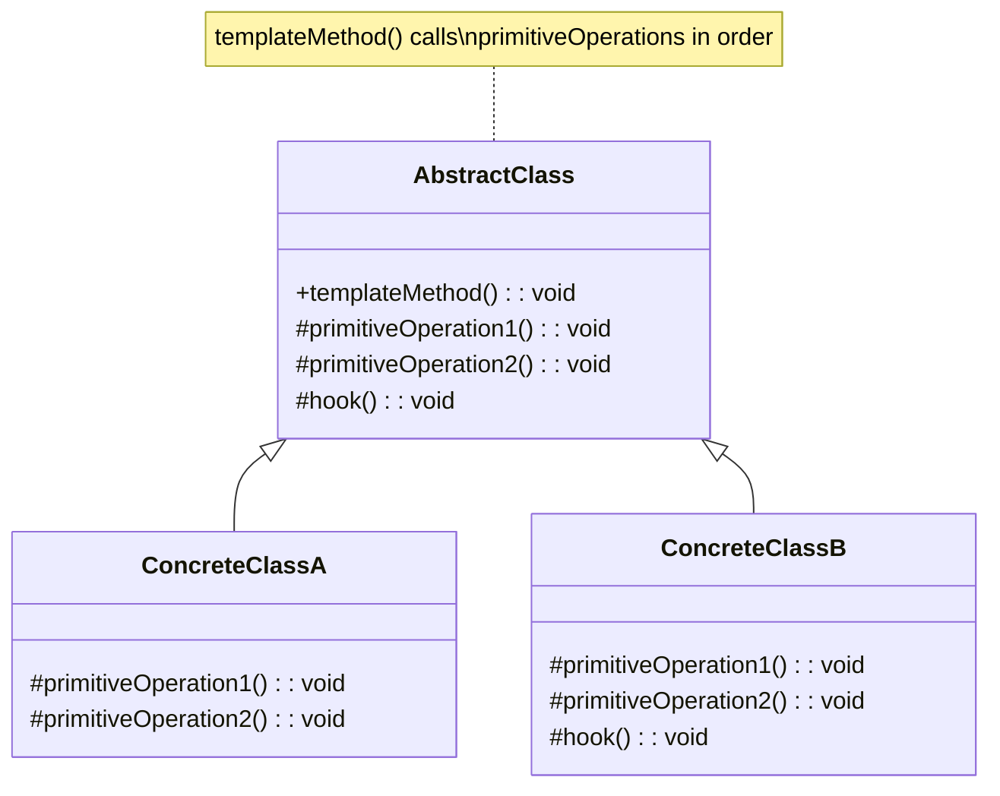

# Design Pattern : Template Method

## 1. Introduction

### Objectifs du cours
Après ce cours, vous serez capable de :
- Comprendre le pattern Template Method
- Créer des workflows réutilisables avec étapes communes
- Implémenter des algorithmes avec parties variables
- Utiliser l'héritage pour étendre le comportement
- Appliquer le principe Hollywood : "Don't call us, we'll call you"

### Scope et applications
Le pattern Template Method est utilisé dans les applications web métier pour :
- **Workflows métier** : processus de validation, approbation
- **Pipelines de traitement** : import/export de données
- **Hooks de cycle de vie** : Angular lifecycle hooks
- **Validation en étapes** : formulaires multi-étapes
- **Algorithmes avec variantes** : génération de rapports
- **Intégrations API** : flux d'authentification OAuth

---

## 2. Définitions et concepts clés

### 2.1 Qu'est-ce que le pattern Template Method ?

Le **Template Method** est un pattern comportemental qui définit le **squelette d'un algorithme** dans une classe de base, tout en laissant les **sous-classes redéfinir certaines étapes** sans changer la structure globale.

**Analogie de la vie quotidienne :**
Imaginez une **recette de cuisine** pour faire un gâteau :
- **Étapes communes** (template) :
  1. Préchauffer le four
  2. **Préparer la pâte** (varie selon le gâteau)
  3. Verser dans le moule
  4. **Cuire** (temps varie)
  5. Laisser refroidir
  6. **Décorer** (varie selon le gâteau)
- Les étapes 1, 3, 5 sont **toujours les mêmes**
- Les étapes 2, 4, 6 **varient** selon le type de gâteau
- L'**ordre** ne change jamais

De la même façon en programmation :
- **Template Method** : Méthode qui définit l'algorithme complet
- **Étapes concrètes** : Implémentées dans la classe de base
- **Étapes abstraites** : À implémenter dans les sous-classes
- **Ordre fixe** : La séquence ne change pas

### 2.2 Concepts clés

| Concept | Description |
|---------|-------------|
| **Template Method** | Méthode qui définit le squelette de l'algorithme |
| **Abstract Class** | Classe de base avec template method |
| **Concrete Methods** | Étapes communes implémentées |
| **Abstract/Hook Methods** | Étapes à implémenter par sous-classes |
| **Invariant** | Structure de l'algorithme fixe |

### 2.3 Structure du Template Method



---

## 3. Pourquoi utiliser le pattern Template Method ?

### 3.1 Problèmes sans Template Method

**❌ Problème 1 : Code dupliqué**
```typescript
// ❌ Même structure répétée partout
class CsvExporter {
  export(data: any[]): string {
    // Validation
    if (!data || data.length === 0) {
      throw new Error('No data');
    }
    
    // Transformation
    const rows = data.map(item => Object.values(item).join(','));
    
    // En-têtes
    const headers = Object.keys(data[0]).join(',');
    
    // Assemblage
    return [headers, ...rows].join('\n');
  }
}

class JsonExporter {
  export(data: any[]): string {
    // ❌ Même validation répétée
    if (!data || data.length === 0) {
      throw new Error('No data');
    }
    
    // Transformation différente
    return JSON.stringify(data, null, 2);
  }
}

class XmlExporter {
  export(data: any[]): string {
    // ❌ Encore la même validation
    if (!data || data.length === 0) {
      throw new Error('No data');
    }
    
    // Transformation différente
    let xml = '<items>\n';
    data.forEach(item => {
      xml += '  <item>\n';
      // ...
    });
    xml += '</items>';
    return xml;
  }
}
```

**❌ Problème 2 : Workflow incohérent**
```typescript
// ❌ Ordre des étapes différent partout
class UserRegistration {
  register(user: User): void {
    this.validate(user);
    this.save(user);
    this.sendEmail(user);
  }
}

class AdminRegistration {
  register(user: User): void {
    // ❌ Oubli de la validation !
    this.save(user);
    this.sendEmail(user);
    this.assignAdminRole(user);
  }
}
```

### 3.2 Avantages du Template Method

| Avantage | Description |
|----------|-------------|
| **Réutilisation** | Code commun centralisé |
| **Cohérence** | Structure uniforme garantie |
| **Extensibilité** | Facile d'ajouter nouvelles variantes |
| **Maintenance** | Changements centralisés |
| **Open/Closed** | Ouvert à l'extension, fermé à la modification |

---

## 4. Implémentation du pattern Template Method

### 4.1 Template Method simple

```typescript
// Classe abstraite avec template method
abstract class DataExporter {
  // Template Method - définit l'algorithme complet
  export(data: any[]): string {
    // Étape 1 : Validation (commune)
    this.validate(data);
    
    // Étape 2 : Pré-traitement (hook optionnel)
    const processedData = this.preProcess(data);
    
    // Étape 3 : Formatage (varie selon sous-classe)
    const formatted = this.format(processedData);
    
    // Étape 4 : Post-traitement (hook optionnel)
    return this.postProcess(formatted);
  }
  
  // Méthode concrète (commune à tous)
  protected validate(data: any[]): void {
    if (!data || data.length === 0) {
      throw new Error('No data to export');
    }
    console.log(`✓ Validated ${data.length} items`);
  }
  
  // Hook method (optionnel, implémentation par défaut)
  protected preProcess(data: any[]): any[] {
    return data;
  }
  
  // Méthode abstraite (doit être implémentée)
  protected abstract format(data: any[]): string;
  
  // Hook method (optionnel)
  protected postProcess(output: string): string {
    return output;
  }
}

// Implémentation concrète : CSV
class CsvExporter extends DataExporter {
  protected format(data: any[]): string {
    console.log('Formatting as CSV');
    const headers = Object.keys(data[0]).join(',');
    const rows = data.map(item => Object.values(item).join(','));
    return [headers, ...rows].join('\n');
  }
}

// Implémentation concrète : JSON
class JsonExporter extends DataExporter {
  protected format(data: any[]): string {
    console.log('Formatting as JSON');
    return JSON.stringify(data, null, 2);
  }
  
  // Surcharge du hook postProcess
  protected postProcess(output: string): string {
    // Ajouter timestamp
    return `// Generated: ${new Date().toISOString()}\n${output}`;
  }
}

// Implémentation concrète : XML
class XmlExporter extends DataExporter {
  protected format(data: any[]): string {
    console.log('Formatting as XML');
    let xml = '<items>\n';
    data.forEach(item => {
      xml += '  <item>\n';
      Object.entries(item).forEach(([key, value]) => {
        xml += `    <${key}>${value}</${key}>\n`;
      });
      xml += '  </item>\n';
    });
    xml += '</items>';
    return xml;
  }
}

// Utilisation
const data = [
  { id: 1, name: 'John', age: 30 },
  { id: 2, name: 'Jane', age: 25 }
];

const csvExporter = new CsvExporter();
console.log(csvExporter.export(data));
// ✓ Validated 2 items
// Formatting as CSV
// id,name,age
// 1,John,30
// 2,Jane,25

const jsonExporter = new JsonExporter();
console.log(jsonExporter.export(data));
// ✓ Validated 2 items
// Formatting as JSON
// // Generated: 2024-01-15T10:30:00.000Z
// [
//   { "id": 1, "name": "John", "age": 30 },
//   { "id": 2, "name": "Jane", "age": 25 }
// ]
```

### 4.2 Workflow métier avec Template Method

```typescript
// Workflow de validation de commande
abstract class OrderProcessor {
  // Template Method
  async processOrder(order: Order): Promise<OrderResult> {
    console.log('=== Starting order processing ===');
    
    try {
      // 1. Validation (commune)
      await this.validateOrder(order);
      
      // 2. Vérifier stock (varie)
      await this.checkInventory(order);
      
      // 3. Calcul prix (varie)
      const total = await this.calculateTotal(order);
      
      // 4. Paiement (varie)
      const payment = await this.processPayment(total);
      
      // 5. Créer commande (commune)
      const createdOrder = await this.createOrder(order, total, payment);
      
      // 6. Post-traitement (hook)
      await this.afterOrderCreated(createdOrder);
      
      return {
        success: true,
        orderId: createdOrder.id
      };
      
    } catch (error) {
      console.error('Order processing failed:', error);
      return {
        success: false,
        error: error.message
      };
    }
  }
  
  // Méthodes concrètes (communes)
  protected async validateOrder(order: Order): Promise<void> {
    if (!order.items || order.items.length === 0) {
      throw new Error('Order has no items');
    }
    console.log('✓ Order validated');
  }
  
  protected async createOrder(
    order: Order,
    total: number,
    payment: Payment
  ): Promise<CreatedOrder> {
    console.log('Creating order in database');
    return {
      id: Math.floor(Math.random() * 1000),
      ...order,
      total,
      paymentId: payment.id,
      status: 'confirmed'
    };
  }
  
  // Méthodes abstraites (à implémenter)
  protected abstract checkInventory(order: Order): Promise<void>;
  protected abstract calculateTotal(order: Order): Promise<number>;
  protected abstract processPayment(amount: number): Promise<Payment>;
  
  // Hook (optionnel)
  protected async afterOrderCreated(order: CreatedOrder): Promise<void> {
    // Par défaut : ne fait rien
  }
}

// Commande B2C (consommateur)
class B2COrderProcessor extends OrderProcessor {
  protected async checkInventory(order: Order): Promise<void> {
    console.log('Checking B2C inventory');
    // Vérification stock standard
    for (const item of order.items) {
      if (item.quantity > 5) {
        throw new Error(`Maximum 5 items per product for B2C`);
      }
    }
  }
  
  protected async calculateTotal(order: Order): Promise<number> {
    console.log('Calculating B2C total');
    const subtotal = order.items.reduce(
      (sum, item) => sum + item.price * item.quantity,
      0
    );
    const tax = subtotal * 0.2;  // 20% TVA
    const shipping = subtotal > 50 ? 0 : 5;  // Livraison gratuite > 50€
    return subtotal + tax + shipping;
  }
  
  protected async processPayment(amount: number): Promise<Payment> {
    console.log('Processing B2C payment via card');
    return {
      id: 'PAY_' + Date.now(),
      amount,
      method: 'card'
    };
  }
  
  protected async afterOrderCreated(order: CreatedOrder): Promise<void> {
    console.log('Sending confirmation email to customer');
  }
}

// Commande B2B (entreprise)
class B2BOrderProcessor extends OrderProcessor {
  protected async checkInventory(order: Order): Promise<void> {
    console.log('Checking B2B inventory');
    // Pas de limite de quantité pour B2B
  }
  
  protected async calculateTotal(order: Order): Promise<number> {
    console.log('Calculating B2B total');
    const subtotal = order.items.reduce(
      (sum, item) => sum + item.price * item.quantity,
      0
    );
    
    // Remise volume pour B2B
    const discount = subtotal > 1000 ? 0.1 : 0;
    const tax = subtotal * 0.2;
    
    return subtotal * (1 - discount) + tax;
  }
  
  protected async processPayment(amount: number): Promise<Payment> {
    console.log('Processing B2B payment on account (net 30)');
    return {
      id: 'INV_' + Date.now(),
      amount,
      method: 'invoice'
    };
  }
  
  protected async afterOrderCreated(order: CreatedOrder): Promise<void> {
    console.log('Generating invoice PDF');
    console.log('Notifying account manager');
  }
}

interface Order {
  items: OrderItem[];
  customerId: number;
}

interface OrderItem {
  productId: number;
  quantity: number;
  price: number;
}

interface Payment {
  id: string;
  amount: number;
  method: string;
}

interface CreatedOrder extends Order {
  id: number;
  total: number;
  paymentId: string;
  status: string;
}

interface OrderResult {
  success: boolean;
  orderId?: number;
  error?: string;
}

// Utilisation
const b2cOrder: Order = {
  customerId: 1,
  items: [
    { productId: 101, quantity: 2, price: 20 },
    { productId: 102, quantity: 1, price: 35 }
  ]
};

const b2cProcessor = new B2COrderProcessor();
await b2cProcessor.processOrder(b2cOrder);

const b2bProcessor = new B2BOrderProcessor();
await b2bProcessor.processOrder(b2cOrder);
```

### 4.3 Pipeline de traitement de données

```typescript
// Pipeline de traitement générique
abstract class DataPipeline<TInput, TOutput> {
  // Template Method
  async process(input: TInput): Promise<TOutput> {
    console.log('=== Pipeline Started ===');
    
    // 1. Validation
    await this.validate(input);
    
    // 2. Extraction
    const extracted = await this.extract(input);
    
    // 3. Transformation
    const transformed = await this.transform(extracted);
    
    // 4. Enrichissement (optionnel)
    const enriched = await this.enrich(transformed);
    
    // 5. Validation sortie
    await this.validateOutput(enriched);
    
    // 6. Sauvegarde
    const output = await this.save(enriched);
    
    console.log('=== Pipeline Completed ===');
    return output;
  }
  
  // Méthodes abstraites
  protected abstract validate(input: TInput): Promise<void>;
  protected abstract extract(input: TInput): Promise<any>;
  protected abstract transform(data: any): Promise<any>;
  protected abstract save(data: any): Promise<TOutput>;
  
  // Hooks (optionnels)
  protected async enrich(data: any): Promise<any> {
    return data;
  }
  
  protected async validateOutput(data: any): Promise<void> {
    // Par défaut : pas de validation
  }
}

// Pipeline d'import CSV vers DB
class CsvImportPipeline extends DataPipeline<string, ImportResult> {
  protected async validate(csv: string): Promise<void> {
    if (!csv || csv.trim() === '') {
      throw new Error('CSV is empty');
    }
    console.log('✓ CSV validated');
  }
  
  protected async extract(csv: string): Promise<any[]> {
    console.log('Extracting rows from CSV');
    const lines = csv.trim().split('\n');
    const headers = lines[0].split(',');
    
    return lines.slice(1).map(line => {
      const values = line.split(',');
      return headers.reduce((obj, header, i) => {
        obj[header] = values[i];
        return obj;
      }, {} as any);
    });
  }
  
  protected async transform(rows: any[]): Promise<User[]> {
    console.log('Transforming rows to User objects');
    return rows.map(row => ({
      name: row.name,
      email: row.email.toLowerCase(),
      age: parseInt(row.age)
    }));
  }
  
  protected async enrich(users: User[]): Promise<User[]> {
    console.log('Enriching users with default values');
    return users.map(user => ({
      ...user,
      createdAt: new Date(),
      active: true
    }));
  }
  
  protected async validateOutput(users: User[]): Promise<void> {
    for (const user of users) {
      if (!user.email.includes('@')) {
        throw new Error(`Invalid email: ${user.email}`);
      }
    }
    console.log('✓ Output validated');
  }
  
  protected async save(users: User[]): Promise<ImportResult> {
    console.log(`Saving ${users.length} users to database`);
    // Simuler sauvegarde
    return {
      success: true,
      count: users.length,
      users
    };
  }
}

interface User {
  name: string;
  email: string;
  age: number;
  createdAt?: Date;
  active?: boolean;
}

interface ImportResult {
  success: boolean;
  count: number;
  users: User[];
}

// Utilisation
const csv = `name,email,age
John,JOHN@EXAMPLE.COM,30
Jane,jane@example.com,25`;

const pipeline = new CsvImportPipeline();
const result = await pipeline.process(csv);
console.log('Import result:', result);
```

---

## 5. Erreurs courantes et comment les éviter

### 5.1 Erreurs fréquentes

| Erreur | Problème | Solution |
|--------|----------|----------|
| **Trop de méthodes abstraites** | Complexité excessive | Garder simple, hooks par défaut |
| **Template trop rigide** | Pas assez flexible | Ajouter hooks |
| **Héritage profond** | Difficile à maintenir | Limiter à 2-3 niveaux |
| **État partagé** | Effets de bord | Éviter variables d'instance |

---

## 6. Exercices pratiques

### Exercice 1 : Email Sender Template (Facile)
Créez un template pour envoyer des emails avec validation, formatting, et sending qui varie selon le provider (SMTP, SendGrid, Mailgun).

### Exercice 2 : Report Generator (Intermédiaire)
Créez un générateur de rapport avec étapes de collecte de données, calculs, formatage (PDF, Excel, HTML).

---

## 7. Comportement senior : Recommandations et astuces

### 7.1 Quand utiliser Template Method

**✅ Utilisez Template Method quand :**
- **Workflow commun** avec étapes variables
- **Algorithme** avec parties interchangeables
- **Code dupliqué** dans plusieurs classes similaires
- **Ordre fixe** d'opérations
- **Hooks** pour personnalisation

**❌ N'utilisez PAS Template Method quand :**
- Composition est mieux (préférer composition à héritage)
- Algorithme trop simple
- Over-engineering

### 7.2 Préférer Composition quand possible

```typescript
// ⚠️ Template Method avec héritage
abstract class Processor {
  process(): void {
    this.step1();
    this.step2();  // Abstract
    this.step3();
  }
  abstract step2(): void;
}

// ✅ Alternative avec composition
interface Strategy {
  execute(): void;
}

class Processor {
  constructor(private strategy: Strategy) {}
  
  process(): void {
    this.step1();
    this.strategy.execute();  // Composition
    this.step3();
  }
}
```

---

## 8. Résumé

**Le pattern Template Method** permet de :
- ✅ Définir un **squelette d'algorithme**
- ✅ Laisser les **sous-classes** personnaliser les étapes
- ✅ **Réutiliser** le code commun
- ✅ Garantir la **cohérence** du workflow
- ✅ Respecter **Open/Closed**

---

## 9. Ressources complémentaires

### Français
- 📚 [Refactoring Guru - Template Method](https://refactoring.guru/fr/design-patterns/template-method)

### Anglais
- 🎥 [Template Method Pattern](https://www.youtube.com/watch?v=7ocpwK9uesw)
- 📖 [Template Method in TypeScript](https://sbcode.net/typescript/template/)

---

**En une phrase :**

> Le pattern Template Method définit le squelette d'un algorithme dans une classe de base en laissant les sous-classes redéfinir certaines étapes, utilisé dans les webapps pour créer des workflows métier cohérents, des pipelines de traitement de données, et des processus de validation standardisés.
