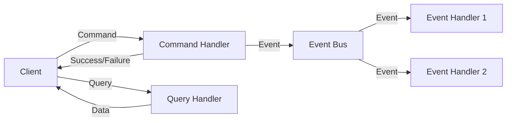

# Command Message — Enterprise Integration Pattern

## 1. Introduction

### Objectifs du cours
À la fin de ce cours, vous serez capable de :
- Comprendre ce qu'est un Command Message et son rôle dans les architectures distribuées
- Différencier Command, Event et Query
- Implémenter des Command Messages avec NestJS et CQRS
- Appliquer les bonnes pratiques de validation et de gestion d'erreurs
- Concevoir des APIs métier robustes basées sur des commandes

### Ce que vous allez apprendre
- La définition et les caractéristiques d'un Command Message
- L'implémentation pratique avec TypeScript/NestJS
- Le pattern CQRS (Command Query Responsibility Segregation)
- Les techniques de validation et d'autorisation
- La gestion des erreurs et des rollbacks

### Scope de la notion
Après ce cours, vous pourrez :
- Structurer vos applications selon le pattern CQRS
- Créer des commandes métier expressives et type-safe
- Implémenter des workflows complexes avec des commandes
- Garantir la cohérence des données dans des systèmes distribués

---

## 2. Définition et Concepts Clés

### 2.1 Qu'est-ce qu'un Command Message ?

Un **Command Message** est un message qui **demande** au système d'effectuer une action spécifique. C'est un ordre, une instruction qui doit être exécutée.

**Analogie de la vie quotidienne :**
Imaginez que vous allez au restaurant. Vous dites au serveur : "Apportez-moi un steak bien cuit". C'est une commande — vous demandez quelque chose de spécifique. Le serveur peut accepter ou refuser (si plus de steak). Une fois acceptée, l'action est effectuée.

### 2.2 Caractéristiques principales

| Caractéristique | Description | Exemple |
|-----------------|-------------|---------|
| **Temps** | Impératif (demande) | "CreateUser", "PlaceOrder", "SendEmail" |
| **Intention** | Demander une action | Action spécifique attendue |
| **Destinataire** | Un seul | La commande va vers un handler spécifique |
| **Réponse** | Succès ou échec | La commande peut être rejetée |
| **État** | Peut modifier l'état | Write operation |

### 2.3 Command vs Event vs Query



**Tableau comparatif complet :**

| Aspect | Command | Event | Query |
|--------|---------|-------|-------|
| **Verbe** | Impératif | Passé | Interrogatif |
| **Exemple** | `PlaceOrder` | `OrderPlaced` | `GetOrderById` |
| **Action** | Modifier l'état | Notifier | Lire l'état |
| **Destinataires** | 1 seul | N (0 à plusieurs) | 1 seul |
| **Réponse** | Succès/Échec | Aucune | Données |
| **Rejet** | Possible | Impossible | N/A |
| **Idempotence** | Important | Crucial | Naturelle |

**Exemples concrets :**

```typescript
// ❌ COMMAND - Demande une action
interface CreateUserCommand {
  firstName: string;
  lastName: string;
  email: string;
}
// Réponse : User créé OU erreur de validation

// ❌ EVENT - Notifie un fait accompli
interface UserCreatedEvent {
  userId: string;
  email: string;
  timestamp: Date;
}
// Pas de réponse attendue

// ❌ QUERY - Demande des données
interface GetUserByIdQuery {
  userId: string;
}
// Réponse : User OU null
```

---

## 3. Cas d'usage métier dans les webapps

### 3.1 E-commerce : Passer une commande

**Scénario :** Un client valide son panier et passe commande.

```typescript
// Command
export class PlaceOrderCommand {
  constructor(
    public readonly customerId: string,
    public readonly items: OrderItem[],
    public readonly shippingAddress: Address,
    public readonly paymentMethod: PaymentMethod,
  ) {}
}

// Command Handler
@CommandHandler(PlaceOrderCommand)
export class PlaceOrderHandler implements ICommandHandler<PlaceOrderCommand> {
  constructor(
    private readonly orderRepository: OrderRepository,
    private readonly inventoryService: InventoryService,
    private readonly paymentService: PaymentService,
    private readonly eventBus: EventBus,
  ) {}

  async execute(command: PlaceOrderCommand): Promise<OrderResult> {
    // 1. Validation métier
    await this.validateCommand(command);
    
    // 2. Vérifier la disponibilité du stock
    const stockAvailable = await this.inventoryService.checkAvailability(
      command.items,
    );
    
    if (!stockAvailable) {
      throw new InsufficientStockException('Some items are out of stock');
    }
    
    // 3. Créer la commande
    const order = Order.create({
      customerId: command.customerId,
      items: command.items,
      shippingAddress: command.shippingAddress,
      status: OrderStatus.PENDING,
    });
    
    // 4. Réserver le stock
    await this.inventoryService.reserveStock(order.items);
    
    // 5. Traiter le paiement
    try {
      const payment = await this.paymentService.processPayment({
        orderId: order.id,
        amount: order.total,
        method: command.paymentMethod,
      });
      
      order.confirmPayment(payment.id);
    } catch (error) {
      // Rollback de la réservation
      await this.inventoryService.releaseStock(order.items);
      throw new PaymentFailedException('Payment processing failed', error);
    }
    
    // 6. Sauvegarder la commande
    await this.orderRepository.save(order);
    
    // 7. Publier l'événement (après le succès de la commande)
    this.eventBus.publish(new OrderPlacedEvent({
      orderId: order.id,
      customerId: order.customerId,
      total: order.total,
      items: order.items,
    }));
    
    return {
      success: true,
      orderId: order.id,
    };
  }
  
  private async validateCommand(command: PlaceOrderCommand): Promise<void> {
    if (!command.items || command.items.length === 0) {
      throw new ValidationException('Order must contain at least one item');
    }
    
    if (!command.shippingAddress) {
      throw new ValidationException('Shipping address is required');
    }
    
    // Vérifier que le client existe
    const customerExists = await this.customerRepository.exists(
      command.customerId,
    );
    
    if (!customerExists) {
      throw new NotFoundException('Customer not found');
    }
  }
}
```

**Utilisation dans un controller :**

```typescript
@Controller('orders')
export class OrdersController {
  constructor(private readonly commandBus: CommandBus) {}

  @Post()
  async createOrder(@Body() dto: CreateOrderDto): Promise<OrderResponse> {
    const command = new PlaceOrderCommand(
      dto.customerId,
      dto.items,
      dto.shippingAddress,
      dto.paymentMethod,
    );
    
    try {
      const result = await this.commandBus.execute(command);
      
      return {
        success: true,
        orderId: result.orderId,
        message: 'Order placed successfully',
      };
    } catch (error) {
      if (error instanceof ValidationException) {
        throw new BadRequestException(error.message);
      }
      if (error instanceof InsufficientStockException) {
        throw new ConflictException(error.message);
      }
      if (error instanceof PaymentFailedException) {
        throw new PaymentRequiredException(error.message);
      }
      
      throw new InternalServerErrorException('Failed to place order');
    }
  }
}
```

### 3.2 Gestion d'utilisateurs : Création et mise à jour

```typescript
// Command pour créer un utilisateur
export class CreateUserCommand {
  constructor(
    public readonly email: string,
    public readonly firstName: string,
    public readonly lastName: string,
    public readonly password: string,
    public readonly role: UserRole,
  ) {}
}

@CommandHandler(CreateUserCommand)
export class CreateUserHandler implements ICommandHandler<CreateUserCommand> {
  constructor(
    private readonly userRepository: UserRepository,
    private readonly passwordHasher: PasswordHasher,
    private readonly eventBus: EventBus,
  ) {}

  async execute(command: CreateUserCommand): Promise<CreateUserResult> {
    // 1. Vérifier que l'email n'existe pas déjà
    const existingUser = await this.userRepository.findByEmail(command.email);
    
    if (existingUser) {
      throw new ConflictException('User with this email already exists');
    }
    
    // 2. Hacher le mot de passe
    const hashedPassword = await this.passwordHasher.hash(command.password);
    
    // 3. Créer l'utilisateur
    const user = User.create({
      email: command.email,
      firstName: command.firstName,
      lastName: command.lastName,
      password: hashedPassword,
      role: command.role,
    });
    
    // 4. Sauvegarder
    await this.userRepository.save(user);
    
    // 5. Publier événement
    this.eventBus.publish(new UserCreatedEvent({
      userId: user.id,
      email: user.email,
      firstName: user.firstName,
      lastName: user.lastName,
    }));
    
    return {
      userId: user.id,
      email: user.email,
    };
  }
}

// Command pour mettre à jour un utilisateur
export class UpdateUserProfileCommand {
  constructor(
    public readonly userId: string,
    public readonly updates: {
      firstName?: string;
      lastName?: string;
      phoneNumber?: string;
    },
  ) {}
}

@CommandHandler(UpdateUserProfileCommand)
export class UpdateUserProfileHandler 
  implements ICommandHandler<UpdateUserProfileCommand> {
  
  async execute(command: UpdateUserProfileCommand): Promise<void> {
    const user = await this.userRepository.findById(command.userId);
    
    if (!user) {
      throw new NotFoundException('User not found');
    }
    
    // Appliquer les changements
    if (command.updates.firstName) {
      user.updateFirstName(command.updates.firstName);
    }
    
    if (command.updates.lastName) {
      user.updateLastName(command.updates.lastName);
    }
    
    if (command.updates.phoneNumber) {
      user.updatePhoneNumber(command.updates.phoneNumber);
    }
    
    await this.userRepository.save(user);
    
    this.eventBus.publish(new UserProfileUpdatedEvent({
      userId: user.id,
      updatedFields: Object.keys(command.updates),
    }));
  }
}
```

### 3.3 Workflow métier : Approbation de document

```typescript
// Command pour soumettre un document à l'approbation
export class SubmitDocumentForApprovalCommand {
  constructor(
    public readonly documentId: string,
    public readonly submittedBy: string,
    public readonly approvers: string[],
    public readonly comments?: string,
  ) {}
}

@CommandHandler(SubmitDocumentForApprovalCommand)
export class SubmitDocumentForApprovalHandler 
  implements ICommandHandler<SubmitDocumentForApprovalCommand> {
  
  async execute(command: SubmitDocumentForApprovalCommand): Promise<void> {
    // 1. Récupérer le document
    const document = await this.documentRepository.findById(command.documentId);
    
    if (!document) {
      throw new NotFoundException('Document not found');
    }
    
    // 2. Vérifier que l'utilisateur peut soumettre
    if (document.createdBy !== command.submittedBy) {
      throw new ForbiddenException('Only document owner can submit for approval');
    }
    
    // 3. Vérifier l'état du document
    if (document.status !== DocumentStatus.DRAFT) {
      throw new BadRequestException('Only draft documents can be submitted');
    }
    
    // 4. Créer le workflow d'approbation
    const workflow = ApprovalWorkflow.create({
      documentId: command.documentId,
      approvers: command.approvers,
      currentLevel: 0,
    });
    
    // 5. Mettre à jour le document
    document.submitForApproval(workflow.id);
    
    // 6. Sauvegarder
    await this.documentRepository.save(document);
    await this.workflowRepository.save(workflow);
    
    // 7. Publier événement
    this.eventBus.publish(new DocumentSubmittedForApprovalEvent({
      documentId: document.id,
      workflowId: workflow.id,
      firstApprover: command.approvers[0],
    }));
  }
}

// Command pour approuver un document
export class ApproveDocumentCommand {
  constructor(
    public readonly documentId: string,
    public readonly approverId: string,
    public readonly comments?: string,
  ) {}
}

@CommandHandler(ApproveDocumentCommand)
export class ApproveDocumentHandler 
  implements ICommandHandler<ApproveDocumentCommand> {
  
  async execute(command: ApproveDocumentCommand): Promise<void> {
    const document = await this.documentRepository.findById(command.documentId);
    const workflow = await this.workflowRepository.findByDocumentId(
      command.documentId,
    );
    
    // Validation
    if (!workflow.isCurrentApprover(command.approverId)) {
      throw new ForbiddenException('You are not authorized to approve at this stage');
    }
    
    // Enregistrer l'approbation
    workflow.approve(command.approverId, command.comments);
    
    // Si workflow terminé
    if (workflow.isComplete()) {
      document.markAsApproved();
      
      this.eventBus.publish(new DocumentFullyApprovedEvent({
        documentId: document.id,
      }));
    } else {
      // Passer au prochain niveau
      workflow.moveToNextLevel();
      
      this.eventBus.publish(new DocumentApprovedAtLevelEvent({
        documentId: document.id,
        level: workflow.currentLevel,
        nextApprover: workflow.getCurrentApprover(),
      }));
    }
    
    await this.documentRepository.save(document);
    await this.workflowRepository.save(workflow);
  }
}
```

---

## 4. Implémentation CQRS avec NestJS

### 4.1 Setup du projet

**Installation :**

```bash
npm install @nestjs/cqrs
```

**Configuration du module :**

```typescript
// app.module.ts
import { Module } from '@nestjs/common';
import { CqrsModule } from '@nestjs/cqrs';
import { OrderModule } from './order/order.module';

@Module({
  imports: [
    CqrsModule,
    OrderModule,
  ],
})
export class AppModule {}
```

### 4.2 Structure d'un Command

**Bonnes pratiques pour définir une commande :**

```typescript
// commands/create-product.command.ts
export class CreateProductCommand {
  constructor(
    public readonly name: string,
    public readonly description: string,
    public readonly price: number,
    public readonly categoryId: string,
    public readonly stock: number,
  ) {}
}

// Validation avec class-validator
import { IsString, IsNumber, IsUUID, Min, MaxLength } from 'class-validator';

export class CreateProductCommand {
  @IsString()
  @MaxLength(100)
  name: string;

  @IsString()
  @MaxLength(500)
  description: string;

  @IsNumber()
  @Min(0)
  price: number;

  @IsUUID()
  categoryId: string;

  @IsNumber()
  @Min(0)
  stock: number;

  constructor(data: Partial<CreateProductCommand>) {
    Object.assign(this, data);
  }
}
```

### 4.3 Command Handler complet

```typescript
// handlers/create-product.handler.ts
import { CommandHandler, ICommandHandler, EventBus } from '@nestjs/cqrs';
import { CreateProductCommand } from '../commands/create-product.command';

@CommandHandler(CreateProductCommand)
export class CreateProductHandler 
  implements ICommandHandler<CreateProductCommand> {
  
  constructor(
    private readonly productRepository: ProductRepository,
    private readonly categoryRepository: CategoryRepository,
    private readonly eventBus: EventBus,
    private readonly logger: Logger,
  ) {}

  async execute(command: CreateProductCommand): Promise<ProductCreatedResult> {
    this.logger.log(`Executing CreateProductCommand for ${command.name}`);
    
    try {
      // 1. Validation métier
      await this.validateCommand(command);
      
      // 2. Création de l'entité
      const product = Product.create({
        name: command.name,
        description: command.description,
        price: command.price,
        categoryId: command.categoryId,
        stock: command.stock,
      });
      
      // 3. Persistence
      await this.productRepository.save(product);
      
      // 4. Événement de succès
      this.eventBus.publish(new ProductCreatedEvent({
        productId: product.id,
        name: product.name,
        categoryId: product.categoryId,
      }));
      
      this.logger.log(`Product ${product.id} created successfully`);
      
      return {
        productId: product.id,
        name: product.name,
      };
      
    } catch (error) {
      this.logger.error(`Failed to create product: ${error.message}`, error.stack);
      throw error;
    }
  }
  
  private async validateCommand(command: CreateProductCommand): Promise<void> {
    // Vérifier que la catégorie existe
    const categoryExists = await this.categoryRepository.exists(
      command.categoryId,
    );
    
    if (!categoryExists) {
      throw new NotFoundException(`Category ${command.categoryId} not found`);
    }
    
    // Vérifier que le nom n'existe pas déjà
    const productExists = await this.productRepository.findByName(command.name);
    
    if (productExists) {
      throw new ConflictException(`Product with name ${command.name} already exists`);
    }
    
    // Validation de business rules
    if (command.price < 0) {
      throw new ValidationException('Price cannot be negative');
    }
    
    if (command.stock < 0) {
      throw new ValidationException('Stock cannot be negative');
    }
  }
}
```

### 4.4 Enregistrement des handlers

```typescript
// product.module.ts
import { Module } from '@nestjs/common';
import { CqrsModule } from '@nestjs/cqrs';
import { CreateProductHandler } from './handlers/create-product.handler';
import { UpdateProductHandler } from './handlers/update-product.handler';
import { DeleteProductHandler } from './handlers/delete-product.handler';

const CommandHandlers = [
  CreateProductHandler,
  UpdateProductHandler,
  DeleteProductHandler,
];

@Module({
  imports: [CqrsModule],
  providers: [
    ProductService,
    ...CommandHandlers,
  ],
  controllers: [ProductController],
})
export class ProductModule {}
```

### 4.5 Utilisation dans un Controller

```typescript
// product.controller.ts
import { Controller, Post, Body, Param, Put, Delete } from '@nestjs/common';
import { CommandBus } from '@nestjs/cqrs';
import { CreateProductCommand } from './commands/create-product.command';

@Controller('products')
export class ProductController {
  constructor(private readonly commandBus: CommandBus) {}

  @Post()
  async createProduct(
    @Body() dto: CreateProductDto,
  ): Promise<ProductResponse> {
    const command = new CreateProductCommand({
      name: dto.name,
      description: dto.description,
      price: dto.price,
      categoryId: dto.categoryId,
      stock: dto.stock,
    });
    
    const result = await this.commandBus.execute(command);
    
    return {
      id: result.productId,
      name: result.name,
    };
  }

  @Put(':id')
  async updateProduct(
    @Param('id') id: string,
    @Body() dto: UpdateProductDto,
  ): Promise<void> {
    const command = new UpdateProductCommand({
      productId: id,
      ...dto,
    });
    
    await this.commandBus.execute(command);
  }

  @Delete(':id')
  async deleteProduct(@Param('id') id: string): Promise<void> {
    const command = new DeleteProductCommand(id);
    await this.commandBus.execute(command);
  }
}
```

---

## 5. Validation et Gestion d'Erreurs

### 5.1 Validation avec class-validator

```typescript
import { IsEmail, IsString, MinLength, IsEnum } from 'class-validator';
import { validate } from 'class-validator';

export class RegisterUserCommand {
  @IsEmail()
  email: string;

  @IsString()
  @MinLength(8)
  password: string;

  @IsString()
  @MinLength(2)
  firstName: string;

  @IsString()
  @MinLength(2)
  lastName: string;

  @IsEnum(UserRole)
  role: UserRole;

  constructor(data: Partial<RegisterUserCommand>) {
    Object.assign(this, data);
  }
  
  async validate(): Promise<void> {
    const errors = await validate(this);
    
    if (errors.length > 0) {
      const messages = errors.map(err => 
        Object.values(err.constraints || {}).join(', ')
      ).join('; ');
      
      throw new ValidationException(messages);
    }
  }
}

// Utilisation
@CommandHandler(RegisterUserCommand)
export class RegisterUserHandler {
  async execute(command: RegisterUserCommand): Promise<void> {
    // Valider avant traitement
    await command.validate();
    
    // Suite du traitement...
  }
}
```

### 5.2 Custom Validation Pipe

```typescript
// validation.pipe.ts
import { PipeTransform, Injectable, BadRequestException } from '@nestjs/common';
import { validate } from 'class-validator';
import { plainToClass } from 'class-transformer';

@Injectable()
export class CommandValidationPipe implements PipeTransform {
  async transform(value: any, metadata: ArgumentMetadata) {
    const { metatype } = metadata;
    
    if (!metatype || !this.toValidate(metatype)) {
      return value;
    }
    
    const object = plainToClass(metatype, value);
    const errors = await validate(object);
    
    if (errors.length > 0) {
      const messages = errors.map(err => {
        return {
          property: err.property,
          constraints: err.constraints,
        };
      });
      
      throw new BadRequestException({
        message: 'Validation failed',
        errors: messages,
      });
    }
    
    return object;
  }
  
  private toValidate(metatype: Function): boolean {
    const types: Function[] = [String, Boolean, Number, Array, Object];
    return !types.includes(metatype);
  }
}

// Utilisation dans controller
@Post()
async create(
  @Body(CommandValidationPipe) dto: CreateProductDto,
): Promise<ProductResponse> {
  // dto est déjà validé
  const command = new CreateProductCommand(dto);
  return await this.commandBus.execute(command);
}
```

### 5.3 Gestion d'erreurs centralisée

```typescript
// Définition des exceptions métier
export class DomainException extends Error {
  constructor(message: string) {
    super(message);
    this.name = this.constructor.name;
  }
}

export class ValidationException extends DomainException {}
export class NotFoundException extends DomainException {}
export class ConflictException extends DomainException {}
export class ForbiddenException extends DomainException {}

// Exception Filter
import { ExceptionFilter, Catch, ArgumentsHost, HttpStatus } from '@nestjs/common';

@Catch(DomainException)
export class DomainExceptionFilter implements ExceptionFilter {
  catch(exception: DomainException, host: ArgumentsHost) {
    const ctx = host.switchToHttp();
    const response = ctx.getResponse();
    const request = ctx.getRequest();

    let status = HttpStatus.INTERNAL_SERVER_ERROR;

    if (exception instanceof ValidationException) {
      status = HttpStatus.BAD_REQUEST;
    } else if (exception instanceof NotFoundException) {
      status = HttpStatus.NOT_FOUND;
    } else if (exception instanceof ConflictException) {
      status = HttpStatus.CONFLICT;
    } else if (exception instanceof ForbiddenException) {
      status = HttpStatus.FORBIDDEN;
    }

    response.status(status).json({
      statusCode: status,
      timestamp: new Date().toISOString(),
      path: request.url,
      message: exception.message,
      type: exception.name,
    });
  }
}

// Enregistrement global
// main.ts
app.useGlobalFilters(new DomainExceptionFilter());
```

---

## 6. Transactions et Rollback

### 6.1 Transaction avec TypeORM

```typescript
@CommandHandler(TransferMoneyCommand)
export class TransferMoneyHandler {
  constructor(
    private readonly dataSource: DataSource,
    private readonly eventBus: EventBus,
  ) {}

  async execute(command: TransferMoneyCommand): Promise<void> {
    // Utiliser un QueryRunner pour la transaction
    const queryRunner = this.dataSource.createQueryRunner();
    
    await queryRunner.connect();
    await queryRunner.startTransaction();
    
    try {
      // 1. Débiter le compte source
      const sourceAccount = await queryRunner.manager.findOne(Account, {
        where: { id: command.sourceAccountId },
        lock: { mode: 'pessimistic_write' }, // Lock pour éviter race conditions
      });
      
      if (!sourceAccount) {
        throw new NotFoundException('Source account not found');
      }
      
      if (sourceAccount.balance < command.amount) {
        throw new ValidationException('Insufficient funds');
      }
      
      sourceAccount.balance -= command.amount;
      await queryRunner.manager.save(sourceAccount);
      
      // 2. Créditer le compte destination
      const destAccount = await queryRunner.manager.findOne(Account, {
        where: { id: command.destinationAccountId },
        lock: { mode: 'pessimistic_write' },
      });
      
      if (!destAccount) {
        throw new NotFoundException('Destination account not found');
      }
      
      destAccount.balance += command.amount;
      await queryRunner.manager.save(destAccount);
      
      // 3. Créer la transaction
      const transaction = queryRunner.manager.create(Transaction, {
        sourceAccountId: command.sourceAccountId,
        destinationAccountId: command.destinationAccountId,
        amount: command.amount,
        status: 'COMPLETED',
      });
      await queryRunner.manager.save(transaction);
      
      // 4. Commit de la transaction
      await queryRunner.commitTransaction();
      
      // 5. Publier événement (après commit réussi)
      this.eventBus.publish(new MoneyTransferredEvent({
        transactionId: transaction.id,
        sourceAccountId: command.sourceAccountId,
        destinationAccountId: command.destinationAccountId,
        amount: command.amount,
      }));
      
    } catch (error) {
      // Rollback en cas d'erreur
      await queryRunner.rollbackTransaction();
      throw error;
      
    } finally {
      // Libérer le QueryRunner
      await queryRunner.release();
    }
  }
}
```

### 6.2 Saga Pattern pour transactions distribuées

```typescript
// Pour des transactions qui touchent plusieurs microservices
export class OrderSaga {
  constructor(
    private readonly commandBus: CommandBus,
    private readonly eventBus: EventBus,
  ) {}

  @Saga()
  orderPlaced = (events$: Observable<any>): Observable<ICommand> => {
    return events$.pipe(
      ofType(OrderPlacedEvent),
      mergeMap((event: OrderPlacedEvent) => {
        return [
          // Étape 1: Réserver le stock
          new ReserveInventoryCommand(event.orderId, event.items),
          // Étape 2: Processus de paiement
          new ProcessPaymentCommand(event.orderId, event.amount),
        ];
      }),
    );
  };

  @Saga()
  paymentFailed = (events$: Observable<any>): Observable<ICommand> => {
    return events$.pipe(
      ofType(PaymentFailedEvent),
      map((event: PaymentFailedEvent) => {
        // Compensation: Libérer le stock
        return new ReleaseInventoryCommand(event.orderId);
      }),
    );
  };

  @Saga()
  inventoryReservationFailed = (events$: Observable<any>): Observable<ICommand> => {
    return events$.pipe(
      ofType(InventoryReservationFailedEvent),
      map((event) => {
        // Compensation: Annuler la commande
        return new CancelOrderCommand(event.orderId);
      }),
    );
  };
}
```

---

## 7. Erreurs Courantes & Comment les Éviter

### 7.1 Erreur 1 : Command trop grosse

**❌ Mauvais :**
```typescript
// Command qui fait tout
export class ManageUserCommand {
  action: 'create' | 'update' | 'delete' | 'activate' | 'deactivate';
  userId?: string;
  userData?: UserData;
  // ... trop de responsabilités
}
```

**✅ Correct :**
```typescript
// Une commande = une intention
export class CreateUserCommand { }
export class UpdateUserCommand { }
export class DeleteUserCommand { }
export class ActivateUserCommand { }
export class DeactivateUserCommand { }
```

**Règle :** Une commande doit représenter **une seule intention métier**.

### 7.2 Erreur 2 : Validation insuffisante

**❌ Mauvais :**
```typescript
@CommandHandler(CreateOrderCommand)
export class CreateOrderHandler {
  async execute(command: CreateOrderCommand): Promise<void> {
    // Pas de validation, on fait confiance aux données
    const order = new Order(command.data);
    await this.repository.save(order);
  }
}
```

**✅ Correct :**
```typescript
@CommandHandler(CreateOrderCommand)
export class CreateOrderHandler {
  async execute(command: CreateOrderCommand): Promise<void> {
    // 1. Validation des données
    if (!command.items || command.items.length === 0) {
      throw new ValidationException('Order must contain items');
    }
    
    // 2. Validation métier
    const customer = await this.customerRepository.findById(command.customerId);
    if (!customer) {
      throw new NotFoundException('Customer not found');
    }
    
    if (!customer.isActive) {
      throw new ForbiddenException('Customer account is inactive');
    }
    
    // 3. Business rules
    if (command.total > customer.creditLimit) {
      throw new ValidationException('Order exceeds credit limit');
    }
    
    // Puis créer l'order
    const order = Order.create(command);
    await this.repository.save(order);
  }
}
```

### 7.3 Erreur 3 : Ne pas gérer l'idempotence

**❌ Mauvais :**
```typescript
@CommandHandler(CreateUserCommand)
export class CreateUserHandler {
  async execute(command: CreateUserCommand): Promise<void> {
    // Créer sans vérifier si existe déjà
    const user = new User(command);
    await this.repository.save(user);
  }
}
```

**✅ Correct :**
```typescript
@CommandHandler(CreateUserCommand)
export class CreateUserHandler {
  async execute(command: CreateUserCommand): Promise<CreateUserResult> {
    // Vérifier si déjà existe
    const existing = await this.repository.findByEmail(command.email);
    
    if (existing) {
      // Option 1: Erreur
      throw new ConflictException('User already exists');
      
      // Option 2: Idempotence (retourner l'existant)
      return { userId: existing.id, created: false };
    }
    
    const user = User.create(command);
    await this.repository.save(user);
    
    return { userId: user.id, created: true };
  }
}
```

### 7.4 Erreur 4 : Publier des événements avant le commit

**❌ Mauvais :**
```typescript
async execute(command: CreateOrderCommand): Promise<void> {
  const order = Order.create(command);
  
  // ❌ Publier avant de sauvegarder
  this.eventBus.publish(new OrderCreatedEvent(order.id));
  
  // Si ceci échoue, l'événement est déjà publié !
  await this.repository.save(order);
}
```

**✅ Correct :**
```typescript
async execute(command: CreateOrderCommand): Promise<void> {
  const order = Order.create(command);
  
  // Sauvegarder d'abord
  await this.repository.save(order);
  
  // ✅ Publier seulement après succès
  this.eventBus.publish(new OrderCreatedEvent(order.id));
}
```

### 7.5 Erreur 5 : Oublier le logging

**❌ Mauvais :**
```typescript
@CommandHandler(DeleteUserCommand)
export class DeleteUserHandler {
  async execute(command: DeleteUserCommand): Promise<void> {
    await this.repository.delete(command.userId);
    // Pas de trace de qui a supprimé quoi et quand
  }
}
```

**✅ Correct :**
```typescript
@CommandHandler(DeleteUserCommand)
export class DeleteUserHandler {
  constructor(
    private readonly repository: UserRepository,
    private readonly logger: Logger,
    private readonly auditLog: AuditLogService,
  ) {}

  async execute(command: DeleteUserCommand): Promise<void> {
    this.logger.log(`Executing DeleteUserCommand for user ${command.userId}`);
    
    const user = await this.repository.findById(command.userId);
    
    if (!user) {
      throw new NotFoundException('User not found');
    }
    
    await this.repository.delete(command.userId);
    
    // Audit log
    await this.auditLog.log({
      action: 'USER_DELETED',
      userId: command.userId,
      performedBy: command.deletedBy,
      timestamp: new Date(),
      details: {
        email: user.email,
        name: `${user.firstName} ${user.lastName}`,
      },
    });
    
    this.logger.log(`User ${command.userId} deleted successfully`);
  }
}
```

---

## 8. Exercices Pratiques

### Exercice 1 : Système de réservation de salles

**Contexte :** Créer un système de réservation de salles de réunion pour une webapp métier.

**Commandes à implémenter :**

1. `BookRoomCommand`
   - roomId
   - userId
   - startTime
   - endTime
   - purpose

2. `CancelBookingCommand`
   - bookingId
   - userId
   - reason

3. `ModifyBookingCommand`
   - bookingId
   - newStartTime
   - newEndTime

**Règles métier :**
- Une salle ne peut pas être réservée deux fois au même moment
- Une réservation doit être d'au moins 30 minutes
- Un utilisateur ne peut pas avoir plus de 3 réservations actives
- Une réservation ne peut être modifiée que par son créateur
- Annulation possible jusqu'à 1h avant le début

**À implémenter :**
- Commands avec validation
- Command Handlers
- Gestion d'erreurs appropriée
- Événements à publier après succès
- Tests unitaires

### Exercice 2 : Workflow d'approbation de congés

**Contexte :** Système d'approbation de demandes de congés.

**Commandes :**

1. `SubmitLeaveRequestCommand`
   - employeeId
   - startDate
   - endDate
   - leaveType (sick, vacation, personal)
   - reason

2. `ApproveLeaveRequestCommand`
   - requestId
   - managerId
   - comments

3. `RejectLeaveRequestCommand`
   - requestId
   - managerId
   - reason

4. `CancelLeaveRequestCommand`
   - requestId
   - employeeId

**Règles métier :**
- Vérifier le solde de congés disponibles
- Demandes > 2 semaines nécessitent approbation du N+2
- Pas de chevauchement de congés dans la même équipe
- Notification automatique au manager
- Historique d'approbation

---

## 9. Comportement Senior

### 9.1 Design de commandes expressives

**Senior tip 1 : Noms de commandes métier**

```typescript
// ❌ Technique
export class UpdateUserCommand { }

// ✅ Métier (exprime l'intention)
export class PromoteUserToAdminCommand { }
export class SuspendUserAccountCommand { }
export class ChangeUserEmailCommand { }
```

**Senior tip 2 : Value Objects dans les commandes**

```typescript
// Au lieu de primitives
export class CreateProductCommand {
  name: string;
  price: number; // ❌ Primitive
  currency: string;
}

// Utiliser Value Objects
export class Money {
  constructor(
    public readonly amount: number,
    public readonly currency: string,
  ) {
    if (amount < 0) throw new Error('Amount cannot be negative');
    if (!['EUR', 'USD', 'GBP'].includes(currency)) {
      throw new Error('Invalid currency');
    }
  }
  
  equals(other: Money): boolean {
    return this.amount === other.amount && this.currency === other.currency;
  }
}

export class CreateProductCommand {
  name: string;
  price: Money; // ✅ Value Object
}
```

### 9.2 Command Metadata et Traçabilité

**Senior tip 3 : Enrichir avec des métadonnées**

```typescript
export interface CommandMetadata {
  commandId: string;
  timestamp: Date;
  userId: string;
  correlationId: string;
  causationId?: string;
  ipAddress?: string;
  userAgent?: string;
}

export abstract class BaseCommand {
  metadata: CommandMetadata;
  
  constructor(metadata: Partial<CommandMetadata>) {
    this.metadata = {
      commandId: metadata.commandId || uuidv4(),
      timestamp: metadata.timestamp || new Date(),
      userId: metadata.userId!,
      correlationId: metadata.correlationId || uuidv4(),
      causationId: metadata.causationId,
      ipAddress: metadata.ipAddress,
      userAgent: metadata.userAgent,
    };
  }
}

export class CreateOrderCommand extends BaseCommand {
  constructor(
    public readonly customerId: string,
    public readonly items: OrderItem[],
    metadata: Partial<CommandMetadata>,
  ) {
    super(metadata);
  }
}

// Utilisation
const command = new CreateOrderCommand(
  customerId,
  items,
  {
    userId: req.user.id,
    correlationId: req.headers['x-correlation-id'],
    ipAddress: req.ip,
    userAgent: req.headers['user-agent'],
  },
);
```

### 9.3 Command Bus Middleware

**Senior tip 4 : Logging et monitoring automatique**

```typescript
export class LoggingMiddleware implements CommandBusMiddleware {
  constructor(private readonly logger: Logger) {}
  
  async execute(command: any, next: () => Promise<any>): Promise<any> {
    const commandName = command.constructor.name;
    const startTime = Date.now();
    
    this.logger.log({
      message: `Executing command ${commandName}`,
      command: commandName,
      commandId: command.metadata?.commandId,
      userId: command.metadata?.userId,
    });
    
    try {
      const result = await next();
      
      const duration = Date.now() - startTime;
      this.logger.log({
        message: `Command ${commandName} executed successfully`,
        command: commandName,
        duration,
      });
      
      return result;
    } catch (error) {
      this.logger.error({
        message: `Command ${commandName} failed`,
        command: commandName,
        error: error.message,
        stack: error.stack,
      });
      
      throw error;
    }
  }
}

// Enregistrement
commandBus.use(new LoggingMiddleware(logger));
commandBus.use(new ValidationMiddleware());
commandBus.use(new AuthorizationMiddleware());
```

### 9.4 Tests de commandes

**Senior tip 5 : Tests exhaustifs**

```typescript
describe('CreateOrderCommandHandler', () => {
  let handler: CreateOrderCommandHandler;
  let orderRepository: MockRepository<Order>;
  let inventoryService: MockInventoryService;
  
  beforeEach(() => {
    orderRepository = createMockRepository();
    inventoryService = createMockInventoryService();
    handler = new CreateOrderCommandHandler(
      orderRepository,
      inventoryService,
    );
  });
  
  describe('Happy path', () => {
    it('should create order when all conditions are met', async () => {
      // Arrange
      const command = new CreateOrderCommand(
        'customer-123',
        [{ productId: 'prod-1', quantity: 2 }],
        {} as CommandMetadata,
      );
      
      inventoryService.checkAvailability.mockResolvedValue(true);
      
      // Act
      const result = await handler.execute(command);
      
      // Assert
      expect(result.orderId).toBeDefined();
      expect(orderRepository.save).toHaveBeenCalledTimes(1);
      expect(inventoryService.reserveStock).toHaveBeenCalled();
    });
  });
  
  describe('Validation errors', () => {
    it('should throw when items are empty', async () => {
      const command = new CreateOrderCommand('customer-123', [], {} as CommandMetadata);
      
      await expect(handler.execute(command)).rejects.toThrow(ValidationException);
    });
    
    it('should throw when customer not found', async () => {
      const command = new CreateOrderCommand('unknown', [{ productId: 'p1', quantity: 1 }], {} as CommandMetadata);
      
      orderRepository.findCustomer.mockResolvedValue(null);
      
      await expect(handler.execute(command)).rejects.toThrow(NotFoundException);
    });
  });
  
  describe('Business rules', () => {
    it('should throw when stock insufficient', async () => {
      const command = new CreateOrderCommand('customer-123', [{ productId: 'p1', quantity: 100 }], {} as CommandMetadata);
      
      inventoryService.checkAvailability.mockResolvedValue(false);
      
      await expect(handler.execute(command)).rejects.toThrow(InsufficientStockException);
    });
  });
  
  describe('Rollback scenarios', () => {
    it('should rollback inventory reservation on payment failure', async () => {
      // Test de compensation
    });
  });
});
```

---

## 10. Résumé

### Points clés

1. **Command = Demande d'action**
   - Impératif (CreateUser, PlaceOrder)
   - Un destinataire
   - Peut être rejeté
   - Modifie l'état

2. **CQRS Pattern**
   - Commands : Write operations
   - Queries : Read operations
   - Séparation claire des responsabilités

3. **Command Handler**
   - Validation
   - Logique métier
   - Persistence
   - Événements de succès

4. **Bonnes pratiques**
   - Une commande = une intention
   - Validation exhaustive
   - Gestion d'erreurs
   - Transactions et rollback
   - Logging et audit
   - Tests complets

### Quand utiliser Commands ?

**✅ Utiliser quand :**
- Modification d'état nécessaire
- Business rules à valider
- Workflow métier complexe
- Besoin de traçabilité
- Transactions importantes

**❌ Ne pas utiliser quand :**
- Simple lecture de données (utiliser Query)
- Opération sans effet de bord
- CRUD basique sans règles métier

### Checklist Command

- [ ] Nom expressif (intention métier claire)
- [ ] Validation des données
- [ ] Validation des business rules
- [ ] Gestion d'erreurs appropriée
- [ ] Transaction si nécessaire
- [ ] Événements après succès
- [ ] Logging et audit
- [ ] Tests unitaires
- [ ] Documentation

---

## 11. Ressources Externes

### Documentation
- 📘 [Enterprise Integration Patterns - Command Message](https://www.enterpriseintegrationpatterns.com/patterns/messaging/CommandMessage.html)
- 📘 [NestJS CQRS](https://docs.nestjs.com/recipes/cqrs)
- 📘 [Martin Fowler - CQRS](https://martinfowler.com/bliki/CQRS.html)

### Articles
- 📝 [CQRS expliqué simplement](https://www.youtube.com/watch?v=iK8x1mUPwCE) (FR)
- 📝 [Commands vs Events vs Queries](https://medium.com/@daniel.juen/commands-events-and-queries-oh-my-6ba5f1e3a2f3)

### Vidéos
- 🎥 [CQRS and Event Sourcing - Greg Young](https://www.youtube.com/watch?v=JHGkaShoyNs)
- 🎥 [NestJS CQRS Tutorial](https://www.youtube.com/watch?v=F3pQQ_fKHMI)

### Outils
- 🛠️ [@nestjs/cqrs](https://www.npmjs.com/package/@nestjs/cqrs)
- 🛠️ [class-validator](https://github.com/typestack/class-validator)
- 🛠️ [class-transformer](https://github.com/typestack/class-transformer)

---

**En une phrase :**

> Un Command Message est une instruction qui demande au système d'effectuer une action spécifique (write operation), avec validation métier, gestion d'erreurs et publication d'événements en cas de succès, permettant de structurer proprement les applications selon le pattern CQRS.
