# Dead Letter Channel — Enterprise Integration Pattern

## 1. Introduction

### Objectifs du cours
À la fin de ce cours, vous serez capable de :
- Comprendre le rôle du Dead Letter Channel dans les systèmes de messaging
- Implémenter un DLC avec RabbitMQ et NestJS
- Gérer les messages en échec de manière robuste
- Mettre en place des stratégies de retry et d'alerting
- Analyser et résoudre les problèmes de messages morts

### Ce que vous allez apprendre
- La définition et l'utilité du Dead Letter Channel
- Les causes courantes d'échec de messages
- L'implémentation pratique avec différentes technologies
- Les patterns de retry, backoff et circuit breaker
- Le monitoring et l'alerte sur les dead letters

### Scope de la notion
Après ce cours, vous pourrez :
- Créer des systèmes de messaging résilients
- Éviter la perte de messages critiques
- Debugger efficacement les problèmes de traitement
- Implémenter des mécanismes de recovery automatiques

---

## 2. Définition et Concepts Clés

### 2.1 Qu'est-ce qu'un Dead Letter Channel ?

Un **Dead Letter Channel** (DLC) est une queue spéciale qui reçoit les messages qui n'ont pas pu être traités correctement après plusieurs tentatives. C'est le "cimetière" des messages en échec.

**Analogie de la vie quotidienne :**
Imaginez le service des objets trouvés à la poste. Quand un colis ne peut pas être livré (adresse incorrecte, destinataire absent après plusieurs passages), il est envoyé aux objets trouvés au lieu d'être perdu. Le Dead Letter Channel, c'est pareil : les messages qu'on ne peut pas traiter sont mis de côté pour investigation au lieu d'être perdus.

### 2.2 Caractéristiques principales

| Caractéristique | Description |
|-----------------|-------------|
| **Destination** | Queue séparée pour messages en échec |
| **Automatique** | Routage automatique après échecs |
| **Conservation** | Messages préservés pour analyse |
| **Alerting** | Notification des équipes |
| **Recovery** | Possibilité de rejouer les messages |

### 2.3 Causes d'échec de messages

```mermaid
graph TD
    A[Message entrant] --> B{Traitement}
    B -->|Succès| C[Traité]
    B -->|Échec Temporaire| D[Retry]
    D -->|Max retries atteint| E[Dead Letter Queue]
    B -->|Échec Permanent| E
    B -->|Timeout| E
    B -->|Format invalide| E
    B -->|Exception non gérée| E
    
    E --> F[Alerting]
    E --> G[Investigation]
    E --> H[Recovery manuel]
```



**Types d'échecs courants :**

| Type d'échec | Cause | Exemple | Action |
|--------------|-------|---------|--------|
| **Temporaire** | Service indisponible | DB down | Retry |
| **Permanent** | Données invalides | Email malformé | Manual fix |
| **Timeout** | Traitement trop long | API lente | Optimiser |
| **Exception** | Bug dans le code | NullPointerException | Fix code |
| **Validation** | Format incorrect | JSON invalide | Rejeter |

---

## 3. Cas d'usage métier dans les webapps

### 3.1 E-commerce : Traitement de paiement

**Scénario :** Un paiement échoue après plusieurs tentatives.

```typescript
// Message de paiement
interface PaymentMessage {
  orderId: string;
  amount: number;
  customerId: string;
  paymentMethod: string;
  attempts: number;
}

// Handler de paiement
@Controller()
export class PaymentProcessor {
  constructor(
    private paymentGateway: PaymentGateway,
    @Inject('DLQ') private deadLetterQueue: ClientProxy,
  ) {}
  
  @EventPattern('payment.process')
  async processPayment(
    @Payload() message: PaymentMessage,
    @Ctx() context: RmqContext,
  ) {
    const channel = context.getChannelRef();
    const originalMsg = context.getMessage();
    
    try {
      // Tenter le paiement
      await this.paymentGateway.charge({
        orderId: message.orderId,
        amount: message.amount,
        customerId: message.customerId,
      });
      
      // Succès : acknowledger
      channel.ack(originalMsg);
      
      this.logger.log(`Payment processed for order ${message.orderId}`);
      
    } catch (error) {
      this.logger.error(`Payment failed: ${error.message}`);
      
      // Incrémenter le compteur de tentatives
      message.attempts = (message.attempts || 0) + 1;
      
      // Max 3 tentatives
      if (message.attempts >= 3) {
        // Envoyer vers Dead Letter Queue
        await this.deadLetterQueue.emit('payment.failed', {
          originalMessage: message,
          error: error.message,
          failedAt: new Date(),
          attempts: message.attempts,
        });
        
        // Rejeter définitivement (ne pas requeue)
        channel.nack(originalMsg, false, false);
        
        // Alerter l'équipe
        await this.alertService.notify({
          severity: 'HIGH',
          message: `Payment failed after ${message.attempts} attempts for order ${message.orderId}`,
        });
        
      } else {
        // Retry: rejeter et requeue avec délai
        channel.nack(originalMsg, false, true);
        
        this.logger.log(`Payment will be retried (attempt ${message.attempts}/3)`);
      }
    }
  }
}

// Handler DLQ pour analyse
@Controller()
export class DeadLetterHandler {
  @EventPattern('payment.failed')
  async handleDeadPayment(@Payload() deadLetter: DeadLetterMessage) {
    // Logger dans une DB pour investigation
    await this.deadLetterRepository.save({
      queueName: 'payment.process',
      originalMessage: deadLetter.originalMessage,
      error: deadLetter.error,
      failedAt: deadLetter.failedAt,
      attempts: deadLetter.attempts,
      status: 'PENDING_INVESTIGATION',
    });
    
    // Créer un ticket pour l'équipe support
    await this.ticketService.create({
      title: `Payment Failed - Order ${deadLetter.originalMessage.orderId}`,
      description: `Payment processing failed after ${deadLetter.attempts} attempts`,
      priority: 'HIGH',
      data: deadLetter,
    });
    
    this.logger.error(`Dead letter logged for order ${deadLetter.originalMessage.orderId}`);
  }
}
```

### 3.2 Email Service avec DLQ

**Scénario :** Emails qui ne peuvent pas être envoyés.

```typescript
@Controller()
export class EmailProcessor {
  @EventPattern('email.send')
  async sendEmail(
    @Payload() message: EmailMessage,
    @Ctx() context: RmqContext,
  ) {
    try {
      await this.emailService.send({
        to: message.to,
        subject: message.subject,
        body: message.body,
      });
      
      context.getChannelRef().ack(context.getMessage());
      
    } catch (error) {
      // Analyser le type d'erreur
      if (this.isPermanentError(error)) {
        // Erreur permanente (email invalide, domaine n'existe pas)
        await this.deadLetterQueue.emit('email.permanent_failure', {
          originalMessage: message,
          error: error.message,
          errorType: 'PERMANENT',
        });
        
        // Ne pas retry
        context.getChannelRef().nack(context.getMessage(), false, false);
        
      } else {
        // Erreur temporaire (SMTP down, rate limit)
        message.attempts = (message.attempts || 0) + 1;
        
        if (message.attempts >= 5) {
          await this.deadLetterQueue.emit('email.max_retries', {
            originalMessage: message,
            error: error.message,
            errorType: 'MAX_RETRIES_EXCEEDED',
          });
          
          context.getChannelRef().nack(context.getMessage(), false, false);
        } else {
          // Retry avec exponential backoff
          const delay = Math.pow(2, message.attempts) * 1000; // 2s, 4s, 8s, 16s
          
          setTimeout(() => {
            context.getChannelRef().nack(context.getMessage(), false, true);
          }, delay);
        }
      }
    }
  }
  
  private isPermanentError(error: any): boolean {
    const permanentErrors = [
      'Invalid email address',
      'Domain does not exist',
      'Recipient blocked',
      'Email bounced',
    ];
    
    return permanentErrors.some(msg => error.message.includes(msg));
  }
}
```

### 3.3 Workflow métier avec compensation

**Scénario :** Saga pattern avec Dead Letter pour échecs.

```typescript
@Injectable()
export class OrderSaga {
  constructor(
    @Inject('DLQ') private deadLetterQueue: ClientProxy,
  ) {}
  
  async processOrder(orderId: string): Promise<void> {
    let paymentId: string | undefined;
    let reservationId: string | undefined;
    
    try {
      // Étape 1: Réserver le stock
      reservationId = await this.inventoryService.reserve(orderId);
      
      // Étape 2: Traiter le paiement
      paymentId = await this.paymentService.process(orderId);
      
      // Étape 3: Confirmer la commande
      await this.orderService.confirm(orderId);
      
      this.logger.log(`Order ${orderId} processed successfully`);
      
    } catch (error) {
      this.logger.error(`Order processing failed: ${error.message}`);
      
      // Compensation : annuler les étapes réussies
      if (paymentId) {
        await this.paymentService.refund(paymentId);
      }
      
      if (reservationId) {
        await this.inventoryService.release(reservationId);
      }
      
      // Envoyer vers DLQ après compensation
      await this.deadLetterQueue.emit('order.saga_failed', {
        orderId,
        failedStep: this.getFailedStep(error),
        error: error.message,
        compensated: true,
        compensationDetails: {
          paymentRefunded: !!paymentId,
          stockReleased: !!reservationId,
        },
      });
      
      // Créer ticket pour investigation manuelle
      await this.createInvestigationTicket(orderId, error);
      
      throw error;
    }
  }
}
```

---

## 4. Implémentation avec RabbitMQ

### 4.1 Configuration DLQ avec RabbitMQ

```typescript
// Configuration du module avec DLQ
@Module({
  imports: [
    ClientsModule.register([
      {
        name: 'ORDER_SERVICE',
        transport: Transport.RMQ,
        options: {
          urls: ['amqp://localhost:5672'],
          queue: 'orders_queue',
          queueOptions: {
            durable: true,
            // Configuration Dead Letter Exchange
            deadLetterExchange: 'dlx',
            deadLetterRoutingKey: 'dead_orders',
            // TTL pour messages (optionnel)
            messageTtl: 60000, // 60 secondes
            // Max longueur de queue
            maxLength: 10000,
          },
        },
      },
      {
        name: 'DLQ',
        transport: Transport.RMQ,
        options: {
          urls: ['amqp://localhost:5672'],
          queue: 'dead_letter_queue',
          queueOptions: {
            durable: true,
          },
        },
      },
    ]),
  ],
})
export class OrderModule {}
```

### 4.2 Setup automatique de DLX et DLQ

```typescript
// rabbitmq-setup.service.ts
import { Injectable, OnModuleInit } from '@nestjs/common';
import * as amqp from 'amqplib';

@Injectable()
export class RabbitMQSetupService implements OnModuleInit {
  async onModuleInit() {
    await this.setupDeadLetterInfrastructure();
  }
  
  private async setupDeadLetterInfrastructure(): Promise<void> {
    const connection = await amqp.connect('amqp://localhost:5672');
    const channel = await connection.createChannel();
    
    // 1. Créer Dead Letter Exchange
    await channel.assertExchange('dlx', 'topic', { durable: true });
    
    // 2. Créer Dead Letter Queue
    await channel.assertQueue('dead_letter_queue', {
      durable: true,
    });
    
    // 3. Binder DLQ à DLX
    await channel.bindQueue('dead_letter_queue', 'dlx', '#');
    
    // 4. Créer queues principales avec DLX config
    await channel.assertQueue('orders_queue', {
      durable: true,
      deadLetterExchange: 'dlx',
      deadLetterRoutingKey: 'dead_orders',
    });
    
    await channel.assertQueue('payments_queue', {
      durable: true,
      deadLetterExchange: 'dlx',
      deadLetterRoutingKey: 'dead_payments',
    });
    
    await channel.assertQueue('emails_queue', {
      durable: true,
      deadLetterExchange: 'dlx',
      deadLetterRoutingKey: 'dead_emails',
    });
    
    await channel.close();
    await connection.close();
    
    this.logger.log('Dead Letter infrastructure setup complete');
  }
}
```

### 4.3 Handler avec retry logic

```typescript
@Injectable()
export class MessageHandler {
  private readonly MAX_RETRIES = 3;
  private readonly RETRY_DELAYS = [1000, 5000, 15000]; // 1s, 5s, 15s
  
  @EventPattern('order.created')
  async handleOrderCreated(
    @Payload() data: OrderCreatedEvent,
    @Ctx() context: RmqContext,
  ) {
    const channel = context.getChannelRef();
    const originalMsg = context.getMessage();
    const properties = originalMsg.properties;
    
    // Récupérer le compteur de retry des headers
    const retryCount = properties.headers?.['x-retry-count'] || 0;
    
    try {
      await this.processOrder(data);
      
      // Succès
      channel.ack(originalMsg);
      
    } catch (error) {
      this.logger.error(`Order processing failed (attempt ${retryCount + 1}/${this.MAX_RETRIES})`, error);
      
      if (retryCount < this.MAX_RETRIES) {
        // Retry : republier avec délai
        const delay = this.RETRY_DELAYS[retryCount];
        
        await this.retryWithDelay(channel, originalMsg, data, retryCount + 1, delay);
        
      } else {
        // Max retries atteint : envoyer vers DLQ
        await this.sendToDeadLetter(data, error, retryCount);
        
        // Rejeter définitivement
        channel.nack(originalMsg, false, false);
      }
    }
  }
  
  private async retryWithDelay(
    channel: amqp.Channel,
    originalMsg: amqp.Message,
    data: any,
    retryCount: number,
    delay: number,
  ): Promise<void> {
    // Rejeter le message
    channel.nack(originalMsg, false, false);
    
    // Republier après délai avec header de retry
    setTimeout(async () => {
      await channel.sendToQueue(
        'orders_queue',
        Buffer.from(JSON.stringify(data)),
        {
          persistent: true,
          headers: {
            'x-retry-count': retryCount,
          },
        },
      );
    }, delay);
    
    this.logger.log(`Message will be retried in ${delay}ms (attempt ${retryCount}/${this.MAX_RETRIES})`);
  }
  
  private async sendToDeadLetter(
    data: any,
    error: Error,
    retryCount: number,
  ): Promise<void> {
    await this.deadLetterQueue.emit('order.dead_letter', {
      originalMessage: data,
      error: {
        message: error.message,
        stack: error.stack,
        name: error.name,
      },
      failedAt: new Date(),
      retryCount,
      metadata: {
        queueName: 'orders_queue',
        routingKey: 'order.created',
      },
    });
    
    // Alerter l'équipe
    await this.alerting.sendAlert({
      severity: 'HIGH',
      title: 'Message sent to Dead Letter Queue',
      message: `Order ${data.orderId} failed after ${retryCount} retries`,
      metadata: data,
    });
  }
}
```

---

## 5. Dead Letter Storage et Analysis

### 5.1 Stocker les Dead Letters pour analyse

```typescript
// dead-letter.entity.ts
@Entity('dead_letters')
export class DeadLetter {
  @PrimaryGeneratedColumn('uuid')
  id: string;
  
  @Column()
  queueName: string;
  
  @Column()
  routingKey: string;
  
  @Column('jsonb')
  originalMessage: any;
  
  @Column('jsonb')
  error: {
    message: string;
    stack: string;
    name: string;
  };
  
  @Column()
  failedAt: Date;
  
  @Column()
  retryCount: number;
  
  @Column({
    type: 'enum',
    enum: ['PENDING', 'INVESTIGATING', 'RESOLVED', 'REJECTED'],
    default: 'PENDING',
  })
  status: string;
  
  @Column({ nullable: true })
  investigatedBy: string;
  
  @Column({ nullable: true })
  resolution: string;
  
  @Column({ nullable: true })
  resolvedAt: Date;
}

// dead-letter.service.ts
@Injectable()
export class DeadLetterService {
  constructor(
    @InjectRepository(DeadLetter)
    private deadLetterRepository: Repository<DeadLetter>,
  ) {}
  
  async save(deadLetter: Partial<DeadLetter>): Promise<DeadLetter> {
    const entity = this.deadLetterRepository.create(deadLetter);
    return await this.deadLetterRepository.save(entity);
  }
  
  async findPending(): Promise<DeadLetter[]> {
    return await this.deadLetterRepository.find({
      where: { status: 'PENDING' },
      order: { failedAt: 'DESC' },
    });
  }
  
  async getStatistics(): Promise<DeadLetterStats> {
    const total = await this.deadLetterRepository.count();
    const pending = await this.deadLetterRepository.count({
      where: { status: 'PENDING' },
    });
    const resolved = await this.deadLetterRepository.count({
      where: { status: 'RESOLVED' },
    });
    const rejected = await this.deadLetterRepository.count({
      where: { status: 'REJECTED' },
    });
    
    // Grouper par queue
    const byQueue = await this.deadLetterRepository
      .createQueryBuilder('dl')
      .select('dl.queueName', 'queueName')
      .addSelect('COUNT(*)', 'count')
      .groupBy('dl.queueName')
      .getRawMany();
    
    // Grouper par type d'erreur
    const byError = await this.deadLetterRepository
      .createQueryBuilder('dl')
      .select("dl.error->>'name'", 'errorType')
      .addSelect('COUNT(*)', 'count')
      .groupBy("dl.error->>'name'")
      .getRawMany();
    
    return {
      total,
      pending,
      resolved,
      rejected,
      byQueue,
      byError,
    };
  }
}
```

### 5.2 API pour gérer les Dead Letters

```typescript
@Controller('dead-letters')
export class DeadLetterController {
  constructor(private deadLetterService: DeadLetterService) {}
  
  @Get()
  async list(
    @Query('status') status?: string,
    @Query('queue') queue?: string,
  ): Promise<DeadLetter[]> {
    return await this.deadLetterService.findAll({ status, queue });
  }
  
  @Get('stats')
  async getStatistics(): Promise<DeadLetterStats> {
    return await this.deadLetterService.getStatistics();
  }
  
  @Get(':id')
  async getById(@Param('id') id: string): Promise<DeadLetter> {
    return await this.deadLetterService.findById(id);
  }
  
  @Post(':id/replay')
  async replay(@Param('id') id: string): Promise<void> {
    const deadLetter = await this.deadLetterService.findById(id);
    
    // Republier le message
    await this.messageQueue.emit(
      deadLetter.routingKey,
      deadLetter.originalMessage,
    );
    
    // Marquer comme résolu
    await this.deadLetterService.update(id, {
      status: 'RESOLVED',
      resolution: 'MESSAGE_REPLAYED',
      resolvedAt: new Date(),
    });
  }
  
  @Post(':id/reject')
  async reject(
    @Param('id') id: string,
    @Body() body: { reason: string },
  ): Promise<void> {
    await this.deadLetterService.update(id, {
      status: 'REJECTED',
      resolution: body.reason,
      resolvedAt: new Date(),
    });
  }
  
  @Post('bulk-replay')
  async bulkReplay(@Body() body: { ids: string[] }): Promise<void> {
    for (const id of body.ids) {
      await this.replay(id);
    }
  }
}
```

---

## 6. Monitoring et Alerting

### 6.1 Métriques DLQ

```typescript
@Injectable()
export class DeadLetterMetricsService {
  constructor(
    @Inject('METRICS') private metrics: MetricsService,
  ) {}
  
  recordDeadLetter(queueName: string, errorType: string): void {
    // Compteur de dead letters
    this.metrics.increment('dead_letters_total', {
      queue: queueName,
      error_type: errorType,
    });
    
    // Gauge du nombre de pending
    this.metrics.gauge('dead_letters_pending', async () => {
      const count = await this.deadLetterService.countPending();
      return count;
    });
  }
  
  async getMetrics(): Promise<DeadLetterMetrics> {
    const last24h = new Date(Date.now() - 24 * 60 * 60 * 1000);
    
    return {
      total: await this.deadLetterRepository.count(),
      last24h: await this.deadLetterRepository.count({
        where: {
          failedAt: MoreThan(last24h),
        },
      }),
      pending: await this.deadLetterRepository.count({
        where: { status: 'PENDING' },
      }),
      byQueue: await this.getCountByQueue(),
      topErrors: await this.getTopErrors(10),
    };
  }
}
```

### 6.2 Alerting automatique

```typescript
@Injectable()
export class DeadLetterAlertingService {
  private readonly ALERT_THRESHOLD = 10; // Alert si >10 dead letters en 1h
  private readonly CHECK_INTERVAL = 5 * 60 * 1000; // Check toutes les 5 min
  
  constructor(
    private deadLetterService: DeadLetterService,
    private alertingService: AlertingService,
  ) {}
  
  @Cron('*/5 * * * *') // Toutes les 5 minutes
  async checkAndAlert(): Promise<void> {
    const oneHourAgo = new Date(Date.now() - 60 * 60 * 1000);
    
    const recentDeadLetters = await this.deadLetterRepository.count({
      where: {
        failedAt: MoreThan(oneHourAgo),
        status: 'PENDING',
      },
    });
    
    if (recentDeadLetters >= this.ALERT_THRESHOLD) {
      await this.alertingService.send({
        severity: 'HIGH',
        title: 'High Dead Letter Queue Volume',
        message: `${recentDeadLetters} messages in DLQ in the last hour`,
        action: 'Investigate dead letter queue immediately',
        metadata: {
          count: recentDeadLetters,
          threshold: this.ALERT_THRESHOLD,
          queues: await this.getAffectedQueues(oneHourAgo),
        },
      });
    }
  }
  
  private async getAffectedQueues(since: Date): Promise<string[]> {
    const result = await this.deadLetterRepository
      .createQueryBuilder('dl')
      .select('DISTINCT dl.queueName')
      .where('dl.failedAt > :since', { since })
      .getRawMany();
    
    return result.map(r => r.queueName);
  }
}
```

### 6.3 Dashboard Dead Letters

```typescript
@Controller('dashboard/dead-letters')
export class DeadLetterDashboardController {
  @Get()
  async getDashboard(): Promise<DeadLetterDashboard> {
    const stats = await this.deadLetterService.getStatistics();
    const recent = await this.deadLetterService.findRecent(20);
    const trends = await this.deadLetterService.getTrends(7); // 7 derniers jours
    
    return {
      summary: {
        total: stats.total,
        pending: stats.pending,
        resolved: stats.resolved,
        rejected: stats.rejected,
      },
      byQueue: stats.byQueue,
      byError: stats.byError,
      recentFailures: recent.map(dl => ({
        id: dl.id,
        queue: dl.queueName,
        error: dl.error.message,
        failedAt: dl.failedAt,
        retryCount: dl.retryCount,
      })),
      trends: trends,
      alerts: await this.getActiveAlerts(),
    };
  }
}
```

---

## 7. Erreurs Courantes & Comment les Éviter

### 7.1 Erreur 1 : Pas de DLQ configuré

**❌ Mauvais :**
```typescript
// Messages en échec sont perdus !
@EventPattern('order.created')
async handleOrder(@Payload() data) {
  await this.process(data);
  // Si échec, message perdu à jamais
}
```

**✅ Correct :**
```typescript
// Toujours configurer un DLQ
queueOptions: {
  durable: true,
  deadLetterExchange: 'dlx',
  deadLetterRoutingKey: 'dead_orders',
}
```

### 7.2 Erreur 2 : Retry infini

**❌ Mauvais :**
```typescript
// Retry sans limite
catch (error) {
  channel.nack(message, false, true); // Requeue toujours !
}
```

**✅ Correct :**
```typescript
// Max retries puis DLQ
const retryCount = message.properties.headers?.['x-retry-count'] || 0;

if (retryCount < MAX_RETRIES) {
  await this.retryWithDelay(message, retryCount + 1);
} else {
  await this.sendToDeadLetter(message);
  channel.nack(message, false, false);
}
```

### 7.3 Erreur 3 : Pas de monitoring

**❌ Mauvais :**
```typescript
// DLQ se remplit sans qu'on le sache
@EventPattern('dead_letter')
async handleDeadLetter(@Payload() data) {
  await this.repository.save(data);
  // Personne n'est notifié !
}
```

**✅ Correct :**
```typescript
@EventPattern('dead_letter')
async handleDeadLetter(@Payload() data) {
  await this.repository.save(data);
  
  // Métriques
  this.metrics.increment('dead_letters_count');
  
  // Alert si seuil dépassé
  const count = await this.getRecentCount();
  if (count > THRESHOLD) {
    await this.alerting.send('Too many dead letters!');
  }
}
```

### 7.4 Erreur 4 : Pas de distinction entre erreurs temporaires et permanentes

**❌ Mauvais :**
```typescript
// Retry même pour erreurs permanentes
catch (error) {
  await this.retry(message);
}
```

**✅ Correct :**
```typescript
catch (error) {
  if (this.isPermanentError(error)) {
    // Erreur permanente : DLQ directement
    await this.sendToDeadLetter(message, error);
    channel.nack(message, false, false);
  } else {
    // Erreur temporaire : retry
    await this.retryWithBackoff(message);
  }
}

private isPermanentError(error: any): boolean {
  return [
    'VALIDATION_ERROR',
    'INVALID_FORMAT',
    'ENTITY_NOT_FOUND',
  ].includes(error.code);
}
```

### 7.5 Erreur 5 : Pas de mécanisme de replay

**❌ Mauvais :**
```typescript
// Dead letters stockées mais aucun moyen de les rejouer
// Il faut tout refaire manuellement
```

**✅ Correct :**
```typescript
@Post('dead-letters/:id/replay')
async replayDeadLetter(@Param('id') id: string) {
  const deadLetter = await this.deadLetterRepository.findOne(id);
  
  // Nettoyer/corriger le message si nécessaire
  const correctedMessage = await this.correctMessage(deadLetter.originalMessage);
  
  // Republier
  await this.queue.emit(deadLetter.routingKey, correctedMessage);
  
  // Marquer comme résolu
  await this.deadLetterRepository.update(id, {
    status: 'RESOLVED',
    resolvedAt: new Date(),
  });
}
```

---

## 8. Exercices Pratiques

### Exercice 1 : Système de notification avec DLQ

**Objectif :** Implémenter un service d'envoi de notifications avec Dead Letter Queue.

**Fonctionnalités :**
1. Queue pour notifications (email, SMS, push)
2. Retry avec exponential backoff (3 tentatives)
3. Dead Letter Queue après échecs
4. Stockage en DB des dead letters
5. API pour visualiser et rejouer

**À implémenter :**
```typescript
interface NotificationMessage {
  type: 'email' | 'sms' | 'push';
  recipient: string;
  content: string;
  priority: 'low' | 'medium' | 'high';
}

// Handler avec retry et DLQ
@EventPattern('notification.send')
async handleNotification(@Payload() message: NotificationMessage) {
  // TODO
}
```

### Exercice 2 : Analytics de Dead Letters

**Objectif :** Créer un système d'analyse des échecs.

**Fonctionnalités :**
1. Dashboard avec stats
2. Groupement par type d'erreur
3. Tendances (graphiques)
4. Top 10 des erreurs les plus fréquentes
5. Alerting si anomalie détectée

---

## 9. Comportement Senior

### 9.1 Circuit Breaker + DLQ

**Senior tip : Combiner circuit breaker et DLQ**

```typescript
import CircuitBreaker from 'opossum';

@Injectable()
export class ResilientMessageHandler {
  private circuitBreaker: CircuitBreaker;
  
  constructor() {
    this.circuitBreaker = new CircuitBreaker(
      this.processMessage.bind(this),
      {
        timeout: 5000,
        errorThresholdPercentage: 50,
        resetTimeout: 30000,
      },
    );
    
    this.circuitBreaker.on('open', () => {
      this.logger.warn('Circuit breaker opened - routing to DLQ');
    });
  }
  
  @EventPattern('order.process')
  async handleOrder(@Payload() message, @Ctx() context) {
    try {
      await this.circuitBreaker.fire(message);
      context.getChannelRef().ack(context.getMessage());
    } catch (error) {
      // Circuit ouvert ou erreur
      await this.sendToDeadLetter(message, error);
      context.getChannelRef().nack(context.getMessage(), false, false);
    }
  }
}
```

### 9.2 Scheduled Recovery

**Senior tip : Replay automatique programmé**

```typescript
@Injectable()
export class DeadLetterRecoveryService {
  @Cron('0 2 * * *') // Tous les jours à 2h du matin
  async attemptRecovery() {
    const recoverableMessages = await this.deadLetterRepository.find({
      where: {
        status: 'PENDING',
        // Messages de plus de 24h
        failedAt: LessThan(new Date(Date.now() - 24 * 60 * 60 * 1000)),
        // Pas déjà tenté de recovery
        recoveryAttempts: LessThan(3),
      },
    });
    
    for (const message of recoverableMessages) {
      try {
        // Tenter de rejouer
        await this.queue.emit(message.routingKey, message.originalMessage);
        
        await this.deadLetterRepository.update(message.id, {
          recoveryAttempts: message.recoveryAttempts + 1,
          lastRecoveryAttempt: new Date(),
        });
        
      } catch (error) {
        this.logger.error(`Recovery failed for ${message.id}`, error);
      }
    }
  }
}
```

### 9.3 Pattern Detection

**Senior tip : Détecter les patterns d'échec**

```typescript
@Injectable()
export class DeadLetterPatternDetectionService {
  @Cron('*/10 * * * *') // Toutes les 10 minutes
  async detectPatterns() {
    const recent = await this.deadLetterRepository.find({
      where: {
        failedAt: MoreThan(new Date(Date.now() - 60 * 60 * 1000)),
      },
    });
    
    // Grouper par signature d'erreur
    const errorSignatures = this.groupByErrorSignature(recent);
    
    for (const [signature, messages] of errorSignatures) {
      if (messages.length >= 5) {
        // Pattern détecté : même erreur 5+ fois
        await this.alerting.send({
          severity: 'CRITICAL',
          title: 'Error Pattern Detected',
          message: `Same error occurring frequently: ${signature}`,
          count: messages.length,
          suggestion: this.getSuggestion(signature),
        });
      }
    }
  }
  
  private groupByErrorSignature(messages: DeadLetter[]): Map<string, DeadLetter[]> {
    const map = new Map();
    
    for (const message of messages) {
      // Créer une signature basée sur type d'erreur + queue
      const signature = `${message.queueName}:${message.error.name}`;
      
      if (!map.has(signature)) {
        map.set(signature, []);
      }
      
      map.get(signature).push(message);
    }
    
    return map;
  }
  
  private getSuggestion(signature: string): string {
    // Suggestions basées sur patterns connus
    if (signature.includes('TIMEOUT')) {
      return 'Consider increasing timeout or optimizing the service';
    }
    if (signature.includes('VALIDATION')) {
      return 'Check data validation rules and input format';
    }
    if (signature.includes('CONNECTION')) {
      return 'Check network connectivity and service availability';
    }
    
    return 'Investigate the root cause manually';
  }
}
```

---

## 10. Résumé

### Points clés

1. **DLC = Filet de sécurité**
   - Messages en échec préservés
   - Analyse et debugging possibles
   - Recovery manuel ou automatique

2. **Configuration**
   - Dead Letter Exchange
   - Max retries
   - Exponential backoff
   - TTL messages

3. **Monitoring**
   - Métriques temps réel
   - Alerting sur seuils
   - Dashboards
   - Pattern detection

4. **Bonnes pratiques**
   - Distinguer erreurs temporaires/permanentes
   - Limiter les retries
   - Logger les échecs
   - Permettre le replay

### Quand utiliser un DLC ?

**✅ Toujours !**
- Tous les systèmes de messaging devraient avoir un DLC
- C'est une pratique obligatoire pour la production

### Checklist DLC

- [ ] Dead Letter Exchange configuré
- [ ] Dead Letter Queue créée
- [ ] Max retries défini
- [ ] Retry avec backoff
- [ ] Stockage en DB
- [ ] API de visualisation
- [ ] Mécanisme de replay
- [ ] Alerting configuré
- [ ] Monitoring en place
- [ ] Documentation des erreurs courantes

---

## 11. Ressources Externes

### Documentation
- 📘 [Enterprise Integration Patterns - Dead Letter Channel](https://www.enterpriseintegrationpatterns.com/patterns/messaging/DeadLetterChannel.html)
- 📘 [RabbitMQ Dead Letter Exchanges](https://www.rabbitmq.com/dlx.html)
- 📘 [AWS SQS Dead-Letter Queues](https://docs.aws.amazon.com/AWSSimpleQueueService/latest/SQSDeveloperGuide/sqs-dead-letter-queues.html)

### Articles
- 📝 [Resilient Messaging with Dead Letter Queues](https://www.cloudamqp.com/blog/what-is-a-dead-letter-exchange.html)
- 📝 [Error Handling Patterns in Microservices](https://microservices.io/patterns/reliability/circuit-breaker.html)

### Outils
- 🛠️ [RabbitMQ Management Plugin](https://www.rabbitmq.com/management.html)
- 🛠️ [Opossum Circuit Breaker](https://nodeshift.dev/opossum/)
- 🛠️ [Bull Queue](https://github.com/OptimalBits/bull) (includes DLQ support)

---

**En une phrase :**

> Le Dead Letter Channel est un pattern essentiel qui préserve les messages en échec dans une queue séparée après plusieurs tentatives de traitement, permettant l'analyse des erreurs, le monitoring des problèmes système et le recovery manuel ou automatique, garantissant qu'aucun message critique n'est perdu dans les architectures de messaging.
