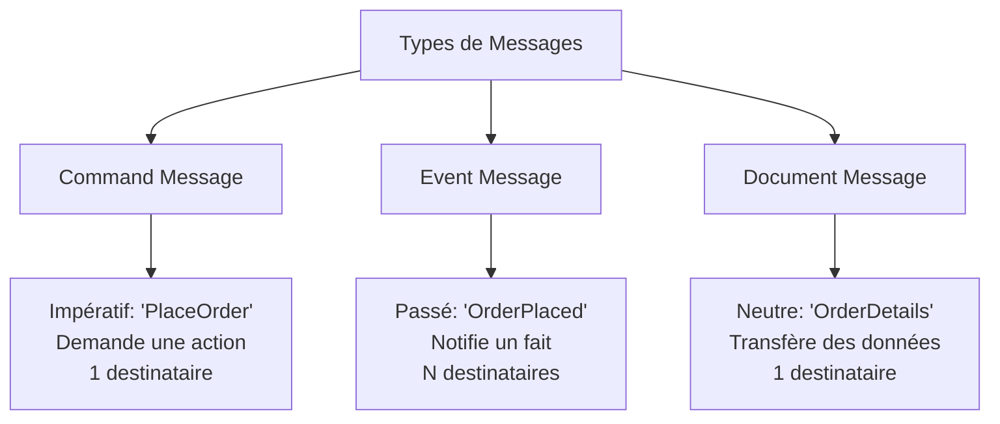

# Event Message — Enterprise Integration Pattern

## 1. Introduction

### Objectifs du cours
À la fin de ce cours, vous serez capable de :
- Comprendre ce qu'est un Event Message et son rôle dans les architectures modernes
- Implémenter des Event Messages dans des applications NestJS et Angular
- Distinguer Event Message des autres types de messages (Command, Document)
- Concevoir des systèmes réactifs basés sur les événements
- Éviter les pièges courants liés aux Event Messages

### Ce que vous allez apprendre
- La définition et les caractéristiques d'un Event Message
- Les cas d'usage concrets dans les webapps métier
- L'implémentation pratique avec TypeScript/NestJS
- Les bonnes pratiques et patterns associés

### Scope de la notion
Après ce cours, vous pourrez :
- Créer des architectures event-driven pour vos applications métier
- Découpler les composants de votre système
- Améliorer la scalabilité et la résilience de vos applications
- Implémenter des workflows asynchrones complexes

---

## 2. Définition et Concepts Clés

### 2.1 Qu'est-ce qu'un Event Message ?

Un **Event Message** est un message qui **notifie** qu'un événement s'est produit dans le système. Il communique un fait accompli, quelque chose qui s'est déjà passé.

**Analogie de la vie quotidienne :**
Imaginez que vous recevez une notification sur votre téléphone : "Votre colis a été livré". C'est un événement — quelque chose qui s'est déjà produit. Vous ne pouvez pas annuler la livraison, vous ne pouvez que réagir à cette information (aller chercher le colis, remercier le livreur, etc.).

### 2.2 Caractéristiques principales

| Caractéristique | Description | Exemple |
|-----------------|-------------|---------|
| **Temps** | Passé (déjà arrivé) | "OrderPlaced", "PaymentReceived" |
| **Intention** | Informer, notifier | Pas de demande d'action spécifique |
| **Émetteur** | Ne connaît pas les destinataires | Publication sans attente de réponse |
| **Destinataires** | Peuvent être multiples | Chaque système réagit selon ses besoins |
| **Immutabilité** | L'événement ne change pas | On ne modifie jamais un événement passé |

### 2.3 Différence avec les autres types de messages



**Tableau comparatif :**

| Type | Temps verbal | Intention | Exemples |
|------|--------------|-----------|----------|
| **Command** | Impératif | Demander une action | `CreateUser`, `SendEmail`, `ProcessPayment` |
| **Event** | Passé | Notifier un fait | `UserCreated`, `EmailSent`, `PaymentProcessed` |
| **Document** | Neutre | Transférer des données | `UserData`, `OrderDetails`, `Invoice` |

---

## 3. Cas d'usage métier dans les webapps

### 3.1 E-commerce : Commande validée

**Scénario :** Quand une commande est validée, plusieurs systèmes doivent réagir :

```typescript
// Event Message
interface OrderPlacedEvent {
  eventId: string;
  eventType: 'OrderPlaced';
  timestamp: Date;
  data: {
    orderId: string;
    customerId: string;
    totalAmount: number;
    items: OrderItem[];
  };
}

// Émetteur (Order Service)
class OrderService {
  async placeOrder(order: CreateOrderDto): Promise<Order> {
    // 1. Valider et créer la commande
    const createdOrder = await this.orderRepository.save(order);
    
    // 2. Publier l'événement (ne connaît pas qui va le recevoir)
    await this.eventBus.publish(new OrderPlacedEvent({
      eventId: uuidv4(),
      eventType: 'OrderPlaced',
      timestamp: new Date(),
      data: {
        orderId: createdOrder.id,
        customerId: createdOrder.customerId,
        totalAmount: createdOrder.total,
        items: createdOrder.items,
      },
    }));
    
    return createdOrder;
  }
}

// Récepteur 1 : Inventory Service
@EventsHandler(OrderPlacedEvent)
class InventoryEventHandler {
  async handle(event: OrderPlacedEvent): Promise<void> {
    // Réserver le stock pour les articles commandés
    await this.inventoryService.reserveStock(event.data.items);
  }
}

// Récepteur 2 : Notification Service
@EventsHandler(OrderPlacedEvent)
class NotificationEventHandler {
  async handle(event: OrderPlacedEvent): Promise<void> {
    // Envoyer un email de confirmation au client
    await this.emailService.sendOrderConfirmation(
      event.data.customerId,
      event.data.orderId,
    );
  }
}

// Récepteur 3 : Analytics Service
@EventsHandler(OrderPlacedEvent)
class AnalyticsEventHandler {
  async handle(event: OrderPlacedEvent): Promise<void> {
    // Enregistrer les métriques
    await this.analyticsService.trackOrder(event.data);
  }
}
```

**Avantages :**
- ✅ Découplage : `OrderService` ne connaît pas les systèmes qui réagissent
- ✅ Évolutivité : Ajouter un nouveau service (ex: Loyalty Points) sans modifier `OrderService`
- ✅ Scalabilité : Chaque handler peut être scalé indépendamment

### 3.2 Gestion d'utilisateurs : Création de compte

**Scénario :** Un utilisateur s'inscrit sur une webapp métier.

```typescript
// Event
interface UserCreatedEvent {
  eventId: string;
  eventType: 'UserCreated';
  timestamp: Date;
  aggregateId: string; // userId
  data: {
    userId: string;
    email: string;
    firstName: string;
    lastName: string;
    role: string;
  };
}

// Émetteur
class UserService {
  async createUser(dto: CreateUserDto): Promise<User> {
    const user = await this.userRepository.save(dto);
    
    await this.eventBus.publish(new UserCreatedEvent({
      eventId: uuidv4(),
      eventType: 'UserCreated',
      timestamp: new Date(),
      aggregateId: user.id,
      data: {
        userId: user.id,
        email: user.email,
        firstName: user.firstName,
        lastName: user.lastName,
        role: user.role,
      },
    }));
    
    return user;
  }
}

// Handlers
@EventsHandler(UserCreatedEvent)
class WelcomeEmailHandler {
  async handle(event: UserCreatedEvent): Promise<void> {
    await this.emailService.sendWelcomeEmail(
      event.data.email,
      event.data.firstName,
    );
  }
}

@EventsHandler(UserCreatedEvent)
class ProvisioningHandler {
  async handle(event: UserCreatedEvent): Promise<void> {
    // Créer l'espace de travail par défaut
    await this.workspaceService.createDefaultWorkspace(event.data.userId);
    
    // Initialiser les préférences utilisateur
    await this.preferencesService.initializeDefaults(event.data.userId);
  }
}
```

### 3.3 Workflow métier : Approbation de document

```typescript
interface DocumentApprovedEvent {
  eventId: string;
  eventType: 'DocumentApproved';
  timestamp: Date;
  data: {
    documentId: string;
    approvedBy: string;
    approvalLevel: number;
    nextApprovalRequired: boolean;
  };
}

@EventsHandler(DocumentApprovedEvent)
class DocumentWorkflowHandler {
  async handle(event: DocumentApprovedEvent): Promise<void> {
    if (event.data.nextApprovalRequired) {
      // Notifier le prochain approbateur
      await this.notifyNextApprover(event.data.documentId);
    } else {
      // Workflow terminé, publier l'événement final
      await this.eventBus.publish(new DocumentFullyApprovedEvent({
        documentId: event.data.documentId,
      }));
    }
  }
}
```

---

## 4. Implémentation avec NestJS

### 4.1 Configuration de base

**1. Installation des dépendances :**

```bash
npm install @nestjs/cqrs
npm install @nestjs/microservices
```

**2. Module de configuration :**

```typescript
// event-bus.module.ts
import { Module } from '@nestjs/common';
import { CqrsModule } from '@nestjs/cqrs';

@Module({
  imports: [CqrsModule],
  exports: [CqrsModule],
})
export class EventBusModule {}
```

### 4.2 Définition d'un Event

**Structure recommandée :**

```typescript
// events/order-placed.event.ts
export class OrderPlacedEvent {
  constructor(
    public readonly eventId: string,
    public readonly timestamp: Date,
    public readonly orderId: string,
    public readonly customerId: string,
    public readonly totalAmount: number,
    public readonly items: OrderItem[],
  ) {}
}

// Alternative avec interface
export interface IOrderPlacedEvent {
  eventId: string;
  eventType: 'OrderPlaced';
  timestamp: Date;
  version: number; // Pour versionning des événements
  data: {
    orderId: string;
    customerId: string;
    totalAmount: number;
    items: OrderItem[];
  };
  metadata?: {
    correlationId?: string;
    causationId?: string;
    userId?: string;
  };
}
```

### 4.3 Publisher (Émetteur)

```typescript
// order.service.ts
import { Injectable } from '@nestjs/common';
import { EventBus } from '@nestjs/cqrs';

@Injectable()
export class OrderService {
  constructor(
    private readonly eventBus: EventBus,
    private readonly orderRepository: OrderRepository,
  ) {}

  async placeOrder(createOrderDto: CreateOrderDto): Promise<Order> {
    // 1. Logique métier
    const order = await this.orderRepository.create(createOrderDto);
    await this.orderRepository.save(order);
    
    // 2. Publier l'événement
    this.eventBus.publish(
      new OrderPlacedEvent(
        uuidv4(),
        new Date(),
        order.id,
        order.customerId,
        order.total,
        order.items,
      ),
    );
    
    return order;
  }
}
```

### 4.4 Event Handlers (Récepteurs)

```typescript
// handlers/order-placed.handler.ts
import { EventsHandler, IEventHandler } from '@nestjs/cqrs';
import { OrderPlacedEvent } from '../events/order-placed.event';

@EventsHandler(OrderPlacedEvent)
export class OrderPlacedHandler implements IEventHandler<OrderPlacedEvent> {
  constructor(
    private readonly emailService: EmailService,
    private readonly logger: Logger,
  ) {}

  async handle(event: OrderPlacedEvent): Promise<void> {
    this.logger.log(`Handling OrderPlacedEvent for order ${event.orderId}`);
    
    try {
      await this.emailService.sendOrderConfirmation(
        event.customerId,
        event.orderId,
      );
      
      this.logger.log(`Email sent for order ${event.orderId}`);
    } catch (error) {
      this.logger.error(
        `Failed to send email for order ${event.orderId}`,
        error,
      );
      // Ne pas propager l'erreur pour ne pas bloquer les autres handlers
      // Utiliser Dead Letter Queue ou retry mechanism
    }
  }
}
```

### 4.5 Enregistrement des handlers

```typescript
// order.module.ts
import { Module } from '@nestjs/common';
import { CqrsModule } from '@nestjs/cqrs';
import { OrderPlacedHandler } from './handlers/order-placed.handler';
import { InventoryUpdatedHandler } from './handlers/inventory-updated.handler';

const EventHandlers = [
  OrderPlacedHandler,
  InventoryUpdatedHandler,
];

@Module({
  imports: [CqrsModule],
  providers: [
    OrderService,
    ...EventHandlers,
  ],
})
export class OrderModule {}
```

---

## 5. Implémentation avec RabbitMQ (Production-ready)

### 5.1 Configuration NestJS + RabbitMQ

```typescript
// main.ts
import { NestFactory } from '@nestjs/core';
import { MicroserviceOptions, Transport } from '@nestjs/microservices';

async function bootstrap() {
  const app = await NestFactory.create(AppModule);
  
  // Connexion à RabbitMQ
  app.connectMicroservice<MicroserviceOptions>({
    transport: Transport.RMQ,
    options: {
      urls: [process.env.RABBITMQ_URL || 'amqp://localhost:5672'],
      queue: 'events_queue',
      queueOptions: {
        durable: true,
      },
      prefetchCount: 1,
    },
  });
  
  await app.startAllMicroservices();
  await app.listen(3000);
}
bootstrap();
```

### 5.2 Publisher avec RabbitMQ

```typescript
// event-publisher.service.ts
import { Injectable } from '@nestjs/common';
import { ClientProxy, ClientProxyFactory, Transport } from '@nestjs/microservices';

@Injectable()
export class EventPublisher {
  private client: ClientProxy;
  
  constructor() {
    this.client = ClientProxyFactory.create({
      transport: Transport.RMQ,
      options: {
        urls: [process.env.RABBITMQ_URL],
        queue: 'events_queue',
        queueOptions: {
          durable: true,
        },
      },
    });
  }
  
  async publishEvent(event: any): Promise<void> {
    await this.client.emit(event.eventType, event).toPromise();
  }
}

// Utilisation
class OrderService {
  async placeOrder(dto: CreateOrderDto): Promise<Order> {
    const order = await this.orderRepository.save(dto);
    
    await this.eventPublisher.publishEvent({
      eventType: 'OrderPlaced',
      eventId: uuidv4(),
      timestamp: new Date(),
      data: {
        orderId: order.id,
        customerId: order.customerId,
      },
    });
    
    return order;
  }
}
```

### 5.3 Consumer avec RabbitMQ

```typescript
// event-consumer.controller.ts
import { Controller } from '@nestjs/common';
import { EventPattern, Payload } from '@nestjs/microservices';

@Controller()
export class EventConsumer {
  constructor(
    private readonly emailService: EmailService,
    private readonly inventoryService: InventoryService,
  ) {}
  
  @EventPattern('OrderPlaced')
  async handleOrderPlaced(@Payload() event: OrderPlacedEvent) {
    console.log('Received OrderPlacedEvent:', event);
    
    // Traiter l'événement
    await this.emailService.sendConfirmation(event.data.customerId);
    await this.inventoryService.reserveStock(event.data.items);
  }
  
  @EventPattern('UserCreated')
  async handleUserCreated(@Payload() event: UserCreatedEvent) {
    console.log('Received UserCreatedEvent:', event);
    
    await this.emailService.sendWelcomeEmail(event.data.email);
  }
}
```

---

## 6. Event Sourcing Pattern (Avancé)

### 6.1 Concept

**Event Sourcing** consiste à stocker tous les événements qui modifient l'état d'une entité, plutôt que de stocker seulement l'état final.

```typescript
// Event Store
interface EventStoreEntry {
  eventId: string;
  aggregateId: string; // ID de l'entité (ex: orderId, userId)
  eventType: string;
  data: any;
  timestamp: Date;
  version: number;
}

class EventStore {
  private events: EventStoreEntry[] = [];
  
  append(event: EventStoreEntry): void {
    this.events.push(event);
  }
  
  getEventsForAggregate(aggregateId: string): EventStoreEntry[] {
    return this.events.filter(e => e.aggregateId === aggregateId);
  }
}

// Reconstruire l'état d'une commande à partir des événements
class OrderAggregate {
  private id: string;
  private customerId: string;
  private items: OrderItem[] = [];
  private status: OrderStatus;
  private total: number = 0;
  
  static fromEvents(events: EventStoreEntry[]): OrderAggregate {
    const order = new OrderAggregate();
    
    events.forEach(event => {
      switch (event.eventType) {
        case 'OrderCreated':
          order.applyOrderCreated(event.data);
          break;
        case 'ItemAdded':
          order.applyItemAdded(event.data);
          break;
        case 'OrderConfirmed':
          order.applyOrderConfirmed(event.data);
          break;
        case 'OrderShipped':
          order.applyOrderShipped(event.data);
          break;
      }
    });
    
    return order;
  }
  
  private applyOrderCreated(data: any): void {
    this.id = data.orderId;
    this.customerId = data.customerId;
    this.status = 'CREATED';
  }
  
  private applyItemAdded(data: any): void {
    this.items.push(data.item);
    this.total += data.item.price * data.item.quantity;
  }
  
  private applyOrderConfirmed(data: any): void {
    this.status = 'CONFIRMED';
  }
  
  private applyOrderShipped(data: any): void {
    this.status = 'SHIPPED';
  }
}
```

**Avantages :**
- ✅ Audit complet : Historique de tous les changements
- ✅ Time-travel : Reconstruire l'état à n'importe quel moment
- ✅ Debugging : Comprendre comment on est arrivé à un état
- ✅ Business Intelligence : Analyser les comportements

**Inconvénients :**
- ❌ Complexité accrue
- ❌ Besoin de snapshots pour les performances
- ❌ Requêtes complexes sur l'état actuel

---

## 7. Erreurs Courantes & Comment les Éviter

### 7.1 Erreur 1 : Event Message qui ressemble à un Command

**❌ Mauvais :**
```typescript
// Ceci est un Command déguisé en Event !
interface PlaceOrderEvent {  // ❌ Impératif
  eventType: 'PlaceOrder';
  orderId: string;
}
```

**✅ Correct :**
```typescript
// Event au passé
interface OrderPlacedEvent {  // ✅ Passé
  eventType: 'OrderPlaced';
  orderId: string;
}
```

**Règle :** Les noms d'événements doivent être au **passé** (participe passé).

### 7.2 Erreur 2 : Événements trop granulaires

**❌ Mauvais :**
```typescript
// Trop de petits événements
interface UserFirstNameChangedEvent { firstName: string; }
interface UserLastNameChangedEvent { lastName: string; }
interface UserEmailChangedEvent { email: string; }
interface UserAgeChangedEvent { age: number; }
```

**✅ Correct :**
```typescript
// Événement métier significatif
interface UserProfileUpdatedEvent {
  userId: string;
  changes: {
    firstName?: string;
    lastName?: string;
    email?: string;
    age?: number;
  };
  updatedFields: string[];
}
```

**Règle :** Créer des événements qui représentent des **faits métier significatifs**, pas chaque changement de propriété.

### 7.3 Erreur 3 : Event Handlers avec effets de bord non gérés

**❌ Mauvais :**
```typescript
@EventsHandler(OrderPlacedEvent)
class OrderPlacedHandler {
  async handle(event: OrderPlacedEvent): Promise<void> {
    // Si ceci échoue, tout le traitement échoue
    await this.emailService.sendEmail(event.customerId);
    await this.inventoryService.reserve(event.items);
    await this.analyticsService.track(event);
  }
}
```

**✅ Correct :**
```typescript
@EventsHandler(OrderPlacedEvent)
class EmailNotificationHandler {
  async handle(event: OrderPlacedEvent): Promise<void> {
    try {
      await this.emailService.sendEmail(event.customerId);
    } catch (error) {
      this.logger.error('Failed to send email', error);
      // Envoyer vers Dead Letter Queue pour retry
      await this.dlq.send(event, error);
    }
  }
}

// Handlers séparés pour chaque responsabilité
@EventsHandler(OrderPlacedEvent)
class InventoryReservationHandler {
  async handle(event: OrderPlacedEvent): Promise<void> {
    try {
      await this.inventoryService.reserve(event.items);
    } catch (error) {
      this.logger.error('Failed to reserve inventory', error);
      // Compensation : annuler la commande
      await this.eventBus.publish(new OrderCancelledEvent(event.orderId));
    }
  }
}
```

**Règle :** Un handler = une responsabilité. Gérer les erreurs de manière isolée.

### 7.4 Erreur 4 : Oublier les métadonnées importantes

**❌ Mauvais :**
```typescript
interface OrderPlacedEvent {
  orderId: string;
  customerId: string;
}
```

**✅ Correct :**
```typescript
interface OrderPlacedEvent {
  // Identifiant unique de l'événement
  eventId: string;
  
  // Type d'événement
  eventType: 'OrderPlaced';
  
  // Timestamp
  timestamp: Date;
  
  // Version pour gérer les évolutions
  version: number;
  
  // Données métier
  data: {
    orderId: string;
    customerId: string;
    items: OrderItem[];
  };
  
  // Métadonnées de traçabilité
  metadata: {
    correlationId: string;  // Lier les événements d'une même transaction
    causationId: string;    // Événement qui a causé celui-ci
    userId: string;         // Qui a déclenché l'action
    source: string;         // D'où vient l'événement
  };
}
```

### 7.5 Erreur 5 : Pas de gestion de l'idempotence

**Problème :** Un événement peut être traité plusieurs fois (retry, duplication réseau).

**❌ Mauvais :**
```typescript
@EventsHandler(OrderPlacedEvent)
class InventoryHandler {
  async handle(event: OrderPlacedEvent): Promise<void> {
    // Réserver le stock sans vérifier si déjà fait
    await this.inventoryService.reserve(event.items);
    // ⚠️ Risque : double réservation si event rejoué
  }
}
```

**✅ Correct :**
```typescript
@EventsHandler(OrderPlacedEvent)
class InventoryHandler {
  async handle(event: OrderPlacedEvent): Promise<void> {
    // Vérifier si déjà traité
    const alreadyProcessed = await this.processedEvents.exists(event.eventId);
    
    if (alreadyProcessed) {
      this.logger.log(`Event ${event.eventId} already processed, skipping`);
      return;
    }
    
    // Traiter l'événement
    await this.inventoryService.reserve(event.items);
    
    // Marquer comme traité
    await this.processedEvents.add(event.eventId);
  }
}

// Service de tracking
class ProcessedEventsService {
  constructor(private redis: Redis) {}
  
  async exists(eventId: string): Promise<boolean> {
    return await this.redis.exists(`processed:${eventId}`);
  }
  
  async add(eventId: string): Promise<void> {
    await this.redis.set(`processed:${eventId}`, '1', 'EX', 86400); // 24h
  }
}
```

---

## 8. Exercices Pratiques

### Exercice 1 : Système de notifications

**Contexte :** Vous développez un système de gestion de tâches pour une webapp métier.

**Objectif :** Implémenter des Event Messages pour notifier différents services quand une tâche change d'état.

**Fonctionnalités à implémenter :**

1. Créer les événements :
   - `TaskCreatedEvent`
   - `TaskAssignedEvent`
   - `TaskCompletedEvent`
   - `TaskOverdueEvent`

2. Créer les handlers :
   - `EmailNotificationHandler` : Envoie un email à l'assigné
   - `SlackNotificationHandler` : Envoie un message Slack
   - `AnalyticsHandler` : Enregistre les métriques
   - `AuditLogHandler` : Enregistre dans l'audit log

3. Implémenter la gestion d'erreur avec retry et DLQ

**Code de départ :**

```typescript
// task.service.ts
export class TaskService {
  async createTask(dto: CreateTaskDto): Promise<Task> {
    const task = await this.taskRepository.save(dto);
    
    // TODO: Publier TaskCreatedEvent
    
    return task;
  }
  
  async assignTask(taskId: string, userId: string): Promise<Task> {
    const task = await this.taskRepository.findOne(taskId);
    task.assignedTo = userId;
    await this.taskRepository.save(task);
    
    // TODO: Publier TaskAssignedEvent
    
    return task;
  }
}
```

**Critères de réussite :**
- ✅ Événements nommés au passé
- ✅ Handlers découplés (un par responsabilité)
- ✅ Gestion d'erreur avec try/catch et logging
- ✅ Métadonnées complètes (eventId, timestamp, correlationId)
- ✅ Tests unitaires pour chaque handler

### Exercice 2 : Event Sourcing simple

**Contexte :** Implémenter un système de panier d'achat avec Event Sourcing.

**Objectif :** Stocker tous les événements du panier et reconstruire son état.

**Événements à créer :**
- `CartCreatedEvent`
- `ItemAddedToCartEvent`
- `ItemRemovedFromCartEvent`
- `CartCheckedOutEvent`

**Fonctionnalités :**
1. Ajouter des produits au panier
2. Retirer des produits
3. Valider le panier
4. Reconstruire l'état actuel du panier depuis les événements
5. Obtenir l'historique complet du panier

**Code de départ :**

```typescript
class ShoppingCart {
  private events: Event[] = [];
  
  addItem(item: CartItem): void {
    // TODO: Créer et stocker ItemAddedToCartEvent
  }
  
  removeItem(itemId: string): void {
    // TODO: Créer et stocker ItemRemovedFromCartEvent
  }
  
  static fromEvents(events: Event[]): ShoppingCart {
    // TODO: Reconstruire le panier depuis les événements
  }
}
```

---

## 9. Comportement Senior

### 9.1 Design des événements

**Senior tip 1 : Versionner vos événements**

```typescript
// Version 1
interface OrderPlacedEventV1 {
  version: 1;
  orderId: string;
  customerId: string;
}

// Version 2 : Ajout de nouveaux champs
interface OrderPlacedEventV2 {
  version: 2;
  orderId: string;
  customerId: string;
  items: OrderItem[];  // Nouveau champ
  totalAmount: number; // Nouveau champ
}

// Handler qui gère les deux versions
@EventsHandler(OrderPlacedEvent)
class OrderPlacedHandler {
  async handle(event: OrderPlacedEventV1 | OrderPlacedEventV2): Promise<void> {
    if (event.version === 1) {
      // Gérer l'ancienne version
      await this.handleV1(event as OrderPlacedEventV1);
    } else {
      // Gérer la nouvelle version
      await this.handleV2(event as OrderPlacedEventV2);
    }
  }
}
```

**Senior tip 2 : Utiliser des Correlation IDs**

```typescript
// Permet de tracer tous les événements d'une même transaction
interface EventMetadata {
  correlationId: string; // ID de la transaction business
  causationId: string;   // ID de l'événement qui a causé celui-ci
  userId: string;        // Utilisateur qui a initié
}

// Exemple de chaîne d'événements
// 1. OrderPlaced (correlationId: abc123, causationId: null)
// 2. InventoryReserved (correlationId: abc123, causationId: OrderPlaced.eventId)
// 3. PaymentProcessed (correlationId: abc123, causationId: OrderPlaced.eventId)
// 4. OrderConfirmed (correlationId: abc123, causationId: PaymentProcessed.eventId)
```

### 9.2 Monitoring et observabilité

**Senior tip 3 : Logger intelligemment**

```typescript
@EventsHandler(OrderPlacedEvent)
class OrderPlacedHandler {
  async handle(event: OrderPlacedEvent): Promise<void> {
    const startTime = Date.now();
    
    this.logger.log({
      message: 'Processing OrderPlacedEvent',
      eventId: event.eventId,
      orderId: event.data.orderId,
      correlationId: event.metadata.correlationId,
    });
    
    try {
      await this.processOrder(event);
      
      const duration = Date.now() - startTime;
      this.logger.log({
        message: 'OrderPlacedEvent processed successfully',
        eventId: event.eventId,
        duration,
      });
      
      // Métriques
      this.metrics.recordEventProcessing('OrderPlaced', duration);
      
    } catch (error) {
      this.logger.error({
        message: 'Failed to process OrderPlacedEvent',
        eventId: event.eventId,
        error: error.message,
        stack: error.stack,
      });
      
      throw error;
    }
  }
}
```

**Senior tip 4 : Utiliser des Circuit Breakers**

```typescript
import CircuitBreaker from 'opossum';

@EventsHandler(OrderPlacedEvent)
class EmailNotificationHandler {
  private circuitBreaker: CircuitBreaker;
  
  constructor(private emailService: EmailService) {
    // Circuit breaker pour l'email service
    this.circuitBreaker = new CircuitBreaker(
      this.emailService.send.bind(this.emailService),
      {
        timeout: 3000,        // 3 secondes timeout
        errorThresholdPercentage: 50,  // Ouvrir après 50% d'erreurs
        resetTimeout: 30000,  // Réessayer après 30 secondes
      },
    );
    
    this.circuitBreaker.on('open', () => {
      this.logger.warn('Email service circuit breaker opened');
    });
  }
  
  async handle(event: OrderPlacedEvent): Promise<void> {
    try {
      await this.circuitBreaker.fire(event.data.customerId);
    } catch (error) {
      // Circuit ouvert ou erreur
      this.logger.error('Email sending failed', error);
      await this.dlq.send(event); // Dead Letter Queue
    }
  }
}
```

### 9.3 Tests

**Senior tip 5 : Tester les handlers de manière isolée**

```typescript
describe('OrderPlacedHandler', () => {
  let handler: OrderPlacedHandler;
  let emailService: jest.Mocked<EmailService>;
  
  beforeEach(() => {
    emailService = {
      sendOrderConfirmation: jest.fn(),
    } as any;
    
    handler = new OrderPlacedHandler(emailService);
  });
  
  it('should send confirmation email when order is placed', async () => {
    // Arrange
    const event = new OrderPlacedEvent(
      'event-123',
      new Date(),
      'order-456',
      'customer-789',
      100,
      [],
    );
    
    // Act
    await handler.handle(event);
    
    // Assert
    expect(emailService.sendOrderConfirmation).toHaveBeenCalledWith(
      'customer-789',
      'order-456',
    );
  });
  
  it('should handle email service failure gracefully', async () => {
    // Arrange
    const event = new OrderPlacedEvent('event-123', new Date(), 'order-456', 'customer-789', 100, []);
    emailService.sendOrderConfirmation.mockRejectedValue(new Error('SMTP error'));
    
    // Act & Assert
    await expect(handler.handle(event)).resolves.not.toThrow();
    // Handler ne doit pas propager l'erreur
  });
});
```

---

## 10. Résumé

### Points clés à retenir

1. **Event Message = Notification d'un fait passé**
   - Nommé au passé (OrderPlaced, UserCreated)
   - Immutable
   - Peut avoir plusieurs destinataires

2. **Différence avec Command**
   - Event : "OrderPlaced" (passé, notifie)
   - Command : "PlaceOrder" (impératif, demande)

3. **Architecture event-driven**
   - Découplage des composants
   - Scalabilité horizontale
   - Résilience

4. **Bonnes pratiques**
   - Versionner les événements
   - Inclure métadonnées (eventId, correlationId, timestamp)
   - Gérer l'idempotence
   - Un handler = une responsabilité
   - Monitoring et observabilité

5. **Technologies**
   - NestJS + @nestjs/cqrs pour applications simples
   - RabbitMQ / Kafka pour production
   - Event Store pour Event Sourcing

### Quand utiliser Event Messages ?

**✅ Utiliser quand :**
- Plusieurs services doivent réagir à un même fait
- Découplage nécessaire entre composants
- Besoin d'audit trail complet
- Architecture microservices
- Workflow asynchrones

**❌ Ne pas utiliser quand :**
- Communication synchrone requise
- Besoin de réponse immédiate
- Transaction ACID stricte nécessaire
- Application monolithique simple

### Checklist avant de publier un événement

- [ ] Nom au passé (participe passé)
- [ ] eventId unique généré
- [ ] timestamp inclus
- [ ] version spécifiée
- [ ] correlationId pour traçabilité
- [ ] Données suffisantes pour les handlers
- [ ] Pas de données sensibles non chiffrées
- [ ] Handler(s) enregistré(s)
- [ ] Tests unitaires écrits
- [ ] Monitoring en place

---

## 11. Ressources Externes

### Documentation officielle
- 📘 [Enterprise Integration Patterns - Event Message](https://www.enterpriseintegrationpatterns.com/patterns/messaging/EventMessage.html)
- 📘 [NestJS CQRS Documentation](https://docs.nestjs.com/recipes/cqrs)
- 📘 [NestJS Microservices](https://docs.nestjs.com/microservices/basics)

### Articles et tutoriels
- 📝 [Event-Driven Architecture en français](https://www.redhat.com/fr/topics/integration/what-is-event-driven-architecture)
- 📝 [Martin Fowler - Event Sourcing](https://martinfowler.com/eaaDev/EventSourcing.html)
- 📝 [CQRS Journey Guide](https://docs.microsoft.com/en-us/previous-versions/msp-n-p/jj554200(v=pandp.10))

### Vidéos
- 🎥 [Event-Driven Architectures en 20 minutes (FR)](https://www.youtube.com/watch?v=STKCRSUsyP0)
- 🎥 [CQRS and Event Sourcing - Greg Young](https://www.youtube.com/watch?v=JHGkaShoyNs) (EN)
- 🎥 [NestJS Event-Driven Microservices](https://www.youtube.com/watch?v=OXxqLRNPnPA) (EN)

### Outils et bibliothèques
- 🛠️ [RabbitMQ](https://www.rabbitmq.com/)
- 🛠️ [Apache Kafka](https://kafka.apache.org/)
- 🛠️ [EventStoreDB](https://www.eventstore.com/)
- 🛠️ [NestJS EventEmitter](https://docs.nestjs.com/techniques/events)

### Livres recommandés
- 📚 "Enterprise Integration Patterns" - Gregor Hohpe & Bobby Woolf
- 📚 "Implementing Domain-Driven Design" - Vaughn Vernon
- 📚 "Building Event-Driven Microservices" - Adam Bellemare

---

**En une phrase :**

> Un Event Message notifie qu'un événement s'est produit dans le système (au passé), permettant à plusieurs composants de réagir de manière découplée, ce qui améliore la scalabilité et la résilience des applications métier modernes.
