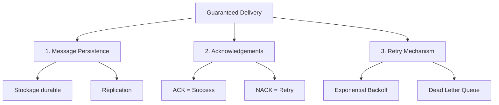

# Guaranteed Delivery — Enterprise Integration Pattern

## 1. Introduction

### Objectifs du cours
À la fin de ce cours, vous serez capable de :
- Comprendre ce qu'est le Guaranteed Delivery et pourquoi il est critique
- Implémenter la persistence des messages avec RabbitMQ et Bull
- Gérer les acknowledgements (ACK/NACK) correctement
- Mettre en place des stratégies de retry et de Dead Letter Queue
- Garantir qu'aucun message ne soit perdu même en cas de crash

### Ce que vous allez apprendre
- La définition et les mécanismes du Guaranteed Delivery
- L'implémentation avec TypeScript/NestJS
- Les patterns de persistence et de durabilité
- Les stratégies de recovery après crash
- La gestion des transactions distribuées

### Scope de la notion
Après ce cours, vous pourrez :
- Construire des systèmes de messaging résilients
- Prévenir la perte de messages critiques
- Implémenter des patterns de retry intelligents
- Gérer les scénarios de reprise après incident

---

## 2. Définition et Concepts Clés

### 2.1 Qu'est-ce que le Guaranteed Delivery ?

Le **Guaranteed Delivery** est un pattern qui garantit qu'**un message sera livré à son destinataire même en cas de crash du système** (sender, receiver, ou broker).

**Trade-offs importants** :
- **Performance** : La persistence sur disque est plus lente que la mémoire
- **Complexité** : Nécessite plus de code (ACK, retry, monitoring)
- **Coût** : Requiert plus de ressources (stockage, mémoire)

**Analogie de la vie quotidienne :**
Imaginez que vous envoyez un colis en recommandé avec accusé de réception. La poste garantit la livraison : si le facteur ne peut pas livrer, il réessaiera. Le colis est enregistré et tracé à chaque étape. Même si un camion tombe en panne, le colis sera récupéré et livré. C'est du Guaranteed Delivery - plus fiable mais plus cher qu'un envoi standard.

### 2.2 Trois piliers du Guaranteed Delivery



### 2.3 Niveaux de garantie

| Niveau | Garantie | Performance | Use Case |
|--------|----------|-------------|----------|
| **At-Most-Once** | 0 ou 1 fois | Très rapide | Logs, metrics |
| **At-Least-Once** | ≥ 1 fois | Moyen | Commandes, emails |
| **Exactly-Once** | Exactement 1 fois | Lent | Paiements, facturation |

---

## 3. Cas d'usage métier dans les webapps

### 3.1 Traitement de paiements

**Scénario :** Garantir qu'aucune transaction n'est perdue.

```typescript
// payment-queue.service.ts
import { Injectable } from '@nestjs/common';
import { InjectQueue } from '@nestjs/bull';
import { Queue } from 'bull';

export interface ProcessPaymentJob {
  orderId: string;
  customerId: string;
  amount: number;
  currency: string;
  paymentMethodId: string;
}

@Injectable()
export class PaymentQueueService {
  constructor(
    @InjectQueue('payments') private paymentQueue: Queue,
    private readonly logger: Logger,
  ) {}

  async processPayment(payment: ProcessPaymentJob): Promise<string> {
    // Configuration pour Guaranteed Delivery
    const job = await this.paymentQueue.add('process', payment, {
      // 1. Persistence
      removeOnComplete: false, // Garder en DB même après succès
      removeOnFail: false,
      
      // 2. Retry strategy
      attempts: 5,
      backoff: {
        type: 'exponential',
        delay: 2000, // Start at 2s, then 4s, 8s, 16s, 32s
      },
      
      // 3. Timeout
      timeout: 30000, // 30 secondes max
    });

    this.logger.log(`Payment job ${job.id} queued for order ${payment.orderId}`);
    
    return job.id.toString();
  }
}

// payment-consumer.service.ts
import { Processor, Process, OnQueueCompleted, OnQueueFailed } from '@nestjs/bull';
import { Job } from 'bull';

@Processor('payments')
export class PaymentConsumer {
  constructor(
    private readonly paymentService: PaymentService,
    private readonly orderService: OrderService,
    private readonly auditLog: AuditLogService,
    private readonly logger: Logger,
  ) {}

  @Process({ name: 'process', concurrency: 1 })
  async handlePayment(job: Job<ProcessPaymentJob>): Promise<PaymentResult> {
    const { orderId, customerId, amount, currency, paymentMethodId } = job.data;
    
    this.logger.log(`Processing payment for order ${orderId}, attempt ${job.attemptsMade + 1}`);

    try {
      // 1. Vérifier idempotence (déjà traité ?)
      const existingPayment = await this.paymentService.findByOrderId(orderId);
      if (existingPayment?.status === 'SUCCESS') {
        this.logger.warn(`Payment already processed for order ${orderId}`);
        return existingPayment;
      }

      // 2. Traiter le paiement
      const payment = await this.paymentService.charge({
        customerId,
        amount,
        currency,
        paymentMethodId,
        idempotencyKey: `order_${orderId}`,
      });

      // 3. Mettre à jour la commande
      await this.orderService.confirmPayment(orderId, payment.id);

      // 4. Audit log
      await this.auditLog.log({
        action: 'PAYMENT_SUCCESS',
        orderId,
        paymentId: payment.id,
        amount,
      });

      this.logger.log(`Payment successful for order ${orderId}`);
      
      return payment;

    } catch (error) {
      this.logger.error(`Payment failed for order ${orderId}: ${error.message}`);
      
      // Audit log d'échec
      await this.auditLog.log({
        action: 'PAYMENT_FAILED',
        orderId,
        error: error.message,
        attempt: job.attemptsMade + 1,
      });

      throw error; // Déclenchera un retry
    }
  }

  @OnQueueCompleted()
  async onCompleted(job: Job, result: PaymentResult) {
    this.logger.log(`Payment job ${job.id} completed successfully`);
    
    // Notification de succès
    await this.notificationService.send(result.customerId, {
      type: 'PAYMENT_SUCCESS',
      amount: result.amount,
      orderId: job.data.orderId,
    });
  }

  @OnQueueFailed()
  async onFailed(job: Job, error: Error) {
    const { orderId, customerId } = job.data;
    
    if (job.attemptsMade >= job.opts.attempts) {
      this.logger.error(`Payment job ${job.id} failed permanently`);
      
      // Déplacer vers Dead Letter Queue
      await this.deadLetterQueue.add('failed-payment', {
        originalJob: job.data,
        error: error.message,
        attempts: job.attemptsMade,
        failedAt: new Date(),
      });
      
      // Notifier l'équipe support
      await this.alertService.sendAlert({
        severity: 'critical',
        message: `Payment failed for order ${orderId} after ${job.attemptsMade} attempts`,
        data: job.data,
      });
      
      // Annuler la commande
      await this.orderService.cancel(orderId, 'Payment failed');
      
      // Notifier le client
      await this.notificationService.send(customerId, {
        type: 'PAYMENT_FAILED',
        orderId,
      });
    }
  }
}
```

### 3.2 Import de données massives

**Scénario :** Importer des milliers de lignes sans perte.

```typescript
// import-queue.service.ts
export interface ImportDataJob {
  importId: string;
  fileName: string;
  userId: string;
  totalRows: number;
  batchSize: number;
}

@Injectable()
export class ImportQueueService {
  constructor(
    @InjectQueue('imports') private importQueue: Queue,
  ) {}

  async startImport(importData: ImportDataJob): Promise<void> {
    // Créer des batches pour éviter les timeouts
    const batches = Math.ceil(importData.totalRows / importData.batchSize);
    
    for (let i = 0; i < batches; i++) {
      await this.importQueue.add('process-batch', {
        ...importData,
        batchIndex: i,
        startRow: i * importData.batchSize,
        endRow: Math.min((i + 1) * importData.batchSize, importData.totalRows),
      }, {
        jobId: `${importData.importId}_batch_${i}`, // Idempotence
        attempts: 10, // Beaucoup de retries
        backoff: {
          type: 'exponential',
          delay: 5000,
        },
        removeOnComplete: false, // Garder pour audit
      });
    }
  }
}

@Processor('imports')
export class ImportConsumer {
  @Process('process-batch')
  async processBatch(job: Job): Promise<void> {
    const { importId, fileName, startRow, endRow, batchIndex } = job.data;
    
    try {
      // 1. Lire le fichier (de startRow à endRow)
      const rows = await this.fileService.readRows(fileName, startRow, endRow);
      
      // 2. Valider
      const validRows = rows.filter(row => this.validate(row));
      const invalidRows = rows.filter(row => !this.validate(row));
      
      // 3. Sauvegarder les lignes valides (transaction)
      await this.dataRepository.insertBatch(validRows);
      
      // 4. Enregistrer les erreurs
      if (invalidRows.length > 0) {
        await this.errorRepository.saveBatchErrors(importId, batchIndex, invalidRows);
      }
      
      // 5. Mettre à jour la progression
      await this.importRepository.updateProgress(importId, {
        processedRows: endRow,
        validRows: validRows.length,
        invalidRows: invalidRows.length,
      });
      
      await job.progress(100);
      
    } catch (error) {
      this.logger.error(`Batch ${batchIndex} failed: ${error.message}`);
      throw error; // Retry automatique
    }
  }
}
```

### 3.3 Synchronisation de données entre systèmes

**Scénario :** Synchroniser les commandes vers un ERP externe.

```typescript
// erp-sync-queue.service.ts
export interface SyncOrderToERPJob {
  orderId: string;
  erpEndpoint: string;
  retryCount: number;
}

@Processor('erp-sync')
export class ERPSyncConsumer {
  @Process('sync-order')
  async syncOrder(job: Job<SyncOrderToERPJob>): Promise<void> {
    const { orderId, erpEndpoint } = job.data;
    
    try {
      // 1. Récupérer les données de la commande
      const order = await this.orderRepository.findById(orderId);
      
      if (!order) {
        throw new NotFoundException('Order not found');
      }
      
      // 2. Transformer au format ERP
      const erpData = this.transformToERPFormat(order);
      
      // 3. Envoyer à l'ERP avec idempotence
      const response = await this.httpService.post(erpEndpoint, erpData, {
        headers: {
          'Idempotency-Key': `order_${orderId}`,
          'X-Retry-Count': job.attemptsMade.toString(),
        },
        timeout: 10000,
      }).toPromise();
      
      // 4. Marquer comme synchronisé
      await this.orderRepository.markAsSynced(orderId, {
        erpId: response.data.id,
        syncedAt: new Date(),
      });
      
      this.logger.log(`Order ${orderId} synced to ERP successfully`);
      
    } catch (error) {
      // Analyser le type d'erreur
      if (this.isTransientError(error)) {
        // Erreur temporaire → retry
        this.logger.warn(`Transient error syncing order ${orderId}, will retry`);
        throw error;
      } else {
        // Erreur permanente → DLQ
        this.logger.error(`Permanent error syncing order ${orderId}`);
        await this.deadLetterQueue.add('erp-sync-failed', {
          orderId,
          error: error.message,
        });
        // Ne pas throw pour ne pas retry
      }
    }
  }
  
  private isTransientError(error: any): boolean {
    // Network errors, timeouts, 5xx → transient
    return error.code === 'ECONNREFUSED' ||
           error.code === 'ETIMEDOUT' ||
           (error.response?.status >= 500 && error.response?.status < 600);
  }
}
```

---

## 4. Implémentation de la Persistence

### 4.1 Configuration Redis avec persistence

```typescript
// app.module.ts
import { BullModule } from '@nestjs/bull';

@Module({
  imports: [
    BullModule.forRoot({
      redis: {
        host: 'localhost',
        port: 6379,
        // Activer la persistence Redis
        enableOfflineQueue: true,
        enableReadyCheck: true,
        maxRetriesPerRequest: 3,
      },
      defaultJobOptions: {
        attempts: 3,
        backoff: {
          type: 'exponential',
          delay: 1000,
        },
        // Ne pas supprimer les jobs terminés
        removeOnComplete: false,
        removeOnFail: false,
      },
    }),
  ],
})
export class AppModule {}
```

**Configuration Redis (redis.conf) :**

```conf
# Activer la persistence AOF (Append Only File)
appendonly yes
appendfilename "appendonly.aof"
appendfsync everysec

# Activer RDB (snapshots)
save 900 1
save 300 10
save 60 10000

# En cas de crash, récupérer automatiquement
stop-writes-on-bgsave-error yes
```

### 4.2 Configuration RabbitMQ avec persistence

```typescript
// main.ts
import { NestFactory } from '@nestjs/core';
import { Transport } from '@nestjs/microservices';

async function bootstrap() {
  const app = await NestFactory.create(AppModule);

  app.connectMicroservice({
    transport: Transport.RMQ,
    options: {
      urls: ['amqp://localhost:5672'],
      queue: 'critical_tasks',
      queueOptions: {
        durable: true, // ✅ Queue persiste après redémarrage
        arguments: {
          'x-message-ttl': 86400000, // 24h
        },
      },
      // Prefetch = 1 pour garantir la livraison
      prefetchCount: 1,
      // Ne pas auto-ack
      noAck: false,
    },
  });

  await app.startAllMicroservices();
  await app.listen(3000);
}
bootstrap();
```

**Publier un message durable :**

```typescript
@Injectable()
export class ProducerService {
  async sendCriticalMessage(data: any): Promise<void> {
    await this.client.emit('critical_task', data, {
      persistent: true, // ✅ Message persiste sur disque
    }).toPromise();
  }
}
```

### 4.3 Pattern Transactional Outbox

```typescript
// Pour garantir la cohérence entre DB et queue
@Injectable()
export class OrderService {
  constructor(
    private readonly dataSource: DataSource,
    private readonly eventBus: EventBus,
  ) {}

  async createOrder(orderData: CreateOrderDto): Promise<Order> {
    const queryRunner = this.dataSource.createQueryRunner();
    await queryRunner.connect();
    await queryRunner.startTransaction();

    try {
      // 1. Créer la commande en DB
      const order = await queryRunner.manager.save(Order, orderData);

      // 2. Insérer dans une table "outbox"
      await queryRunner.manager.save(OutboxEvent, {
        aggregateId: order.id,
        eventType: 'OrderCreated',
        payload: JSON.stringify(order),
        status: 'PENDING',
      });

      // 3. Commit transaction
      await queryRunner.commitTransaction();

      // 4. Un worker lit la table outbox et publie les events
      // → Garantit que l'event sera publié même si le process crash

      return order;

    } catch (error) {
      await queryRunner.rollbackTransaction();
      throw error;
    } finally {
      await queryRunner.release();
    }
  }
}

// Outbox Worker
@Processor('outbox')
export class OutboxWorker {
  @Process('publish-events')
  async publishPendingEvents(): Promise<void> {
    const pendingEvents = await this.outboxRepository.findPending();

    for (const event of pendingEvents) {
      try {
        // Publier l'événement
        await this.eventBus.publish(event.eventType, JSON.parse(event.payload));

        // Marquer comme publié
        await this.outboxRepository.markAsPublished(event.id);

      } catch (error) {
        this.logger.error(`Failed to publish event ${event.id}: ${error.message}`);
        // Sera réessayé au prochain run
      }
    }
  }
}
```

---

## 5. Stratégies de Retry

### 5.1 Exponential Backoff

```typescript
await queue.add('task', data, {
  attempts: 5,
  backoff: {
    type: 'exponential',
    delay: 1000, // 1s, 2s, 4s, 8s, 16s
  },
});
```

### 5.2 Retry conditionnel

```typescript
@Process('api-call')
async callAPI(job: Job): Promise<void> {
  try {
    await this.externalAPI.call(job.data);
  } catch (error) {
    // Retry seulement pour les erreurs transientes
    if (error.status === 429 || error.status >= 500) {
      throw error; // Retry
    } else {
      // Erreur permanente (400, 404, etc.)
      this.logger.error('Permanent error, not retrying');
      // Ne pas throw = pas de retry
    }
  }
}
```

### 5.3 Circuit Breaker

```typescript
import { Injectable } from '@nestjs/common';

@Injectable()
export class CircuitBreakerService {
  private failures = 0;
  private lastFailure: Date;
  private state: 'CLOSED' | 'OPEN' | 'HALF_OPEN' = 'CLOSED';

  async execute<T>(fn: () => Promise<T>): Promise<T> {
    if (this.state === 'OPEN') {
      // Vérifier si on peut réessayer
      if (Date.now() - this.lastFailure.getTime() > 60000) {
        this.state = 'HALF_OPEN';
      } else {
        throw new Error('Circuit breaker is OPEN');
      }
    }

    try {
      const result = await fn();
      
      // Succès → reset
      this.failures = 0;
      this.state = 'CLOSED';
      
      return result;

    } catch (error) {
      this.failures++;
      this.lastFailure = new Date();

      // Trop d'échecs → ouvrir le circuit
      if (this.failures >= 5) {
        this.state = 'OPEN';
        this.logger.error('Circuit breaker OPEN');
      }

      throw error;
    }
  }
}
```

---

## 6. Erreurs Courantes & Comment les Éviter

### 6.1 Erreur 1 : Auto-acknowledge activé

**❌ Mauvais :**
```typescript
// RabbitMQ
app.connectMicroservice({
  transport: Transport.RMQ,
  options: {
    noAck: true, // ❌ Messages acquittés automatiquement
  },
});
```

**✅ Correct :**
```typescript
app.connectMicroservice({
  transport: Transport.RMQ,
  options: {
    noAck: false, // ✅ ACK manuel
  },
});

@MessagePattern('task')
async handle(@Payload() data, @Ctx() context: RmqContext) {
  const channel = context.getChannelRef();
  const message = context.getMessage();
  
  try {
    await this.process(data);
    channel.ack(message); // ✅ ACK explicite
  } catch (error) {
    channel.nack(message, false, true); // Requeue
  }
}
```

### 6.2 Erreur 2 : Pas de persistence

**❌ Mauvais :**
```typescript
await queue.add('important-task', data, {
  removeOnComplete: true, // ❌ Supprimé immédiatement
});
```

**✅ Correct :**
```typescript
await queue.add('important-task', data, {
  removeOnComplete: false, // ✅ Gardé pour audit
  removeOnFail: false,
});
```

### 6.3 Erreur 3 : Pas d'idempotence

**❌ Mauvais :**
```typescript
@Process('charge-customer')
async charge(job: Job) {
  // Peut charger 2 fois si retry
  await this.stripe.charge(job.data.amount);
}
```

**✅ Correct :**
```typescript
@Process('charge-customer')
async charge(job: Job) {
  const idempotencyKey = `charge_${job.data.orderId}`;
  
  // Vérifier si déjà traité
  const existing = await this.paymentRepo.findByIdempotencyKey(idempotencyKey);
  if (existing) {
    return existing;
  }
  
  // Charger avec idempotence
  const charge = await this.stripe.charge({
    amount: job.data.amount,
    idempotencyKey,
  });
  
  return charge;
}
```

### 6.4 Erreur 4 : Timeout trop court

**❌ Mauvais :**
```typescript
await queue.add('slow-task', data, {
  timeout: 5000, // ❌ 5s peut être insuffisant
});
```

**✅ Correct :**
```typescript
await queue.add('slow-task', data, {
  timeout: 300000, // ✅ 5 minutes
  attempts: 1, // Pas de retry si timeout
});
```

### 6.5 Erreur 5 : Pas de Dead Letter Queue

**❌ Mauvais :**
```typescript
@OnQueueFailed()
async onFailed(job: Job) {
  // Job perdu après max retries
  this.logger.error('Job failed');
}
```

**✅ Correct :**
```typescript
@OnQueueFailed()
async onFailed(job: Job, error: Error) {
  if (job.attemptsMade >= job.opts.attempts) {
    // Sauvegarder dans DLQ
    await this.dlqQueue.add('failed', {
      originalJob: job.data,
      error: error.message,
      stack: error.stack,
      failedAt: new Date(),
    });
    
    // Alerter
    await this.alertService.send({
      severity: 'high',
      message: `Job ${job.id} moved to DLQ`,
    });
  }
}
```

---

## 7. Exercices Pratiques

### Exercice 1 : Système de facturation

**Objectif :** Implémenter un système de facturation sans perte de factures.

**Tâches :**
1. Queue `invoices` avec persistence
2. Consumer pour générer les factures PDF
3. Retry avec exponential backoff (5 tentatives)
4. Idempotence (ne pas facturer 2 fois)
5. DLQ pour les factures en échec

**Validation :**
- Aucune facture perdue même si crash
- Chaque facture générée une seule fois
- Alertes si échecs répétés

### Exercice 2 : Webhook delivery

**Objectif :** Livrer des webhooks de manière garantie.

**Tâches :**
1. Persister les webhooks en DB (pattern Outbox)
2. Worker pour envoyer les webhooks
3. Retry avec backoff pour erreurs réseau
4. Circuit breaker pour URLs en panne
5. Notification si échec permanent

---

## 8. Comportement Senior

### 8.1 Monitoring de la santé

```typescript
@Injectable()
export class QueueHealthService {
  async checkHealth(): Promise<HealthStatus> {
    const queues = ['payments', 'emails', 'reports'];
    const health = {};

    for (const queueName of queues) {
      const queue = this.getQueue(queueName);
      
      const waiting = await queue.getWaitingCount();
      const active = await queue.getActiveCount();
      const failed = await queue.getFailedCount();
      
      health[queueName] = {
        waiting,
        active,
        failed,
        healthy: failed < 100 && waiting < 1000,
      };
      
      // Alerte si problème
      if (health[queueName].healthy === false) {
        await this.alertService.send({
          severity: 'warning',
          message: `Queue ${queueName} unhealthy: ${failed} failed, ${waiting} waiting`,
        });
      }
    }

    return health;
  }
}
```

### 8.2 Pattern Saga pour transactions distribuées

```typescript
// Coordonner plusieurs services avec compensation
@Injectable()
export class OrderSaga {
  async execute(orderData: CreateOrderDto): Promise<void> {
    const compensations = [];

    try {
      // Étape 1: Réserver stock
      await this.inventoryService.reserve(orderData.items);
      compensations.push(() => this.inventoryService.release(orderData.items));

      // Étape 2: Autoriser paiement
      const auth = await this.paymentService.authorize(orderData.amount);
      compensations.push(() => this.paymentService.cancel(auth.id));

      // Étape 3: Créer commande
      const order = await this.orderService.create(orderData);

      // Étape 4: Capturer paiement
      await this.paymentService.capture(auth.id);

    } catch (error) {
      // Rollback via compensations
      for (const compensate of compensations.reverse()) {
        await compensate();
      }
      throw error;
    }
  }
}
```

---

## 9. Résumé

### Points clés

1. **Trois piliers** : Persistence + ACK + Retry
2. **Niveaux** : At-Most-Once, At-Least-Once, Exactly-Once
3. **Patterns** : Outbox, Saga, Circuit Breaker, DLQ
4. **Technologies** : Bull/Redis, RabbitMQ avec persistence

### Quand utiliser Guaranteed Delivery ?

**✅ Utiliser quand :**
- Messages critiques (paiements, factures)
- Perte de données inacceptable
- Audit/compliance requis
- Synchronisation entre systèmes

**❌ Ne pas utiliser quand :**
- Logs non critiques
- Données facilement recalculables
- Performance > fiabilité

---

## 10. Ressources Externes

### Documentation
- 📘 [Enterprise Integration Patterns - Guaranteed Delivery](https://www.enterpriseintegrationpatterns.com/patterns/messaging/GuaranteedMessaging.html)
- 📘 [RabbitMQ Reliability Guide](https://www.rabbitmq.com/reliability.html)
- 📘 [Redis Persistence](https://redis.io/topics/persistence)

### Vidéos
- 🎥 [Message Reliability Patterns](https://www.youtube.com/watch?v=QmpBOCvY8mY)

### Articles
- 📝 [Exactly-Once Delivery](https://segment.com/blog/exactly-once-delivery/)

---

**En une phrase :**

> Guaranteed Delivery garantit qu'aucun message critique ne sera perdu grâce à la persistence, les acknowledgements manuels, et des stratégies de retry intelligentes avec Dead Letter Queue.
