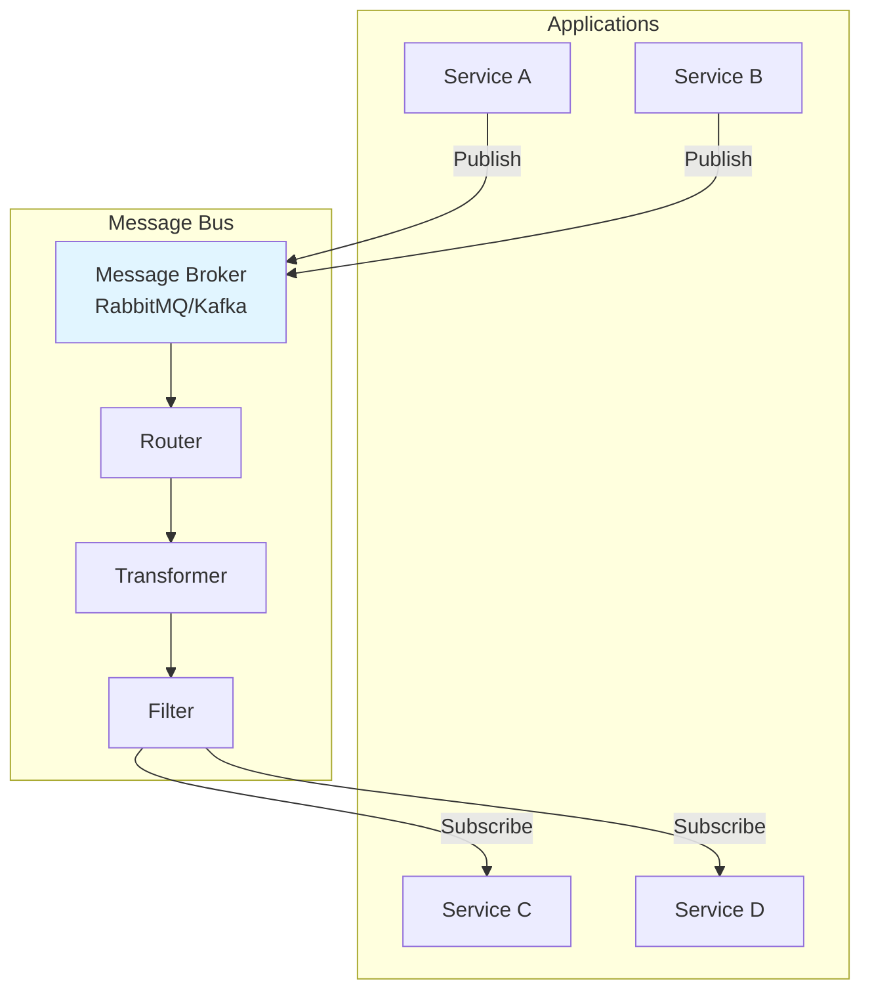

# Message Bus — Enterprise Integration Pattern

## 1. Introduction

### Objectifs du cours
À la fin de ce cours, vous serez capable de :
- Comprendre ce qu'est un Message Bus et son rôle dans les architectures
- Différencier Message Bus, Event Bus et Service Bus
- Implémenter un Message Bus avec NestJS
- Gérer le routage de messages entre services
- Découpler les composants d'une application

### Ce que vous allez apprendre
- La définition et les caractéristiques d'un Message Bus
- L'implémentation avec TypeScript/NestJS et RabbitMQ
- Les patterns de routage et de transformation
- L'intégration de services hétérogènes
- Les stratégies de monitoring et de debugging

### Scope de la notion
Après ce cours, vous pourrez :
- Construire une architecture orientée messages
- Découpler les microservices efficacement
- Implémenter des workflows complexes
- Faciliter l'évolution et la maintenance des systèmes

---

## 2. Définition et Concepts Clés

### 2.1 Qu'est-ce qu'un Message Bus ?

Un **Message Bus** est une infrastructure centrale qui permet à plusieurs applications/services de communiquer en envoyant et recevant des messages, sans connaissance directe les uns des autres.

**Analogie de la vie quotidienne :**
Imaginez un réseau de transport en commun (bus, métro). Les passagers (messages) montent à un arrêt (producteur), le bus les transporte selon des routes définies (routage), et ils descendent à leur destination (consommateur). Les passagers n'ont pas besoin de connaître le chauffeur ni les autres passagers. Le bus gère tout le transport. C'est un Message Bus.

### 2.2 Architecture d'un Message Bus



### 2.3 Composants d'un Message Bus

| Composant | Rôle | Exemple |
|-----------|------|---------|
| **Message Broker** | Infrastructure centrale | RabbitMQ, Kafka, Redis |
| **Channels** | Routes de messages | Queues, Topics |
| **Router** | Aiguillage des messages | Content-Based Router |
| **Transformer** | Conversion de formats | JSON ↔ XML |
| **Filter** | Filtrage de messages | By type, priority |
| **Adapter** | Connexion aux services | HTTP, gRPC, WebSocket |

### 2.4 Message Bus vs autres patterns

| Pattern | Caractéristique | Use Case |
|---------|-----------------|----------|
| **Message Bus** | Infrastructure centralisée | Intégration d'entreprise |
| **Event Bus** | Événements applicatifs | Domain events |
| **Service Bus** | SOA/ESB complet | Legacy integration |
| **API Gateway** | Routage HTTP | External APIs |

---

## 3. Cas d'usage métier dans les webapps

### 3.1 E-commerce : Workflow de commande

**Scénario :** Orchestrer le workflow complet d'une commande via un bus.

```typescript
// message-bus.module.ts
import { Module } from '@nestjs/common';
import { ClientsModule, Transport } from '@nestjs/microservices';

@Module({
  imports: [
    ClientsModule.register([
      {
        name: 'MESSAGE_BUS',
        transport: Transport.RMQ,
        options: {
          urls: ['amqp://localhost:5672'],
          queue: 'message_bus',
          queueOptions: {
            durable: true,
          },
        },
      },
    ]),
  ],
  providers: [MessageBusService],
  exports: [MessageBusService, ClientsModule],
})
export class MessageBusModule {}

// message-bus.service.ts
import { Injectable, Inject } from '@nestjs/common';
import { ClientProxy } from '@nestjs/microservices';

@Injectable()
export class MessageBusService {
  constructor(
    @Inject('MESSAGE_BUS') private readonly messageBus: ClientProxy,
  ) {}

  async publishEvent<T>(eventType: string, data: T): Promise<void> {
    await this.messageBus.emit(eventType, {
      type: eventType,
      timestamp: Date.now(), // Better performance than new Date()
      data,
    });
  }

  async sendCommand<T, R>(commandType: string, data: T): Promise<R> {
    return this.messageBus.send(commandType, {
      type: commandType,
      timestamp: Date.now(), // Better performance than new Date()
      data,
    }).toPromise();
  }
}

// order.service.ts - Producteur
@Injectable()
export class OrderService {
  constructor(
    private readonly messageBus: MessageBusService,
    private readonly orderRepository: OrderRepository,
  ) {}

  async createOrder(orderData: CreateOrderDto): Promise<Order> {
    // 1. Créer la commande en base
    const order = await this.orderRepository.create(orderData);

    // 2. Publier l'événement sur le bus
    await this.messageBus.publishEvent('order.created', {
      orderId: order.id,
      customerId: order.customerId,
      total: order.total,
      items: order.items,
    });

    return order;
  }
}

// inventory.consumer.ts - Consommateur 1
@Controller()
export class InventoryConsumer {
  constructor(
    private readonly inventoryService: InventoryService,
    private readonly messageBus: MessageBusService,
  ) {}

  @EventPattern('order.created')
  async handleOrderCreated(@Payload() event: any) {
    const { orderId, items } = event.data;

    try {
      // Réserver le stock
      await this.inventoryService.reserveStock(items);

      // Publier succès sur le bus
      await this.messageBus.publishEvent('inventory.reserved', {
        orderId,
        items,
      });

    } catch (error) {
      // Publier échec sur le bus
      await this.messageBus.publishEvent('inventory.reservation.failed', {
        orderId,
        reason: error.message,
      });
    }
  }
}

// payment.consumer.ts - Consommateur 2
@Controller()
export class PaymentConsumer {
  constructor(
    private readonly paymentService: PaymentService,
    private readonly messageBus: MessageBusService,
  ) {}

  @EventPattern('inventory.reserved')
  async handleInventoryReserved(@Payload() event: any) {
    const { orderId } = event.data;

    try {
      // Traiter le paiement
      const payment = await this.paymentService.process(orderId);

      // Publier succès
      await this.messageBus.publishEvent('payment.processed', {
        orderId,
        paymentId: payment.id,
      });

    } catch (error) {
      // Publier échec et déclencher compensation
      await this.messageBus.publishEvent('payment.failed', {
        orderId,
        reason: error.message,
      });
    }
  }

  @EventPattern('inventory.reservation.failed')
  async handleInventoryFailed(@Payload() event: any) {
    const { orderId } = event.data;
    
    // Annuler la commande
    await this.messageBus.publishEvent('order.cancelled', {
      orderId,
      reason: 'Inventory reservation failed',
    });
  }
}

// shipping.consumer.ts - Consommateur 3
@Controller()
export class ShippingConsumer {
  @EventPattern('payment.processed')
  async handlePaymentProcessed(@Payload() event: any) {
    const { orderId } = event.data;

    // Créer l'expédition
    const shipment = await this.shippingService.createShipment(orderId);

    await this.messageBus.publishEvent('shipment.created', {
      orderId,
      shipmentId: shipment.id,
      trackingNumber: shipment.trackingNumber,
    });
  }
}

// notification.consumer.ts - Consommateur 4
@Controller()
export class NotificationConsumer {
  @EventPattern('shipment.created')
  async handleShipmentCreated(@Payload() event: any) {
    const { orderId, trackingNumber } = event.data;

    // Notifier le client
    await this.notificationService.send({
      type: 'ORDER_SHIPPED',
      orderId,
      trackingNumber,
    });
  }

  @EventPattern('order.cancelled')
  async handleOrderCancelled(@Payload() event: any) {
    await this.notificationService.send({
      type: 'ORDER_CANCELLED',
      orderId: event.data.orderId,
      reason: event.data.reason,
    });
  }
}
```

### 3.2 CRM : Synchronisation multi-systèmes

**Scénario :** Synchroniser les contacts entre CRM, email marketing, et support.

```typescript
// contact-sync.service.ts
@Injectable()
export class ContactSyncService {
  constructor(
    private readonly messageBus: MessageBusService,
  ) {}

  async createContact(contact: CreateContactDto): Promise<Contact> {
    // Créer le contact en BDD
    const newContact = await this.contactRepository.create(contact);

    // Publier sur le bus pour synchronisation
    await this.messageBus.publishEvent('contact.created', {
      contactId: newContact.id,
      email: newContact.email,
      firstName: newContact.firstName,
      lastName: newContact.lastName,
      tags: newContact.tags,
    });

    return newContact;
  }
}

// email-marketing.consumer.ts
@Controller()
export class EmailMarketingConsumer {
  @EventPattern('contact.created')
  async syncToEmailMarketing(@Payload() event: any) {
    const { email, firstName, lastName, tags } = event.data;

    // Synchroniser vers Mailchimp/SendGrid
    await this.emailMarketingAPI.addSubscriber({
      email,
      firstName,
      lastName,
      tags,
    });
  }

  @EventPattern('contact.updated')
  async updateEmailMarketing(@Payload() event: any) {
    await this.emailMarketingAPI.updateSubscriber(event.data);
  }
}

// support-system.consumer.ts
@Controller()
export class SupportSystemConsumer {
  @EventPattern('contact.created')
  async syncToSupport(@Payload() event: any) {
    // Créer le contact dans Zendesk/Intercom
    await this.supportAPI.createCustomer({
      email: event.data.email,
      name: `${event.data.firstName} ${event.data.lastName}`,
    });
  }
}

// analytics.consumer.ts
@Controller()
export class AnalyticsConsumer {
  @EventPattern('contact.created')
  async trackContactCreation(@Payload() event: any) {
    // Envoyer à Google Analytics / Segment
    await this.analyticsService.track({
      event: 'Contact Created',
      properties: event.data,
    });
  }
}
```

### 3.3 IoT : Agrégation de données de capteurs

**Scénario :** Collecter et distribuer les données de capteurs IoT.

```typescript
// sensor-data.gateway.ts
@WebSocketGateway()
export class SensorDataGateway {
  constructor(
    private readonly messageBus: MessageBusService,
  ) {}

  @SubscribeMessage('sensor-data')
  async handleSensorData(@MessageBody() data: SensorData) {
    // Publier sur le bus
    await this.messageBus.publishEvent('sensor.data.received', {
      sensorId: data.sensorId,
      type: data.type,
      value: data.value,
      timestamp: data.timestamp,
      location: data.location,
    });
  }
}

// alerting.consumer.ts
@Controller()
export class AlertingConsumer {
  @EventPattern('sensor.data.received')
  async checkThresholds(@Payload() event: any) {
    const { sensorId, type, value } = event.data;

    // Vérifier les seuils d'alerte
    const threshold = await this.thresholdService.getThreshold(sensorId, type);

    if (value > threshold.max || value < threshold.min) {
      await this.messageBus.publishEvent('alert.triggered', {
        sensorId,
        type,
        value,
        threshold,
        severity: this.calculateSeverity(value, threshold),
      });
    }
  }
}

// storage.consumer.ts
@Controller()
export class StorageConsumer {
  @EventPattern('sensor.data.received')
  async storeData(@Payload() event: any) {
    // Sauvegarder dans une time-series DB
    await this.timeseriesDB.insert({
      measurement: 'sensor_data',
      tags: {
        sensor_id: event.data.sensorId,
        type: event.data.type,
      },
      fields: {
        value: event.data.value,
      },
      timestamp: event.data.timestamp,
    });
  }
}

// dashboard.consumer.ts
@Controller()
export class DashboardConsumer {
  @EventPattern('sensor.data.received')
  async updateDashboard(@Payload() event: any) {
    // Envoyer au frontend via WebSocket
    this.dashboardGateway.broadcast('sensor-update', event.data);
  }

  @EventPattern('alert.triggered')
  async notifyAlert(@Payload() event: any) {
    // Notification temps réel
    this.dashboardGateway.broadcast('alert', event.data);
  }
}
```

---

## 4. Implémentation avancée

### 4.1 Message Bus avec routage intelligent

```typescript
// smart-message-bus.service.ts
@Injectable()
export class SmartMessageBusService {
  constructor(
    @Inject('MESSAGE_BUS') private readonly messageBus: ClientProxy,
    private readonly logger: Logger,
  ) {}

  async publish<T>(
    eventType: string,
    data: T,
    options?: PublishOptions,
  ): Promise<void> {
    const enrichedMessage = {
      id: uuidv4(),
      type: eventType,
      timestamp: new Date(),
      correlationId: options?.correlationId || uuidv4(),
      source: options?.source || 'unknown',
      data,
      metadata: {
        version: '1.0',
        priority: options?.priority || 5,
        ttl: options?.ttl || 3600000, // 1h par défaut
      },
    };

    // Logging
    this.logger.log(`Publishing event: ${eventType}`, {
      id: enrichedMessage.id,
      correlationId: enrichedMessage.correlationId,
    });

    // Metrics
    this.metricsService.incrementCounter('events_published', {
      type: eventType,
    });

    // Publish
    await this.messageBus.emit(eventType, enrichedMessage);
  }

  async request<T, R>(
    commandType: string,
    data: T,
    options?: RequestOptions,
  ): Promise<R> {
    const timeout = options?.timeout || 30000;
    const correlationId = options?.correlationId || uuidv4();

    const enrichedMessage = {
      id: uuidv4(),
      type: commandType,
      timestamp: new Date(),
      correlationId,
      data,
    };

    this.logger.log(`Sending command: ${commandType}`, {
      id: enrichedMessage.id,
      correlationId,
    });

    try {
      const result = await this.messageBus
        .send(commandType, enrichedMessage)
        .pipe(
          timeout(timeout),
          catchError((error) => {
            this.logger.error(`Command failed: ${commandType}`, error);
            throw error;
          }),
        )
        .toPromise();

      return result;

    } catch (error) {
      this.metricsService.incrementCounter('commands_failed', {
        type: commandType,
      });
      throw error;
    }
  }
}

interface PublishOptions {
  correlationId?: string;
  source?: string;
  priority?: number;
  ttl?: number;
}

interface RequestOptions {
  correlationId?: string;
  timeout?: number;
}
```

### 4.2 Message Bus avec transformation

```typescript
// message-transformer.service.ts
@Injectable()
export class MessageTransformerService {
  transformToV2(message: any): any {
    // Transformer les messages legacy vers nouveau format
    return {
      ...message,
      version: '2.0',
      data: this.upgradeDataFormat(message.data),
    };
  }

  transformFromExternal(externalMessage: any, source: string): any {
    // Normaliser les messages externes
    const transformers = {
      'salesforce': this.transformSalesforce,
      'hubspot': this.transformHubspot,
      'zendesk': this.transformZendesk,
    };

    const transformer = transformers[source];
    if (!transformer) {
      throw new Error(`No transformer for source: ${source}`);
    }

    return transformer(externalMessage);
  }

  private transformSalesforce(msg: any): any {
    return {
      id: msg.Id,
      type: 'contact.updated',
      data: {
        contactId: msg.ContactId,
        email: msg.Email,
        name: msg.Name,
      },
    };
  }
}
```

### 4.3 Message Bus avec filtering

```typescript
// message-filter.service.ts
@Injectable()
export class MessageFilterService {
  shouldProcess(message: any, filters: MessageFilter[]): boolean {
    return filters.every(filter => this.applyFilter(message, filter));
  }

  private applyFilter(message: any, filter: MessageFilter): boolean {
    switch (filter.type) {
      case 'type':
        return message.type === filter.value;
      
      case 'priority':
        return message.metadata.priority >= filter.value;
      
      case 'source':
        return message.source === filter.value;
      
      case 'custom':
        return filter.predicate(message);
      
      default:
        return true;
    }
  }
}

// Usage dans un consumer
@Controller()
export class FilteredConsumer {
  constructor(
    private readonly filterService: MessageFilterService,
  ) {}

  @EventPattern('*') // Écouter tous les événements
  async handleMessage(@Payload() message: any) {
    // Filtrer les messages
    const filters: MessageFilter[] = [
      { type: 'priority', value: 7 }, // Seulement haute priorité
      { type: 'source', value: 'payment-service' },
    ];

    if (!this.filterService.shouldProcess(message, filters)) {
      return; // Ignorer
    }

    // Traiter le message
    await this.process(message);
  }
}
```

---

## 5. Monitoring et Debugging

### 5.1 Message Tracing

```typescript
// message-tracer.service.ts
@Injectable()
export class MessageTracerService {
  async traceMessage(messageId: string): Promise<MessageTrace> {
    const trace = await this.traceRepository.findByMessageId(messageId);
    
    return {
      messageId,
      correlationId: trace.correlationId,
      timeline: trace.events.map(event => ({
        timestamp: event.timestamp,
        service: event.service,
        action: event.action,
        duration: event.duration,
      })),
      status: trace.status,
      errors: trace.errors,
    };
  }

  async recordEvent(event: TraceEvent): Promise<void> {
    await this.traceRepository.addEvent({
      messageId: event.messageId,
      correlationId: event.correlationId,
      timestamp: new Date(),
      service: event.service,
      action: event.action,
      duration: event.duration,
    });
  }
}

// Interceptor pour tracer automatiquement
@Injectable()
export class TracingInterceptor implements NestInterceptor {
  constructor(private readonly tracer: MessageTracerService) {}

  intercept(context: ExecutionContext, next: CallHandler): Observable<any> {
    const message = context.switchToRpc().getData();
    const startTime = Date.now();
    const serviceName = context.getClass().name;

    return next.handle().pipe(
      tap(async () => {
        const duration = Date.now() - startTime;
        
        await this.tracer.recordEvent({
          messageId: message.id,
          correlationId: message.correlationId,
          service: serviceName,
          action: 'processed',
          duration,
        });
      }),
      catchError(async (error) => {
        await this.tracer.recordEvent({
          messageId: message.id,
          correlationId: message.correlationId,
          service: serviceName,
          action: 'failed',
          duration: Date.now() - startTime,
          error: error.message,
        });
        throw error;
      }),
    );
  }
}
```

### 5.2 Health Checks

```typescript
// message-bus-health.service.ts
@Injectable()
export class MessageBusHealthService {
  constructor(
    @Inject('MESSAGE_BUS') private readonly messageBus: ClientProxy,
  ) {}

  async checkHealth(): Promise<HealthIndicatorResult> {
    try {
      // Envoyer un message de test
      await this.messageBus
        .send('health.check', { timestamp: new Date() })
        .pipe(timeout(5000))
        .toPromise();

      return {
        messageBus: {
          status: 'up',
          details: {
            latency: Date.now() - start,
          },
        },
      };

    } catch (error) {
      return {
        messageBus: {
          status: 'down',
          details: {
            error: error.message,
          },
        },
      };
    }
  }
}
```

---

## 6. Erreurs Courantes & Comment les Éviter

### 6.1 Erreur 1 : Couplage fort malgré le bus

**❌ Mauvais :**
```typescript
// Service A appelle directement Service B via le bus
const result = await this.messageBus.send('service-b.get-user', { id: 123 });
// ❌ Couplage fort, dépendance directe
```

**✅ Correct :**
```typescript
// Événements découplés
await this.messageBus.publishEvent('user.updated', { userId: 123 });
// ✅ Service B s'abonne s'il est intéressé
```

### 6.2 Erreur 2 : Pas de versioning

**❌ Mauvais :**
```typescript
@EventPattern('order.created')
async handle(@Payload() data: any) {
  // Format du message peut changer
  const total = data.total; // ❌ Peut échouer
}
```

**✅ Correct :**
```typescript
@EventPattern('order.created')
async handle(@Payload() message: any) {
  const version = message.metadata?.version || '1.0';
  
  if (version === '1.0') {
    return this.handleV1(message.data);
  } else if (version === '2.0') {
    return this.handleV2(message.data);
  }
}
```

### 6.3 Erreur 3 : Pas de timeout

**❌ Mauvais :**
```typescript
const result = await this.messageBus.send('command', data).toPromise();
// ❌ Peut bloquer indéfiniment
```

**✅ Correct :**
```typescript
const result = await this.messageBus
  .send('command', data)
  .pipe(timeout(5000))
  .toPromise();
// ✅ Timeout de 5s
```

### 6.4 Erreur 4 : Events trop granulaires

**❌ Mauvais :**
```typescript
await this.messageBus.publishEvent('user.first.name.updated', {});
await this.messageBus.publishEvent('user.last.name.updated', {});
await this.messageBus.publishEvent('user.email.updated', {});
// ❌ Trop granulaire, bruit
```

**✅ Correct :**
```typescript
await this.messageBus.publishEvent('user.profile.updated', {
  userId,
  changes: ['firstName', 'lastName', 'email'],
});
// ✅ Un événement agrégé
```

---

## 7. Exercices Pratiques

### Exercice 1 : Workflow d'approbation

**Objectif :** Implémenter un workflow via le bus.

**Tâches :**
1. Événement `document.submitted`
2. Consumer pour assigner un approbateur
3. Événement `approval.requested`
4. Consumer pour traiter l'approbation
5. Événements de fin : `document.approved` ou `document.rejected`

### Exercice 2 : Multi-tenant sync

**Objectif :** Synchroniser des données entre tenants.

**Tâches :**
1. Bus avec routage par tenant
2. Filtering par tenant ID
3. Transformation selon config du tenant
4. Audit trail complet

---

## 8. Comportement Senior

### 8.1 Schema Registry

```typescript
// Valider les messages avec JSON Schema
@Injectable()
export class SchemaValidationService {
  private schemas = new Map<string, any>();

  async validate(messageType: string, data: any): Promise<void> {
    const schema = this.schemas.get(messageType);
    if (!schema) {
      throw new Error(`No schema for type: ${messageType}`);
    }

    const valid = await this.jsonSchemaValidator.validate(data, schema);
    if (!valid) {
      throw new ValidationError('Message does not match schema');
    }
  }
}
```

---

## 9. Résumé

### Points clés

1. **Message Bus = Infrastructure centrale** pour communication découplée
2. **Composants** : Broker, Router, Transformer, Filter
3. **Use cases** : Workflows, Synchronisation, IoT
4. **Bonnes pratiques** : Versioning, Timeout, Tracing, Health checks

### Quand utiliser un Message Bus ?

**✅ Utiliser quand :**
- Découplage nécessaire
- Multiple consommateurs
- Workflows complexes
- Intégration de systèmes

**❌ Ne pas utiliser quand :**
- Communication simple point-à-point
- Latence critique
- CRUD basique

---

## 10. Ressources Externes

### Documentation
- 📘 [Enterprise Integration Patterns - Message Bus](https://www.enterpriseintegrationpatterns.com/patterns/messaging/MessageBus.html)
- 📘 [NestJS Microservices](https://docs.nestjs.com/microservices/basics)

### Vidéos
- 🎥 [Event-Driven Architecture](https://www.youtube.com/watch?v=STKCRSUsyP0)

---

**En une phrase :**

> Un Message Bus est une infrastructure centralisée permettant à plusieurs services de communiquer de manière découplée via des messages routés, transformés et filtrés selon les besoins métier.
