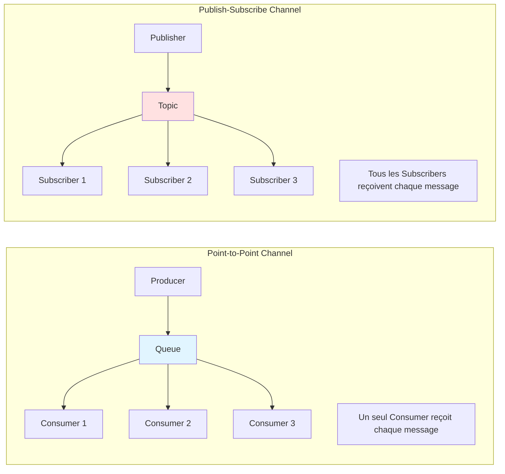

# Point-to-Point Channel — Enterprise Integration Pattern

## 1. Introduction

### Objectifs du cours
À la fin de ce cours, vous serez capable de :
- Comprendre ce qu'est un Point-to-Point Channel et son rôle dans les architectures distribuées
- Différencier Point-to-Point et Publish-Subscribe
- Implémenter des Point-to-Point Channels avec NestJS et RabbitMQ
- Garantir qu'un seul consommateur traite chaque message
- Gérer la distribution de charge avec des queues

### Ce que vous allez apprendre
- La définition et les caractéristiques d'un Point-to-Point Channel
- L'implémentation pratique avec TypeScript/NestJS et RabbitMQ
- Les stratégies de distribution de messages (round-robin, priorités)
- La gestion de la concurrence et des locks
- Les bonnes pratiques pour les applications métier

### Scope de la notion
Après ce cours, vous pourrez :
- Mettre en place des queues de messages pour traiter des tâches asynchrones
- Implémenter des workers concurrents pour améliorer les performances
- Garantir qu'une seule instance traite chaque tâche critique
- Gérer la charge de travail dans des webapps métier

---

## 2. Définition et Concepts Clés

### 2.1 Qu'est-ce qu'un Point-to-Point Channel ?

Un **Point-to-Point Channel** (aussi appelé **Queue**) est un canal de communication où **chaque message est consommé par un et un seul destinataire**, même s'il y a plusieurs consommateurs en écoute.

**Analogie de la vie quotidienne :**
Imaginez une file d'attente à la poste. Plusieurs guichets (consommateurs) sont ouverts, mais chaque client (message) est servi par un seul guichet. Une fois qu'un guichet prend en charge un client, les autres guichets ne le servent pas. C'est du Point-to-Point.

### 2.2 Caractéristiques principales

| Caractéristique | Description |
|-----------------|-------------|
| **Consommation** | Un seul consommateur par message |
| **Distribution** | Round-robin ou priorité |
| **Concurrence** | Plusieurs consommateurs possibles |
| **Garantie** | Chaque message est traité exactement une fois |
| **Ordre** | FIFO (First In, First Out) par défaut |

### 2.3 Point-to-Point vs Publish-Subscribe



**Tableau comparatif :**

| Aspect | Point-to-Point | Publish-Subscribe |
|--------|----------------|-------------------|
| **Destinataires** | 1 seul | Tous |
| **Use case** | Tâches à traiter | Notifications |
| **Distribution** | Compétition | Diffusion |
| **Exemple** | Jobs, commandes | Events, logs |
| **Scalabilité** | Horizontal (workers) | Vertical (subscribers) |

---

## 3. Cas d'usage métier dans les webapps

### 3.1 Traitement de commandes e-commerce

**Scénario :** Traiter les commandes de manière asynchrone avec plusieurs workers.

```typescript
// order-processor.service.ts
import { Injectable } from '@nestjs/common';
import { InjectQueue } from '@nestjs/bull';
import { Queue } from 'bull';

@Injectable()
export class OrderService {
  constructor(
    @InjectQueue('orders') private orderQueue: Queue,
  ) {}

  async submitOrder(orderData: CreateOrderDto): Promise<string> {
    // Envoyer la commande dans la queue (Point-to-Point)
    const job = await this.orderQueue.add('process-order', orderData, {
      attempts: 3,
      backoff: {
        type: 'exponential',
        delay: 2000,
      },
    });

    return job.id.toString();
  }
}

// order-consumer.service.ts
import { Processor, Process } from '@nestjs/bull';
import { Job } from 'bull';

@Processor('orders')
export class OrderConsumer {
  constructor(
    private readonly orderRepository: OrderRepository,
    private readonly paymentService: PaymentService,
    private readonly inventoryService: InventoryService,
    private readonly logger: Logger,
  ) {}

  @Process('process-order')
  async handleOrder(job: Job<CreateOrderDto>): Promise<void> {
    const { id, data } = job;
    
    this.logger.log(`Worker processing order ${id}`);

    try {
      // 1. Valider la commande
      await this.validateOrder(data);

      // 2. Réserver le stock
      await this.inventoryService.reserveStock(data.items);

      // 3. Traiter le paiement
      const payment = await this.paymentService.charge(
        data.customerId,
        data.total,
      );

      // 4. Créer la commande
      const order = await this.orderRepository.create({
        ...data,
        paymentId: payment.id,
        status: 'CONFIRMED',
      });

      // 5. Mettre à jour la progression
      await job.progress(100);

      this.logger.log(`Order ${order.id} processed successfully by worker`);

    } catch (error) {
      this.logger.error(`Failed to process order: ${error.message}`);
      throw error; // Bull réessaiera automatiquement
    }
  }

  private async validateOrder(data: CreateOrderDto): Promise<void> {
    if (!data.items || data.items.length === 0) {
      throw new ValidationException('Order must contain items');
    }
  }
}
```

**Configuration du module :**

```typescript
// order.module.ts
import { Module } from '@nestjs/common';
import { BullModule } from '@nestjs/bull';

@Module({
  imports: [
    BullModule.registerQueue({
      name: 'orders',
      redis: {
        host: 'localhost',
        port: 6379,
      },
    }),
  ],
  providers: [OrderService, OrderConsumer],
  controllers: [OrderController],
})
export class OrderModule {}
```

### 3.2 Envoi d'emails asynchrone

**Scénario :** Envoyer des emails de confirmation sans bloquer l'utilisateur.

```typescript
// email-queue.service.ts
import { Injectable } from '@nestjs/common';
import { InjectQueue } from '@nestjs/bull';
import { Queue } from 'bull';

export interface SendEmailJob {
  to: string;
  subject: string;
  template: string;
  data: Record<string, any>;
  priority?: number;
}

@Injectable()
export class EmailQueueService {
  constructor(
    @InjectQueue('emails') private emailQueue: Queue,
  ) {}

  async sendEmail(emailData: SendEmailJob): Promise<void> {
    await this.emailQueue.add('send', emailData, {
      priority: emailData.priority || 5,
      removeOnComplete: true,
      attempts: 3,
    });
  }

  async sendPriorityEmail(emailData: SendEmailJob): Promise<void> {
    await this.emailQueue.add('send', {
      ...emailData,
      priority: 1, // Haute priorité
    });
  }
}

// email-consumer.service.ts
@Processor('emails')
export class EmailConsumer {
  constructor(
    private readonly emailService: EmailService,
    private readonly logger: Logger,
  ) {}

  @Process({ name: 'send', concurrency: 5 })
  async sendEmail(job: Job<SendEmailJob>): Promise<void> {
    const { to, subject, template, data } = job.data;

    this.logger.log(`Sending email to ${to}`);

    try {
      await this.emailService.send({
        to,
        subject,
        html: await this.renderTemplate(template, data),
      });

      this.logger.log(`Email sent successfully to ${to}`);
    } catch (error) {
      this.logger.error(`Failed to send email to ${to}: ${error.message}`);
      throw error;
    }
  }

  private async renderTemplate(
    template: string,
    data: Record<string, any>,
  ): Promise<string> {
    // Rendu du template (Handlebars, EJS, etc.)
    return '';
  }
}
```

**Utilisation dans un controller :**

```typescript
@Controller('users')
export class UserController {
  constructor(
    private readonly userService: UserService,
    private readonly emailQueue: EmailQueueService,
  ) {}

  @Post('register')
  async register(@Body() dto: RegisterDto): Promise<UserResponse> {
    // 1. Créer l'utilisateur (synchrone)
    const user = await this.userService.create(dto);

    // 2. Envoyer l'email de confirmation (asynchrone via queue)
    await this.emailQueue.sendEmail({
      to: user.email,
      subject: 'Bienvenue !',
      template: 'welcome',
      data: { firstName: user.firstName },
    });

    // 3. Réponse immédiate à l'utilisateur
    return {
      id: user.id,
      email: user.email,
      message: 'Registration successful. Confirmation email sent.',
    };
  }
}
```

### 3.3 Génération de rapports

**Scénario :** Générer des rapports volumineux en arrière-plan.

```typescript
// report-queue.service.ts
export interface GenerateReportJob {
  userId: string;
  reportType: 'sales' | 'inventory' | 'analytics';
  startDate: Date;
  endDate: Date;
  format: 'pdf' | 'excel' | 'csv';
}

@Injectable()
export class ReportQueueService {
  constructor(
    @InjectQueue('reports') private reportQueue: Queue,
  ) {}

  async generateReport(reportData: GenerateReportJob): Promise<string> {
    const job = await this.reportQueue.add('generate', reportData, {
      timeout: 300000, // 5 minutes max
      attempts: 1, // Pas de retry (trop coûteux)
    });

    return job.id.toString();
  }

  async getReportStatus(jobId: string): Promise<JobStatus> {
    const job = await this.reportQueue.getJob(jobId);
    
    if (!job) {
      throw new NotFoundException('Report job not found');
    }

    const state = await job.getState();
    const progress = job.progress();

    return {
      id: jobId,
      state,
      progress,
      result: job.returnvalue,
    };
  }
}

// report-consumer.service.ts
@Processor('reports')
export class ReportConsumer {
  constructor(
    private readonly reportService: ReportService,
    private readonly storageService: StorageService,
    private readonly notificationService: NotificationService,
  ) {}

  @Process({ name: 'generate', concurrency: 2 })
  async generateReport(job: Job<GenerateReportJob>): Promise<string> {
    const { userId, reportType, startDate, endDate, format } = job.data;

    try {
      // 1. Récupérer les données
      await job.progress(10);
      const data = await this.reportService.fetchData(
        reportType,
        startDate,
        endDate,
      );

      // 2. Générer le rapport
      await job.progress(50);
      const reportBuffer = await this.reportService.generate(data, format);

      // 3. Sauvegarder dans le storage
      await job.progress(80);
      const fileUrl = await this.storageService.upload(
        `reports/${userId}/${Date.now()}.${format}`,
        reportBuffer,
      );

      // 4. Notifier l'utilisateur
      await job.progress(90);
      await this.notificationService.notify(userId, {
        type: 'REPORT_READY',
        message: 'Your report is ready',
        downloadUrl: fileUrl,
      });

      await job.progress(100);

      return fileUrl;

    } catch (error) {
      await this.notificationService.notify(userId, {
        type: 'REPORT_FAILED',
        message: 'Report generation failed',
      });

      throw error;
    }
  }
}
```

---

## 4. Implémentation avec NestJS et RabbitMQ

### 4.1 Setup avec Bull (Redis)

**Installation :**

```bash
npm install @nestjs/bull bull
npm install --save-dev @types/bull
```

**Configuration :**

```typescript
// app.module.ts
import { Module } from '@nestjs/common';
import { BullModule } from '@nestjs/bull';

@Module({
  imports: [
    BullModule.forRoot({
      redis: {
        host: process.env.REDIS_HOST || 'localhost',
        port: parseInt(process.env.REDIS_PORT) || 6379,
        password: process.env.REDIS_PASSWORD,
      },
      defaultJobOptions: {
        attempts: 3,
        backoff: {
          type: 'exponential',
          delay: 1000,
        },
        removeOnComplete: true,
        removeOnFail: false,
      },
    }),
    // Modules métier
  ],
})
export class AppModule {}
```

### 4.2 Setup avec RabbitMQ

**Installation :**

```bash
npm install @nestjs/microservices amqplib amqp-connection-manager
```

**Configuration :**

```typescript
// main.ts
import { NestFactory } from '@nestjs/core';
import { Transport, MicroserviceOptions } from '@nestjs/microservices';

async function bootstrap() {
  const app = await NestFactory.create(AppModule);

  // Microservice RabbitMQ
  app.connectMicroservice<MicroserviceOptions>({
    transport: Transport.RMQ,
    options: {
      urls: [process.env.RABBITMQ_URL || 'amqp://localhost:5672'],
      queue: 'tasks_queue',
      queueOptions: {
        durable: true, // Queue persiste après redémarrage
      },
      prefetchCount: 1, // Un message à la fois par consumer
    },
  });

  await app.startAllMicroservices();
  await app.listen(3000);
}
bootstrap();
```

**Producer :**

```typescript
// task-producer.service.ts
import { Injectable } from '@nestjs/common';
import { ClientProxy, ClientProxyFactory, Transport } from '@nestjs/microservices';

@Injectable()
export class TaskProducerService {
  private client: ClientProxy;

  constructor() {
    this.client = ClientProxyFactory.create({
      transport: Transport.RMQ,
      options: {
        urls: ['amqp://localhost:5672'],
        queue: 'tasks_queue',
        queueOptions: {
          durable: true,
        },
      },
    });
  }

  async sendTask(task: TaskData): Promise<void> {
    // Envoyer dans la queue (Point-to-Point)
    await this.client.emit('process_task', task).toPromise();
  }

  async sendTaskWithReply(task: TaskData): Promise<any> {
    // Envoyer et attendre la réponse
    return this.client.send('process_task_sync', task).toPromise();
  }
}
```

**Consumer :**

```typescript
// task-consumer.controller.ts
import { Controller } from '@nestjs/common';
import { MessagePattern, Payload, Ctx, RmqContext } from '@nestjs/microservices';

@Controller()
export class TaskConsumerController {
  constructor(
    private readonly taskService: TaskService,
    private readonly logger: Logger,
  ) {}

  @MessagePattern('process_task')
  async handleTask(@Payload() data: TaskData, @Ctx() context: RmqContext) {
    const channel = context.getChannelRef();
    const originalMsg = context.getMessage();

    this.logger.log(`Processing task: ${JSON.stringify(data)}`);

    try {
      // Traiter la tâche
      const result = await this.taskService.process(data);

      // Acquitter le message (enlever de la queue)
      channel.ack(originalMsg);

      this.logger.log(`Task processed successfully`);
      return result;

    } catch (error) {
      this.logger.error(`Task processing failed: ${error.message}`);

      // Rejeter et remettre en queue (ou envoyer en Dead Letter)
      channel.nack(originalMsg, false, false);
      throw error;
    }
  }
}
```

### 4.3 Gestion de la concurrence

```typescript
// Configuration pour plusieurs workers
@Processor('tasks')
export class TaskProcessor {
  // Concurrent workers
  @Process({ name: 'heavy-task', concurrency: 3 })
  async processHeavyTask(job: Job): Promise<void> {
    // 3 workers traitent en parallèle
  }

  @Process({ name: 'light-task', concurrency: 10 })
  async processLightTask(job: Job): Promise<void> {
    // 10 workers traitent en parallèle
  }
}
```

**Load balancing :**

```typescript
// Configuration RabbitMQ avec prefetch
app.connectMicroservice<MicroserviceOptions>({
  transport: Transport.RMQ,
  options: {
    urls: ['amqp://localhost:5672'],
    queue: 'tasks_queue',
    queueOptions: {
      durable: true,
    },
    prefetchCount: 5, // Chaque worker peut traiter 5 messages en parallèle
  },
});
```

---

## 5. Patterns avancés

### 5.1 Priority Queues

```typescript
// Envoyer avec priorité
await queue.add('task', data, {
  priority: 1, // 1 = haute, 10 = basse
});

// Configuration de la queue
BullModule.registerQueue({
  name: 'tasks',
  redis: { /* ... */ },
  settings: {
    // Activer les priorités
    stalledInterval: 30000,
    maxStalledCount: 1,
  },
});
```

### 5.2 Delayed Messages

```typescript
// Envoyer un message différé
await queue.add('send-reminder', {
  userId: '123',
  message: 'Your trial expires in 3 days',
}, {
  delay: 3 * 24 * 60 * 60 * 1000, // 3 jours
});
```

### 5.3 Rate Limiting

```typescript
// Limiter le nombre de jobs traités par période
BullModule.registerQueue({
  name: 'api-calls',
  limiter: {
    max: 100, // 100 jobs
    duration: 1000, // par seconde
  },
});
```

---

## 6. Erreurs Courantes & Comment les Éviter

### 6.1 Erreur 1 : Pas d'acquittement (ACK)

**❌ Mauvais :**
```typescript
@MessagePattern('process_task')
async handleTask(@Payload() data: any) {
  await this.process(data);
  // ❌ Pas d'ACK, le message reste dans la queue
}
```

**✅ Correct :**
```typescript
@MessagePattern('process_task')
async handleTask(@Payload() data: any, @Ctx() context: RmqContext) {
  const channel = context.getChannelRef();
  const message = context.getMessage();

  try {
    await this.process(data);
    channel.ack(message); // ✅ Acquitter
  } catch (error) {
    channel.nack(message, false, false); // Rejeter
  }
}
```

### 6.2 Erreur 2 : Jobs sans timeout

**❌ Mauvais :**
```typescript
await queue.add('long-task', data);
// Pas de timeout, peut bloquer indéfiniment
```

**✅ Correct :**
```typescript
await queue.add('long-task', data, {
  timeout: 60000, // 1 minute max
  attempts: 1, // Ne pas réessayer si timeout
});
```

### 6.3 Erreur 3 : Pas de monitoring

**❌ Mauvais :**
```typescript
@Process('task')
async process(job: Job) {
  await this.doWork(job.data);
  // Pas de visibilité sur les erreurs ou la progression
}
```

**✅ Correct :**
```typescript
@Process('task')
async process(job: Job) {
  const logger = new Logger('TaskProcessor');
  
  try {
    logger.log(`Starting job ${job.id}`);
    
    await job.progress(0);
    await this.step1(job.data);
    
    await job.progress(50);
    await this.step2(job.data);
    
    await job.progress(100);
    logger.log(`Job ${job.id} completed`);
    
  } catch (error) {
    logger.error(`Job ${job.id} failed: ${error.message}`);
    throw error;
  }
}
```

### 6.4 Erreur 4 : Queue non durable

**❌ Mauvais :**
```typescript
BullModule.registerQueue({
  name: 'critical-tasks',
  // Pas de configuration de persistence
});
```

**✅ Correct :**
```typescript
BullModule.registerQueue({
  name: 'critical-tasks',
  redis: {
    host: 'localhost',
    port: 6379,
    enableOfflineQueue: true, // ✅ Persistance
  },
});
```

### 6.5 Erreur 5 : Concurrence excessive

**❌ Mauvais :**
```typescript
@Process({ concurrency: 100 }) // ❌ Trop de workers
async process(job: Job) {
  // Peut saturer la BDD ou l'API
}
```

**✅ Correct :**
```typescript
@Process({ concurrency: 5 }) // ✅ Raisonnable
async process(job: Job) {
  // Configuration adaptée aux ressources
}
```

---

## 7. Exercices Pratiques

### Exercice 1 : File d'attente de notifications

**Objectif :** Créer un système de notifications push asynchrone.

**Tâches :**
1. Créer une queue `notifications` avec Bull
2. Implémenter un producer pour envoyer des notifications
3. Créer un consumer avec concurrence de 3
4. Gérer les retry (3 tentatives)
5. Logger les succès et échecs

**Validation :** 
- Plusieurs notifications envoyées en parallèle
- Chaque notification traitée une seule fois
- Retry automatique en cas d'échec

### Exercice 2 : Traitement de fichiers

**Objectif :** Traiter des uploads de fichiers en arrière-plan.

**Tâches :**
1. Queue pour traiter des images (resize, compression)
2. Supporter plusieurs formats (jpg, png, webp)
3. Mettre à jour la progression
4. Notifier l'utilisateur à la fin
5. Gérer les erreurs (format invalide, fichier corrompu)

**Validation :**
- Upload non bloquant
- Traitement parallèle de plusieurs fichiers
- Feedback de progression en temps réel

### Exercice 3 : Job scheduler

**Objectif :** Planifier des tâches récurrentes.

**Tâches :**
1. Configurer des jobs CRON (daily, weekly)
2. Créer un job de nettoyage de données
3. Créer un job de génération de statistiques
4. Logger l'exécution de chaque job
5. Éviter les doublons (idempotence)

---

## 8. Comportement Senior

### 8.1 Monitoring et Observabilité

```typescript
// Bull Board pour UI de monitoring
import { BullAdapter } from '@bull-board/api/bullAdapter';
import { ExpressAdapter } from '@bull-board/express';
import { createBullBoard } from '@bull-board/api';

const serverAdapter = new ExpressAdapter();
serverAdapter.setBasePath('/admin/queues');

createBullBoard({
  queues: [
    new BullAdapter(orderQueue),
    new BullAdapter(emailQueue),
    new BullAdapter(reportQueue),
  ],
  serverAdapter,
});

app.use('/admin/queues', serverAdapter.getRouter());
```

### 8.2 Metrics et Alerting

```typescript
// Collecter des métriques
@Process('task')
async process(job: Job) {
  const startTime = Date.now();
  
  try {
    await this.doWork(job.data);
    
    const duration = Date.now() - startTime;
    this.metricsService.recordJobDuration('task', duration);
    this.metricsService.incrementCounter('jobs_success');
    
  } catch (error) {
    this.metricsService.incrementCounter('jobs_failed');
    
    if (await job.attemptsMade >= job.opts.attempts) {
      // Alerte si max retries atteint
      await this.alertingService.sendAlert({
        severity: 'high',
        message: `Job ${job.id} failed after ${job.attemptsMade} attempts`,
      });
    }
    
    throw error;
  }
}
```

### 8.3 Pattern Dead Letter Queue

```typescript
// Déplacer les jobs en échec vers une Dead Letter Queue
@Process('main-task')
async process(job: Job) {
  try {
    await this.doWork(job.data);
  } catch (error) {
    if (job.attemptsMade >= job.opts.attempts) {
      // Envoyer dans DLQ
      await this.deadLetterQueue.add('failed-task', {
        originalJob: job.data,
        error: error.message,
        failedAt: new Date(),
      });
    }
    throw error;
  }
}
```

### 8.4 Graceful Shutdown

```typescript
// main.ts
import { NestFactory } from '@nestjs/core';

async function bootstrap() {
  const app = await NestFactory.create(AppModule);
  
  // Graceful shutdown
  process.on('SIGTERM', async () => {
    console.log('SIGTERM received, closing gracefully');
    
    // Arrêter de prendre de nouveaux jobs
    await app.close();
    
    // Attendre que les jobs en cours se terminent
    setTimeout(() => {
      console.log('Forcing shutdown');
      process.exit(0);
    }, 30000); // 30 secondes max
  });
  
  await app.listen(3000);
}
bootstrap();
```

---

## 9. Résumé

### Points clés

1. **Point-to-Point = Une Queue, Un Consumer par Message**
   - Garantit qu'un seul worker traite chaque message
   - Distribution automatique (load balancing)
   - Idéal pour les tâches asynchrones

2. **Use Cases**
   - Traitement de commandes
   - Envoi d'emails
   - Génération de rapports
   - Upload de fichiers
   - Jobs planifiés

3. **Technologies**
   - Bull (Redis) pour la simplicité
   - RabbitMQ pour la robustesse
   - Kafka pour le débit élevé

4. **Bonnes pratiques**
   - Toujours acquitter les messages
   - Configurer des timeouts
   - Monitorer et logger
   - Gérer les retry et DLQ
   - Concurrence adaptée

### Quand utiliser Point-to-Point ?

**✅ Utiliser quand :**
- Tâches asynchrones à traiter
- Besoin de load balancing
- Traitement unique par message requis
- Scalabilité horizontale souhaitée

**❌ Ne pas utiliser quand :**
- Besoin de notifier tous les consommateurs (→ Pub/Sub)
- Communication synchrone requise
- Ordre strict entre messages critiques

### Checklist Point-to-Point

- [ ] Queue configurée avec durabilité
- [ ] Acquittement (ACK) des messages
- [ ] Timeout et retry configurés
- [ ] Monitoring et logging en place
- [ ] Dead Letter Queue pour les échecs
- [ ] Concurrence adaptée
- [ ] Tests de charge effectués

---

## 10. Ressources Externes

### Documentation
- 📘 [Enterprise Integration Patterns - Point-to-Point Channel](https://www.enterpriseintegrationpatterns.com/patterns/messaging/PointToPointChannel.html)
- 📘 [NestJS Bull](https://docs.nestjs.com/techniques/queues)
- 📘 [RabbitMQ Work Queues](https://www.rabbitmq.com/tutorials/tutorial-two-javascript.html)

### Vidéos (français)
- 🎥 [Les Queues de Messages expliquées](https://www.youtube.com/watch?v=oUJbuFMyBDk)

### Vidéos (anglais)
- 🎥 [RabbitMQ Crash Course](https://www.youtube.com/watch?v=Cie5v59mrTg)
- 🎥 [Bull Queue Tutorial](https://www.youtube.com/watch?v=1XR0oQYf8Yw)

### Articles et tutoriels
- 📝 [Message Queue Best Practices](https://www.cloudamqp.com/blog/part1-rabbitmq-best-practice.html)
- 📝 [Building Robust Queue Systems](https://blog.logrocket.com/build-robust-queue-system-nestjs-bull/)

### Outils
- 🛠️ [Bull Dashboard](https://github.com/felixmosh/bull-board)
- 🛠️ [RabbitMQ Management UI](https://www.rabbitmq.com/management.html)
- 🛠️ [Redis Commander](https://github.com/joeferner/redis-commander)

---

**En une phrase :**

> Un Point-to-Point Channel est une queue qui garantit qu'un seul consommateur traite chaque message, permettant le load balancing automatique et le traitement asynchrone de tâches dans les webapps métier avec NestJS/Bull/RabbitMQ.
