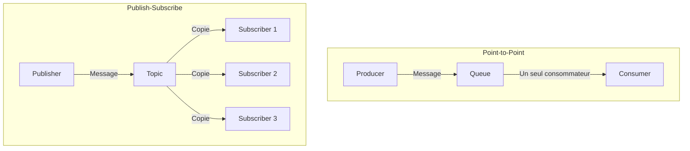

# Publish-Subscribe Channel — Enterprise Integration Pattern

## 1. Introduction

### Objectifs du cours
À la fin de ce cours, vous serez capable de :
- Comprendre le pattern Publish-Subscribe et ses avantages
- Implémenter Pub/Sub avec RabbitMQ, Redis et NestJS
- Différencier Point-to-Point et Pub/Sub
- Créer des systèmes event-driven scalables
- Gérer les abonnements et les topics dynamiquement

### Ce que vous allez apprendre
- Le fonctionnement de Publish-Subscribe
- Les cas d'usage dans les webapps métier
- L'implémentation avec différentes technologies
- Les patterns de filtrage et routing
- Les bonnes pratiques de performance et scalabilité

### Scope de la notion
Après ce cours, vous pourrez :
- Découp

ler complètement producteurs et consommateurs
- Créer des architectures event-driven robustes
- Implémenter des notifications en temps réel
- Scaler horizontalement vos services

---

## 2. Définition et Concepts Clés

### 2.1 Qu'est-ce que Publish-Subscribe ?

**Publish-Subscribe (Pub/Sub)** est un pattern où les émetteurs (publishers) publient des messages sur des **topics** sans connaître les destinataires, et les récepteurs (subscribers) s'abonnent aux topics qui les intéressent.

**Analogie de la vie quotidienne :**
Imaginez une chaîne YouTube. Le créateur (publisher) publie des vidéos sans savoir qui va les regarder. Les spectateurs (subscribers) s'abonnent à la chaîne et sont notifiés quand une nouvelle vidéo sort. Si quelqu'un se désabonne, le créateur continue à publier. C'est exactement Pub/Sub.

### 2.2 Caractéristiques principales

| Caractéristique | Description |
|-----------------|-------------|
| **Découplage** | Publisher ne connaît pas les subscribers |
| **1-to-N** | Un message peut avoir 0, 1 ou N destinataires |
| **Topics** | Messages organisés par sujets |
| **Dynamique** | Subscribers peuvent s'abonner/désabonner à tout moment |
| **Asynchrone** | Communication non-bloquante |

### 2.3 Pub/Sub vs Point-to-Point



**Tableau comparatif :**

| Aspect | Point-to-Point | Publish-Subscribe |
|--------|----------------|-------------------|
| **Destinataires** | 1 seul | 0 à N |
| **Message** | Consommé une fois | Copié pour chaque subscriber |
| **Découplage** | Moyen | Fort |
| **Use case** | Tâches à distribuer | Notifications, events |
| **Exemple** | Job queue | Event bus |

---

## 3. Cas d'usage métier dans les webapps

### 3.1 Notifications en temps réel

**Scénario :** Quand un utilisateur poste un commentaire, notifier tous les abonnés.

```typescript
// Publisher (Post Service)
@Injectable()
export class PostService {
  constructor(
    @Inject('EVENT_BUS') private eventBus: ClientProxy,
  ) {}
  
  async createComment(postId: string, userId: string, content: string): Promise<Comment> {
    const comment = await this.commentRepository.save({
      postId,
      userId,
      content,
    });
    
    // Publier sur le topic "post.commented"
    await this.eventBus.emit('post.commented', {
      postId,
      commentId: comment.id,
      userId,
      content: comment.content,
      timestamp: new Date(),
    });
    
    return comment;
  }
}

// Subscriber 1 : Email Notification Service
@Controller()
export class EmailNotificationService {
  @EventPattern('post.commented')
  async handleCommentNotification(@Payload() event: CommentCreatedEvent) {
    // Récupérer les abonnés du post
    const subscribers = await this.postRepository.getSubscribers(event.postId);
    
    // Envoyer email à chaque abonné
    for (const subscriber of subscribers) {
      await this.emailService.send({
        to: subscriber.email,
        subject: 'New comment on your post',
        body: `${event.userId} commented: ${event.content}`,
      });
    }
  }
}

// Subscriber 2 : Push Notification Service
@Controller()
export class PushNotificationService {
  @EventPattern('post.commented')
  async handleCommentNotification(@Payload() event: CommentCreatedEvent) {
    const subscribers = await this.postRepository.getSubscribers(event.postId);
    
    // Envoyer notification push
    for (const subscriber of subscribers) {
      await this.pushService.send(subscriber.deviceToken, {
        title: 'New Comment',
        body: event.content,
      });
    }
  }
}

// Subscriber 3 : Analytics Service
@Controller()
export class AnalyticsService {
  @EventPattern('post.commented')
  async trackComment(@Payload() event: CommentCreatedEvent) {
    await this.analyticsRepository.save({
      eventType: 'comment_created',
      postId: event.postId,
      userId: event.userId,
      timestamp: event.timestamp,
    });
  }
}

// Subscriber 4 : WebSocket Service (notifications en temps réel)
@Controller()
export class WebSocketService {
  @EventPattern('post.commented')
  async broadcastComment(@Payload() event: CommentCreatedEvent) {
    // Broadcast aux clients connectés
    this.websocketGateway.broadcast('new-comment', {
      postId: event.postId,
      comment: event.content,
    });
  }
}
```

**Avantages :**
- ✅ Ajouter un nouveau subscriber (ex: Slack notification) sans modifier le publisher
- ✅ Chaque service est isolé et peut être scalé indépendamment
- ✅ Si un service est down, les autres continuent de fonctionner

### 3.2 Event-Driven Architecture : Commande e-commerce

**Scénario :** Quand une commande est créée, plusieurs services doivent réagir.

```typescript
// Publisher
@Injectable()
export class OrderService {
  async placeOrder(dto: CreateOrderDto): Promise<Order> {
    const order = await this.orderRepository.save(dto);
    
    // Publier l'événement
    await this.eventBus.emit('order.placed', {
      orderId: order.id,
      customerId: order.customerId,
      items: order.items,
      total: order.total,
    });
    
    return order;
  }
}

// Subscribers multiples
@Controller()
export class InventoryService {
  @EventPattern('order.placed')
  async reserveStock(@Payload() event: OrderPlacedEvent) {
    for (const item of event.items) {
      await this.inventoryRepository.reserve(item.productId, item.quantity);
    }
  }
}

@Controller()
export class EmailService {
  @EventPattern('order.placed')
  async sendConfirmation(@Payload() event: OrderPlacedEvent) {
    await this.sendEmail({
      to: event.customer.email,
      subject: 'Order Confirmation',
      template: 'order-confirmation',
      data: event,
    });
  }
}

@Controller()
export class PaymentService {
  @EventPattern('order.placed')
  async processPayment(@Payload() event: OrderPlacedEvent) {
    await this.paymentGateway.charge({
      orderId: event.orderId,
      amount: event.total,
      customerId: event.customerId,
    });
  }
}

@Controller()
export class LoyaltyService {
  @EventPattern('order.placed')
  async addPoints(@Payload() event: OrderPlacedEvent) {
    const points = Math.floor(event.total / 10);
    await this.loyaltyRepository.addPoints(event.customerId, points);
  }
}
```

### 3.3 Mise à jour de cache distribuée

**Scénario :** Quand un produit est modifié, invalider le cache sur tous les serveurs.

```typescript
// Publisher
@Injectable()
export class ProductService {
  async updateProduct(id: string, updates: UpdateProductDto): Promise<Product> {
    const product = await this.productRepository.update(id, updates);
    
    // Publier événement de mise à jour
    await this.eventBus.emit('product.updated', {
      productId: id,
      changes: updates,
      timestamp: new Date(),
    });
    
    return product;
  }
}

// Subscribers (tous les serveurs d'API)
@Controller()
export class CacheInvalidationService {
  @EventPattern('product.updated')
  async invalidateCache(@Payload() event: ProductUpdatedEvent) {
    // Invalider le cache local
    await this.cacheManager.del(`product:${event.productId}`);
    
    // Également invalider les caches liés
    await this.cacheManager.del(`product-list:category:${event.categoryId}`);
    await this.cacheManager.del(`featured-products`);
    
    this.logger.log(`Cache invalidated for product ${event.productId}`);
  }
}
```

---

## 4. Implémentation avec RabbitMQ

### 4.1 Configuration Fanout Exchange

Le **Fanout Exchange** route les messages vers toutes les queues liées, c'est l'implémentation native du Pub/Sub.

```typescript
// Configuration du Publisher
// main.ts
async function bootstrap() {
  const app = await NestFactory.create(AppModule);
  
  app.connectMicroservice<MicroserviceOptions>({
    transport: Transport.RMQ,
    options: {
      urls: ['amqp://localhost:5672'],
      queue: 'publisher_queue',
      queueOptions: {
        durable: true,
      },
      // Configuration Fanout Exchange
      noAck: false,
      prefetchCount: 1,
    },
  });
  
  await app.startAllMicroservices();
  await app.listen(3000);
}
```

**Publisher Service :**

```typescript
// event-publisher.service.ts
@Injectable()
export class EventPublisher {
  constructor(
    @Inject('EVENT_BUS') private client: ClientProxy,
  ) {}
  
  async publish(topic: string, event: any): Promise<void> {
    await this.client.emit(topic, {
      eventId: uuidv4(),
      timestamp: new Date(),
      topic,
      data: event,
    });
    
    this.logger.log(`Published event to topic ${topic}`);
  }
}

// Utilisation
await this.eventPublisher.publish('order.placed', {
  orderId: order.id,
  customerId: order.customerId,
});
```

**Subscriber Configuration :**

```typescript
// Subscriber 1 - Email Service
// main.ts
async function bootstrapEmailService() {
  const app = await NestFactory.createMicroservice<MicroserviceOptions>(
    EmailModule,
    {
      transport: Transport.RMQ,
      options: {
        urls: ['amqp://localhost:5672'],
        queue: 'email_service_queue', // Queue unique pour ce service
        queueOptions: {
          durable: true,
        },
        // Bindings aux topics
        exchangeName: 'events',
        exchangeType: 'fanout',
      },
    },
  );
  
  await app.listen();
}

// Subscriber 2 - Analytics Service
async function bootstrapAnalyticsService() {
  const app = await NestFactory.createMicroservice<MicroserviceOptions>(
    AnalyticsModule,
    {
      transport: Transport.RMQ,
      options: {
        urls: ['amqp://localhost:5672'],
        queue: 'analytics_service_queue', // Queue unique
        queueOptions: {
          durable: true,
        },
        exchangeName: 'events',
        exchangeType: 'fanout',
      },
    },
  );
  
  await app.listen();
}
```

### 4.2 Topic Exchange pour filtrage

Le **Topic Exchange** permet de filtrer les messages par routing key pattern.

```typescript
// Configuration avec Topic Exchange
@Module({
  imports: [
    ClientsModule.register([
      {
        name: 'EVENT_BUS',
        transport: Transport.RMQ,
        options: {
          urls: ['amqp://localhost:5672'],
          queue: 'events_queue',
          queueOptions: {
            durable: true,
          },
          // Topic Exchange
          exchange: 'events',
          exchangeType: 'topic',
        },
      },
    ]),
  ],
})
export class AppModule {}

// Publisher avec routing key
@Injectable()
export class EventPublisher {
  async publish(routingKey: string, event: any): Promise<void> {
    await this.client.emit(routingKey, event);
  }
}

// Exemples de routing keys
await this.publish('order.created', orderData);
await this.publish('order.updated', orderData);
await this.publish('order.cancelled', orderData);
await this.publish('payment.succeeded', paymentData);
await this.publish('payment.failed', paymentData);

// Subscribers avec patterns
@Controller()
export class OrderEventConsumer {
  // S'abonne à tous les événements "order.*"
  @EventPattern('order.*')
  async handleOrderEvents(@Payload() event: any) {
    this.logger.log(`Received order event: ${event}`);
  }
  
  // S'abonne uniquement à "order.created"
  @EventPattern('order.created')
  async handleOrderCreated(@Payload() event: OrderCreatedEvent) {
    // Traitement spécifique
  }
}

@Controller()
export class PaymentEventConsumer {
  // S'abonne à tous les événements "payment.*"
  @EventPattern('payment.*')
  async handlePaymentEvents(@Payload() event: any) {
    this.logger.log(`Received payment event: ${event}`);
  }
}

@Controller()
export class AllEventsConsumer {
  // S'abonne à TOUS les événements
  @EventPattern('#')
  async handleAllEvents(@Payload() event: any) {
    // Analytics, logging, audit...
    await this.analyticsService.track(event);
  }
}
```

**Patterns de routing :**

| Pattern | Description | Exemples matchés |
|---------|-------------|------------------|
| `order.created` | Exact match | `order.created` uniquement |
| `order.*` | Tous les événements order | `order.created`, `order.updated`, `order.cancelled` |
| `*.created` | Tous les événements created | `order.created`, `user.created`, `product.created` |
| `#` | Tous les événements | Tout |
| `order.#` | Tous les événements order (multilevel) | `order.created`, `order.item.added` |

---

## 5. Implémentation avec Redis Pub/Sub

### 5.1 Configuration Redis

```bash
npm install redis
```

```typescript
// redis-pubsub.module.ts
import { Module, Global } from '@nestjs/common';
import { createClient } from 'redis';

@Global()
@Module({
  providers: [
    {
      provide: 'REDIS_PUBLISHER',
      useFactory: async () => {
        const client = createClient({
          url: 'redis://localhost:6379',
        });
        await client.connect();
        return client;
      },
    },
    {
      provide: 'REDIS_SUBSCRIBER',
      useFactory: async () => {
        const client = createClient({
          url: 'redis://localhost:6379',
        });
        await client.connect();
        return client;
      },
    },
  ],
  exports: ['REDIS_PUBLISHER', 'REDIS_SUBSCRIBER'],
})
export class RedisPubSubModule {}
```

### 5.2 Publisher avec Redis

```typescript
@Injectable()
export class RedisEventPublisher {
  constructor(
    @Inject('REDIS_PUBLISHER') private redisPublisher: RedisClientType,
  ) {}
  
  async publish(channel: string, event: any): Promise<void> {
    const message = JSON.stringify({
      eventId: uuidv4(),
      timestamp: new Date().toISOString(),
      data: event,
    });
    
    await this.redisPublisher.publish(channel, message);
    
    this.logger.log(`Published to channel ${channel}`);
  }
}

// Utilisation
await this.redisEventPublisher.publish('notifications', {
  type: 'new_message',
  userId: '123',
  message: 'You have a new message',
});
```

### 5.3 Subscriber avec Redis

```typescript
@Injectable()
export class RedisEventSubscriber implements OnModuleInit {
  constructor(
    @Inject('REDIS_SUBSCRIBER') private redisSubscriber: RedisClientType,
  ) {}
  
  async onModuleInit() {
    // S'abonner aux channels
    await this.redisSubscriber.subscribe('notifications', (message) => {
      this.handleNotification(message);
    });
    
    await this.redisSubscriber.subscribe('orders', (message) => {
      this.handleOrder(message);
    });
    
    // Pattern matching
    await this.redisSubscriber.pSubscribe('user:*', (message, channel) => {
      this.handleUserEvent(message, channel);
    });
  }
  
  private handleNotification(message: string): void {
    try {
      const event = JSON.parse(message);
      this.logger.log(`Received notification: ${event.type}`);
      
      // Traiter l'événement
      this.notificationService.process(event.data);
    } catch (error) {
      this.logger.error('Failed to process notification', error);
    }
  }
  
  private handleOrder(message: string): void {
    const event = JSON.parse(message);
    this.orderProcessor.process(event.data);
  }
  
  private handleUserEvent(message: string, channel: string): void {
    const event = JSON.parse(message);
    this.logger.log(`User event on ${channel}: ${event.type}`);
  }
}
```

---

## 6. Implémentation avec NestJS EventEmitter

Pour des événements **in-process** (même application), NestJS fournit `EventEmitter`.

### 6.1 Configuration

```bash
npm install @nestjs/event-emitter
```

```typescript
// app.module.ts
import { EventEmitterModule } from '@nestjs/event-emitter';

@Module({
  imports: [
    EventEmitterModule.forRoot({
      wildcard: true,
      delimiter: '.',
      maxListeners: 10,
      verboseMemoryLeak: true,
    }),
  ],
})
export class AppModule {}
```

### 6.2 Publisher

```typescript
@Injectable()
export class UserService {
  constructor(private eventEmitter: EventEmitter2) {}
  
  async createUser(dto: CreateUserDto): Promise<User> {
    const user = await this.userRepository.save(dto);
    
    // Émettre événement
    this.eventEmitter.emit('user.created', {
      userId: user.id,
      email: user.email,
    });
    
    return user;
  }
}
```

### 6.3 Subscribers

```typescript
@Injectable()
export class WelcomeEmailListener {
  @OnEvent('user.created')
  async handleUserCreated(event: UserCreatedEvent) {
    await this.emailService.sendWelcomeEmail(event.email);
  }
}

@Injectable()
export class UserAnalyticsListener {
  @OnEvent('user.created')
  async trackUserCreation(event: UserCreatedEvent) {
    await this.analyticsService.track('user_created', {
      userId: event.userId,
    });
  }
}

@Injectable()
export class UserProvisioningListener {
  @OnEvent('user.created')
  async provisionUser(event: UserCreatedEvent) {
    await this.workspaceService.createDefaultWorkspace(event.userId);
  }
}

// Listener avec pattern matching
@Injectable()
export class AllUserEventsListener {
  @OnEvent('user.*')
  async handleAllUserEvents(event: any) {
    this.logger.log(`User event: ${JSON.stringify(event)}`);
  }
}
```

---

## 7. Gestion des Subscribers dynamiques

### 7.1 Subscribe/Unsubscribe runtime

```typescript
@Injectable()
export class DynamicSubscriptionService {
  private subscriptions = new Map<string, Subscription>();
  
  constructor(
    @Inject('REDIS_SUBSCRIBER') private redis: RedisClientType,
  ) {}
  
  async subscribe(userId: string, channels: string[]): Promise<void> {
    for (const channel of channels) {
      await this.redis.subscribe(channel, (message) => {
        this.handleMessage(userId, channel, message);
      });
    }
    
    this.logger.log(`User ${userId} subscribed to ${channels.join(', ')}`);
  }
  
  async unsubscribe(userId: string, channels: string[]): Promise<void> {
    for (const channel of channels) {
      await this.redis.unsubscribe(channel);
    }
    
    this.logger.log(`User ${userId} unsubscribed from ${channels.join(', ')}`);
  }
  
  private handleMessage(userId: string, channel: string, message: string): void {
    // Envoyer au client via WebSocket
    this.websocketGateway.sendToUser(userId, {
      channel,
      message: JSON.parse(message),
    });
  }
}

// API Controller
@Controller('subscriptions')
export class SubscriptionController {
  @Post(':userId/subscribe')
  async subscribe(
    @Param('userId') userId: string,
    @Body() dto: { channels: string[] },
  ): Promise<void> {
    await this.subscriptionService.subscribe(userId, dto.channels);
  }
  
  @Post(':userId/unsubscribe')
  async unsubscribe(
    @Param('userId') userId: string,
    @Body() dto: { channels: string[] },
  ): Promise<void> {
    await this.subscriptionService.unsubscribe(userId, dto.channels);
  }
}
```

### 7.2 Filtrage côté subscriber

```typescript
@Controller()
export class FilteredSubscriber {
  @EventPattern('order.*')
  async handleOrderEvents(@Payload() event: OrderEvent) {
    // Filtrage personnalisé
    if (this.shouldProcess(event)) {
      await this.processEvent(event);
    }
  }
  
  private shouldProcess(event: OrderEvent): boolean {
    // Filtrer par région
    if (event.region !== 'EU') {
      return false;
    }
    
    // Filtrer par montant
    if (event.total < 100) {
      return false;
    }
    
    // Filtrer par statut
    if (!['CONFIRMED', 'SHIPPED'].includes(event.status)) {
      return false;
    }
    
    return true;
  }
}
```

---

## 8. Erreurs Courantes & Comment les Éviter

### 8.1 Erreur 1 : Subscribers lents bloquent le système

**❌ Mauvais :**
```typescript
@EventPattern('order.placed')
async handleOrder(@Payload() event: OrderEvent) {
  // Traitement lent (10 secondes)
  await this.slowExternalApi.call(event);
  // Tous les autres messages sont bloqués !
}
```

**✅ Correct :**
```typescript
@EventPattern('order.placed')
async handleOrder(@Payload() event: OrderEvent) {
  // Traitement asynchrone
  this.processAsync(event).catch(error => {
    this.logger.error('Failed to process order', error);
  });
  
  // Acknowledge immediately
}

private async processAsync(event: OrderEvent): Promise<void> {
  await this.slowExternalApi.call(event);
}
```

### 8.2 Erreur 2 : Pas de gestion d'erreur

**❌ Mauvais :**
```typescript
@EventPattern('user.created')
async sendWelcomeEmail(@Payload() event: UserCreatedEvent) {
  await this.emailService.send(event.email);
  // Si échec, le message est perdu
}
```

**✅ Correct :**
```typescript
@EventPattern('user.created')
async sendWelcomeEmail(@Payload() event: UserCreatedEvent) {
  try {
    await this.emailService.send(event.email);
  } catch (error) {
    this.logger.error('Failed to send email', error);
    
    // Envoyer vers Dead Letter Queue
    await this.dlq.send(event, error);
    
    // Ou retry
    await this.retryQueue.schedule(event, {
      attempts: 3,
      backoff: 1000,
    });
  }
}
```

### 8.3 Erreur 3 : Messages dupliqués

**❌ Mauvais :**
```typescript
@EventPattern('payment.succeeded')
async addLoyaltyPoints(@Payload() event: PaymentEvent) {
  // Si ce message est rejoué, double points !
  await this.loyaltyService.addPoints(event.userId, event.points);
}
```

**✅ Correct :**
```typescript
@EventPattern('payment.succeeded')
async addLoyaltyPoints(@Payload() event: PaymentEvent) {
  // Idempotence check
  const alreadyProcessed = await this.processedEvents.has(event.eventId);
  
  if (alreadyProcessed) {
    this.logger.log(`Event ${event.eventId} already processed`);
    return;
  }
  
  await this.loyaltyService.addPoints(event.userId, event.points);
  
  // Marquer comme traité
  await this.processedEvents.add(event.eventId);
}
```

### 8.4 Erreur 4 : Trop de subscribers

**❌ Mauvais :**
```typescript
// 50 subscribers sur le même événement
// Chacun fait une requête DB
@EventPattern('product.updated')
async handleProductUpdate(@Payload() event) {
  const product = await this.db.findOne(event.productId); // x50 !
}
```

**✅ Correct :**
```typescript
// Option 1: Enrichir l'événement
await this.eventBus.emit('product.updated', {
  productId: product.id,
  product: product, // Inclure les données
});

// Option 2: Batch processing
@EventPattern('product.updated')
async handleProductUpdate(@Payload() event) {
  // Batch les requêtes
  this.batchService.add(event.productId);
}

@Cron('*/5 * * * * *') // Toutes les 5 secondes
async processBatch() {
  const ids = this.batchService.flush();
  if (ids.length > 0) {
    const products = await this.db.findByIds(ids); // 1 requête
    // Traiter...
  }
}
```

### 8.5 Erreur 5 : Pas de monitoring

**❌ Mauvais :**
```typescript
@EventPattern('order.placed')
async handleOrder(@Payload() event) {
  await this.process(event);
  // Aucune visibilité
}
```

**✅ Correct :**
```typescript
@EventPattern('order.placed')
async handleOrder(@Payload() event) {
  const startTime = Date.now();
  
  try {
    await this.process(event);
    
    this.metrics.recordEventProcessed('order.placed', Date.now() - startTime);
  } catch (error) {
    this.metrics.recordEventFailed('order.placed');
    this.logger.error('Failed to process order', error);
    throw error;
  }
}
```

---

## 9. Exercices Pratiques

### Exercice 1 : Système de notifications multi-canaux

**Objectif :** Créer un système Pub/Sub pour notifications.

**Topics :**
- `notification.email`
- `notification.sms`
- `notification.push`
- `notification.slack`

**Fonctionnalités :**
1. Publisher qui publie sur plusieurs topics selon les préférences utilisateur
2. Subscribers pour chaque canal
3. Gestion d'erreur avec retry
4. Métriques de delivery rate

### Exercice 2 : Cache invalidation distribuée

**Objectif :** Invalider le cache sur tous les serveurs d'API.

**Spécifications :**
1. Pub/Sub avec Redis
2. Topics par entité (`cache:user:*`, `cache:product:*`)
3. Pattern matching pour groupes de caches
4. Logging de tous les invalidations

---

## 10. Comportement Senior

### 10.1 Message Ordering

**Senior tip : Garantir l'ordre avec partitioning**

```typescript
// Publisher avec partition key
@Injectable()
export class OrderedEventPublisher {
  async publish(event: any, partitionKey: string): Promise<void> {
    await this.client.emit({
      topic: 'events',
      partitionKey, // Même key = même partition = ordre garanti
      data: event,
    });
  }
}

// Utilisation
await this.publish(userEvent, `user:${userId}`);
// Tous les événements du même user sont ordonnés
```

### 10.2 Dead Letter Topics

**Senior tip : Topic dédié pour les échecs**

```typescript
@EventPattern('order.placed')
async handleOrder(@Payload() event: OrderEvent, @Ctx() context: RmqContext) {
  try {
    await this.processOrder(event);
    context.getChannelRef().ack(context.getMessage());
  } catch (error) {
    // Publier vers Dead Letter Topic
    await this.eventBus.emit('dlq.order.placed', {
      originalEvent: event,
      error: error.message,
      timestamp: new Date(),
      attempts: event.attempts || 0,
    });
    
    context.getChannelRef().nack(context.getMessage(), false, false);
  }
}
```

---

## 11. Résumé

### Points clés

1. **Pub/Sub = Découplage total**
   - Publisher ne connaît pas subscribers
   - 1-to-N communication
   - Ajout/suppression de subscribers sans impact

2. **Technologies**
   - RabbitMQ : Fanout/Topic Exchange
   - Redis : Pub/Sub native
   - NestJS EventEmitter : In-process

3. **Patterns**
   - Topics pour organisation
   - Pattern matching pour filtrage
   - Dead Letter pour erreurs

4. **Bonnes pratiques**
   - Idempotence
   - Error handling
   - Monitoring
   - Performance

### Quand utiliser Pub/Sub ?

**✅ Utiliser quand :**
- Notifications multi-destinataires
- Event-driven architecture
- Cache invalidation
- Real-time updates

**❌ Ne pas utiliser quand :**
- Request-Reply nécessaire
- Ordre strict requis
- Pas de destinataires possibles

---

## 12. Ressources Externes

### Documentation
- 📘 [Enterprise Integration Patterns - Publish-Subscribe](https://www.enterpriseintegrationpatterns.com/patterns/messaging/PublishSubscribeChannel.html)
- 📘 [RabbitMQ Pub/Sub Tutorial](https://www.rabbitmq.com/tutorials/tutorial-three-javascript.html)
- 📘 [Redis Pub/Sub](https://redis.io/docs/manual/pubsub/)

### Articles
- 📝 [Event-Driven Architecture](https://martinfowler.com/articles/201701-event-driven.html)
- 📝 [Pub/Sub vs Message Queue](https://stackoverflow.com/questions/7793927)

### Vidéos
- 🎥 [RabbitMQ Exchanges Explained](https://www.youtube.com/watch?v=o8eU5WiO8fw)
- 🎥 [Redis Pub/Sub Tutorial](https://www.youtube.com/watch?v=37ByH5zBLP8)

---

**En une phrase :**

> Publish-Subscribe est un pattern de messaging où les publishers publient des messages sur des topics sans connaître les subscribers, permettant un découplage total et une communication 1-to-N asynchrone, idéal pour les architectures event-driven et les notifications en temps réel dans les webapps métier.
