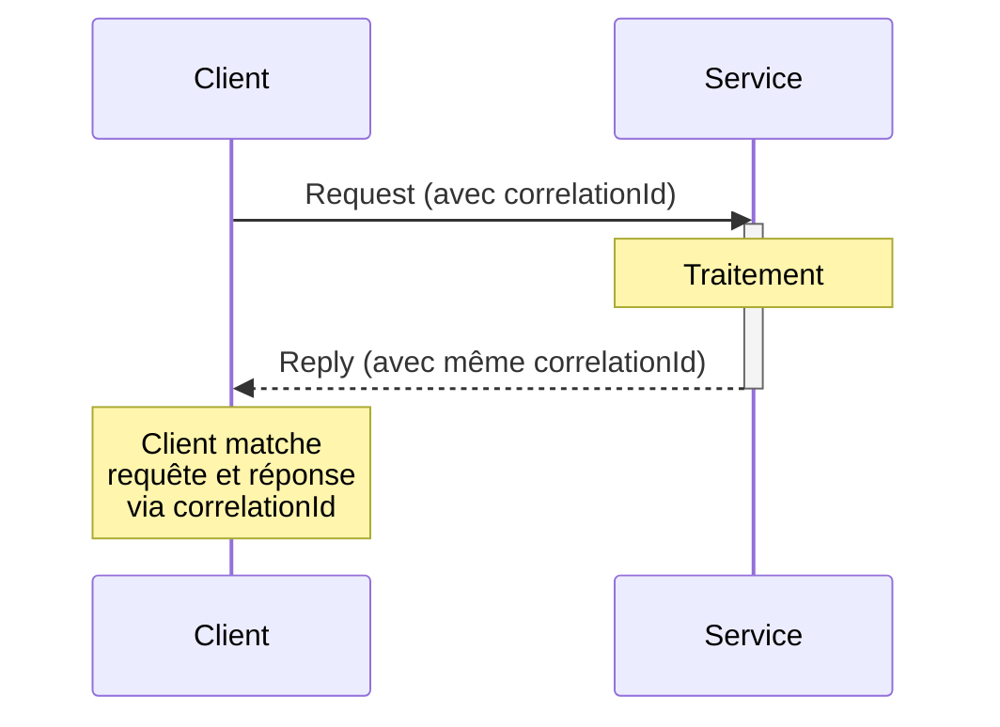

# Request-Reply — Enterprise Integration Pattern

## 1. Introduction

### Objectifs du cours
À la fin de ce cours, vous serez capable de :
- Comprendre le pattern Request-Reply et ses cas d'usage
- Implémenter des communications synchrones et asynchrones avec Request-Reply
- Gérer les timeouts et les erreurs dans les échanges requête-réponse
- Utiliser Request-Reply avec NestJS Microservices
- Appliquer les bonnes pratiques de correlation et de monitoring

### Ce que vous allez apprendre
- Le fonctionnement du pattern Request-Reply
- Les différences entre RPC, REST et messaging Request-Reply
- L'implémentation avec NestJS et RabbitMQ
- Les techniques de gestion de timeout et retry
- Les patterns de correlation pour tracer les échanges

### Scope de la notion
Après ce cours, vous pourrez :
- Créer des APIs synchrones et asynchrones robustes
- Implémenter des communications inter-services fiables
- Gérer les cas d'erreur et les timeouts gracefully
- Monitorer et debugger les échanges Request-Reply

---

## 2. Définition et Concepts Clés

### 2.1 Qu'est-ce que Request-Reply ?

**Request-Reply** est un pattern de communication où l'émetteur envoie une requête et **attend** une réponse du destinataire. C'est le pattern le plus courant dans les applications web.

**Analogie de la vie quotidienne :**
Vous posez une question à un ami par SMS : "Tu es disponible ce soir ?". Vous attendez sa réponse. S'il ne répond pas après un certain temps, vous considérez que vous n'avez pas de réponse (timeout). C'est exactement Request-Reply.

### 2.2 Caractéristiques principales

| Caractéristique | Description |
|-----------------|-------------|
| **Communication** | Bidirectionnelle (requête + réponse) |
| **Attente** | Le client attend la réponse |
| **Correlation** | La réponse doit être liée à la requête |
| **Timeout** | Temps maximum d'attente |
| **Synchrone ou Asynchrone** | Les deux modes possibles |

### 2.3 Schéma du pattern



### 2.4 Request-Reply vs Fire-and-Forget

| Aspect | Request-Reply | Fire-and-Forget |
|--------|---------------|-----------------|
| **Réponse** | Attendue | Aucune |
| **Blocking** | Peut bloquer | Non-bloquant |
| **Use case** | Récupérer des données | Notification |
| **Exemple** | API REST GET | Publish Event |
| **Complexité** | Plus complexe (correlation) | Simple |

---

## 3. Cas d'usage métier dans les webapps

### 3.1 API REST : Récupération de données utilisateur

**Scénario :** Un frontend Angular demande les détails d'un utilisateur.

```typescript
// Frontend (Angular)
@Injectable()
export class UserService {
  constructor(private http: HttpClient) {}
  
  // Request-Reply synchrone via HTTP
  getUserById(userId: string): Observable<User> {
    // Requête
    return this.http.get<User>(`/api/users/${userId}`)
      .pipe(
        // Timeout après 5 secondes
        timeout(5000),
        // Retry 2 fois en cas d'erreur
        retry(2),
        // Gestion d'erreur
        catchError(error => {
          if (error.name === 'TimeoutError') {
            return throwError(() => new Error('Request timed out'));
          }
          return throwError(() => error);
        }),
      );
    // Réponse attendue
  }
}

// Backend (NestJS)
@Controller('users')
export class UsersController {
  constructor(private readonly userService: UserService) {}
  
  @Get(':id')
  async getUserById(@Param('id') id: string): Promise<UserDto> {
    // Recevoir la requête
    const user = await this.userService.findById(id);
    
    if (!user) {
      throw new NotFoundException('User not found');
    }
    
    // Retourner la réponse
    return {
      id: user.id,
      email: user.email,
      firstName: user.firstName,
      lastName: user.lastName,
    };
  }
}
```

### 3.2 Microservices : Communication inter-services

**Scénario :** Un service Order interroge le service Inventory pour vérifier le stock.

```typescript
// Order Service (Client)
@Injectable()
export class OrderService {
  constructor(
    @Inject('INVENTORY_SERVICE') private inventoryClient: ClientProxy,
  ) {}
  
  async createOrder(dto: CreateOrderDto): Promise<Order> {
    // Request: Vérifier le stock
    const stockResponse = await firstValueFrom(
      this.inventoryClient.send(
        { cmd: 'check_stock' },
        { items: dto.items },
      ).pipe(
        timeout(3000), // Timeout 3 secondes
      ),
    );
    
    if (!stockResponse.available) {
      throw new BadRequestException('Insufficient stock');
    }
    
    // Créer la commande
    const order = await this.orderRepository.create(dto);
    
    // Request: Réserver le stock
    await firstValueFrom(
      this.inventoryClient.send(
        { cmd: 'reserve_stock' },
        { 
          orderId: order.id, 
          items: dto.items 
        },
      ),
    );
    
    return order;
  }
}

// Inventory Service (Serveur)
@Controller()
export class InventoryController {
  constructor(private readonly inventoryService: InventoryService) {}
  
  @MessagePattern({ cmd: 'check_stock' })
  async checkStock(@Payload() data: CheckStockDto): Promise<StockResponse> {
    const available = await this.inventoryService.checkAvailability(data.items);
    
    // Reply
    return {
      available,
      items: data.items.map(item => ({
        productId: item.productId,
        requestedQty: item.quantity,
        availableQty: this.inventoryService.getStock(item.productId),
      })),
    };
  }
  
  @MessagePattern({ cmd: 'reserve_stock' })
  async reserveStock(@Payload() data: ReserveStockDto): Promise<ReservationResponse> {
    await this.inventoryService.reserveStock(data.orderId, data.items);
    
    return {
      success: true,
      reservationId: uuidv4(),
    };
  }
}
```

### 3.3 Workflow asynchrone avec réponse différée

**Scénario :** Génération de rapport complexe qui prend du temps.

```typescript
// Client demande un rapport
@Controller('reports')
export class ReportsController {
  constructor(
    private readonly reportService: ReportService,
    @Inject('REPORT_QUEUE') private reportQueue: ClientProxy,
  ) {}
  
  @Post('generate')
  async generateReport(@Body() dto: GenerateReportDto): Promise<ReportJobResponse> {
    // Créer le job
    const jobId = uuidv4();
    
    // Envoyer requête asynchrone
    this.reportQueue.emit('generate_report', {
      jobId,
      reportType: dto.reportType,
      parameters: dto.parameters,
      replyTo: dto.callbackUrl, // URL de callback pour la réponse
    });
    
    // Réponse immédiate avec jobId
    return {
      jobId,
      status: 'PENDING',
      message: 'Report generation started',
    };
  }
  
  @Get('status/:jobId')
  async getReportStatus(@Param('jobId') jobId: string): Promise<ReportStatusResponse> {
    const job = await this.reportService.getJobStatus(jobId);
    
    return {
      jobId: job.id,
      status: job.status,
      progress: job.progress,
      downloadUrl: job.status === 'COMPLETED' ? job.fileUrl : null,
    };
  }
}

// Worker qui génère le rapport
@Controller()
export class ReportWorker {
  @EventPattern('generate_report')
  async handleReportGeneration(@Payload() data: GenerateReportJob) {
    try {
      // Générer le rapport (long processus)
      const report = await this.generateReport(data.parameters);
      
      // Envoyer la réponse via callback
      if (data.replyTo) {
        await this.httpService.post(data.replyTo, {
          jobId: data.jobId,
          status: 'COMPLETED',
          fileUrl: report.url,
        }).toPromise();
      }
      
      // Ou stocker pour récupération ultérieure
      await this.reportService.updateJobStatus(data.jobId, {
        status: 'COMPLETED',
        fileUrl: report.url,
      });
      
    } catch (error) {
      // Notifier l'erreur
      await this.reportService.updateJobStatus(data.jobId, {
        status: 'FAILED',
        error: error.message,
      });
    }
  }
}
```

---

## 4. Implémentation avec NestJS

### 4.1 Request-Reply synchrone avec NestJS Microservices

**Configuration :**

```typescript
// main.ts
import { NestFactory } from '@nestjs/core';
import { Transport, MicroserviceOptions } from '@nestjs/microservices';

async function bootstrap() {
  const app = await NestFactory.create(AppModule);
  
  // Microservice avec RabbitMQ
  app.connectMicroservice<MicroserviceOptions>({
    transport: Transport.RMQ,
    options: {
      urls: ['amqp://localhost:5672'],
      queue: 'user_service_queue',
      queueOptions: {
        durable: true,
      },
    },
  });
  
  await app.startAllMicroservices();
  await app.listen(3000);
}
bootstrap();
```

**Service Provider (serveur) :**

```typescript
// user-microservice.controller.ts
import { Controller } from '@nestjs/common';
import { MessagePattern, Payload } from '@nestjs/microservices';

@Controller()
export class UserMicroserviceController {
  constructor(private readonly userService: UserService) {}
  
  @MessagePattern({ cmd: 'get_user' })
  async getUser(@Payload() data: { userId: string }): Promise<UserDto> {
    this.logger.log(`Received request for user ${data.userId}`);
    
    const user = await this.userService.findById(data.userId);
    
    if (!user) {
      throw new RpcException('User not found');
    }
    
    return {
      id: user.id,
      email: user.email,
      firstName: user.firstName,
      lastName: user.lastName,
    };
  }
  
  @MessagePattern({ cmd: 'create_user' })
  async createUser(@Payload() data: CreateUserDto): Promise<UserCreatedResponse> {
    const user = await this.userService.create(data);
    
    return {
      success: true,
      userId: user.id,
    };
  }
  
  @MessagePattern({ cmd: 'update_user' })
  async updateUser(@Payload() data: UpdateUserDto): Promise<void> {
    await this.userService.update(data.userId, data.updates);
  }
}
```

**Client (consommateur) :**

```typescript
// order-service.ts
import { Injectable, Inject } from '@nestjs/common';
import { ClientProxy } from '@nestjs/microservices';
import { firstValueFrom, timeout } from 'rxjs';

@Injectable()
export class OrderService {
  constructor(
    @Inject('USER_SERVICE') private userServiceClient: ClientProxy,
    private orderRepository: OrderRepository,
  ) {}
  
  async createOrder(dto: CreateOrderDto): Promise<Order> {
    // Request-Reply pour obtenir les infos utilisateur
    try {
      const user = await firstValueFrom(
        this.userServiceClient
          .send<UserDto>({ cmd: 'get_user' }, { userId: dto.userId })
          .pipe(
            timeout(5000), // Timeout 5 secondes
          ),
      );
      
      // Vérifications métier
      if (!user.email) {
        throw new BadRequestException('User email is required');
      }
      
      // Créer la commande
      const order = await this.orderRepository.create({
        ...dto,
        customerEmail: user.email,
        customerName: `${user.firstName} ${user.lastName}`,
      });
      
      return order;
      
    } catch (error) {
      if (error.name === 'TimeoutError') {
        throw new ServiceUnavailableException('User service timeout');
      }
      throw error;
    }
  }
}
```

**Configuration du client :**

```typescript
// order.module.ts
import { Module } from '@nestjs/common';
import { ClientsModule, Transport } from '@nestjs/microservices';

@Module({
  imports: [
    ClientsModule.register([
      {
        name: 'USER_SERVICE',
        transport: Transport.RMQ,
        options: {
          urls: ['amqp://localhost:5672'],
          queue: 'user_service_queue',
          queueOptions: {
            durable: true,
          },
        },
      },
    ]),
  ],
  providers: [OrderService],
})
export class OrderModule {}
```

### 4.2 Gestion de Correlation ID

**Problème :** Comment lier une réponse à sa requête quand il y a plusieurs requêtes en parallèle ?

**Solution :** Utiliser un Correlation ID.

```typescript
// request-reply.service.ts
@Injectable()
export class RequestReplyService {
  private pendingRequests = new Map<string, {
    resolve: (value: any) => void;
    reject: (error: any) => void;
    timeout: NodeJS.Timeout;
  }>();
  
  constructor(
    @Inject('MESSAGE_QUEUE') private client: ClientProxy,
  ) {}
  
  async sendRequest<TRequest, TResponse>(
    pattern: string,
    data: TRequest,
    timeoutMs: number = 5000,
  ): Promise<TResponse> {
    const correlationId = uuidv4();
    
    return new Promise<TResponse>((resolve, reject) => {
      // Configurer le timeout
      const timeoutHandle = setTimeout(() => {
        this.pendingRequests.delete(correlationId);
        reject(new Error('Request timeout'));
      }, timeoutMs);
      
      // Stocker la promesse
      this.pendingRequests.set(correlationId, {
        resolve,
        reject,
        timeout: timeoutHandle,
      });
      
      // Envoyer la requête avec correlationId
      this.client.emit(pattern, {
        correlationId,
        data,
      });
    });
  }
  
  // Appelé quand une réponse arrive
  handleResponse(correlationId: string, response: any, error?: any): void {
    const pending = this.pendingRequests.get(correlationId);
    
    if (!pending) {
      this.logger.warn(`No pending request for correlation ${correlationId}`);
      return;
    }
    
    // Nettoyer
    clearTimeout(pending.timeout);
    this.pendingRequests.delete(correlationId);
    
    // Résoudre ou rejeter
    if (error) {
      pending.reject(error);
    } else {
      pending.resolve(response);
    }
  }
}

// Utilisation
const user = await this.requestReplyService.sendRequest(
  'get_user',
  { userId: '123' },
  3000, // timeout 3s
);
```

### 4.3 Pattern Reply-To Channel

**Concept :** Spécifier explicitement où envoyer la réponse.

```typescript
// Service qui fait la requête
@Injectable()
export class PaymentService {
  constructor(
    @Inject('PAYMENT_GATEWAY') private paymentGateway: ClientProxy,
    @Inject('REPLY_CONSUMER') private replyConsumer: ClientProxy,
  ) {}
  
  async processPayment(orderId: string, amount: number): Promise<PaymentResult> {
    const correlationId = uuidv4();
    const replyTo = 'payment_replies'; // Queue de réponse
    
    // Envoyer requête avec replyTo
    await this.paymentGateway.emit('process_payment', {
      correlationId,
      replyTo,
      data: {
        orderId,
        amount,
      },
    });
    
    // Attendre la réponse sur la queue de réponse
    return await this.waitForReply(correlationId, 30000);
  }
  
  private async waitForReply(
    correlationId: string,
    timeoutMs: number,
  ): Promise<PaymentResult> {
    return new Promise((resolve, reject) => {
      const timeout = setTimeout(() => {
        reject(new Error('Payment processing timeout'));
      }, timeoutMs);
      
      // S'abonner aux réponses
      const subscription = this.replyConsumer
        .subscribe<PaymentReplyMessage>('payment_replies')
        .subscribe(message => {
          if (message.correlationId === correlationId) {
            clearTimeout(timeout);
            subscription.unsubscribe();
            
            if (message.error) {
              reject(new Error(message.error));
            } else {
              resolve(message.result);
            }
          }
        });
    });
  }
}

// Payment Gateway (traite la requête et répond)
@Controller()
export class PaymentGatewayController {
  @EventPattern('process_payment')
  async handlePaymentRequest(@Payload() request: PaymentRequest) {
    let result: PaymentResult;
    let error: string | undefined;
    
    try {
      // Traiter le paiement
      result = await this.paymentProcessor.process(request.data);
    } catch (e) {
      error = e.message;
    }
    
    // Envoyer la réponse sur la queue spécifiée
    await this.messagingService.sendToQueue(request.replyTo, {
      correlationId: request.correlationId,
      result,
      error,
    });
  }
}
```

---

## 5. Gestion des Timeouts et Retry

### 5.1 Timeout Configuration

```typescript
@Injectable()
export class ResilientRequestService {
  constructor(
    @Inject('REMOTE_SERVICE') private remoteService: ClientProxy,
  ) {}
  
  async callWithTimeout<T>(
    pattern: string,
    data: any,
    timeoutMs: number = 5000,
  ): Promise<T> {
    return firstValueFrom(
      this.remoteService.send<T>(pattern, data).pipe(
        timeout(timeoutMs),
        catchError(error => {
          if (error.name === 'TimeoutError') {
            throw new ServiceUnavailableException(
              `Service did not respond within ${timeoutMs}ms`,
            );
          }
          throw error;
        }),
      ),
    );
  }
}
```

### 5.2 Retry Strategy

```typescript
import { retry, retryWhen, delay, scan, throwError } from 'rxjs';

@Injectable()
export class RetryableRequestService {
  async callWithRetry<T>(
    pattern: string,
    data: any,
    options: {
      maxRetries?: number;
      retryDelay?: number;
      timeout?: number;
    } = {},
  ): Promise<T> {
    const {
      maxRetries = 3,
      retryDelay = 1000,
      timeout: timeoutMs = 5000,
    } = options;
    
    return firstValueFrom(
      this.remoteService.send<T>(pattern, data).pipe(
        timeout(timeoutMs),
        // Retry avec exponential backoff
        retryWhen(errors =>
          errors.pipe(
            scan((retryCount, error) => {
              if (retryCount >= maxRetries) {
                throw error;
              }
              
              this.logger.log(
                `Retry ${retryCount + 1}/${maxRetries} for ${pattern}`,
              );
              
              return retryCount + 1;
            }, 0),
            // Délai exponentiel : 1s, 2s, 4s...
            delay((retryCount) => retryDelay * Math.pow(2, retryCount)),
          ),
        ),
        catchError(error => {
          this.logger.error(`Request failed after ${maxRetries} retries`, error);
          throw new ServiceUnavailableException('Service temporarily unavailable');
        }),
      ),
    );
  }
}

// Utilisation
const user = await this.retryableRequestService.callWithRetry(
  'get_user',
  { userId: '123' },
  {
    maxRetries: 3,
    retryDelay: 1000,
    timeout: 5000,
  },
);
```

### 5.3 Circuit Breaker Pattern

```typescript
import CircuitBreaker from 'opossum';

@Injectable()
export class CircuitBreakerRequestService {
  private circuitBreakers = new Map<string, CircuitBreaker>();
  
  constructor(
    @Inject('REMOTE_SERVICE') private remoteService: ClientProxy,
  ) {}
  
  private getCircuitBreaker(pattern: string): CircuitBreaker {
    if (!this.circuitBreakers.has(pattern)) {
      const breaker = new CircuitBreaker(
        async (data: any) => {
          return firstValueFrom(
            this.remoteService.send(pattern, data).pipe(
              timeout(5000),
            ),
          );
        },
        {
          timeout: 5000,
          errorThresholdPercentage: 50,
          resetTimeout: 30000,
          rollingCountTimeout: 10000,
        },
      );
      
      breaker.on('open', () => {
        this.logger.warn(`Circuit breaker opened for ${pattern}`);
      });
      
      breaker.on('halfOpen', () => {
        this.logger.log(`Circuit breaker half-open for ${pattern}`);
      });
      
      breaker.on('close', () => {
        this.logger.log(`Circuit breaker closed for ${pattern}`);
      });
      
      this.circuitBreakers.set(pattern, breaker);
    }
    
    return this.circuitBreakers.get(pattern)!;
  }
  
  async call<T>(pattern: string, data: any): Promise<T> {
    const breaker = this.getCircuitBreaker(pattern);
    
    try {
      return await breaker.fire(data);
    } catch (error) {
      if (error.message.includes('breaker is open')) {
        throw new ServiceUnavailableException('Service temporarily unavailable');
      }
      throw error;
    }
  }
}
```

---

## 6. Erreurs Courantes & Comment les Éviter

### 6.1 Erreur 1 : Ne pas gérer les timeouts

**❌ Mauvais :**
```typescript
// La requête peut bloquer indéfiniment
const user = await firstValueFrom(
  this.userService.send('get_user', { userId }),
);
```

**✅ Correct :**
```typescript
const user = await firstValueFrom(
  this.userService.send('get_user', { userId }).pipe(
    timeout(5000),
    catchError(error => {
      if (error.name === 'TimeoutError') {
        throw new ServiceUnavailableException('User service timeout');
      }
      throw error;
    }),
  ),
);
```

### 6.2 Erreur 2 : Oublier la correlation

**❌ Mauvais :**
```typescript
// Impossible de matcher requête et réponse
await this.queue.emit('get_data', { id: '123' });
// Comment savoir quelle réponse correspond à quelle requête ?
```

**✅ Correct :**
```typescript
const correlationId = uuidv4();
await this.queue.emit('get_data', {
  correlationId,
  id: '123',
});
// Stocker correlationId pour matcher la réponse
```

### 6.3 Erreur 3 : Ne pas prévoir de fallback

**❌ Mauvais :**
```typescript
// Si le service est down, l'application crash
const user = await this.userService.send('get_user', { userId });
```

**✅ Correct :**
```typescript
let user: User;

try {
  user = await this.userService.send('get_user', { userId });
} catch (error) {
  // Fallback : utiliser le cache
  user = await this.userCache.get(userId);
  
  if (!user) {
    // Fallback : données par défaut
    user = {
      id: userId,
      email: 'unknown@example.com',
      firstName: 'Unknown',
      lastName: 'User',
    };
  }
}
```

### 6.4 Erreur 4 : Bloquer le thread principal

**❌ Mauvais :**
```typescript
@Get('heavy-report')
async getReport(): Promise<Report> {
  // Bloque le serveur pendant 30 secondes
  const report = await this.reportService.send('generate_report', data);
  return report;
}
```

**✅ Correct :**
```typescript
@Post('heavy-report')
async requestReport(): Promise<{ jobId: string }> {
  const jobId = uuidv4();
  
  // Asynchrone : ne pas attendre
  this.reportService.emit('generate_report', {
    jobId,
    data,
    replyTo: '/webhooks/report-complete',
  });
  
  return { jobId, status: 'PROCESSING' };
}

@Get('report-status/:jobId')
async getReportStatus(@Param('jobId') jobId: string) {
  return this.reportService.getStatus(jobId);
}
```

### 6.5 Erreur 5 : Memory leaks avec pending requests

**❌ Mauvais :**
```typescript
// Stocker sans jamais nettoyer
private pendingRequests = new Map();

async sendRequest(data: any): Promise<any> {
  const id = uuidv4();
  
  return new Promise((resolve) => {
    this.pendingRequests.set(id, resolve);
    this.client.emit('request', { id, data });
  });
  // ❌ Si la réponse n'arrive jamais, resolve reste en mémoire
}
```

**✅ Correct :**
```typescript
private pendingRequests = new Map<string, {
  resolve: (value: any) => void;
  timeout: NodeJS.Timeout;
}>();

async sendRequest(data: any, timeoutMs = 5000): Promise<any> {
  const id = uuidv4();
  
  return new Promise((resolve, reject) => {
    // Timeout pour nettoyer
    const timeout = setTimeout(() => {
      this.pendingRequests.delete(id);
      reject(new Error('Request timeout'));
    }, timeoutMs);
    
    this.pendingRequests.set(id, { resolve, timeout });
    this.client.emit('request', { id, data });
  });
}

handleResponse(id: string, response: any): void {
  const pending = this.pendingRequests.get(id);
  
  if (pending) {
    clearTimeout(pending.timeout);
    this.pendingRequests.delete(id);
    pending.resolve(response);
  }
}
```

---

## 7. Exercices Pratiques

### Exercice 1 : Service de validation d'email

**Objectif :** Créer un service Request-Reply qui valide des adresses email.

**Fonctionnalités :**
1. Client envoie une requête avec une adresse email
2. Service valide l'email (format, domaine existe, etc.)
3. Service répond avec le résultat de validation
4. Timeout de 3 secondes
5. Retry 2 fois en cas d'échec

**Structure :**
```typescript
// Request
interface ValidateEmailRequest {
  email: string;
  correlationId: string;
}

// Response
interface ValidateEmailResponse {
  valid: boolean;
  reason?: string;
  details: {
    formatValid: boolean;
    domainExists: boolean;
    mxRecordExists: boolean;
  };
}

// À implémenter
@MessagePattern({ cmd: 'validate_email' })
async validateEmail(@Payload() request: ValidateEmailRequest): Promise<ValidateEmailResponse> {
  // TODO
}
```

### Exercice 2 : Calculateur de prix avec cache

**Objectif :** Service qui calcule le prix avec taxes et utilise un cache.

**Spécifications :**
1. Si le service est disponible : calculer en temps réel
2. Si timeout : utiliser le cache
3. Si cache vide : utiliser un taux par défaut
4. Circuit breaker après 3 échecs consécutifs
5. Logger toutes les requêtes et réponses

**À implémenter :**
- Request-Reply avec timeout
- Cache Redis pour les prix calculés
- Circuit breaker
- Logging avec correlation ID

---

## 8. Comportement Senior

### 8.1 Monitoring des Request-Reply

**Senior tip 1 : Métriques complètes**

```typescript
@Injectable()
export class MonitoredRequestService {
  constructor(
    @Inject('METRICS') private metrics: MetricsService,
    @Inject('REMOTE_SERVICE') private remoteService: ClientProxy,
  ) {}
  
  async send<T>(pattern: string, data: any): Promise<T> {
    const startTime = Date.now();
    const correlationId = uuidv4();
    
    try {
      const result = await firstValueFrom(
        this.remoteService.send<T>(pattern, {
          correlationId,
          ...data,
        }).pipe(
          timeout(5000),
        ),
      );
      
      // Métriques de succès
      this.metrics.recordRequestDuration(
        pattern,
        Date.now() - startTime,
        'success',
      );
      
      return result;
      
    } catch (error) {
      const duration = Date.now() - startTime;
      
      // Métriques d'échec
      this.metrics.recordRequestDuration(
        pattern,
        duration,
        error.name === 'TimeoutError' ? 'timeout' : 'error',
      );
      
      this.logger.error({
        message: 'Request failed',
        pattern,
        correlationId,
        duration,
        error: error.message,
      });
      
      throw error;
    }
  }
}
```

### 8.2 Distributed Tracing

**Senior tip 2 : OpenTelemetry pour tracer les requêtes**

```typescript
import { trace, SpanStatusCode } from '@opentelemetry/api';

@Injectable()
export class TracedRequestService {
  private tracer = trace.getTracer('request-reply-service');
  
  async send<T>(pattern: string, data: any): Promise<T> {
    // Créer un span pour cette requête
    return await this.tracer.startActiveSpan(
      `request-reply: ${pattern}`,
      async (span) => {
        const correlationId = uuidv4();
        
        span.setAttributes({
          'messaging.pattern': pattern,
          'messaging.correlation_id': correlationId,
          'messaging.destination': 'remote_service',
        });
        
        try {
          const result = await firstValueFrom(
            this.remoteService.send<T>(pattern, {
              correlationId,
              traceId: span.spanContext().traceId,
              ...data,
            }).pipe(
              timeout(5000),
            ),
          );
          
          span.setStatus({ code: SpanStatusCode.OK });
          return result;
          
        } catch (error) {
          span.setStatus({
            code: SpanStatusCode.ERROR,
            message: error.message,
          });
          span.recordException(error);
          throw error;
          
        } finally {
          span.end();
        }
      },
    );
  }
}
```

### 8.3 Rate Limiting

**Senior tip 3 : Limiter le nombre de requêtes**

```typescript
import Bottleneck from 'bottleneck';

@Injectable()
export class RateLimitedRequestService {
  private limiter: Bottleneck;
  
  constructor(@Inject('REMOTE_SERVICE') private remoteService: ClientProxy) {
    this.limiter = new Bottleneck({
      maxConcurrent: 10,  // Max 10 requêtes en parallèle
      minTime: 100,       // Min 100ms entre requêtes
      reservoir: 100,     // 100 requêtes max
      reservoirRefreshAmount: 100,
      reservoirRefreshInterval: 60000, // Par minute
    });
  }
  
  async send<T>(pattern: string, data: any): Promise<T> {
    return this.limiter.schedule(async () => {
      return firstValueFrom(
        this.remoteService.send<T>(pattern, data).pipe(
          timeout(5000),
        ),
      );
    });
  }
}
```

---

## 9. Résumé

### Points clés

1. **Request-Reply = Communication bidirectionnelle**
   - Client envoie requête
   - Serveur retourne réponse
   - Correlation pour matcher

2. **Modes**
   - Synchrone : HTTP REST
   - Asynchrone : Message queue

3. **Gestion robuste**
   - Timeout obligatoire
   - Retry avec backoff
   - Circuit breaker
   - Fallback strategies

4. **Bonnes pratiques**
   - Correlation ID
   - Logging et monitoring
   - Distributed tracing
   - Rate limiting

### Quand utiliser Request-Reply ?

**✅ Utiliser quand :**
- Besoin de réponse immédiate
- Récupération de données
- Validation synchrone
- APIs REST

**❌ Ne pas utiliser quand :**
- Notification simple (utiliser Event)
- Traitement long (utiliser async Job)
- Broadcast (utiliser Pub/Sub)

### Checklist Request-Reply

- [ ] Timeout configuré
- [ ] Retry strategy définie
- [ ] Correlation ID utilisé
- [ ] Gestion d'erreurs complète
- [ ] Fallback en place
- [ ] Circuit breaker pour services critiques
- [ ] Logging avec context
- [ ] Métriques de performance
- [ ] Tests de timeout et retry

---

## 10. Ressources Externes

### Documentation
- 📘 [Enterprise Integration Patterns - Request-Reply](https://www.enterpriseintegrationpatterns.com/patterns/messaging/RequestReply.html)
- 📘 [NestJS Microservices](https://docs.nestjs.com/microservices/basics)
- 📘 [RxJS timeout operator](https://rxjs.dev/api/operators/timeout)

### Articles
- 📝 [Circuit Breaker Pattern](https://martinfowler.com/bliki/CircuitBreaker.html)
- 📝 [Microservices Communication Patterns](https://microservices.io/patterns/communication-style/messaging.html)

### Outils
- 🛠️ [Opossum Circuit Breaker](https://nodeshift.dev/opossum/)
- 🛠️ [Bottleneck Rate Limiter](https://github.com/SGrondin/bottleneck)
- 🛠️ [OpenTelemetry](https://opentelemetry.io/)

---

**En une phrase :**

> Request-Reply est un pattern de communication bidirectionnel où le client envoie une requête et attend une réponse du serveur, nécessitant une gestion rigoureuse des timeouts, correlation IDs, et stratégies de résilience pour garantir la fiabilité des échanges dans les systèmes distribués.
