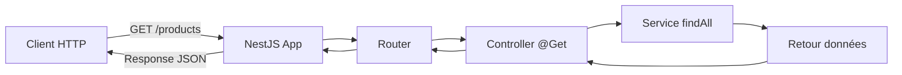

# NestJS : Installation et Premier Projet

## Introduction

### Objectifs du cours
Ce cours vous permettra de :
- Installer NestJS CLI et créer votre premier projet backend
- Comprendre l'architecture MVC de NestJS
- Créer votre première API REST
- Tester vos endpoints avec des outils appropriés

### Ce que vous saurez faire après ce cours
- Créer un nouveau projet NestJS 11 depuis zéro
- Comprendre la structure d'un projet NestJS
- Créer des endpoints HTTP (GET, POST, PUT, DELETE)
- Lancer et tester votre API en mode développement

### Scope de la notion
NestJS est un framework Node.js pour construire des applications serveur scalables et maintenables. Il utilise TypeScript par défaut et s'inspire d'Angular pour son architecture (modules, dépendance injection, décorateurs). Ce cours pose les fondations pour développer des APIs REST professionnelles.

---

## Prérequis

Avant de commencer, assurez-vous d'avoir :
- Node.js (version 18+ ou 20+) installé → [Cours Node.js + NPM](../nodejs-npm.md)
- TypeScript de base → [Phase 2 : TypeScript Propre](../../hard-skills.md#phase-2--typescript-propre)
- Notions HTTP et APIs → [Cours HTTP et APIs](../http-api-fondamentaux.md)
- Un client HTTP (Postman, Insomnia, ou Thunder Client dans VSCode)

---

## Définitions et Concepts Clés

### NestJS
**NestJS** est un framework progressif Node.js pour construire des applications serveur efficaces, fiables et scalables. Il fournit une architecture out-of-the-box basée sur :
- **TypeScript** par défaut (JavaScript supporté)
- **Modularité** - organisation en modules métier
- **Dependency Injection** - gestion automatique des dépendances
- **Décorateurs** - métadonnées pour routes, validation, etc.

**Analogie** : Si Node.js/Express est comme construire une maison avec des outils de base, NestJS est comme utiliser un système de construction préfabriqué avec des plans architecturaux standardisés. Tout est structuré et organisé dès le départ.

### Architecture MVC adaptée
NestJS utilise une architecture inspirée de MVC :
- **Controllers** : Gèrent les requêtes HTTP (comme les contrôleurs MVC)
- **Providers/Services** : Logique métier (comme les modèles + services)
- **Modules** : Organisent l'application en blocs fonctionnels

**Analogie** : Imaginez un restaurant :
- **Controllers** = Serveurs (prennent les commandes des clients)
- **Services** = Cuisiniers (préparent les plats)
- **Modules** = Sections du restaurant (bar, cuisine, salle)

### API REST (REpresentational State Transfer)
Une **API REST** expose des ressources via HTTP avec des opérations standard :
- `GET` : Lire des données
- `POST` : Créer une ressource
- `PUT/PATCH` : Mettre à jour
- `DELETE` : Supprimer

**Exemple concret** : Une API de gestion de produits :
- `GET /products` → Liste tous les produits
- `GET /products/1` → Détails du produit ID 1
- `POST /products` → Crée un nouveau produit
- `PUT /products/1` → Met à jour le produit ID 1
- `DELETE /products/1` → Supprime le produit ID 1

### Décorateur
Un **décorateur** est une annotation TypeScript qui ajoute des métadonnées à une classe, méthode ou propriété. En NestJS, ils définissent le comportement :
- `@Controller()` : Déclare un contrôleur
- `@Get()` : Route HTTP GET
- `@Post()` : Route HTTP POST

**Analogie** : C'est comme des étiquettes sur des boîtes qui disent à NestJS "cette boîte contient un contrôleur" ou "cette méthode répond aux requêtes GET".

### Dependency Injection (DI)
La **Dependency Injection** est un pattern où NestJS fournit automatiquement les dépendances à vos classes. Vous déclarez ce dont vous avez besoin, NestJS s'occupe de l'instanciation.

**Analogie** : C'est comme commander au restaurant. Vous demandez "un café", et le serveur apporte le café. Vous ne savez pas comment il est préparé, qui l'a fait, où sont les grains - tout ça est géré automatiquement.

---

## Installation de NestJS CLI

### Étape 1 : Vérifier Node.js et npm

```bash
node --version  # Doit afficher v18+ ou v20+
npm --version   # Doit afficher 9+ ou 10+
```

### Étape 2 : Installer NestJS CLI

**Option 1 : Installation globale (recommandée pour débuter)**

```bash
npm install -g @nestjs/cli
```

**Explication** :
- `npm install -g` : Installation globale (disponible partout)
- `@nestjs/cli` : Outil en ligne de commande NestJS

**Option 2 : Utiliser npx (sans installation globale)**

```bash
npx @nestjs/cli new mon-projet
# npx télécharge et exécute temporairement la dernière version
```

**Avantages de npx** :
- ✅ Pas de conflits de versions globales
- ✅ Toujours la dernière version
- ✅ Pas de problèmes de permissions

**Avantages de l'installation globale** :
- ✅ Plus rapide (pas de téléchargement à chaque fois)
- ✅ Commandes plus courtes (`nest` au lieu de `npx @nestjs/cli`)

Pour ce cours, nous utiliserons l'installation globale pour simplifier.

### Étape 3 : Vérifier l'installation

```bash
nest --version
# Doit afficher 11.x.x ou supérieur
```

Voir les commandes disponibles :
```bash
nest --help
```

---

## Créer votre Premier Projet

### Commande de création

```bash
nest new mon-premier-api
```

**NestJS CLI vous posera une question** :

```
? Which package manager would you ❤️ to use?
❯ npm
  yarn
  pnpm
```

Choisissez **`npm`** (ou votre gestionnaire préféré).

### Processus d'installation

NestJS CLI va :
1. Créer la structure de dossiers
2. Générer les fichiers de base
3. Installer toutes les dépendances
4. Initialiser Git

```
CREATE mon-premier-api/.eslintrc.js
CREATE mon-premier-api/.prettierrc
CREATE mon-premier-api/nest-cli.json
CREATE mon-premier-api/package.json
CREATE mon-premier-api/tsconfig.json
CREATE mon-premier-api/src/app.controller.ts
CREATE mon-premier-api/src/app.service.ts
CREATE mon-premier-api/src/app.module.ts
CREATE mon-premier-api/src/main.ts
...
✔ Installation in progress... ☕
✔ Successfully created project mon-premier-api
```

---

## Structure du Projet

### Arborescence complète

```
mon-premier-api/
├── src/                          # Code source
│   ├── main.ts                   # Point d'entrée de l'application
│   ├── app.module.ts             # Module racine
│   ├── app.controller.ts         # Contrôleur principal
│   ├── app.controller.spec.ts    # Tests du contrôleur
│   └── app.service.ts            # Service principal
├── test/                         # Tests E2E
│   ├── app.e2e-spec.ts
│   └── jest-e2e.json
├── node_modules/                 # Dépendances (ne pas modifier)
├── dist/                         # Code compilé (généré)
├── .eslintrc.js                  # Configuration ESLint
├── .prettierrc                   # Configuration Prettier
├── nest-cli.json                 # Configuration NestJS CLI
├── package.json                  # Dépendances npm
├── tsconfig.json                 # Configuration TypeScript
├── tsconfig.build.json           # Config TS pour build
└── README.md                     # Documentation
```

### Fichiers importants expliqués

#### `src/main.ts`
Point d'entrée - bootstrap l'application.

```typescript
import { NestFactory } from '@nestjs/core';
import { AppModule } from './app.module';

async function bootstrap() {
  // Créer l'instance de l'application
  const app = await NestFactory.create(AppModule);
  
  // Démarrer le serveur sur le port 3000
  await app.listen(3000);
  
  console.log(`Application is running on: ${await app.getUrl()}`);
}

bootstrap();
```

**Explication** :
- `NestFactory.create()` : Crée l'application à partir du module racine
- `app.listen(3000)` : Démarre le serveur HTTP sur le port 3000
- `async/await` : Opérations asynchrones

#### `src/app.module.ts`
Module racine - orchestre l'application.

```typescript
import { Module } from '@nestjs/common';
import { AppController } from './app.controller';
import { AppService } from './app.service';

@Module({
  imports: [],        // Modules importés
  controllers: [AppController],  // Contrôleurs de ce module
  providers: [AppService],       // Services/Providers de ce module
})
export class AppModule {}
```

**Décortiquons le décorateur `@Module`** :
- `imports`: Autres modules dont ce module dépend
- `controllers`: Classes qui gèrent les requêtes HTTP
- `providers`: Services injectables (logique métier, accès BDD, etc.)

#### `src/app.controller.ts`
Contrôleur - gère les routes HTTP.

```typescript
import { Controller, Get } from '@nestjs/common';
import { AppService } from './app.service';

@Controller()  // Déclare cette classe comme contrôleur
export class AppController {
  // Dependency Injection : NestJS injecte AppService automatiquement
  constructor(private readonly appService: AppService) {}

  @Get()  // Route GET sur /
  getHello(): string {
    return this.appService.getHello();
  }
}
```

**Explication** :
- `@Controller()` : Préfixe de route (vide = racine `/`)
- `@Get()` : Route GET (ici sur `/`)
- `constructor(private readonly appService)` : Injection de dépendance

#### `src/app.service.ts`
Service - logique métier.

```typescript
import { Injectable } from '@nestjs/common';

@Injectable()  // Déclare cette classe comme injectable
export class AppService {
  getHello(): string {
    return 'Hello World!';
  }
}
```

**Explication** :
- `@Injectable()` : Permet à NestJS d'injecter ce service dans d'autres classes
- Logique métier isolée du contrôleur (séparation des responsabilités)

---

## Lancer l'Application

### Démarrer en mode développement

```bash
cd mon-premier-api
npm run start:dev
```

**Sortie attendue** :
```
[Nest] 12345  - 20/12/2025, 10:30:00   LOG [NestFactory] Starting Nest application...
[Nest] 12345  - 20/12/2025, 10:30:00   LOG [InstanceLoader] AppModule dependencies initialized
[Nest] 12345  - 20/12/2025, 10:30:00   LOG [RoutesResolver] AppController {/}: 
[Nest] 12345  - 20/12/2025, 10:30:00   LOG [RouterExplorer] Mapped {/, GET} route
[Nest] 12345  - 20/12/2025, 10:30:00   LOG [NestApplication] Nest application successfully started
Application is running on: http://localhost:3000
```

### Modes de démarrage

```bash
npm run start          # Production (sans watch)
npm run start:dev      # Développement (avec watch + hot reload)
npm run start:debug    # Debug (avec watch + debugger)
```

**Mode watch** : Les changements de code rechargent automatiquement le serveur.

### Tester l'API

**Option 1 : Navigateur**
Ouvrez http://localhost:3000 dans votre navigateur.
Vous devriez voir : `Hello World!`

**Option 2 : curl (ligne de commande)**
```bash
curl http://localhost:3000
# Réponse: Hello World!
```

**Option 3 : Postman / Insomnia / Thunder Client**
- Méthode : GET
- URL : http://localhost:3000
- Cliquez sur Send
- Réponse : `Hello World!`

---

## Créer votre Première API : Gestion de Produits

### Étape 1 : Générer un module Products

```bash
nest generate module products
# Ou version courte
nest g mo products
```

Cela crée :
- `src/products/products.module.ts`
- Met à jour `app.module.ts` pour importer ProductsModule

### Étape 2 : Générer un contrôleur

```bash
nest g controller products --no-spec
```

**Explication** :
- `g` : generate
- `controller` : type de fichier
- `products` : nom
- `--no-spec` : ne pas générer de fichier de test (pour l'instant)

Cela crée :
- `src/products/products.controller.ts`
- Met à jour `products.module.ts`

### Étape 3 : Générer un service

```bash
nest g service products --no-spec
```

Cela crée :
- `src/products/products.service.ts`
- Met à jour `products.module.ts`

### Étape 4 : Définir le modèle Product

Créez `src/products/entities/product.entity.ts` :

```typescript
export class Product {
  id: number;
  name: string;
  price: number;
  description: string;
  inStock: boolean;
}
```

### Étape 5 : Implémenter le Service

Modifiez `src/products/products.service.ts` :

```typescript
import { Injectable } from '@nestjs/common';
import { Product } from './entities/product.entity';

@Injectable()
export class ProductsService {
  // Simuler une base de données en mémoire
  private products: Product[] = [
    {
      id: 1,
      name: 'Laptop Dell XPS 15',
      price: 1500,
      description: 'Laptop professionnel haute performance',
      inStock: true,
    },
    {
      id: 2,
      name: 'Souris Logitech MX Master',
      price: 99,
      description: 'Souris ergonomique sans fil',
      inStock: true,
    },
    {
      id: 3,
      name: 'Clavier mécanique',
      price: 150,
      description: 'Clavier RGB mécanique',
      inStock: false,
    },
  ];

  private nextId = 4;  // Pour les nouveaux produits

  // Récupérer tous les produits
  findAll(): Product[] {
    return this.products;
  }

  // Récupérer un produit par ID
  findOne(id: number): Product {
    const product = this.products.find(p => p.id === id);
    if (!product) {
      throw new Error(`Product with ID ${id} not found`);
    }
    return product;
  }

  // Créer un nouveau produit
  create(productData: Omit<Product, 'id'>): Product {
    const newProduct: Product = {
      id: this.nextId++,
      ...productData,
    };
    this.products.push(newProduct);
    return newProduct;
  }

  // Mettre à jour un produit
  update(id: number, productData: Partial<Product>): Product {
    const index = this.products.findIndex(p => p.id === id);
    if (index === -1) {
      throw new Error(`Product with ID ${id} not found`);
    }
    
    this.products[index] = {
      ...this.products[index],
      ...productData,
      id,  // S'assurer que l'ID ne change pas
    };
    
    return this.products[index];
  }

  // Supprimer un produit
  remove(id: number): void {
    const index = this.products.findIndex(p => p.id === id);
    if (index === -1) {
      throw new Error(`Product with ID ${id} not found`);
    }
    this.products.splice(index, 1);
  }
}
```

### Étape 6 : Implémenter le Controller

Modifiez `src/products/products.controller.ts` :

```typescript
import {
  Controller,
  Get,
  Post,
  Put,
  Delete,
  Body,
  Param,
  HttpCode,
  HttpStatus,
} from '@nestjs/common';
import { ProductsService } from './products.service';
import { Product } from './entities/product.entity';

@Controller('products')  // Préfixe: /products
export class ProductsController {
  constructor(private readonly productsService: ProductsService) {}

  // GET /products - Liste tous les produits
  @Get()
  findAll(): Product[] {
    return this.productsService.findAll();
  }

  // GET /products/:id - Récupère un produit par ID
  @Get(':id')
  findOne(@Param('id') id: string): Product {
    return this.productsService.findOne(+id);  // +id convertit string en number
  }

  // POST /products - Crée un nouveau produit
  @Post()
  @HttpCode(HttpStatus.CREATED)  // Status 201
  create(@Body() productData: Omit<Product, 'id'>): Product {
    return this.productsService.create(productData);
  }

  // PUT /products/:id - Met à jour un produit
  @Put(':id')
  update(
    @Param('id') id: string,
    @Body() productData: Partial<Product>,
  ): Product {
    return this.productsService.update(+id, productData);
  }

  // DELETE /products/:id - Supprime un produit
  @Delete(':id')
  @HttpCode(HttpStatus.NO_CONTENT)  // Status 204
  remove(@Param('id') id: string): void {
    this.productsService.remove(+id);
  }
}
```

**Décorateurs expliqués** :
- `@Controller('products')` : Toutes les routes commencent par `/products`
- `@Get()`, `@Post()`, etc. : Type de requête HTTP
- `@Param('id')` : Extrait un paramètre de route (ex: `/products/1`)
- `@Body()` : Extrait le corps de la requête
- `@HttpCode()` : Définit le code de statut HTTP de la réponse

---

## Tester l'API Complète

### Requêtes à tester

**1. Récupérer tous les produits**
```bash
curl http://localhost:3000/products
```

**Réponse** :
```json
[
  {
    "id": 1,
    "name": "Laptop Dell XPS 15",
    "price": 1500,
    "description": "Laptop professionnel haute performance",
    "inStock": true
  },
  {
    "id": 2,
    "name": "Souris Logitech MX Master",
    "price": 99,
    "description": "Souris ergonomique sans fil",
    "inStock": true
  },
  {
    "id": 3,
    "name": "Clavier mécanique",
    "price": 150,
    "description": "Clavier RGB mécanique",
    "inStock": false
  }
]
```

**2. Récupérer un produit spécifique**
```bash
curl http://localhost:3000/products/1
```

**Réponse** :
```json
{
  "id": 1,
  "name": "Laptop Dell XPS 15",
  "price": 1500,
  "description": "Laptop professionnel haute performance",
  "inStock": true
}
```

**3. Créer un nouveau produit**
```bash
curl -X POST http://localhost:3000/products \
  -H "Content-Type: application/json" \
  -d '{
    "name": "Écran 4K",
    "price": 400,
    "description": "Écran 27 pouces 4K",
    "inStock": true
  }'
```

**Réponse** (Status 201 Created) :
```json
{
  "id": 4,
  "name": "Écran 4K",
  "price": 400,
  "description": "Écran 27 pouces 4K",
  "inStock": true
}
```

**4. Mettre à jour un produit**
```bash
curl -X PUT http://localhost:3000/products/1 \
  -H "Content-Type: application/json" \
  -d '{
    "price": 1400
  }'
```

**Réponse** :
```json
{
  "id": 1,
  "name": "Laptop Dell XPS 15",
  "price": 1400,
  "description": "Laptop professionnel haute performance",
  "inStock": true
}
```

**5. Supprimer un produit**
```bash
curl -X DELETE http://localhost:3000/products/3
```

**Réponse** : Status 204 No Content (pas de body)

### Tester avec Postman

1. **Créez une nouvelle collection** : "Mon Premier API"
2. **Créez les requêtes** :
   - GET `http://localhost:3000/products` → Liste
   - GET `http://localhost:3000/products/1` → Détails
   - POST `http://localhost:3000/products` + Body JSON → Créer
   - PUT `http://localhost:3000/products/1` + Body JSON → Modifier
   - DELETE `http://localhost:3000/products/1` → Supprimer

---

## Ce qui se passe dans l'ordinateur

### Cycle de requête HTTP dans NestJS



### Processus détaillé

**1. Démarrage de l'application** :
```
main.ts → bootstrap() → NestFactory.create(AppModule)
  ↓
AppModule charge tous les modules
  ↓
Chaque module enregistre ses controllers et providers
  ↓
Router map toutes les routes (@Get, @Post, etc.)
  ↓
Serveur HTTP démarre sur port 3000
```

**2. Requête GET /products** :
```
1. Client envoie GET /products
2. NestJS Router trouve @Get() dans ProductsController
3. Controller appelle productsService.findAll()
4. Service retourne les données
5. NestJS sérialise en JSON
6. Réponse HTTP 200 avec le JSON
```

**3. Dependency Injection en action** :

Quand NestJS voit :
```typescript
constructor(private readonly productsService: ProductsService) {}
```

Il fait :
1. Vérifie si ProductsService est dans les providers du module
2. Crée une instance de ProductsService (ou réutilise si déjà créée - singleton par défaut)
3. Injecte l'instance dans le constructeur du controller

**Analogie** : C'est comme un serveur dans un restaurant qui a toujours accès au cuisinier. Le serveur (controller) n'a pas besoin de chercher le cuisinier (service), il est automatiquement disponible.

---

## Erreurs Courantes & Comment les Éviter

### Erreur 1 : "Cannot find module '@nestjs/core'"

**Problème** : Dépendances non installées.

**Solution** :
```bash
npm install
```

### Erreur 2 : "Port 3000 is already in use"

**Problème** : Un autre serveur tourne sur le port 3000.

**Solutions** :
```bash
# Option 1: Changer le port dans main.ts
await app.listen(3001);

# Option 2: Tuer le processus (Linux/Mac)
lsof -ti:3000 | xargs kill -9

# Option 3: Tuer le processus (Windows)
netstat -ano | findstr :3000
taskkill /PID <PID> /F
```

### Erreur 3 : "Nest can't resolve dependencies"

**Problème** : Un service n'est pas dans les providers du module.

**Solution** :
Vérifiez que le service est dans le tableau `providers` du module :
```typescript
@Module({
  providers: [ProductsService],  // ✅ Doit être ici
  controllers: [ProductsController],
})
export class ProductsModule {}
```

### Erreur 4 : 404 Not Found sur une route

**Problème** : Route mal définie ou URL incorrecte.

**Vérifications** :
```typescript
// Le préfixe du controller
@Controller('products')  // ← Base: /products

// La route
@Get(':id')  // ← Complète: /products/:id
```

Testez avec l'URL complète : `http://localhost:3000/products/1`

### Erreur 5 : "Cannot POST /products"

**Problème** : Content-Type manquant dans la requête.

**Solution** :
Ajoutez le header :
```bash
-H "Content-Type: application/json"
```

---

## Commandes NestJS CLI Essentielles

### Créer un nouveau projet
```bash
nest new nom-projet
```

### Générer des ressources

```bash
nest generate module users        # Module
nest generate controller users    # Controller
nest generate service users        # Service
nest generate class users/dto/create-user.dto  # DTO
nest generate interface users/user.interface   # Interface

# Version courte
nest g mo users
nest g co users
nest g s users
```

### Générer une ressource complète (CRUD)

```bash
nest g resource products
```

Cela crée :
- Module
- Controller
- Service
- DTO
- Entity
- Tests

### Lancer l'application

```bash
npm run start           # Production
npm run start:dev       # Développement (watch mode)
npm run start:debug     # Debug mode
```

### Tests

```bash
npm run test            # Tests unitaires
npm run test:watch      # Tests en mode watch
npm run test:cov        # Coverage
npm run test:e2e        # Tests E2E
```

### Build

```bash
npm run build           # Compile TypeScript → JavaScript dans dist/
```

---

## Exercices Pratiques

### Exercice 1 : Créer une API de tâches (Obligatoire)

**Objectif** : Créer une API REST complète pour gérer des tâches.

**Étapes** :
1. Générez un module `tasks`
2. Générez un controller et service
3. Créez une entité `Task` :
   ```typescript
   {
     id: number;
     title: string;
     description: string;
     completed: boolean;
     createdAt: Date;
   }
   ```
4. Implémentez les endpoints :
   - GET /tasks → Liste toutes les tâches
   - GET /tasks/:id → Détails d'une tâche
   - POST /tasks → Créer une tâche
   - PATCH /tasks/:id → Marquer comme complétée
   - DELETE /tasks/:id → Supprimer une tâche

**Validation** : Testez avec Postman/curl.

### Exercice 2 : Filtrage de produits (Recommandé)

**Objectif** : Ajouter un filtre sur le prix.

**Tâches** :
1. Dans ProductsController, ajoutez :
   ```typescript
   @Get('search')
   search(@Query('maxPrice') maxPrice: string) {
     // Filtrer les produits par prix max
   }
   ```
2. Implémentez la logique dans le service
3. Testez : `GET /products/search?maxPrice=500`

**Indice** : Utilisez `@Query()` pour les query parameters.

### Exercice 3 : Statistiques (Facultatif)

**Objectif** : Endpoint pour des statistiques.

**Tâche** :
Créez `GET /products/stats` qui retourne :
```json
{
  "totalProducts": 4,
  "inStock": 3,
  "outOfStock": 1,
  "averagePrice": 537.5,
  "totalValue": 2150
}
```

---

## Comportement Senior

### Bonnes pratiques dès le début

**1. Structure modulaire claire**
```
src/
  products/
    dto/                # Data Transfer Objects
    entities/           # Modèles de données
    products.controller.ts
    products.service.ts
    products.module.ts
  users/
    dto/
    entities/
    users.controller.ts
    users.service.ts
    users.module.ts
```

**2. Séparation des responsabilités**
```typescript
// ✅ BON - Controller = routes uniquement
@Controller('products')
export class ProductsController {
  constructor(private productsService: ProductsService) {}
  
  @Get()
  findAll() {
    return this.productsService.findAll();  // Délègue au service
  }
}

// ✅ BON - Service = logique métier
export class ProductsService {
  findAll() {
    // Logique de filtrage, transformation, etc.
    return this.products;
  }
}

// ❌ MAUVAIS - Logique dans le controller
@Controller('products')
export class ProductsController {
  @Get()
  findAll() {
    return this.products.filter(p => p.price > 0);  // ❌ Mauvais!
  }
}
```

**3. Typage strict**
```typescript
// ✅ BON - Types explicites
create(@Body() productData: CreateProductDto): Product {
  return this.productsService.create(productData);
}

// ❌ MAUVAIS - any partout
create(@Body() productData: any): any {
  return this.productsService.create(productData);
}
```

**4. DTOs pour la validation**
```typescript
// src/products/dto/create-product.dto.ts
export class CreateProductDto {
  name: string;
  price: number;
  description: string;
  inStock: boolean;
}

// Usage dans le controller
@Post()
create(@Body() createProductDto: CreateProductDto) {
  return this.productsService.create(createProductDto);
}
```

**5. Gestion d'erreurs appropriée**
```typescript
// ✅ BON - Exceptions HTTP
import { NotFoundException } from '@nestjs/common';

findOne(id: number): Product {
  const product = this.products.find(p => p.id === id);
  if (!product) {
    throw new NotFoundException(`Product #${id} not found`);
  }
  return product;
}

// ❌ MAUVAIS - Erreur générique
findOne(id: number): Product {
  const product = this.products.find(p => p.id === id);
  if (!product) {
    throw new Error('Not found');  // Pas de status HTTP!
  }
  return product;
}
```

**6. Variables d'environnement**
```typescript
// main.ts
const port = process.env.PORT || 3000;
await app.listen(port);
```

### Outils et extensions VSCode

**Extensions recommandées** :
- **NestJS Files** : Génère des fichiers NestJS
- **Thunder Client** : Tester les APIs directement dans VSCode
- **REST Client** : Fichiers .http pour tester les endpoints
- **Error Lens** : Affiche les erreurs inline

**Thunder Client exemple** :
```
GET http://localhost:3000/products
###
POST http://localhost:3000/products
Content-Type: application/json

{
  "name": "Test Product",
  "price": 100,
  "description": "Test",
  "inStock": true
}
```

---

## Résumé

### Qu'avez-vous appris ?

1. **Installer** NestJS CLI et créer un projet
2. **Comprendre** l'architecture MVC de NestJS
3. **Créer** des modules, controllers et services
4. **Implémenter** une API REST complète (CRUD)
5. **Tester** les endpoints avec différents outils
6. **Utiliser** la Dependency Injection

### Quand utiliser NestJS ?

**✅ Utilisez NestJS pour** :
- APIs REST pour applications métier
- Applications nécessitant une architecture solide
- Projets d'équipe avec besoin de standards
- Microservices
- Applications TypeScript backend

**❌ Ne pas utiliser pour** :
- Scripts simples (utilisez Node.js pur)
- Prototypes ultra-rapides (Express peut être plus simple)
- Serveurs très légers (overhead de NestJS)

### Prochaines étapes

- **[Architecture : Modules, Controllers, Providers](./nestjs-architecture-mvc.md)** - Approfondir l'architecture
- **[DTOs : Data Transfer Objects](./nestjs-dto.md)** - Valider et typer les données
- **[TypeORM : Installation et configuration](./nestjs-typeorm-setup.md)** - Se connecter à une vraie base de données

### Points clés à retenir

> NestJS est un framework TypeScript pour backend avec architecture modulaire. Les Controllers gèrent les routes HTTP, les Services contiennent la logique métier, et la Dependency Injection connecte tout automatiquement. Utilisez les décorateurs (@Get, @Post, etc.) pour définir les routes. Séparez toujours les responsabilités : Controllers → Services → Data.

---

## Ressources Externes

### Documentation officielle
- 📘 [NestJS Documentation](https://docs.nestjs.com) - Documentation complète
- 📘 [NestJS CLI](https://docs.nestjs.com/cli/overview) - Référence CLI
- 📘 [NestJS First Steps](https://docs.nestjs.com/first-steps) - Guide de démarrage

### Vidéos (français)
- 🎥 [NestJS - La Stack Back-End TypeScript Ultime](https://www.youtube.com/watch?v=7s_bVxF1_dI)

### Vidéos (anglais)
- 🎥 [NestJS Crash Course - Traversy Media](https://www.youtube.com/watch?v=F_oOtaxb0L8)
- 🎥 [NestJS Tutorial for Beginners - FreeCodeCamp](https://www.youtube.com/watch?v=GHTA143_b-s)
- 🎥 [Build a REST API with NestJS](https://www.youtube.com/watch?v=ulfU5vY6I78)

### Articles et tutoriels
- 📝 [NestJS Best Practices](https://dev.to/avantar/nestjs-best-practices-5h8f)
- 📝 [Building a REST API with NestJS and PostgreSQL](https://blog.logrocket.com/building-rest-api-nestjs-postgresql/)

### Outils
- 🛠️ [Postman](https://www.postman.com/downloads/) - Tester les APIs
- 🛠️ [Insomnia](https://insomnia.rest/download) - Alternative à Postman
- 🛠️ [Thunder Client](https://marketplace.visualstudio.com/items?itemName=rangav.vscode-thunder-client) - Extension VSCode

### Communauté
- 💬 [NestJS Discord](https://discord.gg/nestjs)
- 💬 [Stack Overflow - NestJS Tag](https://stackoverflow.com/questions/tagged/nestjs)
- 💬 [Reddit r/NestJS](https://www.reddit.com/r/Nestjs_framework/)
